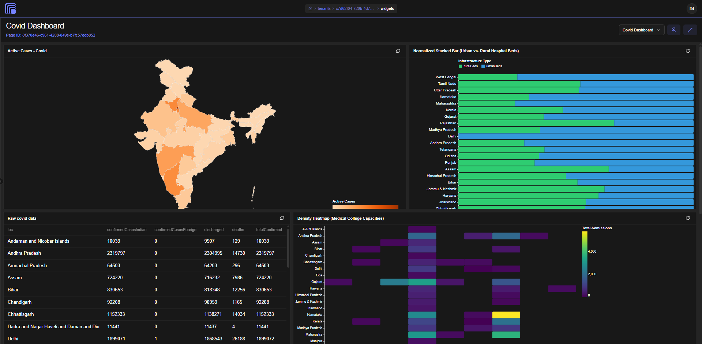

# App Pages & Widgets

# Table of Contents

1. [Overview](#overview)
2. [Key Concepts](#key-concepts)
3. [How It Works — End-to-End Lifecycle](#how-it-works)
4. [App Pages](#app-pages)
  - [App Page Configuration Fields](#app-page-configuration-fields)
  - [Page Data Sources](#page-data-sources)
  - [Page Variables](#page-variables)
  - [Layout System](#layout-system)
5. [Widgets](#widgets)
  - [Widget Configuration Fields](#widget-configuration-fields)
  - [Widget Types Reference](#widget-types-reference)
  - [Widget Properties (Styling)](#widget-properties-styling)
  - [Widget Events System](#widget-events-system)
  - [Widget Methods](#widget-methods)
6. [Expression Engine & Data Binding](#expression-engine-data-binding)
7. [Real-Time & Async Behaviour](#real-time-async-behaviour)
8. [Integration Points](#integration-points)
9. [Access Control](#access-control)
10. [Error States & Edge Cases](#error-states-edge-cases)
11. [Best Practices](#best-practices)
12. [Limitations & Constraints](#limitations-constraints)
13. [Related Modules](#related-modules)

* * *

## Overview

**App Pages** are the primary end-user-facing interface layer in Jet Admin. An App Page is a configurable canvas onto which **Widgets** are placed, data sources are wired, and interactive behaviours are defined — all without writing application code.

A completed App Page acts as a dashboard, data entry form, report viewer, or operational tool depending on how it is configured. Pages are presented to users in **View mode** (read-only rendering) or opened in an **Editor** (where the layout, data sources, variables, and widget configurations can be modified).

**Widgets** are the individual visual components that appear on a page — charts, tables, forms, text blocks, KPI cards, and so on. Each widget is a reusable, independently configurable unit that can be placed on multiple pages. Widgets receive their data reactively through the page's runtime state tree.

Together, App Pages and Widgets implement the **Apps → Pages → Widgets** canvas model that forms the user-facing product surface of Jet Admin.

* * *

## Key Concepts

| Term | Definition |
| --- | --- |
| **App Page** | A named, configurable canvas consisting of a layout, data sources, variables, and a set of placed widget instances. |
| **Widget** | A reusable visual component (chart, table, form, etc.) with its own configuration, stored independently and referenced by pages. |
| **Widget Instance** (Widget Key) | A unique placement of a widget on a specific page. Represented as `widget_{widgetID}_{timestamp}`. The same widget definition can appear multiple times on the same or different pages. |
| **Page Config** | The JSON object stored with an App Page that defines its layout tree, data source bindings, variable definitions, and widget placement keys. |
| **Widget Config** | The JSON object stored with a Widget that defines its visual properties, data binding expressions, and event handlers. |
| **State Tree** | The live, in-memory reactive data object maintained by the Page Runtime. It holds the current values of all data sources (queries, workflows, listeners), page variables, widget states, and globally accessible items. |
| **Expression** | A `{{ }}` mustache-style template that resolves a value from the state tree at render time. Expressions may be simple path lookups or full JavaScript expressions. |
| **Data Source** | A binding from the page to a Data Query, Workflow, or Listener. Each data source is given an alias through which its result is accessible in expressions. |
| **Page Variable** | A typed, named local state value (string, number, boolean, object, array) whose value can be updated at runtime by widget events. |
| **Layout Tree** | The hierarchical node structure (column → row → widget/container/stack) that defines where and how widgets are arranged on the page canvas. |
| **Event Handler** | A named sequence of one or more actions attached to a widget event (e.g., `onRowSelect`) that execute when the event fires. |
| **Action** | A single step in an event handler, such as setting a variable, executing a data source, triggering a workflow, or showing a toast. |
| **Trigger Mode** | A per-data-source setting that controls when a data source is executed: automatically on page load, reactively when a variable changes, or manually only when an event fires. |

* * *

## How It Works — End-to-End Lifecycle {#how-it-works}

### Creating and Editing an App Page

A user opens the App Page editor, which presents a split-panel interface: a left sidebar (Widgets tab, Data tab, Variables tab, Settings tab) and a right canvas (the layout editor).

The user gives the page a title and description in the Settings tab. They then configure data sources in the Data tab — selecting queries, workflows, or listeners, assigning each an alias, and optionally setting input arguments from page variables or other state. They define page variables in the Variables tab to hold local reactive state (selected row IDs, filter values, modal visibility, etc.).

In the Widgets tab, widgets can be created inline (the Widget IDE opens in a modal), or existing widgets can be dragged from the list onto the canvas. When a widget is placed, a unique **widget instance key** is generated and recorded in the page config.

The canvas itself is the **Layout Editor** — a visual drag-and-drop system where rows, columns, containers, stacks, and widget slots can be rearranged, resized, wrapped, and styled. Layout changes are immediately reflected in the page config's layout tree.

The user saves the page when ready.

### Viewing an App Page

When a user opens a page in **View mode**, the system loads the page configuration and renders the **Page Runtime** — an invisible provider that:

1. Reads the page config's `dataSources` list.
2. For each data source with `triggerMode: "auto"`, immediately executes the underlying query or workflow and places the result in the state tree under `state.queries.{alias}` or `state.workflows.{alias}`.
3. For data sources with `triggerMode: "reactive"`, sets up watchers on the referenced page variables and re-executes when those variables change.
4. For data sources with `triggerMode: "manual"`, does nothing until an event handler explicitly triggers them.
5. For listeners, subscribes to the relevant socket channel and pushes incoming events into `state.listeners.{alias}`.

Each widget on the canvas is rendered inside a **Widget Slot**, which fetches the widget's stored configuration, resolves all `{{ }}` expressions against the current state tree, and passes the resolved values to the widget component. Widget components re-render reactively whenever the relevant parts of the state tree change.

When a widget fires an event (a row is clicked, a form is submitted, a button is pressed), the registered event handler runs its action sequence — updating variables, re-fetching data sources, triggering workflows, or showing notifications.

### Cloning and Deleting

App Pages and Widgets each support clone operations. Cloning creates a new record with `(Copy)` appended to the title and transfers the full configuration. The cloning user receives creator-level access to the cloned resource. Deletion removes the record and cleans up all access policies associated with it.

* * *

## App Pages

### App Page Configuration Fields

These are the fields a user configures when creating or updating an App Page.

| Field | Description | Type | Required |
| --- | --- | --- | --- |
| **App Page Title** | The display name of the page, shown in headers and the pages list. | Text (max 255 chars) | Yes |
| **App Page Description** | An optional text description of the page's purpose. | Text | No  |
| **App Page Config** | The structured configuration object containing the layout tree, widget placements, data sources, and variables. Managed visually through the editor. | JSON Object | Yes (auto-generated) |

The **App Page Config** object contains the following sub-fields:

| Sub-Field | Description |
| --- | --- |
| `widgets` | An ordered array of widget instance keys placed on this page (e.g. `["widget_abc123_1717000000000"]`). |
| `layout` | The V2 layout tree (a column node at the root, containing row and widget/container/stack nodes). |
| `layoutVersion` | Set to `2` for the current layout system. Pages with `layoutVersion` not set or set to `1` are automatically migrated to V2 on first load. |
| `dataSources` | An array of data source binding objects (see Page Data Sources section). |
| `variables` | An array of page variable definitions (see Page Variables section). |

* * *

### Page Data Sources

Each entry in the `dataSources` array defines one binding from the page to an external data provider.

| Field | Description | Type | Required | Default |
| --- | --- | --- | --- | --- |
| **Alias** | The key by which this data source's result is accessed in expressions. Must be alphanumeric and underscore only. | Text | Yes | —   |
| **Source Type** | Whether this data source is a Data Query, Workflow, or Listener. | `query` / `workflow` / `listener` | Yes | `query` |
| **Query / Workflow / Listener** | The specific Query, Workflow, or Listener to bind. | Reference | Yes | —   |
| **Trigger Mode** | Controls when this data source is executed. | `auto` / `reactive` / `manual` | No  | `auto` |
| **Refresh When Variable Changes** | (Reactive mode only) A list of page variable paths that trigger a re-fetch when their value changes. | Array of variable paths | No  | —   |
| **Refetch Interval (ms)** | If set, the data source is re-executed automatically at this interval. 0 or empty disables polling. | Number | No  | None |
| **Input Arguments** | Key-value pairs passed as inputs when the data source is executed. Values support `{{ }}` expressions referencing page state. | Key-Value Map | No  | —   |
| **Channel Name** | (Listener type only) The socket channel to subscribe to. Defaults to `listener:{listenerID}` if left blank. | Text | No  | `listener:{listenerID}` |

**Accessing data source results in expressions:**

- Query results: `{{ state.queries.{alias}.data }}`
- Query loading state: `{{ state.queries.{alias}.isLoading }}`
- Query error: `{{ state.queries.{alias}.error }}`
- Workflow results: `{{ state.workflows.{alias}.data }}`
- Listener payloads: `{{ state.listeners.{alias}.data }}`

* * *

### Page Variables

Page Variables hold reactive local state for the page. Their values can be read in expressions and updated by widget event handlers.

| Field | Description | Type | Required |
| --- | --- | --- | --- |
| **Variable Key** | The identifier used to reference this variable. Alphanumeric and underscore only. | Text | Yes |
| **Variable Type** | The data type of the variable, which determines the default value input UI. | `string` / `number` / `boolean` / `object` / `array` | Yes |
| **Default Value** | The value the variable holds at page load before any event updates it. | Matches type | No  |
| **Description** | An optional note explaining the variable's purpose. | Text | No  |

**Accessing page variables in expressions:**

`{{ state.variables.{key} }}`

* * *

### Layout System

The **Layout System** (V2) organises widgets on the canvas using a tree of nodes. The editor provides drag-and-drop tools for all layout operations.

#### Node Types

| Node Type | Description | Children |
| --- | --- | --- |
| **Column** | The root node. A vertical stack of rows. | Rows, Containers |
| **Row** | A horizontal 12-column grid. Contains widget slots or containers side by side. | Widget Slots, Containers, Stacks |
| **Widget Slot** | A single placed widget instance within a row. | None (renders a widget) |
| **Container** | A nestable box with its own inner column, allowing grouped widget layouts. | Column (which contains rows) |
| **Stack** | A flex container for placing widgets either vertically or horizontally with configurable gap and alignment. | Widget Slots, Containers |

#### Layout Node Properties

| Property | Description | Options |
| --- | --- | --- |
| **Span** | How many of the 12 grid columns this node occupies within its parent row. | 1–12 |
| **Sizing** | How the node determines its height. | `auto` (content-driven), `fill` (stretch to parent), `fixed` (explicit pixel height) |
| **Fixed Height** | The height in pixels when `sizing` is set to `fixed`. | Any positive integer |
| **Style** | Optional inline style overrides: padding, margin, gap, border radius, alignment. | See Style Settings |

#### Layout Editor Controls

From the **node toolbar** (appears when a layout node is selected on the canvas), a user can:

- Toggle **sizing** between Auto, Fill, and Fixed
- Adjust **span** with + and − buttons
- Open the **Style panel** to set padding, margin, gap, border-radius, and alignment
- **Wrap** a node inside a new Container
- **Unwrap** a Container to place its children back in the parent row
- **Delete** the node (and its children)
- **Lock** a widget slot (prevents accidental moves and allows direct interaction with the widget during editing)
- **Edit Widget** (opens the Widget IDE for the placed widget)

A **resize handle** on the right edge of any widget slot or container allows dragging to change its span within its parent row. Rows can be reordered by dragging the grip handle in the top-left corner of each row.

* * *

## Widgets

### Widget Configuration Fields

These fields are set when creating or updating a standalone Widget.

| Field | Description | Type | Required |
| --- | --- | --- | --- |
| **Widget Title** | The display name shown in the widget header and the widget list. | Text (max 255 chars) | Yes |
| **Widget Description** | An optional description of the widget's purpose. | Text | No  |
| **Widget Type** | The visual component type that renders this widget. | See Widget Types Reference | Yes |
| **Widget Config** | The structured configuration object containing `properties` and `events`. | JSON Object | Yes (auto-generated) |

* * *

### Widget Types Reference

Each widget type has its own configuration fields, accessible in the **Properties** tab of the Widget IDE or editor.

* * *

#### Vega-Lite Chart

A declarative chart type using the Vega-Lite grammar. Supports a **Visual Builder** (shelf-based drag-and-drop field mapping) and a **Raw JSON editor** for direct spec authoring.

**Visual Builder fields:**

| Field | Description |
| --- | --- |
| **Data Source** | A `{{ }}` expression pointing to an array in the state tree to use as chart data. |
| **Mark Type** | The chart geometry: Auto (inferred), Bar, Line, Area, Scatter, Pie, Donut, Heatmap, Tick, or Bubble. |
| **Encoding Channels** | X axis, Y axis, Color, Size, Shape, Opacity, Row facet, Column facet, Detail, Text, Stroke Dash. Each channel accepts a field name, data type, optional aggregate, and sort direction. |
| **Title** | Chart title displayed above the visualisation. |
| **Color Scheme** | The palette applied to color-encoded fields. Choose from standard Vega color schemes. |
| **Width** | `Fill` (expands to container width) or `Fixed` (explicit pixel width). |
| **Height** | Chart height in pixels. |

**Encoding channel options:**

| Setting | Options |
| --- | --- |
| **Data Type** | Nominal, Ordinal, Quantitative, Temporal |
| **Aggregate** | count, sum, mean, median, min, max, variance, stdev, distinct, valid, missing |
| **Sort** | Default (none), Ascending, Descending |

**Raw editor:** Full Vega-Lite JSON spec can be authored directly. Template expressions (`{{ }}`) can be used within the spec, including inside `data.values`, to bind chart data dynamically.

**Advanced Options:**

| Option | Description | Default |
| --- | --- | --- |
| Show Actions | Display Vega embed action buttons (export, source view) on the chart. | Off |
| Renderer | `svg` or `canvas` rendering engine. | `svg` |

* * *

#### Vega Chart

Identical to Vega-Lite Chart but accepts full **Vega** grammar (lower-level, more expressive). Only the Raw JSON editor is available; the Visual Builder is not supported for Vega specs.

* * *

#### Data Table

A full-featured tabular display with support for pagination, search, export, inline editing, multi-row selection, and bulk operations.

**Data binding:**

| Field | Description |
| --- | --- |
| **Data Array Template** | A `{{ }}` expression that resolves to the array of row objects to display. |
| **Total Count Template** | A `{{ }}` expression that resolves to the total number of rows (used for server-side pagination). If empty, the array length is used. |
| **Is Loading Template** | A `{{ }}` expression that resolves to a boolean indicating whether data is loading. When true, an overlay is shown. |

**Column configuration:**

| Field | Description |
| --- | --- |
| **Header Label** | The column heading displayed to the user. |
| **Data Key** | The field name in each row object to display in this column. |
| **Editable Column** | Whether this column's cells can be edited in edit mode. |

Columns can be reordered using up/down arrows and auto-detected from loaded data using the **Auto-detect** button (when a data array has been resolved).

**Feature toggles:**

| Feature | Description |
| --- | --- |
| **Pagination** | Enables page navigation controls. Server-side pagination is driven by the `onPageChange` event. |
| **Search Box** | Adds a search input above the table. Can be client-side (filters the loaded array) or server-side (fires an `onSearch` event with the debounced search term). |
| **Export Data** | Adds an Export button. Can export the current filtered data as CSV or JSON, or fire an `onExport` event for server-side handling. |
| **Inline Row Editing** | Adds an Edit button per row. Fires `onRowSave` with original and updated row data when saved. Mutually exclusive with Bulk Edit. |
| **Excel-Style Bulk Edit** | Allows double-clicking cells to edit values. Accumulates changes and fires `onBulkEdit` when the Save bar is confirmed. Mutually exclusive with Inline Row Editing. |
| **Multi-Row Selection** | Adds checkboxes to each row. Optionally shows a Select All checkbox. Supports configurable bulk action buttons that fire `onBulkAction`, `onBulkDelete`, or `onBulkExport`. |

* * *

#### Button

A clickable button that triggers event handlers.

| Field | Description | Default |
| --- | --- | --- |
| **Button Text** | The label shown on the button. Supports `{{ }}` expressions. | `Click Me` |
| **Variant** | Visual style: Default, Destructive, Outline, Secondary, Ghost, Link. | `default` |
| **Size** | Button size: Default, Small, Large, Icon. | `default` |
| **Is Loading Template** | Expression resolving to boolean. Shows a loading spinner when true. | —   |

* * *

#### Text / Markdown

Renders text content with optional Markdown formatting.

| Field | Description | Default |
| --- | --- | --- |
| **Content** | The text or Markdown to display. Supports `{{ }}` expressions for dynamic values. | —   |
| **Format** | `Markdown` (renders headings, bold, lists, code, links, images) or `Plain Text`. | `Markdown` |
| **Align** | Text alignment: Left, Center, Right. | `left` |
| **Size** | Font size: Extra Small, Small, Medium, Large, Extra Large. | `sm` |
| **Is Loading Template** | Expression resolving to boolean. Shows a loading overlay when true. | —   |

* * *

#### Stat / KPI

Displays a single metric value with an optional trend indicator.

| Field | Description | Default |
| --- | --- | --- |
| **Label** | The metric label shown above the value. | `Metric` |
| **Value** | A `{{ }}` expression resolving to the primary metric value. | —   |
| **Prefix** | A string prepended to the value (e.g. `$`). | —   |
| **Suffix** | A string appended to the value (e.g. `users`). | —   |
| **Trend Value** | A `{{ }}` expression resolving to a numeric percentage change. Positive shows an up trend; negative shows a down trend. | —   |
| **Trend Semantics** | Controls whether an upward trend is shown as good (green) or bad (red). | `up-is-good` |
| **Align** | Alignment of all text: Left, Center, Right. | `center` |
| **Is Loading Template** | Expression resolving to boolean. | —   |

* * *

#### Alert Banner

Displays a styled informational banner.

| Field | Description | Default |
| --- | --- | --- |
| **Type / Variant** | The banner colour and icon: Info (blue), Success (green), Warning (amber), Error (red). | `info` |
| **Title** | Optional bold heading. Supports `{{ }}` expressions. | —   |
| **Message** | The main banner text. Supports `{{ }}` expressions. | —   |
| **Allow Dismiss** | When enabled, a close button lets the user dismiss the banner. Fires `onDismiss`. | On  |
| **Is Loading Template** | Expression resolving to boolean. | —   |

* * *

#### Form

A dynamic form that renders configured fields and fires an `onSubmit` event with collected values.

**Global form settings:**

| Field | Description | Default |
| --- | --- | --- |
| **Submit Button Text** | Label on the submit button. | `Submit` |
| **Size / Spacing** | Layout density: Compact (Small), Normal (Default), Spacious (Large). | `default` |
| **Show Reset Button** | Adds a Reset button alongside Submit that resets all fields to their default values. | Off |

**Per-field configuration:**

| Field | Description | Default |
| --- | --- | --- |
| **Label** | The field label shown above the input. | —   |
| **Key (Unique ID)** | The field identifier in the submitted form data object. | —   |
| **Input Type** | Text, Email, Password, Number, Checkbox, or Select/Dropdown. | `text` |
| **Placeholder** | Hint text shown inside the input (not for Checkbox). | —   |
| **Options** | Comma-separated list of values for Select type fields. | —   |
| **Required** | Whether the field must be filled before the form can be submitted. | Off |
| **Default Value** | The value pre-populated in the field at render time. Supports `{{ }}` expressions. | —   |

* * *

#### Image

Displays an image from a URL.

| Field | Description | Default |
| --- | --- | --- |
| **Image URL / Source** | URL of the image. Supports `{{ }}` expressions. Can also be populated by uploading a file. | —   |
| **Alt Text** | Accessibility description of the image. | `Image content` |
| **Object Fit** | How the image fills its container: Cover (crop), Contain (letterbox), Fill (stretch), Original Size. | `cover` |
| **Corner Radius** | Rounding of image corners: Square (none), Small, Medium, Large, Circle (pill). | `none` |
| **Is Loading Template** | Expression resolving to boolean. | —   |

* * *

#### IFrame Embed

Embeds an external webpage in a sandboxed iframe.

| Field | Description | Default |
| --- | --- | --- |
| **Embed URL** | The URL to embed. Supports `{{ }}` expressions. | —   |
| **Allow JavaScript** | Grants the embedded page permission to run scripts (`allow-scripts`). | On  |
| **Allow Form Submission** | Grants the embedded page permission to submit forms (`allow-forms`). | On  |
| **Allow Popups** | Allows the embedded page to open new tabs or windows. | Off |
| **Allow Same Origin** | Grants the embedded page access to the host origin's storage and cookies. Use with caution. | Off |
| **Is Loading Template** | Expression resolving to boolean. | —   |

* * *

#### HTML Widget

Renders custom HTML and CSS inside a securely sandboxed iframe. Supports sending events back to the page runtime via a `postMessage` protocol.

| Field | Description |
| --- | --- |
| **HTML Markup** | HTML source. Supports `{{ }}` expressions for dynamic content insertion. |
| **CSS Stylesheet** | CSS rules scoped to the iframe. |
| **Is Loading Template** | Expression resolving to boolean. Shows a loading overlay. |

**Sandbox Security options:**

| Option | Description | Default |
| --- | --- | --- |
| Execute JavaScript | Allow `<script>` tags within the iframe sandbox. | Off |
| Submit Forms | Allow form submissions from within the iframe. | Off |
| Allow Popups | Allow links to open new tabs or windows. | Off |

> The HTML Widget does not grant `allow-same-origin` regardless of settings, providing strong XSS isolation.

To send an event from inside the custom HTML to the page runtime, the embedded script dispatches a `postMessage` with the shape `{ type: "jet-html-message", widgetID: "{widgetID}", payload: { ... } }`. This fires the widget's `onMessage` event.

* * *

#### Date Picker

A popover calendar for selecting a single date or datetime.

| Field | Description | Default |
| --- | --- | --- |
| **Label** | Field label shown above the picker. | —   |
| **Placeholder** | Text shown when no date is selected. | `Select date...` |
| **Enable Time Picking** | Adds hour, minute, and second inputs below the calendar. | Off |
| **Default Value** | A `{{ }}` expression resolving to an ISO date string pre-selected at load. | —   |
| **Is Loading Template** | Expression resolving to boolean. | —   |

The selected value is accessible in the widget's state as: `{{ state.widgets.{widgetKey}.value }}` (ISO string), `.date` (date only), and `.time` (time portion when time is enabled).

* * *

#### Date Range Picker

A dual-calendar popover for selecting a start and end date or datetime range.

| Field | Description | Default |
| --- | --- | --- |
| **Label** | Field label. | —   |
| **Start Placeholder** | Placeholder for the start input. | `Start date` |
| **End Placeholder** | Placeholder for the end input. | `End date` |
| **Enable Time Picking** | Adds time inputs for both start and end dates. | Off |
| **Default Start** | Expression resolving to an ISO date string. | —   |
| **Default End** | Expression resolving to an ISO date string. | —   |
| **Presets** | Configurable quick-select buttons (e.g. Today, Last 7 days, This month). Each preset has a label, start offset, and end offset. | 3 default presets |
| **Is Loading Template** | Expression resolving to boolean. | —   |

The selected range is accessible as `.start`, `.end`, `.startDate`, `.endDate` under the widget's state.

* * *

### Widget Properties (Styling)

All widget types share a set of **Custom Properties** available under the Properties tab:

| Property | Description |
| --- | --- |
| **Show Widget Header** | Toggles the header bar that shows the widget title and a manual refresh button. |
| **Container CSS Classes** | Tailwind CSS utility classes applied to the widget's outer card container. |
| **Widget CSS Classes** | Tailwind CSS utility classes applied to the widget's inner content area. |
| **Auto-refresh Interval (ms)** | If set to a value greater than 0, the widget's data is refreshed at this interval. 0 disables auto-refresh. |
| **Show Border & Shadow** | Toggles the card border and drop shadow. |
| **Border Radius** | Custom border radius value (e.g. `8px`). |
| **Padding** | Custom padding inside the card. |
| **Border Width** | Custom border thickness. |
| **Border Color** | Custom border colour (any valid CSS colour). |
| **Background Color** | Custom card background colour. |
| **Text Color** | Custom text colour override. |
| **Custom CSS** | Raw CSS properties scoped to this specific widget instance only. |

* * *

### Widget Events System

Widgets emit **events** that can trigger one or more sequenced **actions**. Events are configured in the **Events** tab of the Widget IDE or editor.

#### Supported Events by Widget Type

**Common events** (available on all widget types):

| Event | Description | Available Context |
| --- | --- | --- |
| `onClick` | Fires when the widget is clicked. | Native click event |
| `onRefresh` | Fires when the widget's refresh button is pressed. | —   |
| `onLoad` | Fires once when the widget finishes mounting. | —   |

**Table-specific events:**

| Event | Description | Available Context |
| --- | --- | --- |
| `onRowSelect` | Fires when a table row is selected. | `event.row` (row object), `event.rowIndex` |
| `onPageChange` | Fires when the table page changes (server-side pagination). | `event.page`, `event.pageSize`, `event.offset` |
| `onSearch` | Fires when the search term changes (server-side search, debounced). | `event.searchTerm` |
| `onExport` | Fires when server-side export is triggered. | `event.format`, `event.rowCount` |
| `onRowSave` | Fires when an inline-edited row is saved. | `event.rowIndex`, `event.originalRow`, `event.updatedRow`, `event.changes` |
| `onBulkDelete` | Fires when bulk delete is triggered. | `event.selectedRows`, `event.selectedRowIndices` |
| `onBulkExport` | Fires when bulk export is triggered. | `event.selectedRows`, `event.format` |
| `onBulkAction` | Fires for custom bulk action buttons. | `event.actionKey`, `event.selectedRows` |
| `onBulkEdit` | Fires when bulk edits are confirmed. | `event.edits` (array of `{rowIndex, originalRow, changes}`) |

**Button-specific events:**

| Event | Description | Available Context |
| --- | --- | --- |
| `onSubmit` | Fires when the button is clicked. | Button submit payload |

**Form-specific events:**

| Event | Description | Available Context |
| --- | --- | --- |
| `onSubmit` | Fires when the form is submitted. | `event.formData` (all field values) |
| `onFieldChange` | Fires when any field value changes. | `event.field`, `event.value`, `event.formData` |

**Alert-specific events:**

| Event | Description |
| --- | --- |
| `onDismiss` | Fires when the user clicks the dismiss button. |

**Date Picker events:**

| Event | Description | Available Context |
| --- | --- | --- |
| `onChange` | Fires when the selected date changes. | `event.value` (ISO string), `event.date`, `event.time` |
| `onOpen` | Fires when the calendar popover opens. | —   |
| `onClose` | Fires when the calendar popover closes. | —   |
| `onClear` | Fires when the selected value is cleared. | `event.value` (empty string) |

**Date Range Picker events:**

| Event | Description | Available Context |
| --- | --- | --- |
| `onChange` | Fires when the selected range changes. | `event.start`, `event.end`, `event.startDate`, `event.endDate` |
| `onOpen` / `onClose` / `onClear` | Same as Date Picker. | —   |

**HTML Widget events:**

| Event | Description | Available Context |
| --- | --- | --- |
| `onMessage` | Fires when the embedded HTML dispatches a `jet-html-message` postMessage. | `event.data` (the payload object) |

#### Action Types

Each event can have one or more actions executed in sequence:

| Action Type | Description | Configuration |
| --- | --- | --- |
| **Set Page Variable** | Updates a page variable to a new value. | **Variable Key**: expression referencing the variable (e.g. `{{ state.variables.selectedId }}`). **Value Expression**: new value expression. |
| **Execute Data Source** | Re-executes a page-level data source (query, workflow, or listener). | **Data Source**: select from the page's configured data sources by alias. Optionally override input argument values with expressions. |
| **Trigger Workflow** | Directly triggers a specific workflow (not necessarily one bound as a page data source). | **Workflow**: select from all accessible workflows. Optionally supply input argument values. |
| **Trigger Query** | Directly triggers a specific data query. | **Data Query**: select from all accessible queries. Optionally supply input argument values. |
| **Show Toast** | Displays a brief notification to the user. | **Message**: text or expression. **Variant**: Success (green) or Error (red). |

Event context values (e.g. `event.row`, `event.formData`) are accessible inside action expressions using `{{ event.{key} }}`.

* * *

### Widget Methods

Some widget types expose programmatic methods that can be called from another widget's event handler via the **Call Widget Method** action (available but currently not shown in the action list — accessible for future use).

| Widget Type | Method | Description |
| --- | --- | --- |
| Data Table | `refresh` | Reloads the table's data. |
| Data Table | `setSelectedRow` | Selects a row by zero-based index. |
| Data Table | `clearSelection` | Clears all row selections. |
| Vega-Lite / Vega | `refresh` | Redraws the chart. |
| Vega-Lite / Vega | `resize` | Resizes the chart to fit its container. |
| Button | `click` | Triggers the button's click action. |
| HTML Widget | `refresh` | Reloads the iframe content. |

* * *

## Expression Engine & Data Binding {#expression-engine-data-binding}

Widgets and data source inputs use `{{ }}` **expressions** to bind dynamic values from the page state tree. The expression engine supports full JavaScript within template expressions.

### Accessing State

| Path | Description |
| --- | --- |
| `{{ state.queries.{alias}.data }}` | The result data from a query data source. |
| `{{ state.queries.{alias}.isLoading }}` | Boolean — true while the query is executing. |
| `{{ state.queries.{alias}.error }}` | The error from the last failed query execution. |
| `{{ state.workflows.{alias}.data }}` | The result data from a workflow data source. |
| `{{ state.workflows.{alias}.isLoading }}` | Boolean — true while the workflow is running. |
| `{{ state.listeners.{alias}.data }}` | The latest payload received from a listener. |
| `{{ state.variables.{key} }}` | The current value of a page variable. |
| `{{ state.widgets.{widgetKey}.selectedRow }}` | The currently selected row object in a Table widget. |
| `{{ state.widgets.{widgetKey}.selectedRowIndex }}` | The index of the selected row. |
| `{{ state.widgets.{widgetKey}.value }}` | The current value in a Date Picker or other input widget. |

### Expression Syntax

Expressions can contain any valid JavaScript that does not reference browser globals. Supported constructs include:

| Category | Examples |
| --- | --- |
| Path traversal | `{{ state.queries.users.data[0].name }}` |
| Ternary | `{{ state.queries.users.data.length > 0 ? "Has data" : "Empty" }}` |
| Array methods | `{{ state.queries.users.data.filter(u => u.active).length }}` |
| JSON | `{{ JSON.stringify(state.variables.filters) }}` |
| Math | `{{ Math.round(state.queries.stats.data[0].avg * 100) / 100 }}` |
| Nullish coalescing | `{{ state.queries.user.data[0]?.name ?? "Unknown" }}` |
| String methods | `{{ state.variables.query.toUpperCase() }}` |

### Autocomplete Support

The expression editor provides live autocomplete when typing inside `{{ }}`. Suggestions are drawn from the current page state tree and include all reachable paths, array methods, string methods, JSON/Math utilities, and common JavaScript operators.

* * *

## Real-Time & Async Behaviour {#real-time-async-behaviour}

### Listener Data Sources

When a page data source is of type **Listener**, the Page Runtime subscribes to the specified socket channel at mount time. Incoming events are pushed into `state.listeners.{alias}`. The widget that consumes this state updates reactively each time a new event arrives. No polling is involved.

To refresh the socket connection (for example after a connection disruption), pressing the **Refresh** button on a listener data source in the editor re-subscribes.

### Workflow Streaming

When a **Workflow** data source is triggered — either automatically on load, reactively, or from an event — the runtime establishes a streaming connection that receives live workflow context updates as each node completes. The state tree is updated incrementally, so widgets bound to intermediate workflow outputs update in real time as execution progresses.

A running workflow data source shows a **Stop** button in the editor's Data panel, which terminates the workflow execution and disconnects the stream.

### Auto-Refresh

Both page-level data sources and individual widgets support a **Refetch Interval** setting. When set, the data source or widget's data fetch is re-triggered at the configured interval in milliseconds. The minimum meaningful value is typically 1000 ms (1 second). Setting this to 0 disables polling.

### Layout State Persistence

The layout editor automatically saves layout changes into the page config form. The page config is only persisted to the database when the user explicitly clicks **Save**. An **unsaved changes counter** and **Undo** button appear when there are pending changes, allowing the user to step back through layout modifications within the current editing session.

* * *

## Integration Points

| Module | Relationship |
| --- | --- |
| **Data Queries** | Pages bind to Data Queries via data sources. Query results populate the state tree and feed table, chart, and stat widgets. |
| **Workflows** | Pages bind to Workflows via data sources. Workflow results stream into the state tree in real time. Event handlers can also trigger workflows directly without a pre-configured data source binding. |
| **Listeners** | Pages bind to Listeners to receive real-time push data over WebSockets, populating the state tree reactively. |
| **File Storage** | Image widgets and the HTML widget support file uploads. Uploaded files are stored via the platform's file storage service and referenced by URL. |
| **Access Control (Casbin)** | When an App Page or Widget is created, the creator is automatically granted full creator-level access. This determines who can read, update, delete, or clone the resource. Page-level data source binding also checks that the user has execute permission on each referenced Query, Workflow, Listener, and Widget. |
| **WebSocket /** Socket.IO | The Page Runtime uses the platform's Socket.IO connection for listener subscriptions and workflow streaming. The same socket connection is used by the widget-workflow bridge for real-time context updates. |

* * *

## Access Control

Creating an App Page or Widget automatically grants the creating user (or API key) **creator access**, which includes read, update, delete, and clone permissions.

When saving a page that references data sources (queries, workflows, listeners) or places widgets, the system verifies that the saving user has **execute permission** on each referenced asset. If any permission check fails, the save is rejected.

Sharing access with other users or roles is managed through the platform's Role-Based Access Control module.

* * *

## Error States & Edge Cases {#error-states-edge-cases}

| Situation | User-Facing Behaviour |
| --- | --- |
| **A data source fails to execute** | The data source's state tree entry shows an `error` value. Widgets that display `isLoading` or check for errors via expressions can surface this to the user. Other data sources and widgets are unaffected. |
| **A widget expression cannot be resolved** | The expression returns an empty string or `undefined` silently. The widget renders with the fallback/empty state. No error is thrown to the page. |
| **A widget type is invalid or unrecognised** | The widget slot shows an error message: "Widget type is invalid or not supported." |
| **A Vega-Lite spec has a syntax or runtime error** | The chart area shows a warning overlay with the error message. Other widgets on the page are unaffected. |
| **A workflow data source is still running when the page unmounts** | The streaming connection is disconnected automatically on unmount. |
| **Circular JSON in chart data** | Circular references in data bound to Vega specs are silently replaced with `"[Circular]"` strings to prevent crashes. |
| **Layout migration from V1 to V2** | Pages with the old react-grid-layout format are automatically converted to the V2 layout tree on first load. The old layout is preserved in `_legacyLayouts` as a backup. The migration is non-destructive. |
| **Switching from Raw spec to Visual Builder** | If the raw Vega-Lite spec contains features the visual builder cannot parse (transforms, layers, multi-view), a warning dialog is shown before switching. The user can choose to proceed and overwrite or cancel. |
| **A widget's data query is loading at widget slot render time** | A loading spinner overlay is shown over the widget slot. The widget's previously rendered state (if any) remains visible beneath the overlay. |

* * *

## Best Practices

**Data Source Naming:** Use descriptive, lowercase, underscore-separated aliases (e.g. `active_users`, `order_detail`) so that expression autocomplete suggestions are immediately meaningful.

**Variable Naming:** Name page variables after the state they hold (`selected_row_id`, `date_filter_start`) rather than after the widget that sets them. This makes expressions more readable and decouples widget configuration from variable wiring.

**Trigger Mode Selection:** Use `auto` trigger mode only for data sources that should always be fetched. Use `reactive` for data sources that depend on filter variables — this avoids unnecessary fetches on page load before the user has set any filter value. Use `manual` for expensive or side-effecting operations that should only run in response to explicit user actions.

**Widget Reuse:** Configure a widget's data binding using expressions that reference page-level state tree paths rather than hardcoding data. This makes a single widget reusable across multiple pages simply by ensuring each page defines the expected aliases.

**Table Pagination:** For large datasets, always enable server-side pagination. Bind the `onPageChange` event to a `Execute Data Source` action that passes `{{ event.page }}` and `{{ event.pageSize }}` as input arguments to the underlying query.

**Undo Awareness:** The Undo button only tracks changes to the page config (layout, data sources, variables) within the current editing session. It does not undo widget definition changes made in the Widget IDE. Save frequently to avoid losing progress.

**Custom CSS Scoping:** Custom CSS entered in the Widget Properties tab is automatically scoped to that specific widget. Use this for per-widget overrides. For global page styling, use Container or Row style settings in the layout editor instead.

**Loading States:** Always configure **Is Loading Template** on widgets that display asynchronously loaded data. Binding it to `{{ state.queries.{alias}.isLoading }}` provides visual feedback and prevents users from interacting with stale or empty states.

* * *

## Limitations & Constraints {#limitations-constraints}

| Limitation | Detail |
| --- | --- |
| **Page title length** | Maximum 255 characters. |
| **Widget title length** | Maximum 255 characters. |
| **Pagination page size maximum** | The data sources list API returns a maximum of 100 items per page. |
| **Vega Visual Builder** | Only supported for Vega-Lite specs. Full Vega specs must be authored in Raw mode. |
| **Vega Visual Builder spec parsing** | Specs with `layer`, `hconcat`, `vconcat`, `concat`, `repeat`, or `transform` clauses cannot be parsed back into the visual builder. Switching to visual mode in these cases will lose those features. |
| **Layout undo depth** | Undo is limited to changes made within the current editing session. Navigating away and returning resets the undo history. |
| **Listener subscriptions** | Listeners connect via the platform's shared Socket.IO connection. Each listener data source subscribes to one channel. Multiple listeners on the same page each maintain their own subscription. |
| **Widget method calling** | The `Call Widget Method` action type is defined in the system but is not currently exposed as a selectable option in the event editor UI. |
| **HTML Widget browser globals** | The HTML Widget's iframe sandbox does not grant `allow-same-origin`. Scripts running inside cannot access the parent page's DOM, cookies, or local storage by design. |
| **Expression globals** | Only a curated set of JavaScript globals are available inside expressions: `JSON`, `Math`, `Array`, `Object`, `String`, `Number`, `Boolean`, `Date`, `RegExp`, `Map`, `Set`, `parseInt`, `parseFloat`, `isNaN`, `isFinite`, encode/decode URI functions. Browser APIs (`fetch`, `window`, `document`, `localStorage`, etc.) are not accessible. |
| **Workflow streaming horizontal scaling** | The widget-workflow bridge for real-time context updates uses in-memory maps. In a horizontally scaled deployment (multiple backend instances), streaming may not work correctly without a shared pub/sub layer (e.g. Redis). |

* * *

## Related Modules

- **Data Queries** — Define the parameterised database or API queries that App Pages bind to as data sources.
- **Workflows** — Define the DAG-based automation pipelines that pages can execute and stream results from.
- **Listeners** — Define real-time event channels that push data to pages over WebSockets.
- **Access Control / RBAC** — Manages user and role permissions for reading, editing, and executing App Pages and Widgets.
- **File Storage** — Handles file uploads from Image widgets and the Widget IDE file uploader.
- **Expression Engine** — The shared `{{ }}` template evaluation layer used by both App Pages (for data binding) and the backend Query Engine (for input mapping). Documented separately under the Expression Engine module.