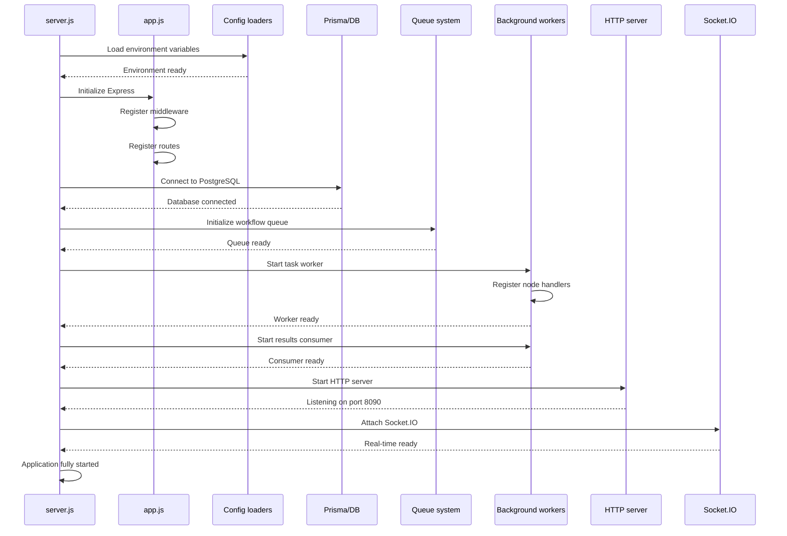
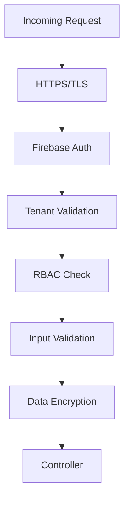

# Backend Architecture

This document provides a comprehensive deep-dive into Jet Admin's backend architecture, explaining the design decisions, folder structure, key components, and how data flows through the system.

---

## 📋 Table of Contents

- [Technology Stack](#technology-stack)
- [Project Structure](#project-structure)
- [Application Lifecycle](#application-lifecycle)
- [Middleware Architecture](#middleware-architecture)
- [Module System](#module-system)
- [Service Layer](#service-layer)
- [Workflow Engine](#workflow-engine)
- [Real-Time Communication](#real-time-communication)
- [Database Access Layer](#database-access-layer)
- [Security Architecture](#security-architecture)
- [Error Handling](#error-handling)
- [Testing Strategy](#testing-strategy)

---

## Technology Stack

Jet Admin's backend is built on a modern, battle-tested technology stack:

| Technology | Version | Purpose |
|------------|---------|---------|
| **Runtime** | Node.js 18+ | JavaScript runtime |
| **Framework** | Express.js 4.x | Web application framework |
| **ORM** | Prisma 5.x | Database access layer |
| **Database** | PostgreSQL 14+ | Primary data store |
| **Authentication** | Firebase Admin SDK | Identity verification |
| **Real-time** | Socket.IO 4.x | WebSocket server |
| **Queue** | fastq | In-memory task queue for workflows |
| **Validation** | Joi / Custom | Request validation |
| **Logging** | Winston | Structured logging |
| **Sandboxing** | vm2 | Secure code execution |

---

## Project Structure

The backend follows a modular, feature-based architecture:

```
apps/backend/
├── config/                      # Configuration management
│   ├── database.config.js       # PostgreSQL connection
│   ├── queue.config.js          # Workflow queue setup
│   ├── firebase.config.js       # Firebase Admin initialization
│   └── socket.config.js         # Socket.IO configuration
│
├── middleware/                  # Express middleware
│   ├── auth.middleware.js       # Firebase token verification
│   ├── tenant.middleware.js     # Tenant context resolution
│   ├── permission.middleware.js # RBAC permission checks
│   ├── error.middleware.js      # Global error handler
│   └── logging.middleware.js    # Request logging
│
├── modules/                     # Feature modules (domain-driven)
│   ├── auth/                    # Authentication & authorization
│   │   ├── auth.controller.js
│   │   ├── auth.service.js
│   │   ├── auth.routes.js
│   │   └── auth.validators.js
│   │
│   ├── tenant/                  # Multi-tenancy management
│   │   ├── tenant.controller.js
│   │   ├── tenant.service.js
│   │   └── tenant.routes.js
│   │
│   ├── datasource/              # External data connections
│   │   ├── datasource.controller.js
│   │   ├── datasource.service.js
│   │   ├── datasource.routes.js
│   │   └── datasource.validators.js
│   │
│   ├── dataQuery/               # Query execution engine
│   │   ├── dataQuery.controller.js
│   │   ├── dataQuery.service.js
│   │   ├── dataQuery.routes.js
│   │   └── handlers/            # Query type handlers
│   │
│   ├── workflow/                # Workflow automation
│   │   ├── workflow.controller.js
│   │   ├── workflow.service.js
│   │   ├── workflow.routes.js
│   │   ├── orchestrator/        # Execution coordination
│   │   ├── workers/             # Task execution
│   │   └── handlers/            # Node type handlers
│   │
│   ├── dashboard/               # Dashboard management
│   │   ├── dashboard.controller.js
│   │   ├── dashboard.service.js
│   │   └── dashboard.routes.js
│   │
│   ├── widget/                  # Widget management
│   │   ├── widget.controller.js
│   │   ├── widget.service.js
│   │   └── widget.routes.js
│   │
│   ├── user/                    # User management
│   │   ├── user.controller.js
│   │   ├── user.service.js
│   │   └── user.routes.js
│   │
│   └── role/                    # Role & permission management
│       ├── role.controller.js
│       ├── role.service.js
│       └── role.routes.js
│
├── prisma/                      # Database layer
│   ├── schema.prisma            # Data models
│   ├── migrations/              # Database migrations
│   └── seed/                    # Seed data
│
├── workers/                     # Background workers
│   ├── taskWorker.js            # Workflow task executor
│   ├── resultsConsumer.js       # Workflow result processor
│   └── cronWorker.js            # Scheduled job runner
│
├── utils/                       # Shared utilities
│   ├── logger.js                # Winston logger
│   ├── encryption.js            # AES encryption helpers
│   ├── validators.js            # Common validators
│   └── constants.js             # Application constants
│
├── routes/                      # Main route aggregator
│   └── index.js                 # Route registration
│
├── app.js                       # Express application setup
├── server.js                    # Server entry point
└── package.json                 # Dependencies
```

---

## Application Lifecycle

### Startup Sequence

The backend initialization follows a specific order:



### Initialization Code

```javascript
// server.js
const app = require('./app');
const { initializeDatabase } = require('./config/database.config');
const { initializeQueue } = require('./config/queue.config');
const { startTaskWorker } = require('./workers/taskWorker');
const { startResultsConsumer } = require('./workers/resultsConsumer');

async function startServer() {
  try {
    // 1. Initialize database connection
    await initializeDatabase();
    console.log('✓ Database connected');

    // 2. Initialize workflow queue
    await initializeQueue();
    console.log('✓ Workflow queue initialized');

    // 3. Start background workers
    await startTaskWorker();
    await startResultsConsumer();
    console.log('✓ Workflow workers started');

    // 4. Start HTTP server
    const PORT = process.env.PORT || 8090;
    const server = app.listen(PORT, () => {
      console.log(`✓ Server running on port ${PORT}`);
    });

    // 5. Attach Socket.IO
    const { initializeSocket } = require('./config/socket.config');
    initializeSocket(server);
    console.log('✓ Socket.IO attached');

    // 6. Graceful shutdown
    process.on('SIGTERM', () => gracefulShutdown(server));
    process.on('SIGINT', () => gracefulShutdown(server));

  } catch (error) {
    console.error('Failed to start server:', error);
    process.exit(1);
  }
}

startServer();
```

---

## Middleware Architecture

Jet Admin uses a layered middleware approach for cross-cutting concerns:

### Middleware Stack

```
Request → Logging → CORS → Auth → Tenant → Permission → Controller
```

### Auth Middleware

Verifies Firebase JWT tokens and establishes user identity:

```javascript
// middleware/auth.middleware.js
const admin = require('firebase-admin');

async function authMiddleware(req, res, next) {
  try {
    // Get token from Authorization header
    const authHeader = req.headers.authorization;
    if (!authHeader?.startsWith('Bearer ')) {
      return res.status(401).json({ error: 'Missing authorization token' });
    }

    const token = authHeader.split(' ')[1];
    
    // Verify Firebase token
    const decodedToken = await admin.auth().verifyIdToken(token);
    
    // Attach user to request
    req.user = {
      uid: decodedToken.uid,
      email: decodedToken.email,
      firebaseData: decodedToken
    };

    next();
  } catch (error) {
    if (error.code === 'auth/id-token-expired') {
      return res.status(401).json({ error: 'Token expired' });
    }
    return res.status(401).json({ error: 'Invalid token' });
  }
}

module.exports = authMiddleware;
```

### Tenant Middleware

Resolves tenant context from headers or route parameters:

```javascript
// middleware/tenant.middleware.js
async function tenantMiddleware(req, res, next) {
  try {
    // Get tenant ID from header or route
    const tenantId = req.headers['x-tenant-id'] || req.params.tenantID;
    
    if (!tenantId) {
      return res.status(400).json({ error: 'Tenant ID required' });
    }

    // Verify tenant exists and user has access
    const tenant = await prisma.tblTenants.findUnique({
      where: { tenantID: tenantId }
    });

    if (!tenant) {
      return res.status(404).json({ error: 'Tenant not found' });
    }

    // Attach tenant to request
    req.tenant = tenant;
    req.tenantID = tenantId;

    next();
  } catch (error) {
    next(error);
  }
}

module.exports = tenantMiddleware;
```

### Permission Middleware

Enforces RBAC permissions:

```javascript
// middleware/permission.middleware.js
function requirePermission(permission) {
  return async (req, res, next) => {
    try {
      const { user, tenantID } = req;
      
      // Get user's roles in tenant
      const userRoles = await prisma.tblUsersTenantsRelationship.findMany({
        where: {
          userID: user.uid,
          tenantID: tenantID
        },
        include: { role: true }
      });

      // Check if any role has required permission
      const hasPermission = userRoles.some(relationship => {
        return relationship.role.permissions.some(
          p => p.permissionName === permission
        );
      });

      if (!hasPermission) {
        return res.status(403).json({ 
          error: 'Permission denied',
          code: 'PERMISSION_DENIED'
        });
      }

      next();
    } catch (error) {
      next(error);
    }
  };
}

module.exports = requirePermission;
```

---

## Module System

Each feature module follows a consistent pattern:

### Module Structure

```
module-name/
├── module-name.controller.js    # Request handlers
├── module-name.service.js       # Business logic
├── module-name.routes.js        # Route definitions
├── module-name.validators.js    # Input validation
└── module-name.test.js          # Unit tests
```

### Controller Pattern

Controllers handle HTTP request/response:

```javascript
// modules/datasource/datasource.controller.js
const datasourceService = require('./datasource.service');

class DatasourceController {
  // GET /api/v1/tenants/:tenantID/datasources
  async listDatasources(req, res, next) {
    try {
      const { tenantID } = req;
      const datasources = await datasourceService.findAll(tenantID);
      res.json({ data: datasources });
    } catch (error) {
      next(error);
    }
  }

  // POST /api/v1/tenants/:tenantID/datasources
  async createDatasource(req, res, next) {
    try {
      const { tenantID, user } = req;
      const datasourceData = req.body;
      
      const datasource = await datasourceService.create(tenantID, user.uid, datasourceData);
      res.status(201).json({ data: datasource });
    } catch (error) {
      next(error);
    }
  }

  // GET /api/v1/tenants/:tenantID/datasources/:id
  async getDatasource(req, res, next) {
    try {
      const { id, tenantID } = req.params;
      const datasource = await datasourceService.findById(id, tenantID);
      res.json({ data: datasource });
    } catch (error) {
      next(error);
    }
  }
}

module.exports = new DatasourceController();
```

### Service Pattern

Services contain business logic:

```javascript
// modules/datasource/datasource.service.js
const { prisma } = require('../../prisma');
const { encryptCredentials } = require('../../utils/encryption');
const { DATASOURCE_LOGIC_COMPONENTS } = require('@jet-admin/datasources-logic');

class DatasourceService {
  async findAll(tenantID) {
    return prisma.tblDatasources.findMany({
      where: { tenantID, deletedAt: null },
      orderBy: { createdAt: 'desc' }
    });
  }

  async findById(id, tenantID) {
    const datasource = await prisma.tblDatasources.findUnique({
      where: { id, tenantID, deletedAt: null }
    });

    if (!datasource) {
      throw new Error('Datasource not found');
    }

    return datasource;
  }

  async create(tenantID, userID, datasourceData) {
    // Test connection before saving
    const datasourceType = datasourceData.datasourceType;
    const connectionTest = await DATASOURCE_LOGIC_COMPONENTS[datasourceType]
      .testConnection({ datasourceOptions: datasourceData.datasourceOptions });

    if (!connectionTest.success) {
      throw new Error(`Connection failed: ${connectionTest.error}`);
    }

    // Encrypt sensitive credentials
    const encryptedOptions = encryptCredentials(datasourceData.datasourceOptions);

    // Create datasource
    return prisma.tblDatasources.create({
      data: {
        tenantID,
        createdByID: userID,
        datasourceType,
        datasourceOptions: encryptedOptions,
        datasourceTags: datasourceData.datasourceTags || [],
        datasourceTitle: datasourceData.datasourceTitle
      }
    });
  }

  async update(id, tenantID, updateData) {
    // Similar pattern for updates
  }

  async delete(id, tenantID) {
    // Soft delete implementation
  }
}

module.exports = new DatasourceService();
```

---

## Workflow Engine

The workflow engine is the most complex component in the backend:

### Architecture Overview

```mermaid
graph TB
    API[API Layer] --> Service[Workflow Service]
    Service --> DB[(PostgreSQL)]
    Service --> Queue[In-Memory Queue (fastq)]

    Queue --> TaskWorker[Task Worker]
    TaskWorker --> Handlers[Node Handlers]
    Handlers --> Queue

    Queue --> Orchestrator[Orchestrator]
    Orchestrator --> DB
    Orchestrator --> Socket[Socket.IO]

    subgraph "Node Handlers"
        Handlers --> JS[JavaScript Node]
        Handlers --> Query[Query Node]
        Handlers --> Condition[Condition Node]
        Handlers --> Loop[Loop Node]
    end
```

### Important: In-Memory Queue Architecture

Jet Admin uses **fastq** for in-memory workflow task queues, not RabbitMQ. This is a deliberate design choice that provides:

- **Simpler Deployment**: No external message broker required
- **Faster Development**: Local development without RabbitMQ dependencies
- **Lower Resource Usage**: No separate queue process
- **Process-Local Queues**: Tasks execute within the backend process

**Trade-offs:**
- Queue state is lost on restart (workflow instances are persisted to DB)
- Horizontal scaling requires shared queue infrastructure (not currently implemented)
- Delayed tasks use `setTimeout` instead of TTL-based queues

The queue configuration is managed in `apps/backend/config/queue.config.js` which provides:
- `initializeQueue()` - Sets up fastq instances
- `addNodeJob()` - Pushes workflow tasks to the queue
- `addResult()` - Pushes execution results
- `registerTaskWorker()` - Registers the task processor
- `registerResultsWorker()` - Registers the results processor
- `publishToMonitor()` - Event bus for monitoring (replaces RabbitMQ topic exchanges)

### Workflow Service

```javascript
// modules/workflow/workflow.service.js
class WorkflowService {
  // Execute a saved workflow
  async executeWorkflow(workflowID, input, tenantID, userID) {
    // 1. Load workflow definition
    const workflow = await this.getWorkflowWithNodes(workflowID, tenantID);
    
    // 2. Create workflow instance
    const instance = await prisma.tblWorkflowInstances.create({
      data: {
        workflowID,
        tenantID,
        startedBy: userID,
        status: 'RUNNING',
        context: { input, __createdAt: new Date() }
      }
    });

    // 3. Queue start node
    const startNode = workflow.nodes.find(n => n.nodeType === 'start');
    await this.queueNodeJob(instance.instanceID, startNode);

    return instance;
  }

  // Test an unsaved workflow
  async testWorkflow(nodes, edges, input, tenantID, userID) {
    // 1. Create test instance with graph in context
    const instance = await prisma.tblWorkflowInstances.create({
      data: {
        tenantID,
        startedBy: userID,
        status: 'RUNNING',
        context: {
          input,
          __workflowDefinition: { nodes, edges },
          __isTestRun: true
        }
      }
    });

    // 2. Queue start node
    const startNode = nodes.find(n => n.nodeType === 'start');
    await this.queueNodeJob(instance.instanceID, startNode, { __isTestRun: true });

    return instance;
  }

  async queueNodeJob(instanceID, node, options = {}) {
    const instance = await this.getInstanceContext(instanceID);
    
    const task = {
      instanceID,
      workflowID: instance.workflowID,
      nodeID: node.nodeID,
      nodeType: node.nodeType,
      nodeConfig: node.nodeConfig,
      context: instance.context,
      ...options
    };

    await addNodeJobToQueue(task);
  }
}
```

### Task Worker

The task worker processes workflow tasks from the in-memory fastq queue:

```javascript
// workers/taskWorker.js
const { registerTaskWorker } = require('../config/queue.config');
const { NODE_HANDLERS } = require('../modules/workflow/handlers');

async function startTaskWorker() {
  // Register the task processor with the queue
  await registerTaskWorker(async (task) => {
    try {
      // 1. Resolve handler by node type
      const handler = NODE_HANDLERS[task.nodeType];

      if (!handler) {
        throw new Error(`Unknown node type: ${task.nodeType}`);
      }

      // 2. Execute handler (in-process, no network call)
      const result = await handler.execute({
        nodeConfig: task.nodeConfig,
        context: task.context,
        instanceID: task.instanceID
      });

      // 3. Publish success result to results queue
      await addResultToQueue({
        instanceID: task.instanceID,
        nodeID: task.nodeID,
        status: 'COMPLETED',
        output: result,
        completedAt: new Date()
      });

    } catch (error) {
      // 4. Publish error result to results queue
      await addResultToQueue({
        instanceID: task.instanceID,
        nodeID: task.nodeID,
        status: 'FAILED',
        error: error.message,
        failedAt: new Date()
      });
    }
  });
}

module.exports = { startTaskWorker };
```

**Key Differences from RabbitMQ:**
- Tasks are processed in-process via `fastq` (no network overhead)
- Queue concurrency is limited to 10 concurrent tasks (configurable)
- Delayed tasks use `setTimeout` before pushing to queue
- No persistent queue state - all tasks are lost on restart
- Error handling includes retry with exponential backoff via `setTimeout`

### Node Handlers

```javascript
// modules/workflow/handlers/javascript.handler.js
const { runInSandbox } = require('../../utils/sandbox');

class JavascriptHandler {
  async execute({ nodeConfig, context }) {
    const { code } = nodeConfig;

    // Execute user code in secure sandbox
    const result = await runInSandbox(code, {
      context,
      args: context.input,
      utils: {
        formatDate: (d) => d.toISOString(),
        // ... other utilities
      }
    });

    return { result };
  }
}

module.exports = new JavascriptHandler();
```

### Orchestrator

```javascript
// modules/workflow/orchestrator/orchestrator.js
class Orchestrator {
  async processNodeResult(result) {
    const { instanceID, nodeID, status, output, error } = result;

    // 1. Load instance
    const instance = await this.getInstanceContext(instanceID);

    // 2. Update context with node output
    instance.context[nodeID] = { status, output, error };

    // 3. Emit socket update
    this.emitNodeUpdate(instanceID, nodeID, result);

    // 4. Check if workflow should continue
    if (status === 'FAILED') {
      await this.failWorkflow(instance, error);
      return;
    }

    // 5. Find next nodes
    const nextNodes = await this.findNextNodes(instance, nodeID);

    if (nextNodes.length === 0) {
      await this.completeWorkflow(instance);
    } else {
      // 6. Queue next nodes
      for (const node of nextNodes) {
        await this.queueNodeJob(instance, node);
      }
    }
  }

  async findNextNodes(instance, currentNodeID) {
    const { nodes, edges } = await this.getWorkflowGraph(instance);
    
    // Find edges from current node
    const outgoingEdges = edges.filter(e => e.source === currentNodeID);
    
    // Handle conditional edges
    const nextNodes = [];
    for (const edge of outgoingEdges) {
      if (edge.data?.condition) {
        // Evaluate condition
        const conditionMet = this.evaluateCondition(
          edge.data.condition,
          instance.context
        );
        if (conditionMet) {
          nextNodes.push(nodes.find(n => n.nodeID === edge.target));
        }
      } else {
        nextNodes.push(nodes.find(n => n.nodeID === edge.target));
      }
    }

    return nextNodes;
  }
}
```

---

## Real-Time Communication

Socket.IO provides real-time updates:

### Socket Configuration

```javascript
// config/socket.config.js
const { Server } = require('socket.io');
const admin = require('firebase-admin');

let io;

function initializeSocket(server) {
  io = new Server(server, {
    cors: {
      origin: process.env.CORS_WHITELIST?.split(',') || '*',
      credentials: true
    }
  });

  // Authentication middleware
  io.use(async (socket, next) => {
    try {
      const token = socket.handshake.auth.token;
      const decoded = await admin.auth().verifyIdToken(token);
      socket.user = decoded;
      next();
    } catch (error) {
      next(new Error('Authentication error'));
    }
  });

  io.on('connection', (socket) => {
    console.log(`User ${socket.user.uid} connected`);

    // Join tenant room
    socket.on('join_tenant', (tenantID) => {
      socket.join(`tenant:${tenantID}`);
    });

    // Subscribe to workflow run
    socket.on('workflow_run_join', ({ runId }) => {
      socket.join(`workflow:${runId}`);
    });

    // Widget connections
    socket.on('widget_workflow_connect', async (data) => {
      await handleWidgetConnection(socket, data);
    });

    socket.on('disconnect', () => {
      console.log(`User ${socket.user.uid} disconnected`);
    });
  });
}

function emitToWorkflowRun(runId, event, data) {
  if (io) {
    io.to(`workflow:${runId}`).emit(event, data);
  }
}

module.exports = { initializeSocket, emitToWorkflowRun };
```

---

## Database Access Layer

Prisma ORM provides type-safe database access:

### Prisma Schema Example

```prisma
// prisma/schema.prisma

model tblTenants {
  tenantID    String   @id @default(gen_random_uuid())
  tenantTitle String
  createdAt   DateTime @default(now())
  updatedAt   DateTime @updatedAt
  
  datasources tblDatasources[]
  workflows   tblWorkflows[]
  dashboards  tblDashboards[]
  users       tblUsersTenantsRelationship[]
}

model tblWorkflows {
  workflowID         String   @id @default(gen_random_uuid())
  tenantID           String
  title              String
  workflowOptions    Json?
  createdAt          DateTime @default(now())
  updatedAt          DateTime @updatedAt
  
  tenant             tblTenants      @relation(fields: [tenantID], references: [tenantID])
  nodes              tblWorkflowNodes[]
  edges              tblWorkflowEdge[]
  instances          tblWorkflowInstances[]
}

model tblWorkflowNodes {
  nodeID      String   @id @default(gen_random_uuid())
  workflowID  String
  nodeType    String
  nodeConfig  Json
  position    Json?
  
  workflow    tblWorkflows @relation(fields: [workflowID], references: [workflowID])
  executions  tblNodeExecutionLogs[]
}
```

### Prisma Client Setup

```javascript
// prisma/index.js
const { PrismaClient } = require('@prisma/client');

const prisma = new PrismaClient({
  log: process.env.NODE_ENV === 'development' 
    ? ['query', 'error', 'warn'] 
    : ['error']
});

// Connection management
async function connectDatabase() {
  try {
    await prisma.$connect();
    console.log('Database connected');
  } catch (error) {
    console.error('Database connection failed:', error);
    throw error;
  }
}

async function disconnectDatabase() {
  await prisma.$disconnect();
}

module.exports = { prisma, connectDatabase, disconnectDatabase };
```

---

## Security Architecture

### Multi-Layer Security



### Encryption at Rest

```javascript
// utils/encryption.js
const crypto = require('crypto');

const ENCRYPTION_KEY = process.env.ENCRYPTION_KEY; // 32 bytes
const IV_LENGTH = 16;

function encryptCredentials(data) {
  const iv = crypto.randomBytes(IV_LENGTH);
  const cipher = crypto.createCipheriv('aes-256-cbc', Buffer.from(ENCRYPTION_KEY), iv);
  
  let encrypted = cipher.update(JSON.stringify(data));
  encrypted = Buffer.concat([encrypted, cipher.final()]);
  
  return {
    encrypted: encrypted.toString('hex'),
    iv: iv.toString('hex')
  };
}

function decryptCredentials(encryptedData) {
  const iv = Buffer.from(encryptedData.iv, 'hex');
  const encryptedText = Buffer.from(encryptedData.encrypted, 'hex');
  
  const decipher = crypto.createDecipheriv('aes-256-cbc', Buffer.from(ENCRYPTION_KEY), iv);
  let decrypted = decipher.update(encryptedText);
  decrypted = Buffer.concat([decrypted, decipher.final()]);
  
  return JSON.parse(decrypted.toString());
}

module.exports = { encryptCredentials, decryptCredentials };
```

---

## Error Handling

### Global Error Middleware

```javascript
// middleware/error.middleware.js
const logger = require('../utils/logger');

class AppError extends Error {
  constructor(message, code, statusCode = 400) {
    super(message);
    this.code = code;
    this.statusCode = statusCode;
    this.isOperational = true;
  }
}

function errorMiddleware(err, req, res, next) {
  logger.error('Error:', {
    message: err.message,
    stack: err.stack,
    url: req.url,
    method: req.method
  });

  if (err.isOperational) {
    return res.status(err.statusCode).json({
      error: {
        code: err.code,
        message: err.message
      }
    });
  }

  // Unknown error - don't leak details
  return res.status(500).json({
    error: {
      code: 'SERVER_ERROR',
      message: 'An unexpected error occurred'
    }
  });
}

module.exports = { AppError, errorMiddleware };
```

---

## Testing Strategy

### Unit Tests

```javascript
// modules/datasource/datasource.test.js
const datasourceService = require('./datasource.service');

describe('DatasourceService', () => {
  describe('create', () => {
    it('should create datasource with encrypted credentials', async () => {
      const mockData = {
        datasourceType: 'postgresql',
        datasourceOptions: { host: 'localhost', password: 'secret' },
        datasourceTitle: 'Test DB'
      };

      const result = await datasourceService.create(
        'tenant-123',
        'user-456',
        mockData
      );

      expect(result.datasourceOptions.encrypted).toBeDefined();
      expect(result.datasourceOptions.iv).toBeDefined();
    });
  });
});
```

### Integration Tests

```javascript
// tests/integration/workflow.test.js
const request = require('supertest');
const app = require('../../app');

describe('Workflow API', () => {
  let authToken;
  let workflowId;

  beforeAll(async () => {
    authToken = await getTestUserToken();
  });

  describe('POST /api/v1/tenants/:tenantID/workflows', () => {
    it('should create a new workflow', async () => {
      const response = await request(app)
        .post('/api/v1/tenants/tenant-123/workflows')
        .set('Authorization', `Bearer ${authToken}`)
        .set('x-tenant-id', 'tenant-123')
        .send({
          title: 'Test Workflow',
          workflowOptions: {}
        });

      expect(response.status).toBe(201);
      expect(response.data.data.workflowID).toBeDefined();
      workflowId = response.data.data.workflowID;
    });
  });
});
```

---

## Summary

Jet Admin's backend architecture is designed for:

- **Modularity**: Feature-based modules with clear boundaries
- **Scalability**: Stateless design with horizontal scaling potential
- **Security**: Multi-layer authentication, authorization, and encryption
- **Maintainability**: Consistent patterns across all modules
- **Extensibility**: Easy to add new datasources, widgets, and workflow nodes

The architecture balances simplicity for local development with the ability to scale for production deployments.

---

## Next Steps

- [Frontend Architecture](./frontend-architecture) - Understand the React SPA
- [Database Schema](./database-schema) - Explore the data models
- [Workflow Architecture](../concepts/workflow-architecture) - Deep dive into workflow execution
- [API Reference](./api-reference) - Complete endpoint documentation
