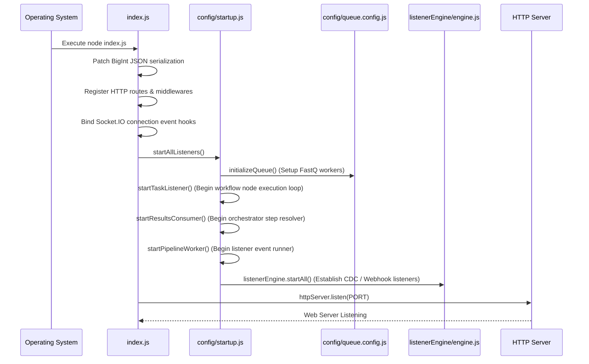
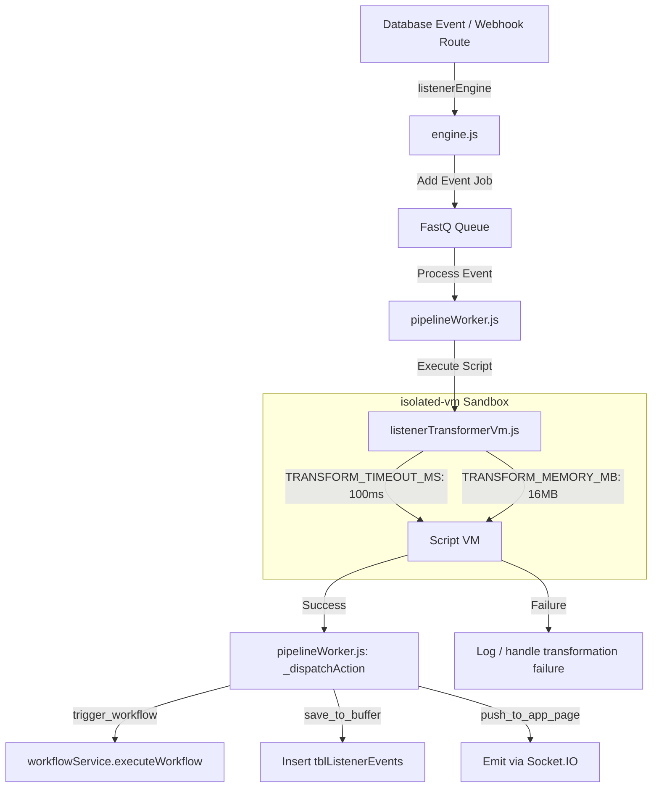

# Backend Architecture

This document provides a comprehensive deep-dive into Jet Admin's backend architecture. It describes the feature-module structure, transaction flows, execution loops, security guards, and database integrations exactly as implemented in the codebase.

---

## 📋 Table of Contents

- [Technology Stack](#technology-stack)
- [Project Structure](#project-structure)
- [Application Lifecycle & Startup Boot Flow](#application-lifecycle--startup-boot-flow)
- [Middleware Architecture](#middleware-architecture)
- [Module System](#module-system)
- [Workflow Orchestration Engine (DAG Scheduler)](#workflow-orchestration-engine-dag-scheduler)
- [Event Listener & Pipeline Engine](#event-listener--pipeline-engine)
- [Security and Authorization Design](#security-and-authorization-design)
- [Audit Logging Infrastructure](#audit-logging-infrastructure)

---

## Technology Stack

Jet Admin's backend is built on a modern, modular Node.js stack:

| Component | Technology | Purpose |
| :--- | :--- | :--- |
| **Runtime** | Node.js | Execution environment |
| **Framework** | Express.js | REST routing API |
| **ORM** | Prisma | Database Access Layer |
| **Database** | PostgreSQL | Primary relational database |
| **Authentication** | Firebase Admin | User identity validation |
| **Real-time** | Socket.IO | Websocket transport layer |
| **Queue** | FastQ / pg-boss | In-memory job queue / queue management |
| **Validation** | Joi | API payload schema verification |
| **Logging** | Custom Logger | Winston-based structured console/file logging |
| **Sandboxing** | isolated-vm | Secure C++ V8 execution limits (100ms timeout, 16MB RAM) |

---

## Project Structure

The backend workspace resides under `apps/backend/` and organizes resources by domain modules:

```
apps/backend/
├── config/                      # Configuration files
│   ├── express-app.config.js    # Express instance config
│   ├── http-server.config.js    # HTTP server creation wrapper
│   ├── module.config.js         # Feature toggles checking allowed modules
│   ├── prisma.config.js         # PrismaClient exports
│   ├── queue.config.js          # FastQ event/task queue creation
│   ├── socket.io.js             # Socket.IO lifecycle attachments
│   └── startup.js               # Startup worker bootstrapper
├── modules/                     # Core domain features
│   ├── apiKey/                  # Tenant API key credentials
│   ├── appPage/                 # Widget layouts and pages config
│   ├── audit/                   # Security request audits
│   ├── auth/                    # Firebase middleware and permission validation
│   ├── cronJob/                 # node-cron orchestrator and history logs
│   ├── dataQuery/               # Datasource queries routing & registry
│   ├── datasource/              # Database/API connection configs
│   ├── listener/                # Real-time data event subscription listeners
│   ├── tenant/                  # Tenant configuration settings
│   ├── widget/                  # Widget registration & sockets
│   └── workflow/                # Workflow orchestrator & DAG runner
├── prisma/                      # Prisma database migrations & scheme definition
│   └── schema.prisma
├── utils/                       # Shared helper utilities
│   ├── encryption.js            # AES-256-CBC credentials encryption
│   ├── input.util.js            # Workflow template parameter resolvers
│   └── logger.js                # Winston wrapper
├── index.js                     # Main server entrypoint
└── environment.js               # Environment variables schemas validation
```

---

## Application Lifecycle & Startup Boot Flow

When the server starts (`index.js` is executed), the system follows a sequential initialization path:



### 1. Bootstrapping Steps
1.  **BigInt Patching**: Modifies the global `BigInt.prototype.toJSON` prototype to return a string representation.
2.  **Websocket Registration**: Attaches Socket.IO handlers to monitor connection hooks.
3.  **Cron Scheduling**: Invokes `cronJobService.scheduleAllCronJobs()`, loading enabled job records from `tblCronJobs` and configuring schedules via `node-cron`.
4.  **Listener Infrastructure**: Invokes `config/startup.js:startAllListeners()`, starting:
    *   **In-Memory queues** via `queue.config.js`.
    *   **Workflow Task Listener** (`modules/workflow/listeners/taskListener.js`) to consume node execute tasks.
    *   **Workflow Orchestrator** (`modules/workflow/workflowEngine/engine.js`) to process step execution results and advance DAG workflows.
    *   **Event Pipeline Worker** (`modules/listener/listenerEngine/pipelineWorker.js`) to parse data events.
    *   **Active Datasource Listeners** (`modules/listener/listenerEngine/engine.js`) to stream database triggers.

### 2. Graceful Shutdown Hooks
On process exit signals (`SIGINT`/`SIGTERM`):
*   Calls `config/startup.js:stopAllListeners()` which stops active CDC database connections.
*   Gracefully closes the queue channels via `closeQueue()`.
*   Shuts down the audit buffer flusher to write any cached audit events to the database.
*   Closes the HTTP Server and terminates the process with code `0`.

---

## Middleware Architecture

API routes run through a chain of Express request middlewares resolving identity, tenancy context, permissions, and request auditing:

```
Request → auditLogMiddleware → authProvider → requirePermission → Controller Router
```

*   **Audit Middleware** (`modules/audit/audit.middleware.js`): Captures API request parameters, redacts sensitive payload variables, and registers telemetry.
*   **Auth Middleware** (`modules/auth/auth.middleware.js`): Examines `Authorization: Bearer <token>` or `X-API-Key` headers. Resolves Firebase accounts or performs SHA-256 database API key verification, setting `req.user` and `req.authContext`.
*   **Tenancy Middleware**: Validates tenant membership context on route variables.
*   **Permission Middleware** (`modules/auth/auth.service.js`): Maps hierarchical wildcard permissions rules.

---

## Module System

Backend modules follow a standard domain-isolated structure:

```
module/
├── module.controller.js      # Decodes Express req/res
├── module.service.js         # Business logic & prisma queries
├── module.v1.routes.js       # Express route path mapping & authorization
├── module.validator.js       # Inbound Joi schema validator models
└── [specific helpers]
```

To optimize security, API parameters (e.g. database passwords, API tokens) are encrypted before storage. `utils/encryption.js` encrypts sensitive datasource options using AES-256-CBC with a random initialization vector (IV), storing them securely in `tblDatasources`.

---

## Workflow Orchestration Engine (DAG Scheduler)

The Workflow Engine manages execution states, advances step transitions, evaluates barrier conditions, and preserves execution context.

### 1. Concurrency and Optimistic locking
To prevent duplicate executions when parallel paths execute downstream nodes, the orchestrator implements Compare-And-Swap (CAS) version bumps.

```javascript
// workflowEngine/engine.js - _bumpVersion
const result = await prisma.tblWorkflowInstances.updateMany({
  where: {
    instanceID,
    version: currentVersion,
    status: 'RUNNING'
  },
  data: {
    version: { increment: 1 }
  }
});
```
Only the worker thread that successfully increments the database execution record's `version` is authorized to advance the workflow DAG and trigger the next step.

### 2. Append-Only State Context Model
> [!IMPORTANT]
> The orchestrator does **not** write state variables to a mutable JSON context field. Instead, it utilizes an append-only transaction log model in `tblWorkflowInstanceLogs`.

To reconstruct the current execution context state dynamically, the orchestrator folds historical log rows ordered by `logID`:

```javascript
// workflowEngine/stateManager.js - assembleContext
const logs = await prisma.tblWorkflowInstanceLogs.findMany({
  where: { instanceID },
  orderBy: { logID: "asc" }
});

return logs.reduce((acc, log) => {
  if (log.eventType === "INPUT_SET") {
    acc.input = { ...acc.input, ...log.payload };
  } else if (log.eventType === "NODE_COMPLETED" && log.outputVariable) {
    acc[log.outputVariable] = log.payload;
  } else if (log.eventType === "SYSTEM_SET") {
    acc.system = { ...acc.system, ...log.payload };
  }
  return acc;
}, { input: {}, system: {} });
```

### 3. Step Execution Loop
1.  **Queue Task**: The engine writes log rows to `tblWorkflowInstanceLogs` and enqueues the step execution task.
2.  **Execute Task**: `taskListener.js` calls the node's execution handler. If execution exceeds the node's timeout limit, it logs a failure.
3.  **Advance DAG**: On completion, `workflowEngine/engine.js:handleTaskResult` is called:
    *   It updates logs.
    *   It checks version mapping using the CAS check.
    *   It evaluates downstream edge configuration via `dagScheduler.js`.
    *   It verifies incoming barrier conditions:
        *   **`joinMode: "all"`**: Requires all incoming branches to be completed.
        *   **`joinMode: "any"`**: Dispatches as soon as any single incoming branch finishes.
    *   It queues subsequent tasks or completes the workflow execution.

---

## Event Listener & Pipeline Engine

The Listener Engine subscribes to real-time events on databases or API webhooks.



### 1. Script Transformation Sandbox
User-defined transformations execute in an isolated environment using native C++ `isolated-vm` instances:
*   **Time Limit**: Enforces a strict execution window of `TRANSFORM_TIMEOUT_MS = 100` milliseconds.
*   **Memory Ceiling**: Restricts memory allocation to `TRANSFORM_MEMORY_MB = 16` megabytes.
*   **Process Security**: No database or network APIs are exposed to the VM scripts.

### 2. Action Dispatching
Transformed event payloads trigger actions configured in the pipeline:
*   **`trigger_workflow`**: Calls `workflowService.executeWorkflow` passing the transformed event payload as execution inputs.
*   **`save_to_buffer`**: Appends the transformed record to the database buffer table `tblListenerEvents`.
*   **`push_to_app_page`**: Emits real-time data overlays to active page views via Socket.IO.

---

## Security and Authorization Design

Jet Admin implements robust authentication and role-based access control (RBAC).

### 1. Authentication Pathways
*   **Bearer Token**: Verified against the Firebase Admin SDK to resolve active user accounts.
*   **API Key Header (`X-API-Key`)**: Matched against hashed values in `tblAPIKeys`. Plain keys are never stored in the database. Validation uses a secure SHA-256 hash comparison:
    ```javascript
    // auth.middleware.js
    const incomingHash = crypto.createHash("sha256").update(apiKeyPlain).digest("hex");
    const match = crypto.timingSafeEqual(Buffer.from(incomingHash), Buffer.from(storedKeyHash));
    ```

### 2. Wildcard Permission Matching
Authorization checks support colon-separated hierarchical rules and wildcards (`*`) to validate access rights:

```javascript
// auth.service.js - checkPermissions
function checkPermissions(userPermissions, requiredPermission) {
  return userPermissions.some(userPerm => {
    const userParts = userPerm.split(':');
    const reqParts = requiredPermission.split(':');

    for (let i = 0; i < reqParts.length; i++) {
      if (userParts[i] === '*') return true;
      if (userParts[i] !== reqParts[i]) return false;
    }
    return userParts.length === reqParts.length;
  });
}
```

---

## Audit Logging Infrastructure

The audit system records HTTP request/response details for system operations while maintaining performance:

1.  **Redaction Interceptor**: `audit.middleware.js` intercepts Express routing calls, recursively redacting sensitive keys (e.g., `apikey`, `token`, `password`, `secret`) and replacing them with `[FILTERED]`.
2.  **Payload Truncation**: Restricts stored payload values to `2000` characters to prevent database bloating.
3.  **Buffer Flusher**: Logs are written to an in-memory queue (`logBuffer`). It flushes to the database via Prisma `createMany` when:
    *   The buffer size reaches `50` logs.
    *   A periodic timer triggers every `5` seconds.
