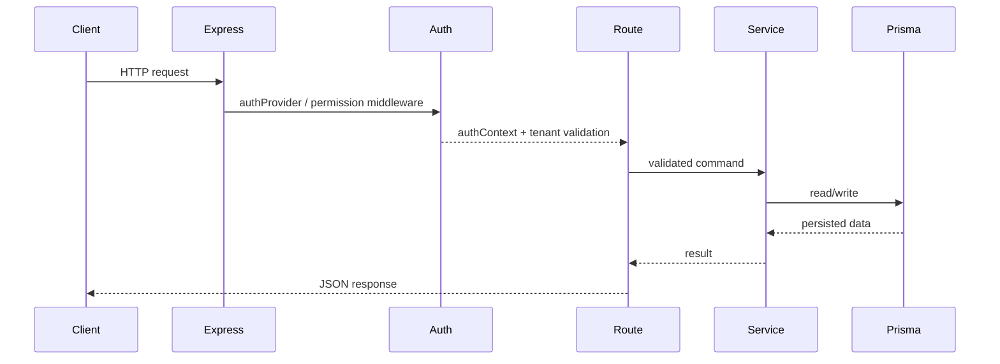

# Backend Architecture

Jet Admin's backend is a modular Node.js application that combines API routing, multi-tenant authorization, Prisma persistence, realtime sockets, cron startup, and an in-process workflow runtime.

## Architectural goals

The backend is organized to support:

- **tenant-scoped access control**,
- **feature modularity** through per-domain modules,
- **reusable configuration surfaces** under `config/`,
- **mixed execution styles**: synchronous REST, realtime sockets, and asynchronous workflow jobs,
- **incremental extensibility** without splitting the repository into separate deployable services.

## Runtime overview

```mermaid
flowchart TB
    Entry[index.js] --> Env[environment.js]
    Entry --> Express[express-app.config.js]
    Entry --> HTTP[http-server.config.js]
    Entry --> Socket[socket.io server]

    Express --> AuthRoutes[/api/v1/auth]
    Express --> TenantRoutes[/api/v1/tenants]

    TenantRoutes --> FeatureModules[tenant nested modules]
    FeatureModules --> Database[database / datasource / queries]
    FeatureModules --> Dashboards[dashboard / widget]
    FeatureModules --> Admin[user management / roles / api keys]
    FeatureModules --> Workflow[workflow]

    AuthRoutes --> Prisma[(PostgreSQL via Prisma)]
    FeatureModules --> Prisma

    Entry --> Cron[node-cron startup]
    Entry --> Workers[workflowWorkers.js]
    Workers --> Queue[fastq in-memory queue adapter]
    Workers --> Orchestrator[result consumer]
    Workers --> TaskWorker[node executor]
    Orchestrator --> Prisma
    TaskWorker --> External[external systems / datasources / vm2]
    Orchestrator --> Socket
```

## Entry point and application boot

The main process starts in `apps/backend/index.js`.

At startup it:

1. loads environment variables from `apps/backend/.env` through `environment.js`,
2. initializes the Express app and HTTP server,
3. mounts top-level routes such as `/health`, `/monitor`, `/api/v1/auth`, and `/api/v1/tenants`,
4. attaches Socket.IO listeners for AI chat, workflow execution rooms, and widget-workflow events,
5. schedules cron jobs,
6. starts workflow workers using the active queue adapter,
7. registers graceful shutdown handling.

## Configuration layer

Most operational behavior is centralized under `apps/backend/config/`.

Important configuration files include:

| File | Responsibility |
| --- | --- |
| `express-app.config.js` | Express instance, CORS, body parsing, trust proxy, request-size limits, Morgan logging. |
| `http-server.config.js` | Wraps the Express app in a Node HTTP server. |
| `socket.io.js` | Creates the Socket.IO server and applies socket auth middleware. |
| `prisma.config.js` | Exposes the Prisma client used by service modules. |
| `queue.config.js` | Active in-memory workflow queue implementation using `fastq`. |
| `rabbitmq.config.js` | Legacy/alternate AMQP-oriented queue implementation retained in the repo. |
| `module.config.js` | Enables/disables feature modules through `ENABLED_MODULES`. |

## Environment model

`apps/backend/environment.js` reads `.env` from the backend app directory and exposes a normalized config object.

Commonly used variables include:

- `NODE_ENV`, `NODE_ID`, `PORT`
- `ENABLED_MODULES`
- `DATABASE_URL`
- `CORS_WHITELIST`
- `EXPRESS_REQUEST_SIZE_LIMIT`
- `GEMINI_API_KEY`
- `LOG_LEVEL`, `LOG_RETENTION`, `LOG_FILE_SIZE`
- `SYSLOG_HOST`, `SYSLOG_PORT`, `SYSLOG_PROTOCOL`, `SYSLOG_LEVEL`

## Routing and module composition

The backend is not split into microservices. Instead, it uses a **modular monolith** layout where feature areas own their controller/service/route/middleware files.

### Top-level routes

- `/api/v1/auth` for current-user and user-config endpoints
- `/api/v1/tenants` for tenant CRUD and tenant-scoped feature routing

### Tenant-scoped nested routes

`tenant.v1.routes.js` mounts the feature modules under `/:tenantID/...`, including:

- `database`
- `datasources`
- `queries`
- `workflows`
- `widgets`
- `dashboards`
- `users`
- `roles`
- `apikeys`
- `cronjobs`
- `audit`
- `ai`

This structure keeps most business operations explicitly tenant-bound.

## Common module shape

Most backend modules follow a stable pattern:

| File type | Role |
| --- | --- |
| `*.controller.js` | Request/response orchestration and HTTP formatting. |
| `*.service.js` | Business logic and persistence coordination. |
| `*.v1.routes.js` / `*.v1.route.js` | Endpoint registration. |
| `*.middleware.js` | Auth, validation, policy, and resource-specific checks. |
| `*.validator.js` | Input schemas used by validation helpers. |

This consistency is important when adding new modules or tracing a request path.

## Authentication and authorization

Authentication and authorization are centered in `modules/auth/`.

### Authentication modes

The HTTP middleware supports two authorization styles:

1. **Firebase bearer tokens** using `Authorization: Bearer <id-token>`
2. **API key auth** using `Authorization: api_key <key>`

Sockets are authenticated separately using Firebase ID tokens passed in the handshake.

### Authorization model

Authorization is **tenant-scoped RBAC**:

- the request must resolve a valid tenant context,
- roles are loaded through Prisma relations,
- permissions are evaluated against the requested action,
- tenant `ADMIN` short-circuits deeper permission checks,
- API keys are evaluated against their own mapped permissions.

## Request lifecycle



Validation is typically applied before controllers using shared helpers such as `validate()` and `validateAll()`.

## Data access strategy

Jet Admin uses more than one data-access style:

### 1. Application persistence

Prisma is used for the application's own metadata and control-plane data, such as:

- tenants,
- users,
- roles and permissions,
- API keys,
- workflows and workflow instances,
- dashboard and widget metadata.

### 2. Tenant-connected data systems

For tenant-facing operational data access, modules may use datasource logic or database utilities to interact with external systems and tenant-specific resources.

This distinction is important:

- **Prisma/PostgreSQL** stores Jet Admin platform state.
- **Datasource/database modules** interact with data systems managed or queried by Jet Admin.

## Realtime architecture

Socket.IO is used for features that need live interaction rather than polling.

Current realtime usage includes:

- AI chat events,
- workflow run room subscription and status updates,
- widget-workflow bridge events,
- monitor socket initialization for operational visibility.

The backend emits workflow node updates and overall workflow status updates as runs advance.

## Workflow runtime integration

The workflow engine runs inside the backend process today.

Important pieces:

- `workflowWorkers.js` starts the queue, result consumer, and task worker.
- `queue.config.js` implements the active `workflow.tasks` and `workflow.results` channels in memory.
- `orchestrator/orchestrator.js` performs the check-decide-act loop.
- `workers/taskWorker.js` resolves node handlers by `nodeType` and publishes results.

### Queue note

Although `amqplib` and `rabbitmq.config.js` still exist in the repository, the current startup path explicitly initializes the **in-memory queue adapter**, not RabbitMQ.

## Observability and operational behavior

The backend includes several lightweight operational surfaces:

- `/health` for health checks,
- `/monitor` for monitor UI access,
- structured logging through the internal logger,
- optional syslog-oriented configuration,
- graceful shutdown for workflow worker cleanup.

## Architectural summary

The backend should be understood as a **tenant-aware modular monolith** with three major execution planes:

1. **REST APIs** for CRUD and administrative operations,
2. **Socket events** for live collaboration and execution feedback,
3. **In-process asynchronous workflow execution** backed by `fastq` queues.

That combination is the backbone of the current Jet Admin platform.