# Database Schema

The following documentation represents the core tables, structures, and relationships in the Jet Admin PostgreSQL database, verified directly from `schema.prisma`.

---

## Entity Relationship Diagram (ERD)

```mermaid
erDiagram
    %% Tenants & Users Core
    tblTenants ||--o{ tblUsersTenantsRelationship : "has_members"
    tblUsers ||--o{ tblUsersTenantsRelationship : "has_roles"
    tblTenants ||--o{ tblAPIKeys : "owns_keys"
    tblUsers ||--o{ tblAPIKeys : "creates_keys"
    
    %% Role Base Access Control
    tblTenants ||--o{ tblRoles : "defines_roles"
    tblRoles ||--o{ tblRolePermissionMappings : "has_permissions"
    tblPermissions ||--o{ tblRolePermissionMappings : "mapped_in"
    tblUsersTenantsRelationship ||--o{ tblUserTenantRoleMappings : "assigned"
    tblRoles ||--o{ tblUserTenantRoleMappings : "role_mapped"
    tblAPIKeys ||--o{ tblAPIKeyRoleMappings : "has_apiKey_roles"
    tblRoles ||--o{ tblAPIKeyRoleMappings : "apiKey_role_mapped"

    %% Connectivity & Pages
    tblTenants ||--o{ tblDatasources : "registers_sources"
    tblTenants ||--o{ tblDataQueries : "defines_queries"
    tblDatasources ||--o{ tblDataQueries : "executed_via"
    tblTenants ||--o{ tblAppPages : "has_pages"
    tblTenants ||--o{ tblWidgets : "mounts_widgets"

    %% Workflow Orchestration
    tblTenants ||--o{ tblWorkflows : "defines_workflows"
    tblWorkflows ||--o{ tblWorkflowNodes : "contains_nodes"
    tblWorkflows ||--o{ tblWorkflowEdge : "connects_via"
    tblTenants ||--o{ tblWorkflowInstances : "executes_instances"
    tblWorkflows ||--o{ tblWorkflowInstances : "instantiated_from"
    tblWorkflowInstances ||--o{ tblWorkflowInstanceLogs : "generates_logs"
    tblWorkflowInstances ||--o{ tblWorkflowDataCollectionRequests : "requires_inputs"

    %% Listeners & Automation
    tblTenants ||--o{ tblListeners : "attaches_listeners"
    tblDatasources ||--o{ tblListeners : "listened_by"
    tblListeners ||--o{ tblListenerActions : "triggers_actions"
    tblListeners ||--o{ tblListenerEvents : "records_events"
    tblTenants ||--o{ tblCronJobs : "schedules_jobs"
    tblWorkflows ||--o{ tblCronJobs : "triggers_workflow"
    tblCronJobs ||--o{ tblCronJobHistory : "records_history"
```

---

## Table Definitions

### 1. User & Tenant Administration
*   **`tblTenants`**: Root multi-tenant entity. Tracks logo URL, disabled state, and metadata.
*   **`tblUsers`**: Core user profiles synchronized from Firebase Auth (`firebaseID`).
*   **`tblUsersTenantsRelationship`**: Junction table assigning users to specific tenants (with role string defaults like `MEMBER`).
*   **`tblUserTenantConfigMap`**: Store of user preferences per tenant.

### 2. Authorization & RBAC
*   **`tblRoles`**: Tenant-scoped role titles.
*   **`tblPermissions`**: Permission actions (such as `workflow:create`).
*   **`tblRolePermissionMappings`**: Links permission keys to specific roles.
*   **`tblUserTenantRoleMappings`**: Links users within a tenant to multiple custom roles.
*   **`tblAPIKeys`**: API keys representing services or integration accounts. Keys are stored as SHA-256 hashes (`apiKey`).
*   **`tblAPIKeyRoleMappings`**: Assigns roles to API Keys for granular service execution.

### 3. Application Pages & UI Widgets
*   **`tblAppPages`**: Stores page screens and layouts configured as JSON arrays (`appPageConfig`).
*   **`tblWidgets`**: Defines component configurations (`widgetConfig`), types, and automatic refresh intervals.

### 4. Data Sources & Queries
*   **`tblDatasources`**: Stores connection settings (`datasourceOptions` is AES encrypted at rest).
*   **`tblDataQueries`**: Stores dynamic query configurations (`dataQueryOptions` JSON) with schema details. Runs on load if enabled.

### 5. Workflow Execution Engine
*   **`tblWorkflows`**: Parent metadata table for workflows.
*   **`tblWorkflowNodes`**: Configures specific workflow nodes (`nodeConfig` parameters, `timeoutSeconds`, and `retryLimit`).
*   **`tblWorkflowEdge`**: Declares DAG connection paths between nodes, defining custom condition mapping (`edgeConfig` and target handlers).
*   **`tblWorkflowInstances`**: Tracks active workflow executions, including a `version` field for optimistic lock concurrency guards.
*   **`tblWorkflowInstanceLogs`**: Append-only log trail recording node status transitions (`INPUT_SET`, `NODE_COMPLETED`, etc.) to fold execution contexts.
*   **`tblWorkflowDataCollectionRequests`**: Logs manual interaction requests (e.g., human-in-the-loop forms).

### 6. Event Listening & Scheduled Jobs
*   **`tblListeners`**: Connection metadata for background datasource events (e.g., PostgreSQL CDC listener endpoint path and active status).
*   **`tblListenerActions`**: Action mapping routines triggering specific steps (like workflows) on data events.
*   **`tblListenerEvents`**: Ring buffer storing transformed event records (`eventData` JSON).
*   **`tblCronJobs`**: Stores cron scheduler parameters (`cronJobSchedule`) executing target workflows.
*   **`tblCronJobHistory`**: Traces execution runs, durations, and output statuses from the cron daemon.
