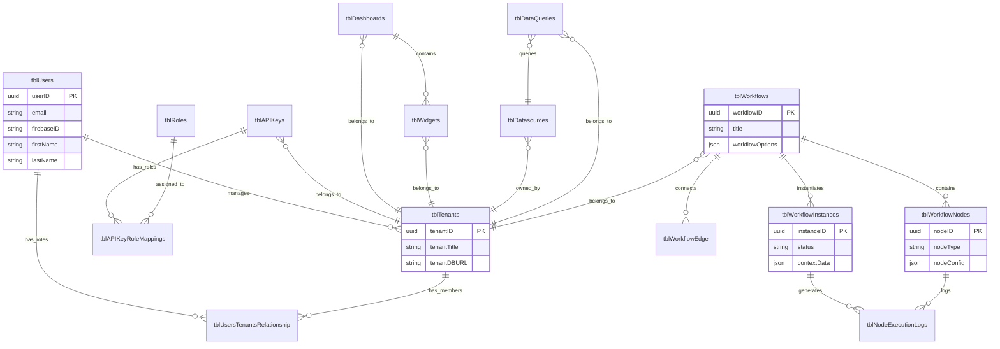

# Database Schema

The following diagram represents the core tables and relationships in the Jet Admin database, generated from the Prisma Schema.

## Entity Relationship Diagram

## Core Entities

### User Management

| Table | Description |
|:------|:------------|
| `tblUsers` | System users synced with Firebase Authentication |
| `tblTenants` | Workspaces/organizations in the multi-tenant system |
| `tblUsersTenantsRelationship` | Junction table linking users to tenants with roles |
| `tblRoles` | Role definitions (Admin, Editor, Viewer) |
| `tblPermissions` | Granular permissions assigned to roles |

### Resources (Tenant-Scoped)

| Table | Description |
|:------|:------------|
| `tblDatasources` | External database connection configurations (encrypted) |
| `tblDataQueries` | Saved SQL/API queries for reuse |
| `tblWorkflows` | Workflow metadata and settings |
| `tblWorkflowVersions` | Versioned workflow graph (nodes/edges as JSON) |
| `tblDashboards` | Dashboard layouts and settings |
| `tblWidgets` | Widget instances with configuration |

### Runtime & Logging

| Table | Description |
|:------|:------------|
| `tblWorkflowInstances` | Individual workflow execution runs |
| `tblNodeExecutionLogs` | Per-node execution logs within a run |
| `tblAuditLogs` | Security audit trail for compliance |
| `tblCronJobs` | Scheduled task configurations |

## Key Design Patterns

- **Multi-tenancy**: All resource tables have a `tenantID` foreign key for data isolation
- **UUIDs**: Primary keys use `gen_random_uuid()` for distributed ID generation
- **Soft Deletes**: Critical tables support `deletedAt` for recoverable deletion
- **Timestamps**: Standard `createdAt` and `updatedAt` on all tables
- **Encrypted Fields**: Datasource credentials are AES-encrypted at rest

