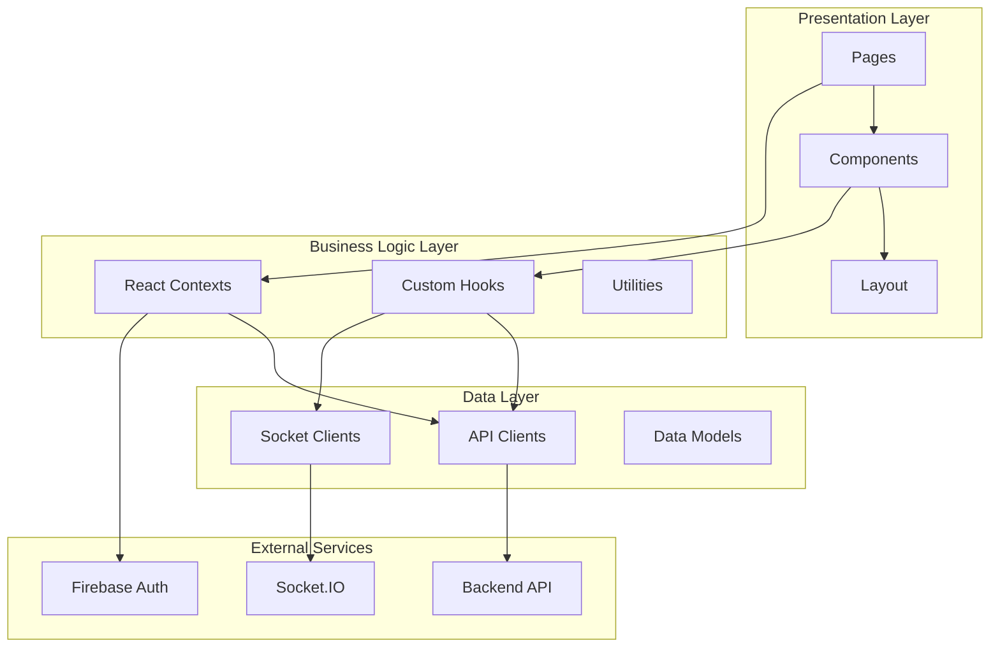

# Frontend Architecture

This document provides a comprehensive deep-dive into Jet Admin's frontend architecture, explaining the design decisions, folder structure, key components, and how data flows through the application.

---

## 📋 Table of Contents

- [Technology Stack](#technology-stack)
- [Project Structure](#project-structure)
- [Application Architecture](#application-architecture)
- [Routing System](#routing-system)
- [State Management](#state-management)
- [API Layer](#api-layer)
- [Component Architecture](#component-architecture)
- [Shared Packages](#shared-packages)
- [Real-Time Communication](#real-time-communication)
- [Authentication Flow](#authentication-flow)
- [Styling System](#styling-system)
- [Build & Deployment](#build--deployment)

---

## Technology Stack

Jet Admin's frontend is built on a modern, production-ready technology stack:

| Technology | Version | Purpose |
|------------|---------|---------|
| **Framework** | React 18 | UI library |
| **Build Tool** | Vite 5.x | Fast build & HMR |
| **Language** | JavaScript/JSX | Application code |
| **Routing** | React Router v6 | Client-side routing |
| **State** | React Query + Context | Server & client state |
| **UI Library** | Material-UI (MUI) | Component library |
| **Styling** | TailwindCSS + Emotion | CSS framework |
| **Charts** | Chart.js + react-chartjs-2 | Data visualization |
| **Workflow Editor** | React Flow | Node-based editor |
| **Forms** | JSON Forms | Dynamic form rendering |
| **Code Editor** | Monaco Editor | Code input |
| **HTTP Client** | Axios | API requests |
| **Real-time** | Socket.IO Client | WebSocket communication |
| **Auth** | Firebase SDK | Authentication |

---

## Project Structure

The frontend follows a feature-based, layered architecture:

```
apps/frontend/
├── public/                      # Static assets
│   ├── config.js                # Runtime configuration
│   ├── index.html               # HTML template
│   └── favicon.ico
│
├── src/
│   ├── data/                    # Data layer
│   │   ├── api/                 # API clients
│   │   │   ├── apiClient.js     # Axios instance
│   │   │   ├── auth.api.js      # Auth endpoints
│   │   │   ├── tenant.api.js    # Tenant endpoints
│   │   │   ├── datasource.api.js
│   │   │   ├── workflow.api.js
│   │   │   ├── dashboard.api.js
│   │   │   └── widget.api.js
│   │   │
│   │   ├── models/              # Data models
│   │   │   ├── tenant.model.js
│   │   │   ├── datasource.model.js
│   │   │   ├── workflow.model.js
│   │   │   └── widget.model.js
│   │   │
│   │   └── sockets/             # Socket.IO clients
│   │       ├── socketClient.js  # Socket connection
│   │       ├── workflow.socket.js
│   │       └── widget.socket.js
│   │
│   ├── logic/                   # Business logic layer
│   │   ├── contexts/            # React contexts
│   │   │   ├── AuthContext.jsx  # Authentication state
│   │   │   ├── TenantContext.jsx # Tenant state
│   │   │   ├── ThemeContext.jsx # Theme state
│   │   │   └── SocketContext.jsx # Socket state
│   │   │
│   │   ├── hooks/               # Custom hooks
│   │   │   ├── useAuth.js       # Auth hook
│   │   │   ├── useTenant.js     # Tenant hook
│   │   │   ├── useWorkflow.js   # Workflow hook
│   │   │   ├── useWidget.js     # Widget hook
│   │   │   └── useSocket.js     # Socket hook
│   │   │
│   │   └── utils/               # Utility functions
│   │       ├── formatters.js    # Data formatters
│   │       ├── validators.js    # Input validators
│   │       └── constants.js     # App constants
│   │
│   ├── presentation/            # UI layer
│   │   ├── components/          # Reusable components
│   │   │   ├── common/          # Generic components
│   │   │   │   ├── Button.jsx
│   │   │   │   ├── Modal.jsx
│   │   │   │   ├── Table.jsx
│   │   │   │   ├── Loading.jsx
│   │   │   │   └── ErrorBoundary.jsx
│   │   │   │
│   │   │   ├── layout/          # Layout components
│   │   │   │   ├── AppShell.jsx        # Main app container
│   │   │   │   ├── Sidebar.jsx         # Navigation sidebar
│   │   │   │   ├── Header.jsx          # Top header
│   │   │   │   ├── Breadcrumbs.jsx     # Navigation breadcrumbs
│   │   │   │   └── Footer.jsx
│   │   │   │
│   │   │   ├── auth/            # Authentication components
│   │   │   │   ├── LoginForm.jsx
│   │   │   │   ├── ProtectedRoute.jsx
│   │   │   │   └── AuthCallback.jsx
│   │   │   │
│   │   │   ├── datasource/      # Datasource components
│   │   │   │   ├── DatasourceList.jsx
│   │   │   │   ├── DatasourceForm.jsx
│   │   │   │   ├── DatasourceCatalog.jsx
│   │   │   │   └── TestConnection.jsx
│   │   │   │
│   │   │   ├── workflow/        # Workflow components
│   │   │   │   ├── WorkflowEditor.jsx    # Main editor
│   │   │   │   ├── WorkflowCanvas.jsx    # React Flow canvas
│   │   │   │   ├── WorkflowNode.jsx      # Node wrapper
│   │   │   │   ├── WorkflowEdge.jsx      # Custom edge
│   │   │   │   ├── NodeInspector.jsx     # Node config panel
│   │   │   │   ├── WorkflowToolbar.jsx   # Editor toolbar
│   │   │   │   └── WorkflowRunner.jsx    # Execution controls
│   │   │   │
│   │   │   ├── widget/          # Widget components
│   │   │   │   ├── WidgetCatalog.jsx     # Widget selector
│   │   │   │   ├── WidgetConfigurator.jsx # Config panel
│   │   │   │   ├── ChartWidget.jsx       # Chart renderer
│   │   │   │   ├── TableWidget.jsx       # Table renderer
│   │   │   │   └── TextWidget.jsx        # Text renderer
│   │   │   │
│   │   │   ├── dashboard/       # Dashboard components
│   │   │   │   ├── DashboardBuilder.jsx  # Grid layout editor
│   │   │   │   ├── DashboardList.jsx
│   │   │   │   ├── DashboardView.jsx
│   │   │   │   └── WidgetGrid.jsx        # Draggable grid
│   │   │   │
│   │   │   ├── query/           # Query builder components
│   │   │   │   ├── QueryEditor.jsx       # SQL/code editor
│   │   │   │   ├── QueryTester.jsx       # Test panel
│   │   │   │   ├── QueryParams.jsx       # Parameter inputs
│   │   │   │   └── QueryResults.jsx      # Results display
│   │   │   │
│   │   │   └── admin/           # Admin components
│   │   │       ├── UserManagement.jsx
│   │   │       ├── RoleEditor.jsx
│   │   │       └── TenantSettings.jsx
│   │   │
│   │   └── pages/               # Route pages
│   │       ├── Login.jsx
│   │       ├── Dashboard.jsx
│   │       ├── Datasources.jsx
│   │       ├── Workflows.jsx
│   │       ├── WorkflowEditor.jsx
│   │       ├── Dashboards.jsx
│   │       ├── DashboardBuilder.jsx
│   │       ├── Queries.jsx
│   │       ├── Users.jsx
│   │       └── Settings.jsx
│   │
│   ├── App.jsx                  # Root component
│   ├── App.test.jsx             # App tests
│   ├── index.jsx                # Entry point
│   └── reportWebVitals.js       # Performance metrics
│
├── .env                         # Environment variables
├── .env.sample                  # Environment template
├── vite.config.js               # Vite configuration
├── tailwind.config.js           # Tailwind configuration
├── package.json                 # Dependencies
└── public/
    └── config.js                # Runtime config (Docker)
```

---

## Application Architecture

### Layered Architecture



### Component Hierarchy

```
App
├── AuthProvider
│   └── TenantProvider
│       └── SocketProvider
│           └── ThemeProvider
│               └── AppShell
│                   ├── Sidebar (Navigation)
│                   ├── Header (User info, tenant switcher)
│                   └── Main Content Area
│                       └── Route Pages
│                           ├── Dashboard
│                           ├── Datasources
│                           ├── Workflows
│                           └── ...
```

---

## Routing System

React Router v6 manages client-side routing:

### Route Configuration

```javascript
// App.jsx
import { BrowserRouter, Routes, Route, Navigate } from 'react-router-dom';
import { useAuth } from './logic/hooks/useAuth';

// Pages
import Login from './presentation/pages/Login';
import Dashboard from './presentation/pages/Dashboard';
import Datasources from './presentation/pages/Datasources';
import Workflows from './presentation/pages/Workflows';
import WorkflowEditor from './presentation/pages/WorkflowEditor';
import Dashboards from './presentation/pages/Dashboards';
import DashboardBuilder from './presentation/pages/DashboardBuilder';
import ProtectedRoute from './presentation/components/auth/ProtectedRoute';

function App() {
  return (
    <BrowserRouter>
      <Routes>
        {/* Public routes */}
        <Route path="/login" element={<Login />} />
        
        {/* Protected routes */}
        <Route element={<ProtectedRoute />}>
          <Route path="/" element={<Dashboard />} />
          <Route path="/datasources" element={<Datasources />} />
          <Route path="/workflows" element={<Workflows />} />
          <Route path="/workflows/:workflowId/edit" element={<WorkflowEditor />} />
          <Route path="/dashboards" element={<Dashboards />} />
          <Route path="/dashboards/:dashboardId/build" element={<DashboardBuilder />} />
          <Route path="/queries" element={<Queries />} />
          <Route path="/users" element={<Users />} />
          <Route path="/settings" element={<Settings />} />
        </Route>

        {/* Catch all */}
        <Route path="*" element={<Navigate to="/" replace />} />
      </Routes>
    </BrowserRouter>
  );
}
```

### Protected Route Component

```javascript
// presentation/components/auth/ProtectedRoute.jsx
import { Navigate, useLocation } from 'react-router-dom';
import { useAuth } from '../../../logic/hooks/useAuth';
import Loading from '../common/Loading';

function ProtectedRoute({ children }) {
  const { user, loading } = useAuth();
  const location = useLocation();

  if (loading) {
    return <Loading fullScreen message="Loading..." />;
  }

  if (!user) {
    // Redirect to login with return URL
    return <Navigate to="/login" state={{ from: location }} replace />;
  }

  return children;
}

export default ProtectedRoute;
```

---

## State Management

Jet Admin uses a hybrid approach: React Query for server state + Context for global state.

### React Query (Server State)

```javascript
// data/api/queryClient.js
import { QueryClient } from '@tanstack/react-query';

export const queryClient = new QueryClient({
  defaultOptions: {
    queries: {
      refetchOnWindowFocus: false,
      retry: 1,
      staleTime: 5 * 60 * 1000, // 5 minutes
    },
  },
});
```

### Custom Hooks with React Query

```javascript
// logic/hooks/useWorkflow.js
import { useQuery, useMutation, useQueryClient } from '@tanstack/react-query';
import { workflowApi } from '../../data/api/workflow.api';

export function useWorkflows(tenantID) {
  return useQuery({
    queryKey: ['workflows', tenantID],
    queryFn: () => workflowApi.list(tenantID),
    enabled: !!tenantID,
  });
}

export function useWorkflow(workflowID, tenantID) {
  return useQuery({
    queryKey: ['workflow', workflowID],
    queryFn: () => workflowApi.get(workflowID, tenantID),
    enabled: !!workflowID && !!tenantID,
  });
}

export function useCreateWorkflow() {
  const queryClient = useQueryClient();

  return useMutation({
    mutationFn: (data) => workflowApi.create(data.tenantID, data.workflow),
    onSuccess: (data, variables) => {
      // Invalidate and refetch
      queryClient.invalidateQueries({queryKey:'workflows', variables.tenantID});
    },
  });
}

export function useExecuteWorkflow() {
  return useMutation({
    mutationFn: ({ workflowID, tenantID, input }) =>
      workflowApi.execute(workflowID, tenantID, input),
  });
}
```

### Auth Context

```javascript
// logic/contexts/AuthContext.jsx
import { createContext, useContext, useState, useEffect } from 'react';
import { auth } from 'firebase/app';
import { onAuthStateChanged, signInWithPopup, GoogleAuthProvider } from 'firebase/auth';

const AuthContext = createContext(null);

export function AuthProvider({ children }) {
  const [user, setUser] = useState(null);
  const [loading, setLoading] = useState(true);

  useEffect(() => {
    const unsubscribe = onAuthStateChanged(auth, (firebaseUser) => {
      setUser(firebaseUser);
      setLoading(false);
    });

    return unsubscribe;
  }, []);

  const signInWithGoogle = async () => {
    const provider = new GoogleAuthProvider();
    await signInWithPopup(auth, provider);
  };

  const signOut = async () => {
    await auth.signOut();
  };

  const value = {
    user,
    loading,
    signInWithGoogle,
    signOut,
    isAuthenticated: !!user,
  };

  return <AuthContext.Provider value={value}>{children}</AuthContext.Provider>;
}

export function useAuth() {
  const context = useContext(AuthContext);
  if (!context) {
    throw new Error('useAuth must be used within AuthProvider');
  }
  return context;
}
```

### Tenant Context

```javascript
// logic/contexts/TenantContext.jsx
import { createContext, useContext, useState, useEffect } from 'react';
import { useAuth } from '../hooks/useAuth';
import { tenantApi } from '../../data/api/tenant.api';

const TenantContext = createContext(null);

export function TenantProvider({ children }) {
  const { user } = useAuth();
  const [tenants, setTenants] = useState([]);
  const [currentTenant, setCurrentTenant] = useState(null);
  const [loading, setLoading] = useState(false);

  // Load user's tenants
  useEffect(() => {
    async function loadTenants() {
      if (!user) {
        setTenants([]);
        return;
      }

      setLoading(true);
      try {
        const userTenants = await tenantApi.list();
        setTenants(userTenants);
        
        // Set first tenant as default
        if (userTenants.length > 0 && !currentTenant) {
          setCurrentTenant(userTenants[0]);
        }
      } catch (error) {
        console.error('Failed to load tenants:', error);
      } finally {
        setLoading(false);
      }
    }

    loadTenants();
  }, [user]);

  const selectTenant = (tenant) => {
    setCurrentTenant(tenant);
    localStorage.setItem('selectedTenant', JSON.stringify(tenant));
  };

  const value = {
    tenants,
    currentTenant,
    selectTenant,
    loading,
    hasTenants: tenants.length > 0,
  };

  return (
    <TenantContext.Provider value={value}>
      {children}
    </TenantContext.Provider>
  );
}

export function useTenant() {
  const context = useContext(TenantContext);
  if (!context) {
    throw new Error('useTenant must be used within TenantProvider');
  }
  return context;
}
```

---

## API Layer

### Axios Instance

```javascript
// data/api/apiClient.js
import axios from 'axios';
import { auth } from 'firebase/app';

// Get runtime config
const getConfig = () => {
  // Check for Docker runtime config
  if (window.JET_ADMIN_CONFIG) {
    return {
      baseURL: window.JET_ADMIN_CONFIG.SERVER_HOST,
      socketURL: window.JET_ADMIN_CONFIG.SOCKET_HOST,
    };
  }
  
  // Fallback to Vite env vars
  return {
    baseURL: import.meta.env.VITE_SERVER_HOST || 'http://localhost:8090',
    socketURL: import.meta.env.VITE_SOCKET_HOST || 'http://localhost:8090',
  };
};

const config = getConfig();

// Create axios instance
const apiClient = axios.create({
  baseURL: config.baseURL,
  headers: {
    'Content-Type': 'application/json',
  },
});

// Request interceptor - add auth token
apiClient.interceptors.request.use(
  async (request) => {
    const user = auth.currentUser;
    if (user) {
      const token = await user.getIdToken();
      request.headers.Authorization = `Bearer ${token}`;
    }
    
    // Add tenant ID if available
    const tenant = JSON.parse(localStorage.getItem('selectedTenant'));
    if (tenant) {
      request.headers['x-tenant-id'] = tenant.tenantID;
    }
    
    return request;
  },
  (error) => Promise.reject(error)
);

// Response interceptor - handle errors
apiClient.interceptors.response.use(
  (response) => response,
  (error) => {
    if (error.response?.status === 401) {
      // Token expired - redirect to login
      auth.signOut();
      window.location.href = '/login';
    }
    return Promise.reject(error);
  }
);

export { apiClient, config };
```

### API Module Example

```javascript
// data/api/workflow.api.js
import { apiClient } from './apiClient';

export const workflowApi = {
  // List all workflows
  async list(tenantID) {
    const response = await apiClient.get(`/api/v1/tenants/${tenantID}/workflows`);
    return response.data.data;
  },

  // Get single workflow
  async get(workflowID, tenantID) {
    const response = await apiClient.get(
      `/api/v1/tenants/${tenantID}/workflows/${workflowID}`
    );
    return response.data.data;
  },

  // Create workflow
  async create(tenantID, workflowData) {
    const response = await apiClient.post(
      `/api/v1/tenants/${tenantID}/workflows`,
      workflowData
    );
    return response.data.data;
  },

  // Update workflow
  async update(workflowID, tenantID, workflowData) {
    const response = await apiClient.patch(
      `/api/v1/tenants/${tenantID}/workflows/${workflowID}`,
      workflowData
    );
    return response.data.data;
  },

  // Delete workflow
  async delete(workflowID, tenantID) {
    await apiClient.delete(
      `/api/v1/tenants/${tenantID}/workflows/${workflowID}`
    );
  },

  // Execute workflow
  async execute(workflowID, tenantID, input = {}) {
    const response = await apiClient.post(
      `/api/v1/tenants/${tenantID}/workflows/${workflowID}/execute`,
      { input }
    );
    return response.data.data;
  },

  // Test workflow (unsaved)
  async test(tenantID, nodes, edges, input = {}) {
    const response = await apiClient.post(
      `/api/v1/tenants/${tenantID}/workflows/test`,
      { nodes, edges, input }
    );
    return response.data.data;
  },

  // Get workflow instance status
  async getInstance(instanceID, tenantID) {
    const response = await apiClient.get(
      `/api/v1/tenants/${tenantID}/workflows/instances/${instanceID}`
    );
    return response.data.data;
  },

  // Stop workflow instance
  async stop(instanceID, tenantID) {
    await apiClient.delete(
      `/api/v1/tenants/${tenantID}/workflows/instances/${instanceID}/stop`
    );
  },
};
```

---

## Component Architecture

### Component Patterns

#### Container/Presentational Pattern

```javascript
// Container component (logic)
// presentation/components/workflow/WorkflowEditorContainer.jsx
import { useState, useCallback } from 'react';
import { useWorkflow, useExecuteWorkflow } from '../../../logic/hooks/useWorkflow';
import { useSocket } from '../../../logic/hooks/useSocket';
import WorkflowEditor from './WorkflowEditor';

export function WorkflowEditorContainer({ workflowId }) {
  const { data: workflow, isLoading } = useWorkflow(workflowId);
  const executeMutation = useExecuteWorkflow();
  const { subscribeToWorkflow } = useSocket();
  
  const [nodes, setNodes] = useState(workflow?.nodes || []);
  const [edges, setEdges] = useState(workflow?.edges || []);
  const [isRunning, setIsRunning] = useState(false);

  const handleRun = useCallback(async (input) => {
    setIsRunning(true);
    
    // Subscribe to real-time updates
    const instance = await executeMutation.mutateAsync({ workflowId, input });
    subscribeToWorkflow(instance.instanceID, {
      onNodeUpdate: (nodeData) => {
        // Update UI with node progress
      },
      onComplete: () => {
        setIsRunning(false);
      },
    });
  }, [workflowId]);

  if (isLoading) {
    return <div>Loading workflow...</div>;
  }

  return (
    <WorkflowEditor
      nodes={nodes}
      edges={edges}
      onNodesChange={setNodes}
      onEdgesChange={setEdges}
      onRun={handleRun}
      isRunning={isRunning}
    />
  );
}

// Presentational component (UI)
// presentation/components/workflow/WorkflowEditor.jsx
import ReactFlow from 'reactflow';
import 'reactflow/dist/style.css';

function WorkflowEditor({ nodes, edges, onNodesChange, onEdgesChange, onRun, isRunning }) {
  return (
    <div className="workflow-editor">
      <ReactFlow
        nodes={nodes}
        edges={edges}
        onNodesChange={onNodesChange}
        onEdgesChange={onEdgesChange}
        fitView
      >
        {/* Custom controls */}
      </ReactFlow>
      
      <button onClick={() => onRun({})} disabled={isRunning}>
        {isRunning ? 'Running...' : 'Run Workflow'}
      </button>
    </div>
  );
}

export default WorkflowEditor;
```

### Shared Component Example

```javascript
// presentation/components/common/Modal.jsx
import { Dialog, Transition } from '@headlessui/react';
import { Fragment } from 'react';

export function Modal({ isOpen, onClose, title, children, size = 'md' }) {
  const sizeClasses = {
    sm: 'max-w-md',
    md: 'max-w-lg',
    lg: 'max-w-2xl',
    xl: 'max-w-4xl',
  };

  return (
    <Transition appear show={isOpen} as={Fragment}>
      <Dialog as="div" className="relative z-50" onClose={onClose}>
        <Transition.Child
          as={Fragment}
          enter="ease-out duration-300"
          enterFrom="opacity-0"
          enterTo="opacity-100"
          leave="ease-in duration-200"
          leaveFrom="opacity-100"
          leaveTo="opacity-0"
        >
          <div className="fixed inset-0 bg-black bg-opacity-25" />
        </Transition.Child>

        <div className="fixed inset-0 overflow-y-auto">
          <div className="flex min-h-full items-center justify-center p-4">
            <Transition.Child
              as={Fragment}
              enter="ease-out duration-300"
              enterFrom="opacity-0 scale-95"
              enterTo="opacity-100 scale-100"
              leave="ease-in duration-200"
              leaveFrom="opacity-100 scale-100"
              leaveTo="opacity-0 scale-95"
            >
              <Dialog.Panel
                className={`w-full ${sizeClasses[size]} transform overflow-hidden rounded-2xl bg-white p-6 text-left align-middle shadow-xl transition-all`}
              >
                <Dialog.Title
                  as="h3"
                  className="text-lg font-medium leading-6 text-gray-900 mb-4"
                >
                  {title}
                </Dialog.Title>
                
                {children}
              </Dialog.Panel>
            </Transition.Child>
          </div>
        </div>
      </Dialog>
    </Transition>
  );
}
```

---

## Shared Packages

Jet Admin uses a monorepo structure with shared packages:

### Package Structure

```
packages/
├── datasource-types/        # Shared datasource schemas
│   ├── src/
│   │   ├── index.js         # Exports all types
│   │   ├── postgresql.js    # PostgreSQL schema
│   │   ├── restapi.js       # REST API schema
│   │   └── ...
│   └── package.json
│
├── datasources-logic/       # Backend datasource drivers
│   ├── src/
│   │   ├── index.js
│   │   ├── postgresql/
│   │   │   ├── testConnection.js
│   │   │   └── executeQuery.js
│   │   └── ...
│   └── package.json
│
├── datasources-ui/          # Frontend datasource forms
│   ├── src/
│   │   ├── index.js
│   │   ├── PostgreSQLForm.jsx
│   │   ├── RestApiForm.jsx
│   │   └── ...
│   └── package.json
│
├── widgets-ui/              # Widget configuration UI
│   ├── src/
│   │   ├── index.js
│   │   ├── ChartConfig.jsx
│   │   ├── TableConfig.jsx
│   │   └── ...
│   └── package.json
│
├── widgets-logic/           # Widget data transformers
│   ├── src/
│   │   ├── index.js
│   │   ├── chartTransformer.js
│   │   └── ...
│   └── package.json
│
├── workflow-nodes/          # Workflow node components
│   ├── src/
│   │   ├── index.js
│   │   ├── StartNode.jsx
│   │   ├── QueryNode.jsx
│   │   ├── ScriptNode.jsx
│   │   └── ...
│   └── package.json
│
├── workflow-edges/          # Custom edge components
│   ├── src/
│   │   ├── index.js
│   │   └── ConditionalEdge.jsx
│   └── package.json
│
├── ui/                      # Shared UI components
│   ├── src/
│   │   ├── index.js
│   │   ├── Button.jsx
│   │   ├── Input.jsx
│   │   └── ...
│   └── package.json
│
└── json-forms-renderers/    # JSON Forms custom renderers
    ├── src/
    │   └── ...
    └── package.json
```

### Using Shared Packages

```javascript
// In apps/frontend/src/presentation/components/datasource/DatasourceForm.jsx
import { DATASOURCE_UI_COMPONENTS } from '@jet-admin/datasources-ui';
import { DATASOURCE_TYPES } from '@jet-admin/datasource-types';

function DatasourceForm({ datasourceType }) {
  const FormComponent = DATASOURCE_UI_COMPONENTS[datasourceType];

  return (
    <div>
      <h3>Configure {datasourceType}</h3>
      <FormComponent />
    </div>
  );
}
```

---

## Real-Time Communication

Socket.IO client for real-time updates:

### Socket Client Setup

```javascript
// data/sockets/socketClient.js
import { io } from 'socket.io-client';
import { auth } from 'firebase/app';
import { config } from '../api/apiClient';

let socket;

export function getSocket() {
  if (!socket) {
    socket = io(config.socketURL, {
      auth: {
        token: auth.currentUser?.getIdToken(),
        firebase_id: auth.currentUser?.uid,
      },
      transports: ['websocket', 'polling'],
      reconnection: true,
      reconnectionDelay: 1000,
      reconnectionAttempts: 5,
    });

    socket.on('connect', () => {
      console.log('Socket connected:', socket.id);
    });

    socket.on('disconnect', () => {
      console.log('Socket disconnected');
    });

    socket.on('connect_error', (error) => {
      console.error('Socket connection error:', error);
    });
  }

  return socket;
}

export function disconnectSocket() {
  if (socket) {
    socket.disconnect();
    socket = null;
  }
}
```

### Socket Hook

```javascript
// logic/hooks/useSocket.js
import { useEffect, useCallback } from 'react';
import { getSocket } from '../../data/sockets/socketClient';

export function useSocket() {
  const socket = getSocket();

  useEffect(() => {
    return () => {
      // Cleanup on unmount
    };
  }, []);

  const joinTenant = useCallback((tenantID) => {
    socket.emit('join_tenant', tenantID);
  }, []);

  const subscribeToWorkflow = useCallback((runId, callbacks) => {
    socket.emit('workflow_run_join', { runId });

    if (callbacks?.onNodeUpdate) {
      socket.on('workflow_node_update', callbacks.onNodeUpdate);
    }

    if (callbacks?.onStatusUpdate) {
      socket.on('workflow_status_update', callbacks.onStatusUpdate);
    }

    return () => {
      socket.off('workflow_node_update', callbacks?.onNodeUpdate);
      socket.off('workflow_status_update', callbacks?.onStatusUpdate);
    };
  }, []);

  const connectWidget = useCallback((widgetID, workflowID, callbacks) => {
    socket.emit('widget_workflow_connect', {
      widgetID,
      workflowID,
      mode: 'execute',
    });

    if (callbacks?.onDataUpdate) {
      socket.on('widget_context_update', (data) => {
        if (data.widgetID === widgetID) {
          callbacks.onDataUpdate(data);
        }
      });
    }

    return () => {
      socket.off('widget_context_update', callbacks?.onDataUpdate);
    };
  }, []);

  const disconnectWidget = useCallback((widgetID) => {
    socket.emit('widget_workflow_disconnect', { widgetID });
  }, []);

  return {
    socket,
    joinTenant,
    subscribeToWorkflow,
    connectWidget,
    disconnectWidget,
  };
}
```

---

## Authentication Flow

### Firebase Integration

```javascript
// data/api/firebase.js
import { initializeApp } from 'firebase/app';
import { getAuth } from 'firebase/auth';

// Get Firebase config from runtime or env
const getFirebaseConfig = () => {
  if (window.JET_ADMIN_CONFIG?.FIREBASE) {
    return window.JET_ADMIN_CONFIG.FIREBASE;
  }

  return {
    apiKey: import.meta.env.VITE_FIREBASE_API_KEY,
    authDomain: import.meta.env.VITE_FIREBASE_AUTH_DOMAIN,
    projectId: import.meta.env.VITE_FIREBASE_PROJECT_ID,
    storageBucket: import.meta.env.VITE_FIREBASE_STORAGE_BUCKET,
    messagingSenderId: import.meta.env.VITE_FIREBASE_MESSAGING_SENDER_ID,
    appId: import.meta.env.VITE_FIREBASE_APP_ID,
  };
};

const firebaseApp = initializeApp(getFirebaseConfig());
export const auth = getAuth(firebaseApp);
```

### Login Flow

```javascript
// presentation/pages/Login.jsx
import { useNavigate, useLocation } from 'react-router-dom';
import { useAuth } from '../../logic/hooks/useAuth';

function Login() {
  const { user, signInWithGoogle } = useAuth();
  const navigate = useNavigate();
  const location = useLocation();

  // Redirect if already logged in
  if (user) {
    const from = location.state?.from?.pathname || '/';
    navigate(from, { replace: true });
    return null;
  }

  const handleLogin = async () => {
    try {
      await signInWithGoogle();
      // Auth state change will trigger redirect
    } catch (error) {
      console.error('Login failed:', error);
    }
  };

  return (
    <div className="login-page">
      <div className="login-container">
        <h1>Welcome to Jet Admin</h1>
        <p>Sign in to access your dashboards</p>
        
        <button onClick={handleLogin} className="google-signin-btn">
          
          Sign in with Google
        </button>
      </div>
    </div>
  );
}

export default Login;
```

---

## Styling System

### TailwindCSS + MUI Integration

```javascript
// tailwind.config.js
module.exports = {
  content: [
    './src/**/*.{js,jsx,ts,tsx}',
    './packages/*/src/**/*.{js,jsx,ts,tsx}',
  ],
  theme: {
    extend: {
      colors: {
        primary: {
          50: '#eff6ff',
          500: '#3b82f6',
          600: '#2563eb',
          700: '#1d4ed8',
        },
      },
    },
  },
  plugins: [],
};
```

### Component Styling Example

```javascript
// presentation/components/common/Button.jsx
import { forwardRef } from 'react';

const variants = {
  primary: 'bg-primary-600 hover:bg-primary-700 text-white',
  secondary: 'bg-gray-200 hover:bg-gray-300 text-gray-800',
  danger: 'bg-red-600 hover:bg-red-700 text-white',
  outline: 'border-2 border-primary-600 text-primary-600 hover:bg-primary-50',
};

const sizes = {
  sm: 'px-3 py-1.5 text-sm',
  md: 'px-4 py-2 text-base',
  lg: 'px-6 py-3 text-lg',
};

const Button = forwardRef(function Button(
  { variant = 'primary', size = 'md', className = '', children, ...props },
  ref
) {
  return (
    <button
      ref={ref}
      className={`
        inline-flex items-center justify-center
        font-medium rounded-md
        transition-colors duration-200
        disabled:opacity-50 disabled:cursor-not-allowed
        ${variants[variant]}
        ${sizes[size]}
        ${className}
      `}
      {...props}
    >
      {children}
    </button>
  );
});

export default Button;
```

---

## Build & Deployment

### Vite Configuration

```javascript
// vite.config.js
import { defineConfig } from 'vite';
import react from '@vitejs/plugin-react';
import path from 'path';

export default defineConfig({
  plugins: [react()],
  resolve: {
    alias: {
      '@': path.resolve(__dirname, './src'),
      '@jet-admin/datasources-ui': path.resolve(__dirname, '../packages/datasources-ui/src'),
      '@jet-admin/widgets-ui': path.resolve(__dirname, '../packages/widgets-ui/src'),
      '@jet-admin/workflow-nodes': path.resolve(__dirname, '../packages/workflow-nodes/src'),
    },
  },
  server: {
    port: 5173,
    proxy: {
      '/api': {
        target: 'http://localhost:8090',
        changeOrigin: true,
      },
    },
  },
  build: {
    outDir: 'dist',
    sourcemap: true,
    rollupOptions: {
      output: {
        manualChunks: {
          vendor: ['react', 'react-dom', 'react-router-dom'],
          charts: ['chart.js', 'react-chartjs-2'],
          workflow: ['reactflow'],
        },
      },
    },
  },
});
```

### Docker Build

```dockerfile
# Dockerfile.frontend
FROM node:18-alpine AS builder

WORKDIR /app

# Copy package files
COPY package*.json ./
COPY apps/frontend/package*.json ./apps/frontend/
COPY packages/ ./packages/

# Install dependencies
RUN npm ci

# Copy frontend source
COPY apps/frontend/ ./apps/frontend/

# Build frontend
WORKDIR /app/apps/frontend
RUN npm run build

# Production stage
FROM nginx:alpine

# Copy custom nginx config
COPY nginx.frontend.conf /etc/nginx/conf.d/default.conf

# Copy built assets
COPY --from=builder /app/apps/frontend/dist /usr/share/nginx/html

# Copy entrypoint script
COPY docker-entrypoint.frontend.sh /docker-entrypoint.sh
RUN chmod +x /docker-entrypoint.sh

EXPOSE 80

ENTRYPOINT ["/docker-entrypoint.sh"]
CMD ["nginx", "-g", "daemon off;"]
```

---

## Summary

Jet Admin's frontend architecture is designed for:

- **Scalability**: Modular structure with clear separation of concerns
- **Performance**: Code splitting, lazy loading, and efficient state management
- **Maintainability**: Consistent patterns and shared packages
- **Developer Experience**: Hot reload, TypeScript support, comprehensive tooling
- **User Experience**: Real-time updates, responsive design, smooth interactions

The architecture balances flexibility with structure, enabling rapid development while maintaining code quality.

---

## Next Steps

- [Backend Architecture](./backend-architecture) - Understand the Node.js API
- [Database Schema](./database-schema) - Explore data models
- [Shared Packages](../developer/packages-overview) - Learn about monorepo packages
- [Data Flow Concepts](../concepts/data-flow) - Understand system data flow
