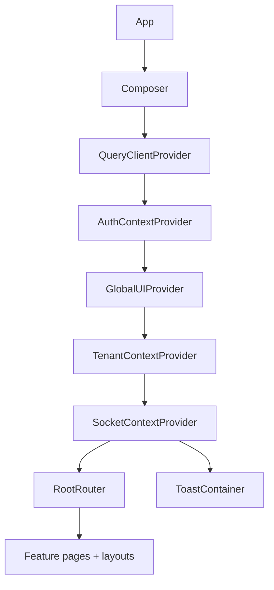

# Frontend Architecture

The frontend is a React 18 application built with Vite and organized around provider composition, tenant-aware routing, domain APIs, and reusable workspace packages.

## Architectural goals

The current frontend emphasizes:

- **feature-oriented navigation** around tenants and tenant resources,
- **shared runtime context** for auth, tenant state, UI state, and sockets,
- **server-state fetching** with TanStack React Query,
- **reusable package-driven UI** for workflows, widgets, datasources, and forms,
- **realtime interactivity** for workflows and operational surfaces.

## Runtime composition

The application renders `App` and then hands control to `presentation/components/composer`.

That composer is the real runtime shell.

This provider order matters because later layers depend on the earlier ones.

## Project structure

The frontend source lives in `apps/frontend/src` and is broadly divided into these areas:

| Area | Responsibility |
| --- | --- |
| `config/` | Firebase and Supabase initialization. |
| `constants.js` | Route definitions, API path builders, event names, and runtime host configuration. |
| `data/` | API modules and socket helpers that talk to the backend. |
| `logic/` | Context providers and reusable hooks. |
| `presentation/` | Routes, layouts, pages, and view components. |
| `utils/` | Helper utilities used across the app. |

## Configuration model

The frontend reads runtime configuration from two places:

1. `import.meta.env.*` values during Vite development/build time
2. `window.JET_ADMIN_CONFIG` at runtime for deploy-time overrides

`constants.js` resolves the API and socket hosts with the following precedence:

1. `window.JET_ADMIN_CONFIG.SERVER_HOST` / `SOCKET_HOST`
2. `VITE_SERVER_HOST` / `VITE_SOCKET_HOST`
3. local defaults (`http://localhost:8090`)

This makes the frontend easier to package behind a static server while still changing backend endpoints per environment.

## Authentication model in the frontend

`logic/contexts/authContext.jsx` is the main auth coordinator.

It combines Firebase client auth with backend profile loading.

### Supported user flows

- Google sign-in
- email/password sign-up
- email/password sign-in
- password reset
- sign-out
- user-config read/update per tenant

### How requests are authenticated

Most API modules request a fresh Firebase ID token from the current user and send it as `Authorization: Bearer <token>`.

The frontend does **not** implement a separate cookie-based backend session model.

## Socket architecture

`logic/contexts/socketContext.jsx` opens the main Socket.IO connection after Firebase auth state resolves.

Key behaviors:

- it fetches the current user's Firebase ID token before connecting,
- it sends that token in the socket handshake,
- it refreshes the token during reconnect flows,
- it exposes the socket instance to feature components.

This enables workflow live updates and other event-driven features without duplicating connection logic in every page.

## Routing model

The route tree is defined in `presentation/components/routes/rootRouter.jsx` and follows a nested layout approach.

Major route areas include:

- sign-in and sign-up
- tenant selection and tenant settings
- database schemas, tables, triggers, and SQL views
- datasources and data queries
- widgets and dashboards
- workflows
- API keys, cron jobs, notifications, and audit logs
- user management and role management

This route shape mirrors the backend's tenant-scoped API layout.

## State strategy

The frontend does not rely on a single monolithic client store.

Instead, state is split into the most appropriate layer:

### Server state

Handled primarily with **TanStack React Query**:

- backend fetches,
- mutation lifecycles,
- cache invalidation,
- loading and error management.

### Session and platform context

Handled with **React Context**:

- current user and auth actions,
- current tenant and tenant-scoped preferences,
- global UI state,
- shared socket lifecycle.

### Local view state

Kept inside feature pages and domain-specific components.

This split keeps data-fetching concerns separate from cross-cutting UI/runtime concerns.

## Package-driven UI architecture

The frontend is tightly integrated with the workspace packages.

Important examples:

- `@jet-admin/workflow-nodes` and `@jet-admin/workflow-edges` provide workflow-builder primitives,
- `@jet-admin/widgets-ui` and `@jet-admin/widget-types` support dashboard/widget configuration,
- `@jet-admin/datasources-ui` and `@jet-admin/datasource-types` support datasource editors,
- `@jet-admin/json-forms-renderers` extends JSON Forms,
- `@jet-admin/ui` supplies shared design-system style building blocks.

This package model reduces duplication across feature surfaces and keeps specialized UI logic out of the app shell.

## UI and interaction stack

The frontend currently mixes several UI technologies depending on the feature:

- **MUI** for many application-level surfaces and controls
- **Emotion** for component styling integration
- **Tailwind CSS** for utility-driven layout/styling
- **Radix UI packages** for headless primitives
- **React Flow** for visual workflow editing
- **JSON Forms** for schema-driven editors
- **Monaco Editor** and **CodeMirror** for code/query editing
- **React Grid Layout** for dashboard arrangement

## Data access layer

`data/apis/` contains domain-specific modules that build URLs from `constants.js`, attach bearer tokens, and normalize responses.

Feature-specific API modules exist for areas such as:

- auth
- tenants
- datasources
- queries
- widgets
- dashboards
- workflows
- roles
- users
- API keys
- AI

This keeps backend contract details close to the features that consume them.

## Design patterns used

### Provider composition

The root composer builds a deterministic dependency chain for the whole app.

### Feature routing

Pages are grouped by domain and mounted under nested layouts rather than treated as a flat route list.

### Package extension points

Specialized feature systems such as workflows, widgets, and datasource forms are extended through shared packages instead of only app-local components.

### Context + query split

Cross-cutting app state lives in React Context, while fetch-heavy backend state lives in React Query.

## Practical summary

The frontend should be understood as a **tenant-aware React shell** that composes:

- provider-managed runtime state,
- package-driven domain components,
- nested feature routes,
- realtime sockets,
- backend API modules authenticated with Firebase tokens.

That structure is what keeps Jet Admin's large feature surface manageable in a single SPA.