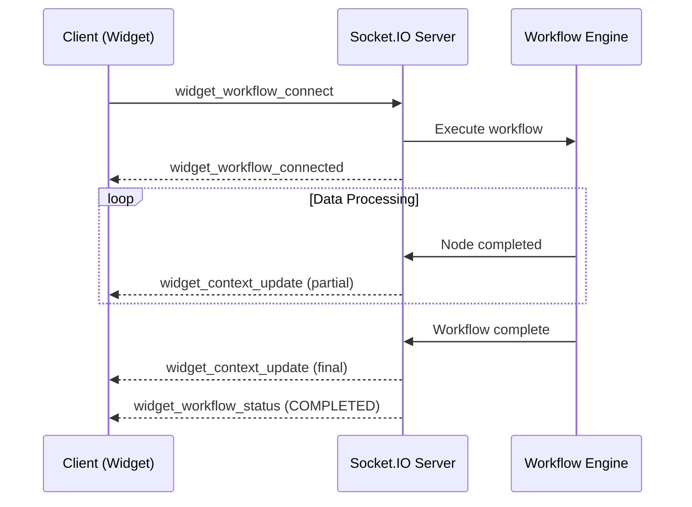

# Real-time Events (Socket.IO)

Jet Admin uses **Socket.IO** for bi-directional real-time communication between the frontend and backend. This enables live workflow logs, widget data updates, and AI chat features.

## Connection Setup

### Client Configuration

```javascript
import { io } from 'socket.io-client';

const socket = io(API_URL, {
  auth: {
    token: 'firebase-jwt-token',
    firebase_id: 'user-firebase-uid'
  }
});
```

The server validates the Firebase token on connection and associates the socket with the authenticated user.

---

## Event Categories

### 1. Workflow Events

Real-time updates during workflow execution.

#### Client → Server

| Event | Constant | Description | Payload |
|:------|:---------|:------------|:--------|
| `workflow_run_join` | `WORKFLOW_RUN_JOIN` | Subscribe to logs for a specific run | `{ runId: string }` |

#### Server → Client

| Event | Constant | Description | Payload |
|:------|:---------|:------------|:--------|
| `workflow_node_update` | `WORKFLOW_NODE_UPDATE` | Node execution status changed | `{ nodeId, status, duration, output }` |
| `workflow_status_update` | `WORKFLOW_STATUS_UPDATE` | Overall workflow status changed | `{ runId, status, error? }` |

**Example Usage:**

```javascript
// Subscribe to workflow run logs
socket.emit('workflow_run_join', { runId: 'run-uuid-123' });

// Listen for node updates
socket.on('workflow_node_update', (data) => {
  console.log(`Node ${data.nodeId}: ${data.status}`);
  updateTerminalLogs(data);
});
```

---

### 2. Widget Events

Real-time data updates for dashboard widgets.

#### Client → Server

| Event | Constant | Description | Payload |
|:------|:---------|:------------|:--------|
| `widget_workflow_connect` | `WIDGET_WORKFLOW_CONNECT` | Widget mounts and requests data | `{ widgetID, workflowID, mode, inputParams, tenantID }` |
| `widget_send_input` | `WIDGET_SEND_INPUT` | User submits input to a widget (e.g., form) | `{ widgetID, instanceID, inputType, data }` |
| `widget_refresh` | `WIDGET_REFRESH` | Manually refresh widget data | `{ widgetID, inputParams, tenantID }` |
| `widget_workflow_disconnect` | `WIDGET_WORKFLOW_DISCONNECT` | Widget unmounts | `{ widgetID }` |

#### Server → Client

| Event | Constant | Description | Payload |
|:------|:---------|:------------|:--------|
| `widget_workflow_connected` | `WIDGET_WORKFLOW_CONNECTED` | Confirms widget connection established | `{ widgetID }` |
| `widget_context_update` | `WIDGET_CONTEXT_UPDATE` | New data available for widget | `{ widgetID, data, metadata }` |
| `widget_workflow_status` | `WIDGET_WORKFLOW_STATUS` | Widget's workflow execution status | `{ widgetID, status }` |
| `widget_workflow_error` | `WIDGET_WORKFLOW_ERROR` | Error during widget data fetch | `{ widgetID, error }` |

**Example Usage:**

```javascript
// Connect widget to its data source
socket.emit('widget_workflow_connect', {
  widgetID: 'widget-uuid',
  workflowID: 'workflow-uuid',
  mode: 'execute',
  inputParams: { dateRange: '7d' },
  tenantID: 'tenant-uuid'
});

// Listen for data updates
socket.on('widget_context_update', (data) => {
  if (data.widgetID === 'widget-uuid') {
    updateChartData(data.data);
  }
});
```

---

### 3. AI Chat Events

Real-time communication for the AI assistant.

#### Client → Server

| Event | Constant | Description | Payload |
|:------|:---------|:------------|:--------|
| `ai_chat_user_message` | `AI_CHAT_USER_MESSAGE` | User sends a message | `{ message, chatRoomID }` |

#### Server → Client

| Event | Constant | Description | Payload |
|:------|:---------|:------------|:--------|
| `ai_chat_room_join` | `AI_CHAT_ROOM_JOIN` | User joined a chat room | `{ chatRoomID }` |
| `ai_chat_bot_message` | `AI_CHAT_BOT_MESSAGE` | AI responds with message | `{ message, chatRoomID }` |

---

## Best Practices

### Connection Management

```javascript
// Handle reconnection
socket.on('connect', () => {
  console.log('Connected to server');
  // Re-subscribe to any active widgets/workflows
});

socket.on('disconnect', () => {
  console.log('Disconnected from server');
});

// Clean up on component unmount
useEffect(() => {
  return () => {
    socket.emit('widget_workflow_disconnect', { widgetID });
  };
}, []);
```

### Error Handling

```javascript
socket.on('widget_workflow_error', (data) => {
  showErrorToast(`Widget ${data.widgetID} failed: ${data.error}`);
});
```

---

## Event Flow Diagram


