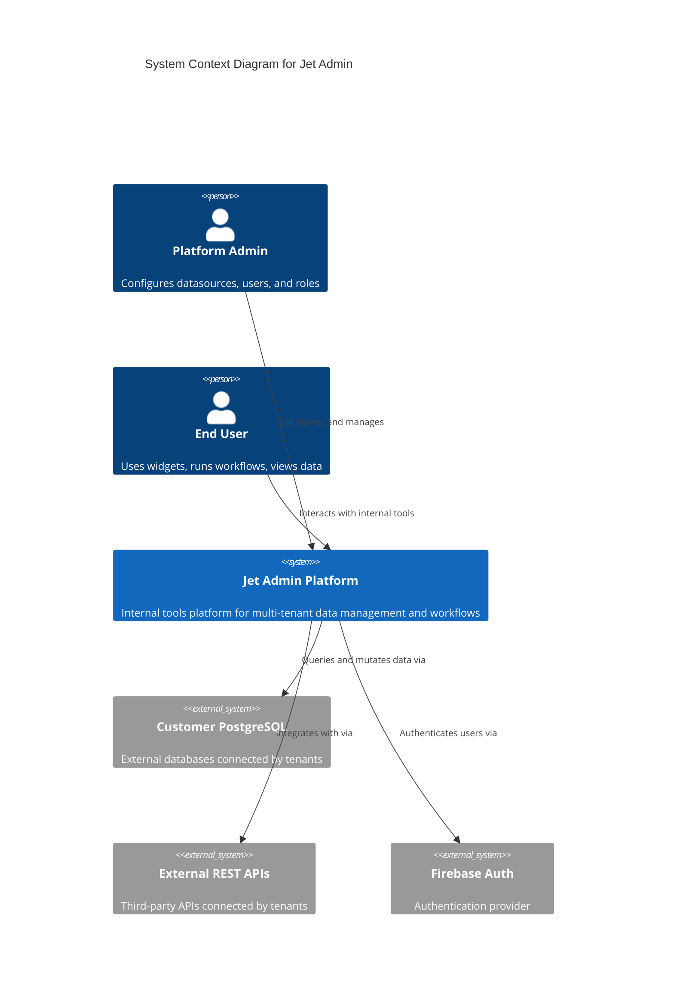
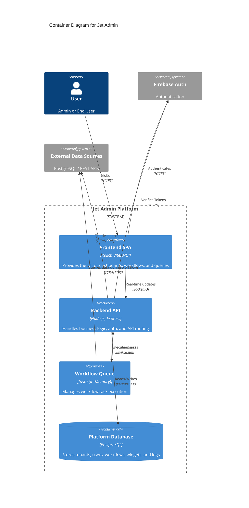

# System Architecture Overview

This document provides a high-level overview of the Jet Admin platform architecture using the **C4 Model** (Context, Containers, Components, Code).

## System Context (C4 Level 1)

The System Context diagram shows Jet Admin in the center of its environment, interacting with users and external systems.

## Container Architecture (C4 Level 2)

The Container diagram zooms into the Jet Admin system to show the high-level technical containers that make up the system.

## Next Steps

For detailed **Component Architecture (C4 Level 3)**, please refer to the specific module architectures:
- [Backend Architecture](./backend-architecture.md)
- [Frontend Architecture](./frontend-architecture.md)
- [Database Schema](./database-schema.md)
