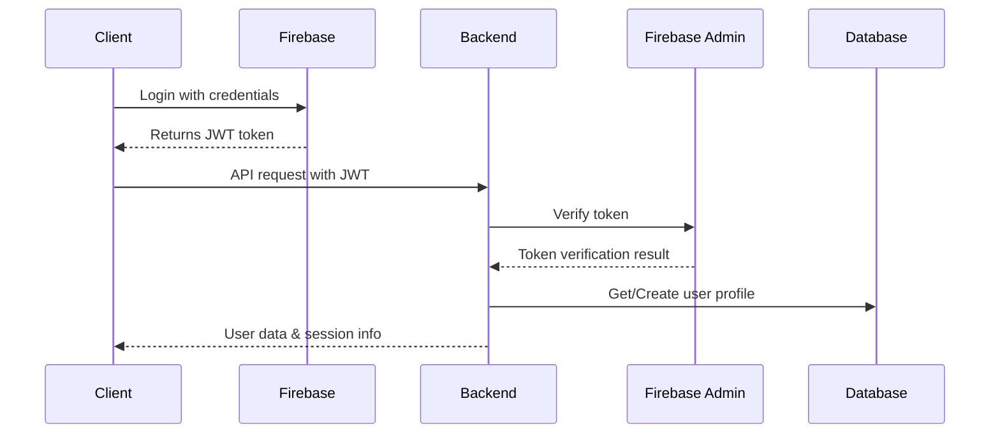

# Authentication System Documentation

## Table of Contents
- [Authentication System Documentation](#authentication-system-documentation)
  - [Table of Contents](#table-of-contents)
  - [System Overview ](#system-overview-)
  - [Core Components ](#core-components-)
    - [Firebase Configuration ](#firebase-configuration-)
    - [Authentication Flow ](#authentication-flow-)
  - [Implementation Details ](#implementation-details-)
    - [Middleware Setup ](#middleware-setup-)
    - [User Management ](#user-management-)
  - [Environment Configuration ](#environment-configuration-)
  - [Security Considerations ](#security-considerations-)
  - [Protected Routes ](#protected-routes-)
  - [Production Deployment ](#production-deployment-)

---

## System Overview <a name="system-overview"></a>

Our authentication system integrates Firebase Authentication with custom backend services to provide secure user management. Key features include:

- Firebase-based JWT token authentication
- Automatic user profile creation
- Session management with access/refresh tokens
- Role-based access control integration



---

## Core Components <a name="core-components"></a>

### Firebase Configuration <a name="firebase-configuration"></a>

**Backend Setup:**
```json
// firebase-key.json
{
  "type": "service_account",
  "project_id": "your-project-id",
  "private_key": "your-private-key",
  "client_email": "firebase-adminsdk@your-project.iam.gserviceaccount.com"
}
```

**Frontend Setup (`.env`):**
```env
VITE_FIREBASE_API_KEY=your-api-key
VITE_FIREBASE_AUTH_DOMAIN=your-project.firebaseapp.com
VITE_FIREBASE_PROJECT_ID=your-project-id
```

:::warning Security Notice
- Never commit service account credentials to version control
- Store secrets in environment variables
- Rotate keys regularly
:::

### Authentication Flow <a name="authentication-flow"></a>

1. Client-side Firebase authentication
2. JWT token verification in backend middleware
3. User profile synchronization
4. Session management with dual tokens

---

## Implementation Details <a name="implementation-details"></a>

### Middleware Setup <a name="middleware-setup"></a>

**Token Verification:**
```javascript
authMiddleware.authProvider = async (req, res, next) => {
  const idToken = req.headers.authorization?.split("Bearer ")[1];
  try {
    const decodedIdToken = await firebaseApp.auth().verifyIdToken(idToken);
    req.user = await authService.getUserFromFirebaseID(decodedIdToken.uid);
    next();
  } catch (error) {
    handleAuthError(res, error);
  }
};
```

### User Management <a name="user-management"></a>

**Profile Creation:**
```javascript
authService.createUser = async ({ email, firebaseID }) => {
  return prisma.tblUsers.create({
    data: {
      email,
      firebaseID,
      isActive: true,
      lastLogin: new Date()
    }
  });
};
```

---

## Environment Configuration <a name="environment-configuration"></a>

**Essential Variables:**
```env
# Network Security
CORS_WHITELIST="http://localhost:3000,https://prod-domain.com"
```

---

## Security Considerations <a name="security-considerations"></a>

1. **Token Security**
   - 15-minute access token lifetime
   - 100-hour refresh token rotation
   - HTTP-only cookies for token storage

2. **Firebase Best Practices**
   - Enable multi-factor authentication
   - Implement password complexity policies
   - Regular security rule audits

3. **CORS Configuration**
```javascript
app.use(cors({
  origin: process.env.CORS_WHITELIST.split(','),
  methods: ['GET', 'POST', 'PUT', 'DELETE']
}));
```

---

## Protected Routes <a name="protected-routes"></a>

**Route Protection Example:**
```javascript
router.get("/", authMiddleware.authProvider, authController.getUserInfo);

router.get(
  "/config/:tenantID",
  authMiddleware.authProvider,
  authController.getUserConfig
);

router.post(
  "/config/:tenantID",
  authMiddleware.authProvider,
  authController.updateUserConfig
);
```

**Error Handling:**
| Error Code          | Description                     |
|---------------------|---------------------------------|
| 401 Unauthorized    | Missing or invalid token        |
| 403 Forbidden       | Insufficient permissions        |
| 429 Too Many Requests| Rate limit exceeded            |

---

## Production Deployment <a name="production-deployment"></a>

**Docker Configuration:**
```bash
docker run -p 8090:8090 \
  -e FIREBASE_PROJECT_ID="$PROD_FIREBASE_ID" \
  -e CORS_WHITELIST="https://prod-domain.com" \
  backend-image
```

**Security Checklist:**
- [ ] Enable HTTPS with HSTS headers
- [ ] Configure Firebase Security Rules
- [ ] Set up monitoring for auth attempts
- [ ] Implement rate limiting

---


This documentation maintains consistency with the authorization system structure while highlighting authentication-specific implementations and security considerations.