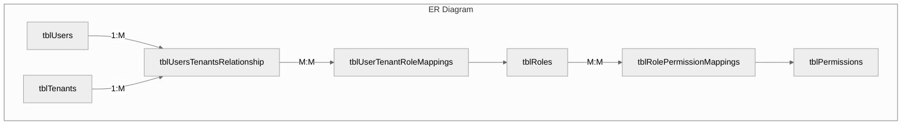
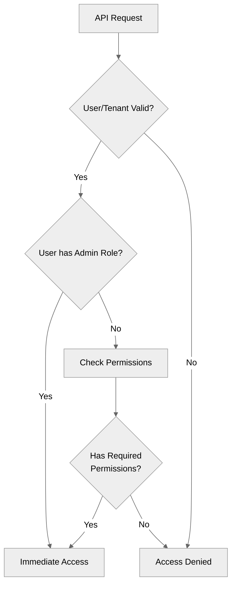

# Authorization System Documentation

## Table of Contents
- [Authorization System Documentation](#authorization-system-documentation)
  - [Table of Contents](#table-of-contents)
  - [System Overview ](#system-overview-)
  - [Core Components ](#core-components-)
    - [Permissions ](#permissions-)
    - [Roles ](#roles-)
    - [Database Schema ](#database-schema-)
  - [Authorization Process ](#authorization-process-)
    - [Workflow Diagram ](#workflow-diagram-)
    - [Implementation Details ](#implementation-details-)
  - [Usage Examples ](#usage-examples-)
  - [Special Cases ](#special-cases-)

---

## System Overview <a name="system-overview"></a>



Our authorization system implements a granular, role-based access control (RBAC) model with tenant isolation. Key features include:

- Multi-tenant architecture with tenant-specific permissions
- Hierarchical permission structure
- Global and tenant-scoped roles
- Admin override capabilities
- Wildcard permission matching

---

## Core Components <a name="core-components"></a>

### Permissions <a name="permissions"></a>

**Structure:**
```typescript
// Standard format
"scope:resource:action"

// Examples
"tenant:database:table:create"
"tenant:role:manage"
"user:read"
```

**Types:**
1. **Global Permissions**
   - `tenant:create`
   - `user:read`

2. **Tenant-Specific Permissions**
   - `tenant:database:table:create`
   - `tenant:role:manage`

**Hierarchy:**
```
tenant
  ├── role
  │   ├── create
  │   ├── read
  │   └── update
  ├── database
  │   ├── table
  │   └── query
  └── member
      ├── add
      └── remove
```

### Roles <a name="roles"></a>

**Types:**
| Global Roles (tenantID=null)      | Tenant-Specific Roles          |
|-----------------------------------|---------------------------------|
| DATABASE_DEVELOPER                | Custom roles defined per tenant|
| DATA_ANALYST                      |                                |
| QUERY_MANAGER                     |                                |
| SUPPORT_AGENT                     |                                |

**Role-Permission Mapping:**
```sql
-- DATABASE_DEVELOPER
'metadata:read', 'schema:create', 'table:create'

-- DATA_ANALYST 
'metadata:read', 'table:read', 'stats:read'
```

### Database Schema <a name="database-schema"></a>

```prisma
model tblPermissions {
  permissionID              Int
  permissionName            String
  permissionDescription     String?
}

model tblRoles {
  roleID                    Int
  roleName                  String
  tenantID                  Int?
}

model tblRolePermissionMappings {
  roleID       Int
  permissionID Int
}
```

---

## Authorization Process <a name="authorization-process"></a>

### Workflow Diagram <a name="workflow-diagram"></a>



### Implementation Details <a name="implementation-details"></a>

**1. Authentication Middleware**
```javascript
authMiddleware.authProvider = async function (req, res, next) {
  // Firebase token verification
  const decodedIdToken = await firebaseApp.auth().verifyIdToken(idToken);
  req.user = await authService.getUserFromFirebaseID(decodedIdToken.uid);
  next();
};
```

**2. Permission Check Middleware**
```javascript
authMiddleware.checkUserPermissions = (requiredPermissions, options) => {
  return async (req, res, next) => {
    const permissionCheck = await authService.checkUserPermissions({
      userID: user.userID,
      tenantID: parseInt(tenantID),
      requiredPermissions,
    });
    
    permissionCheck.permission ? next() : res.sendStatus(403);
  };
};
```

**3. Permission Verification Service**
```javascript
authService.checkUserPermissions = async ({ userID, tenantID }) => {
  if (userTenant?.role === "ADMIN") return { permission: true };
  
  const roleMappings = await fetchUserRolesAndPermissions(userID, tenantID);
  return checkPermissions(extractUserPermissions(roleMappings));
};
```

---

## Usage Examples <a name="usage-examples"></a>

**Route Protection**
```javascript
// Single permission check
router.post("/tables",
  authMiddleware.checkUserPermissions(["tenant:database:table:create"]),
  controller.createTable
);

// Multiple permissions (ALL)
router.post("/complex-op",
  authMiddleware.checkUserPermissions(["perm1", "perm2"], { requireAll: true }),
  controller.complexOp
);

// Multiple permissions (ANY)
router.get("/reports",
  authMiddleware.checkUserPermissions(["perm3", "perm4"], { requireAll: false }),
  controller.getReports
);
```

---

## Special Cases <a name="special-cases"></a>

1. **Admin Privileges**
   - Bypass all permission checks
   - Managed through `tblUsersTenantsRelationship.role`

2. **Wildcard Support**
   - `tenant:database:*` matches all database permissions
   - `tenant:*:create` matches create actions in any tenant resource

3. **Tenant Isolation**
   - Permissions only valid within assigned tenant context
   - Global permissions apply across all tenants

4. **Role Management**
   - Requires `tenant:role:manage` permission
   - Only tenant admins can modify role assignments