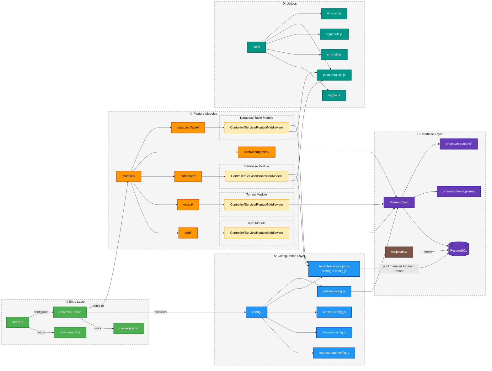

# Backend Architecture

## Overview

The backend is a modular Node.js application built with Express, Prisma ORM, and Firebase authentication. It follows a layered architecture pattern designed for scalability, maintainability, and multi-tenant support.

## Architecture Diagram

## Core Architecture Components

### Application Entry Point

The application initializes through `index.js`, which:
- Loads environment variables
- Configures the Express application
- Sets up logging
- Initializes Firebase connection
- Starts the HTTP server

### Configuration Layer

Located in the `config` directory:

- **express-app.config.js**: Configures the Express application, middleware, and routes
- **firebase.config.js**: Initializes Firebase for authentication services
- **prisma.config.js**: Sets up the Prisma client for database operations
- **tenant-aware-pgpool-manager.config.js**: Manages database connection pools for multi-tenant support
- **winston.config.js**: Configures the Winston logging service

### Middleware Layer

Key middleware components:

- **Authentication Middleware** (`auth.middleware.js`): Validates JWT tokens and Firebase authentication
- **Tenant Middleware** (`tenant.middleware.js`): Handles tenant context for multi-tenant operations
- **Database Middleware** (`database.middleware.js`): Manages database connections and transactions
- **Error Handling** (`utils/error.util.js`): Provides centralized error handling
- **Logging** (`utils/logger.js`): Implements application-wide logging

### Module Layer

The application's functionality is organized into modular components in the `modules` directory:

**Core Modules:**
- **auth**: Authentication and authorization mechanisms
- **tenant**: Multi-tenancy implementation
- **tenantRole**: Role-based access control
- **userManagement**: User operations and profile management

**Database Modules:**
- **database**: Core database operations
- **databaseChart**: Chart generation and visualization
- **dashboard**: Dashboard configuration and management
- **dataQuery**: Query execution and management
- **databaseTable**: Table operations and schema management
- **databaseTrigger**: Event-driven database triggers

**Module Structure:**
Each module follows a consistent structure:
- **Controller** (`*.controller.js`): Handles HTTP requests and responses
- **Service** (`*.service.js`): Contains business logic
- **Routes** (`*.v1.routes.js`): Defines API endpoints
- **Middleware** (`*.middleware.js`): Module-specific request processing

### Data Access Layer

- **Prisma ORM**: Object-Relational Mapping for PostgreSQL (used by core, queries, chart, dashboard modules)
  - `prisma/schema.prisma`: Database schema definition
  - `prisma/migrations`: Database migration files
- **Node PG**: Postgres SQL node client (used by database, databaseTable & databaseTrigger module)
  - `config/tenant-aware-pgpool-manager.config.js`: Manages database connections per tenant/schema.prisma
  - `utils/postgresql.util.js`: Contains raw database queries used by pg client
- **PostgreSQL**: Persistent data storage

### Utility Layer

Located in the `utils` directory:
- **Error Handling** (`error.util.js`): Custom error classes and error handling functions
- **Logging** (`logger.js`): Logging utility for application events
- **String Utilities**: Functions for string manipulation and validation
- **Date Utilities**: Date formatting and manipulation
- **Security Utilities**: Encryption and hashing functions

### Scripts

- **Database Seeding** (`scripts/seed.js`): Initializes database with seed data
- **Development Tools** (`scripts/dev/`): Utilities for development workflows
  - Module generation templates
  - Test data generators

## Authentication Flow

1. Client submits credentials to Firebase Authentication
2. Firebase returns JWT token to client
3. Client includes JWT in Authorization header for subsequent requests
4. Authentication middleware validates the token
5. Tenant middleware establishes tenant context
6. Role-based access control enforces permissions

## Request Processing Pipeline

1. Request received by Express server
2. Global middleware processes request:
   - Logging
   - CORS handling
   - Body parsing
   - Authentication
3. Tenant middleware establishes tenant context
4. Route-specific middleware applies:
   - Parameter validation
   - Resource-specific checks
5. Controller processes the request
6. Service layer implements business logic
7. Prisma client interacts with PostgreSQL database
8. Response flows back through the layers
9. Error handling middleware catches exceptions

## Multi-tenancy Architecture

The system implements a multi-tenant architecture with:

- **Tenant Isolation**: Each tenant's data is logically separated
- **Tenant-Aware Connection Pooling**: Optimized database connections per tenant
- **Role-Based Access Control**: Permissions scoped to tenant contexts
- **Tenant Middleware**: Automatically applies tenant context to requests

## Error Handling Strategy

The application implements a hierarchical error handling approach:

- **Custom Error Classes**: Extend standard Error for specific scenarios
- **Service-Level Error Handling**: Business logic validation and error generation
- **Controller-Level Error Handling**: HTTP-specific error handling
- **Global Error Middleware**: Catches unhandled errors
- **Structured Error Responses**: Consistent error format for API clients

## Logging Architecture

- **Winston Logger**: Configured for different environments
- **Log Levels**: Debug, Info, Warning, Error
- **Log Destinations**:
  - Console (development)
  - Files (rotation based on size and retention policy)
  - Syslog (production)
- **Context Enrichment**: Adds request ID, tenant ID, and user information to logs

## Security Architecture

- **Authentication**: Firebase and JWT-based
- **Authorization**: Role-based access control
- **Data Validation**: Input validation at controller level
- **CORS Protection**: Whitelist-based approach
- **Rate Limiting**: Prevents abuse
- **Environment Isolation**: Configuration-based security settings