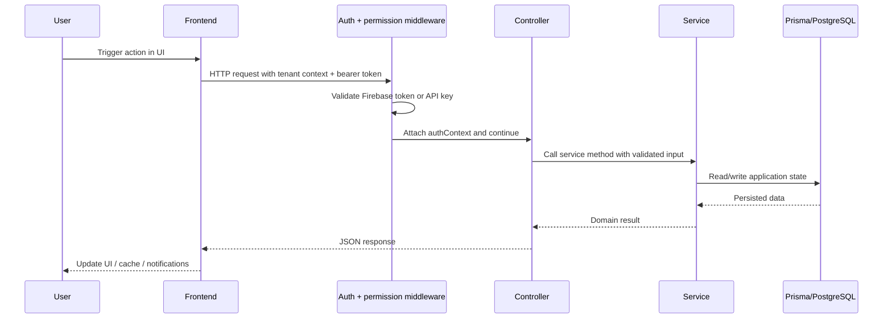
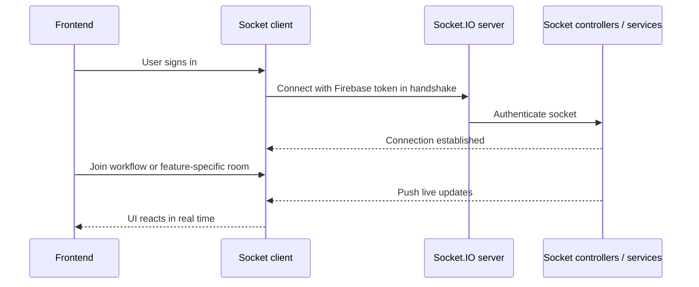
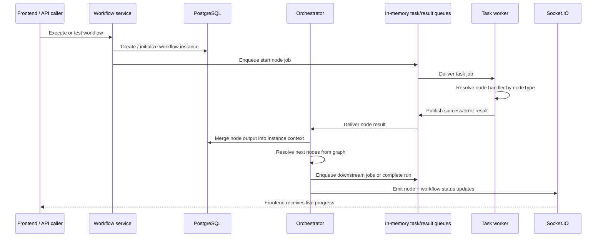
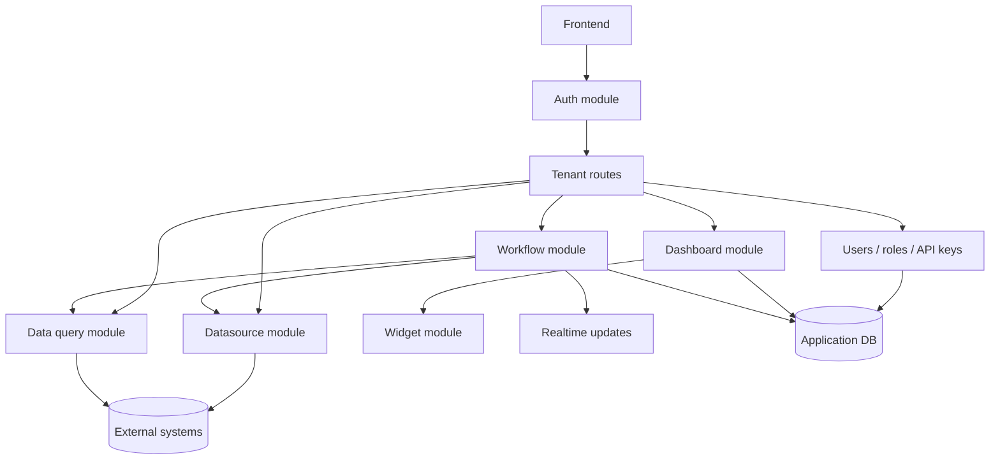

# Data Flow

Jet Admin moves data through three primary channels:

1. **HTTP request/response** for CRUD and administrative operations,
2. **Socket.IO events** for live execution and interactive features,
3. **internal asynchronous workflow jobs** for DAG-based workflow execution.

Understanding which channel is being used is the easiest way to understand the code path you need to inspect.

## Core system actors

- **Frontend SPA** — collects user input, reads route/tenant context, and calls backend APIs.
- **Auth middleware** — resolves user or API-key identity plus tenant authorization context.
- **Feature services** — perform business operations and persistence.
- **Prisma/PostgreSQL** — stores Jet Admin platform metadata and execution records.
- **Socket.IO** — delivers live events to subscribed clients.
- **Workflow runtime** — handles node dispatch, result ingestion, retries, and completion state.

## Synchronous request flow

Most product actions follow a standard request pipeline.

### What usually travels in this path

- Firebase bearer token from the frontend,
- tenant identifier from the route,
- validated request payload,
- RBAC-derived authorization decision,
- persisted response data from Prisma-backed services.

## Realtime event flow

Some experiences need immediate updates instead of polling.

Current examples include workflow-run subscription, AI chat events, and widget-workflow bridge messages.

## Workflow execution flow

Workflow execution is the main asynchronous data path in the current system.

### Important current-runtime detail

The active queue implementation is **in-memory** via `apps/backend/config/queue.config.js` and `fastq`.

It preserves queue-like semantics (`workflow.tasks`, `workflow.results`, delayed retry behavior, monitor publishing), but it is not currently a distributed RabbitMQ runtime.

## Data ownership boundaries

It helps to distinguish the system's two main data domains.

### 1. Platform metadata

Stored in the Jet Admin application database through Prisma:

- users
- tenants
- roles and permissions
- datasources
- dashboards and widgets
- workflows and workflow instances

### 2. External/tenant-managed data

Accessed through datasource logic, database modules, or workflow handlers:

- third-party APIs
- connected databases
- files/object stores
- service integrations such as Slack or analytics connectors

Jet Admin manages the control plane around those systems even when it does not own the actual business data inside them.

## Authorization in the data path

Before most data reads or writes occur, the backend resolves:

1. who the caller is,
2. which tenant the operation belongs to,
3. whether the caller has the required permission,
4. whether API-key permissions or user-role permissions should apply.

That means most meaningful data flow in Jet Admin is **identity-aware and tenant-aware by design**.

## Cross-module interaction view

## Summary

Jet Admin data flow is best understood as a combination of:

- **authenticated HTTP CRUD**,
- **tenant-scoped service execution**,
- **realtime socket feedback**,
- **queue-backed workflow orchestration inside the backend process**.

Once you identify which of those four paths a feature uses, the relevant code becomes much easier to trace.