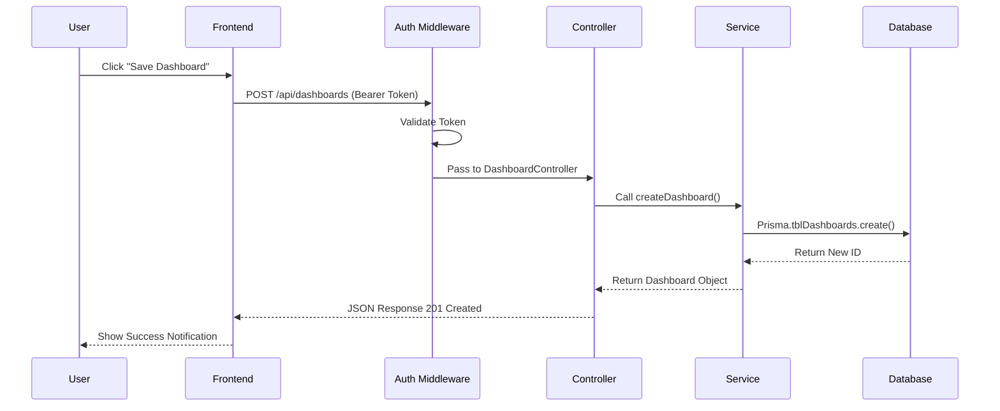
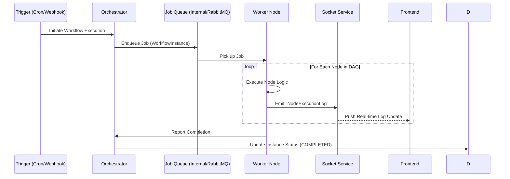
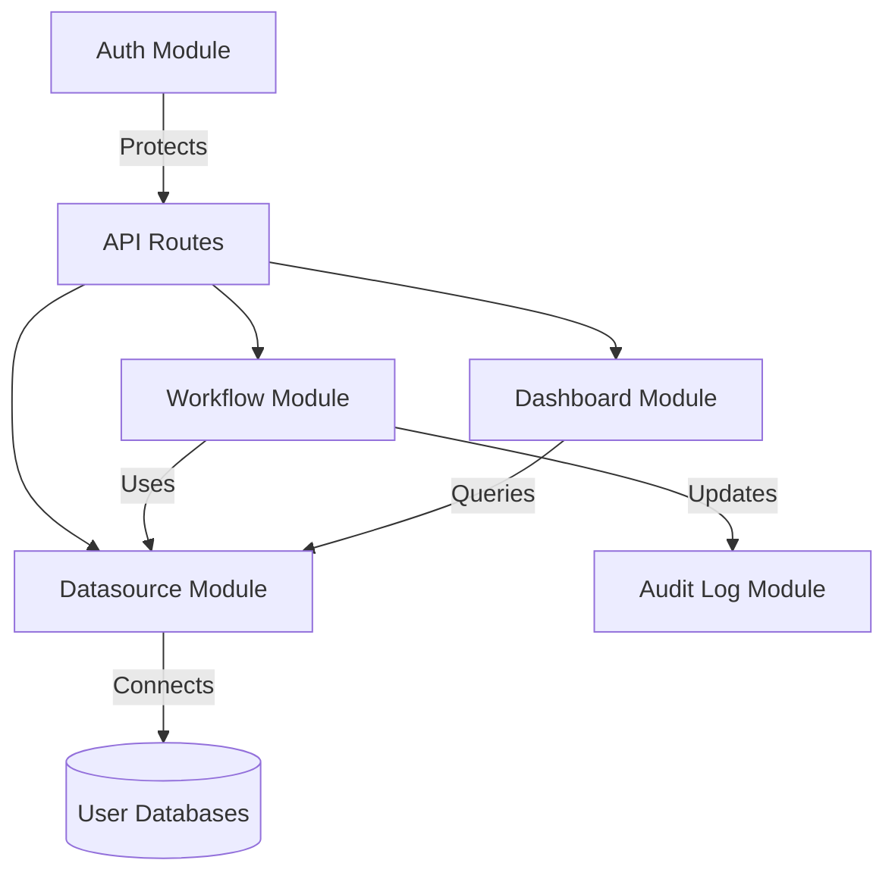

# Data Flow

Jet Admin is designed as a modular, event-driven system. It separates the concerns of user interaction (Frontend), data persistence/logic (Backend), and asynchronous processing (Workflow Engine).

## Core Components

### 1. The Frontend Client
The frontend is a Single Page Application (SPA) built with Vite and React. It communicates with the backend via:
- **REST API:** For standard CRUD operations (creating dashboards, fetching users).
- **Socket.io:** For real-time updates (workflow execution logs, chat, notifications).

### 2. The Backend Server
The backend is a monolithic Node.js application (modularized internally) that handles:
- **API Gateway:** Routes requests to appropriate modules.
- **Authentication:** Validates JWTs and manages user sessions.
- **Workflow Orchestrator:** A specialized module that interprets and executes Directed Acyclic Graphs (DAGs).

### 3. Data Storage
- **PostgreSQL:** The primary source of truth for application data (Users, Apps, Dashboards) AND the user's connected databases.
- **Prisma ORM:** Used for type-safe database interactions.

## Data Flow Architecture

### Request Lifecycle (Synchronous)

### Workflow Execution (Asynchronous)

Workflows in Jet Admin can be triggered manually, via webhook, or on a schedule (Cron).

## Module Interaction Map

The backend is divided into specialized modules. Here is how they interact:

