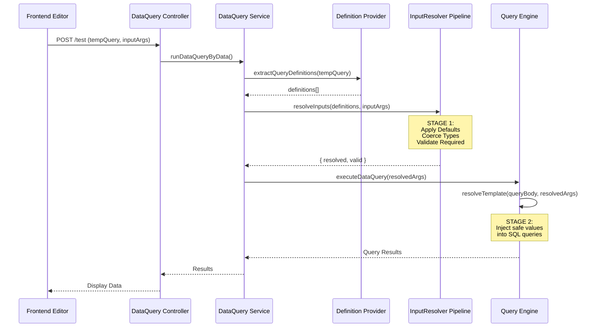
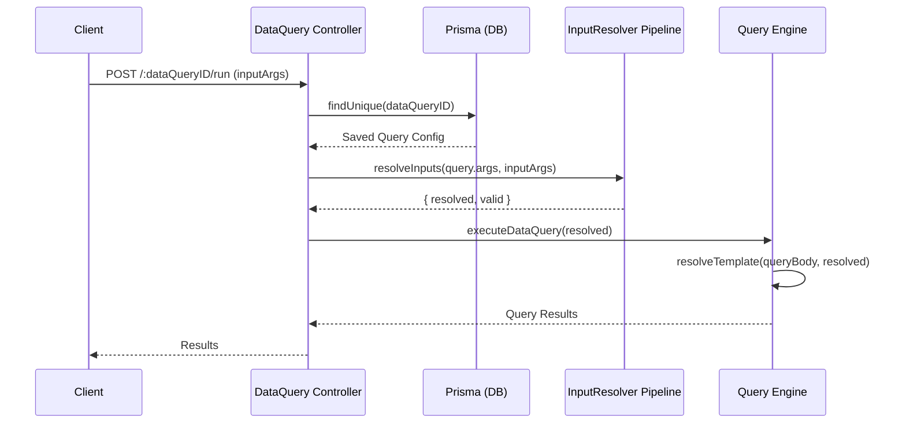
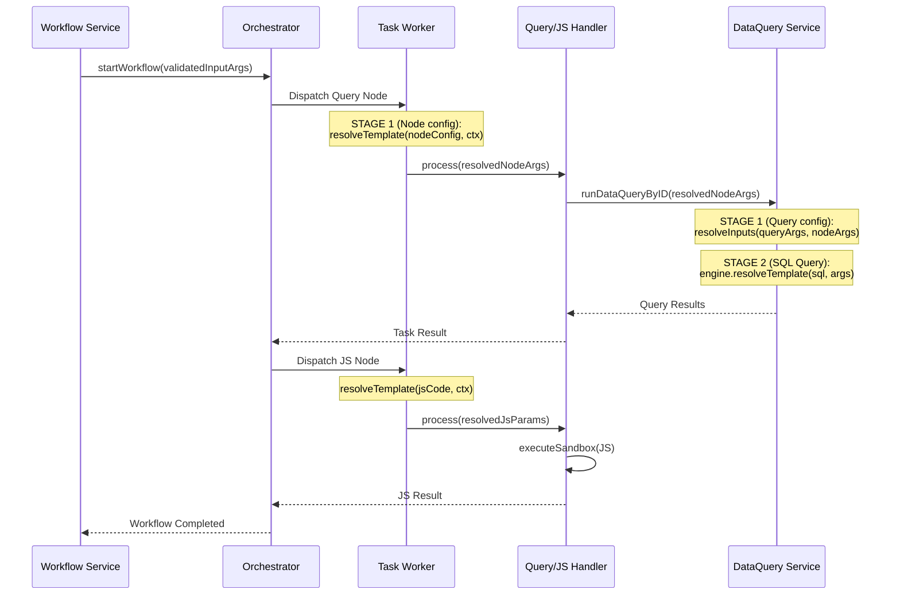
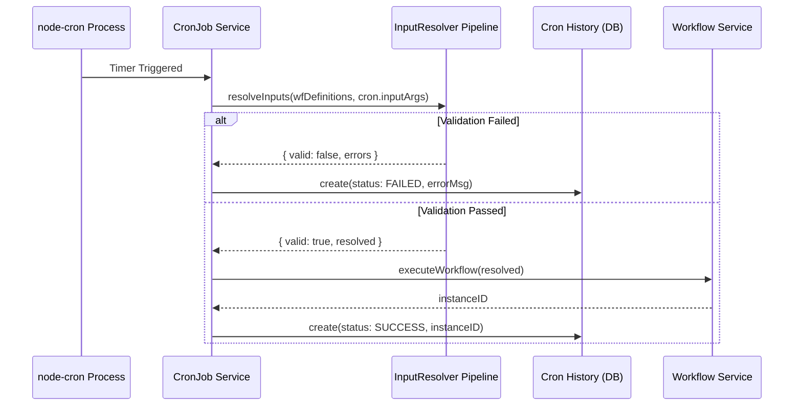

# Execution Flow Scenarios

This document outlines the chronological function invocations and Mermaid sequence diagrams for different execution scenarios across Jet-Admin, specifically highlighting the **Unified Input Lifecycle** (Stage 1 and Stage 2 resolution).

---

## Scenario 1: Testing an Unsaved Data Query
When a user clicks "Run" in the Data Query editor before saving.

**Chronological Invocation:**
1. `dataQuery.controller.js: testDataQuery(req, res)`
2. `dataQuery.service.js: runDataQueryByData(tempQuery, inputArgs)`
3. `definitionProvider.util.js: extractQueryDefinitions(tempQuery)` (Extracts `dataQueryOptions.args` directly from the payload request)
4. `inputArgs.util.js: resolveInputs(type: 'query', definitions, runtimeValues)` — **(Stage 1 Pipeline)**
   * Resolves templates against context (if provided)
   * Applies default values
   * Coerces to declared types (e.g. string `"123"` to integer `123`)
   * Validates required fields
5. `queryExecution.adapter.js: executeDataQuery({ executionArgs: resolved })`
6. `engine.js (QueryEngine): run(executionArgs)`
7. `engine.js (QueryEngine): resolveTemplate(queryBody, executionArgs)` — **(Stage 2 Pipeline)**
   * Injects the *validated* arguments directly into the SQL string or JSON body.
8. `[Specific DB Adapter]: execute()`

---

## Scenario 2: Running a Saved Data Query
When a query is executed via its API endpoint or triggered standalone.

**Chronological Invocation:**
1. `dataQuery.controller.js: runDataQuery(req, res)`
2. `dataQuery.service.js: runDataQueryByID(dataQueryID, inputArgs)`
3. `prisma.tblDataQueries.findUnique(dataQueryID)` (Fetches the saved query config)
4. `definitionProvider.util.js: extractQueryDefinitions(savedQuery)`
5. `inputArgs.util.js: resolveInputs(type: 'query', definitions, runtimeValues)` — **(Stage 1 Pipeline)**
6. `queryExecution.adapter.js: executeDataQuery({ executionArgs: resolved })`
7. `engine.js (QueryEngine): run(executionArgs)`
8. `engine.js (QueryEngine): resolveTemplate(queryBody, executionArgs)` — **(Stage 2 Pipeline)**

---

## Scenario 3: Testing/Running a Workflow (with Query & JS Nodes)
When a workflow triggers, evaluating a Data Query node followed by a Javascript logic node.

**Chronological Invocation:**
*(Workflow Initialisation)*
1. `workflow.controller.js: testWorkflow()` / [executeWorkflow()](file:///d:/PROJECTS/PERSONAL/jet-admin/apps/backend/modules/workflow/workflow.service.js#351-401)
2. `workflow.service.js: testWorkflow()` / [executeWorkflow(inputArgs)](file:///d:/PROJECTS/PERSONAL/jet-admin/apps/backend/modules/workflow/workflow.service.js#351-401)
3. `inputArgs.util.js: resolveInputs()` *(For [executeWorkflow](file:///d:/PROJECTS/PERSONAL/jet-admin/apps/backend/modules/workflow/workflow.service.js#351-401) only: validates initial workflow-level arguments against `workflowOptions.args`)*
4. `orchestrator.js: startWorkflow()` (Stores validated inputs in initial state)

*(Node 1: Data Query Node)*
5. `taskWorker.js: processTask(dataQueryNode)`
6. `resolver.js: resolveTemplate(nodeConfig, workflowContext)` — **(Stage 1 for Nodes)**
   * Resolves dynamic mappings like `{{ctx.input.userId}}` into actual values based on the current workflow state.
7. `dataQueryHandler.js: process()`
8. `dataQuery.service.js: runDataQueryByID(nodeConfig.dataQueryID, resolvedNodeArgs)`
   * *→ Falls back into Scenario 2 flow.*
   * Calls [resolveInputs](file:///d:/PROJECTS/PERSONAL/jet-admin/apps/backend/utils/inputArgs.util.js#180-278) against query definitions to ensure the node passed the correct data types.
   * **Stage 2**: `QueryEngine.resolveTemplate` injects data into SQL.
9. `orchestrator.js: handleTaskResult()` (Saves query result to state, triggers next node)

*(Node 2: Javascript Node)*
10. `taskWorker.js: processTask(jsNode)`
11. `resolver.js: resolveTemplate(nodeConfig, workflowContext)` (Injects previous query results into the JS node variables)
12. `jsHandler.js: process()` (Executes the sandboxed JS code via `isolated-vm`)
13. `orchestrator.js: handleTaskResult()` (Saves JS output, ends workflow)

---

## Scenario 4: Cron Job Triggering a Workflow
When `node-cron` fires on a schedule.

**Chronological Invocation:**
1. `node-cron` trigger fires.
2. `cronJob.service.js: runCronJob({ cronJob })`
3. `definitionProvider.util.js: extractWorkflowDefinitions(cronJob.tblWorkflows)` (Gets required workflow inputs).
4. `inputArgs.util.js: resolveInputs(runtimeValues: cronJob.workflowConfig.inputArgs)`
   * Applies defaults and guarantees the static cron payload is valid for the linked workflow.
   * If invalid, creates a `FAILED` history record immediately.
5. `workflow.service.js: executeWorkflow(workflowID, resolvedArgs)`
   * [executeWorkflow](file:///d:/PROJECTS/PERSONAL/jet-admin/apps/backend/modules/workflow/workflow.service.js#351-401) safely re-verifies via [resolveInputs](file:///d:/PROJECTS/PERSONAL/jet-admin/apps/backend/utils/inputArgs.util.js#180-278) (idempotent step).
6. `orchestrator.js: startWorkflow()` → Starts regular workflow execution (matches Scenario 3).

