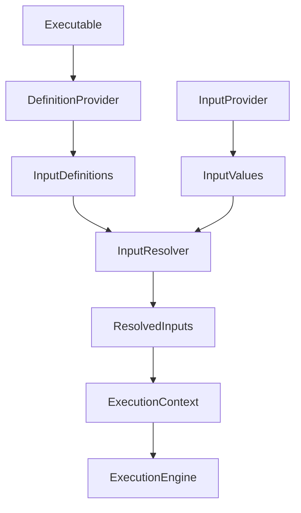
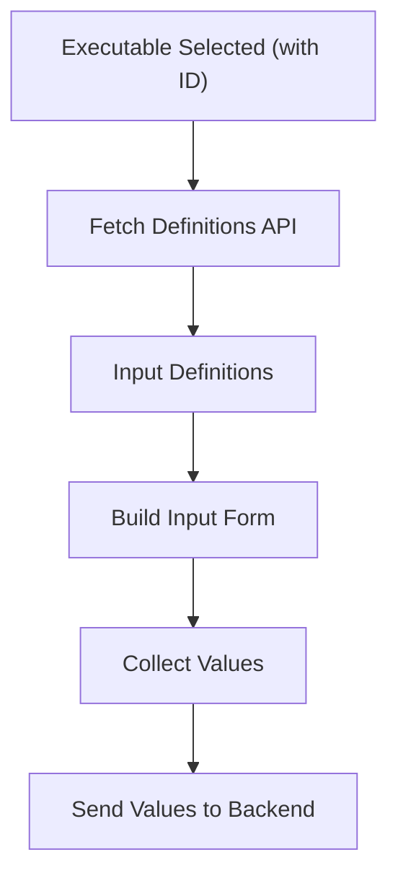
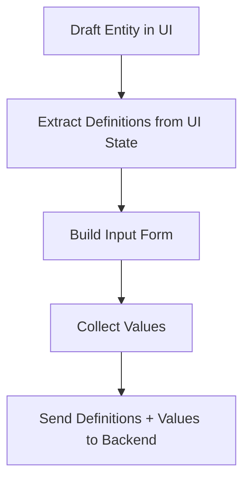
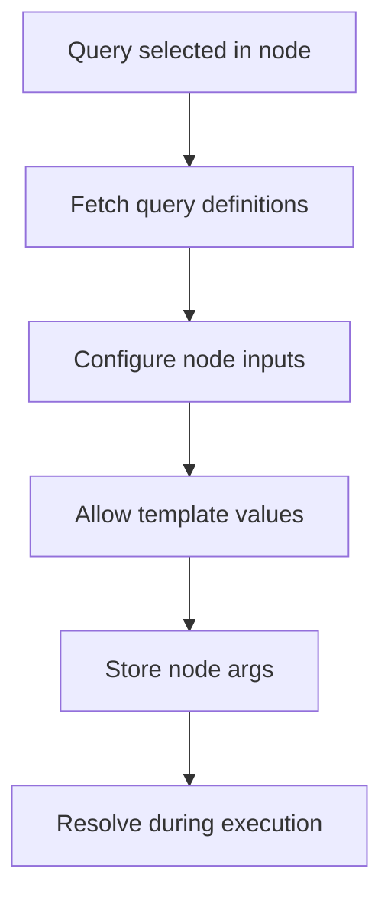
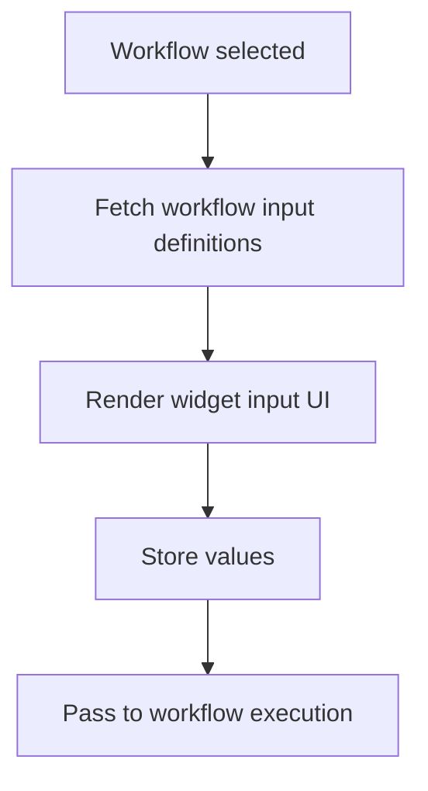
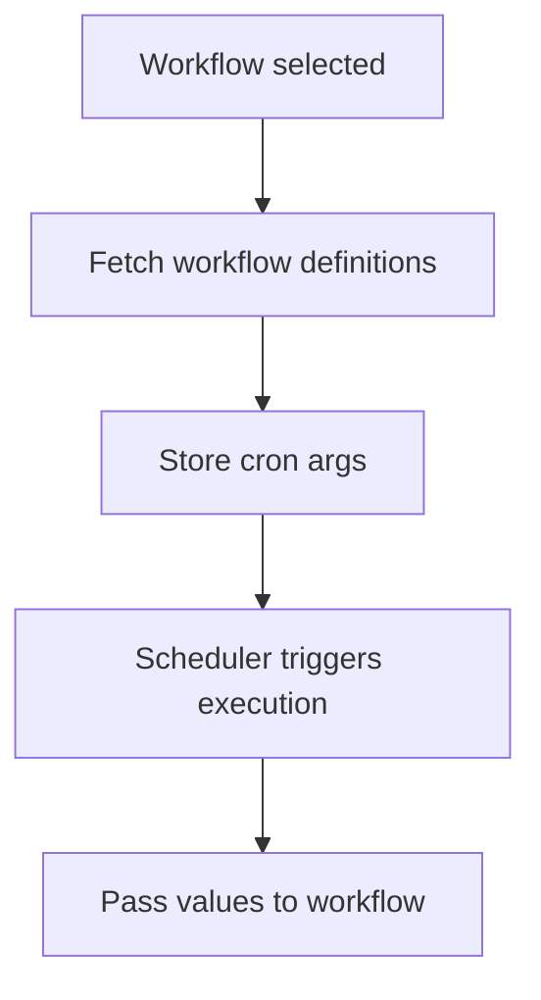
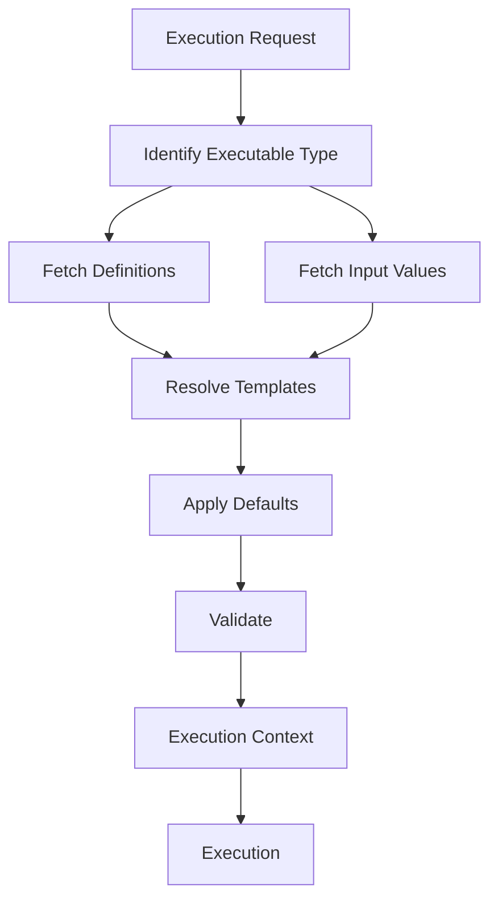
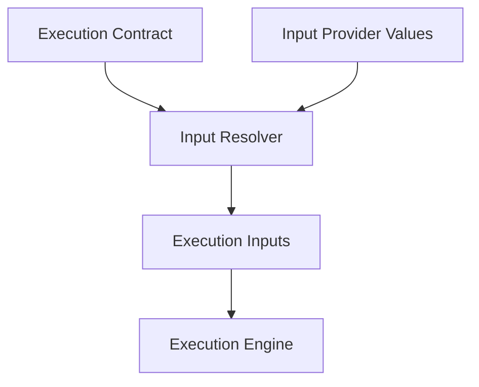

# Jet-Admin Input Lifecycle Architecture

# Core Principle

All execution in Jet-Admin follows this model:

```text
Execution Contract (Input Definitions)
        +
Input Provider Values
        =
Resolved Execution Inputs
```

Where:

**Execution Contract** → defines what inputs exist
**Input Providers** → supply values
**Resolver** → prepares inputs for execution

---

# Core Concepts

# 1 Execution Contract

Defines required inputs for execution.

Examples:

| Executable | Contract          |
| ---------- | ----------------- |
| Workflow   | workflow inputs   |
| Query      | query parameters  |
| Datasource | connection config |

Contract defines:

```ts
InputDefinition {
  key:string
  required:boolean
  default?:any
  supportsTemplate:boolean
  definitionSource: "native" | "derived"
}
```

Contract answers:
**What inputs are required to execute this unit?**

---

# 2 Input Providers

Provide values matching execution contract.

Providers:

| Provider    | Supplies        |
| ----------- | --------------- |
| Widget      | workflow inputs |
| Cron        | workflow inputs |
| Manual Run  | workflow inputs |
| Node Config | query inputs    |

Provider answers:
**Where do input values come from?**

---

# 3 Input Resolver

Transforms values into execution-ready inputs.

Resolver responsibilities:
- Resolve templates (if allowed)
- Apply defaults
- Validate required fields
- Produce final inputs

Resolver answers:
**What are the final execution inputs?**

---

# Complete Input Flow



---

# Definition Sources

Jet-Admin has 2 definition origins:

| Source  | Meaning                           |
| ------- | --------------------------------- |
| Native  | defined by executable             |
| Derived | inherited from another executable |

Examples:

Native:
- Workflow inputs
- Query parameters

Derived:
- QueryNode → Query inputs
- Widget → Workflow inputs
- Cron → Workflow inputs

---

# Definition Fetching Strategy

Definitions must be fetched based on: **Executable Type** (NOT module).

Correct mapping:

| Executable | Definition source |
| ---------- | ----------------- |
| Workflow   | workflow config   |
| Query      | query config      |
| Node       | mapped query      |
| Widget     | mapped workflow   |
| Cron       | mapped workflow   |

Backend strategy:

```ts
getInputDefinitions(type, id) {
  switch(type) {
    case 'workflow': return workflowInputs;
    case 'query': return queryInputs;
    case 'node': return queryInputs;
    case 'widget': return workflowInputs;
    case 'cron': return workflowInputs;
  }
}
```

This becomes the single definition entrypoint.

---

# Frontend Input Lifecycle

Frontend follows the same pattern, but handles two distinct scenarios:

**Scenario 1: Executing Saved Entities**


**Scenario 2: Creating or Testing Unsaved Entities**
When the frontend is drafting a new query or workflow, there is no ID to fetch against.


Frontend responsibilities:
- Render inputs (from API for saved, from UI state for drafted)
- Allow template if supported
- Validate required
- Collect values

---

# Input Value Types (Jet-Admin current support)

Currently only 2 types exist:

| Type     | Meaning           |
| -------- | ----------------- |
| Literal  | fixed value       |
| Template | context reference |

Examples:

Literal:
```text
tenant1
10
true
```

Template:
```text
{{ctx.node1.userId}}
{{ctx.inputs.email}}
```

Definition controls allowance:
```ts
supportsTemplate:boolean
```

---

# Resolution Flow

Resolver pipeline:

```text
Fetch definitions
Merge runtime values
Resolve templates (if supported)
Apply defaults
Validate required
Return resolved inputs
```

Example:

Definition:
```json
{
 "key": "userId",
 "required": true,
 "supportsTemplate": true
}
```

Input:
```json
{
 "userId": "{{ctx.node1.id}}"
}
```

Resolver Output:
```json
{
 "userId": 123
}
```

---

# Node Input Flow

Node inputs follow derived definition pattern.

Flow:



Node inputs are Execution wiring. Not execution contract.

---

# Widget Input Flow

Widgets supply workflow inputs.

Flow:



Widgets are Workflow input providers. Not execution units.

---

# Cron Input Flow

Cron supplies workflow inputs.

Flow:



Cron is Scheduled input provider.

---

# Backend Resolution Flow

Final backend pipeline:



---

# Final System Responsibilities

### DefinitionProvider
Responsible for:
- Fetching definitions
- Handling native/derived logic
- Providing contract

### InputResolver
Responsible for:
- Applying values
- Resolving templates
- Validating inputs

### TemplateResolver
Responsible for:
- Parsing templates
- Resolving context references
- Returning final values

---

# Final Architecture Rules

These rules must be enforced:

1. **Rule 1**: Definitions determine behavior. NOT modules.
2. **Rule 2**: Resolver handles all template logic. Modules must NOT resolve templates.
3. **Rule 3**: Execution always receives resolved inputs. Never raw args.
4. **Rule 4**: Definitions fetched by executable type. Never by module.

---

# Final Architecture Model

This is the final simplified system:



This is the Jet-Admin input lifecycle.

---

# Why this architecture works

This model gives:
- Consistent input behavior
- Predictable execution
- Reusable workflows
- Clean frontend rendering
- Centralized validation
- Future extensibility

---

# Final mental model (the one to remember)

Jet-Admin is not:
- Query system
- Workflow system
- Widget system

It is: **Execution platform driven by contracts and providers**

Where:
- Executables define inputs.
- Providers supply values.
- Resolver prepares execution.
- Execution runs.
