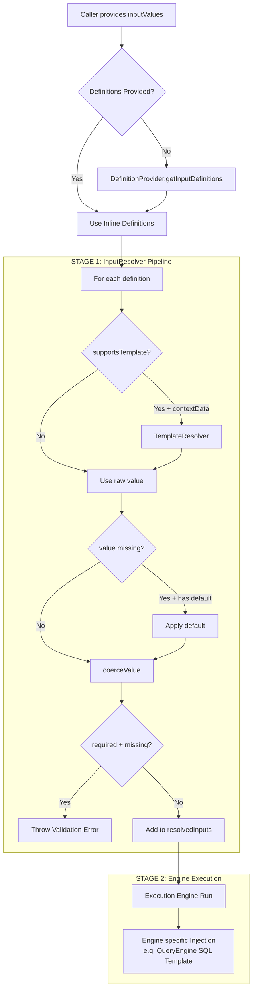
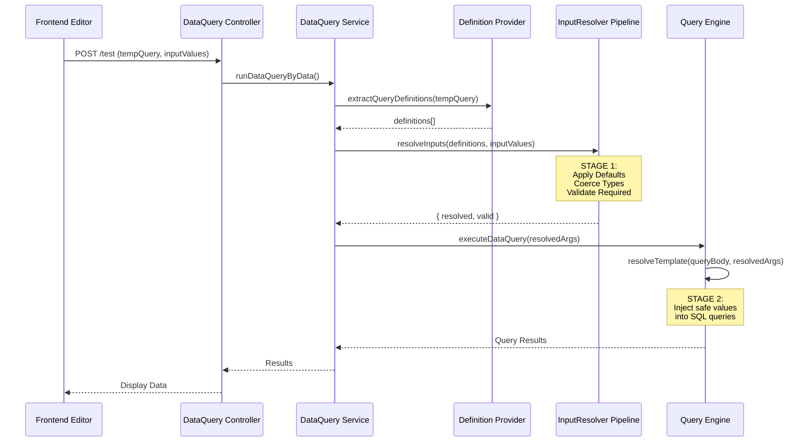
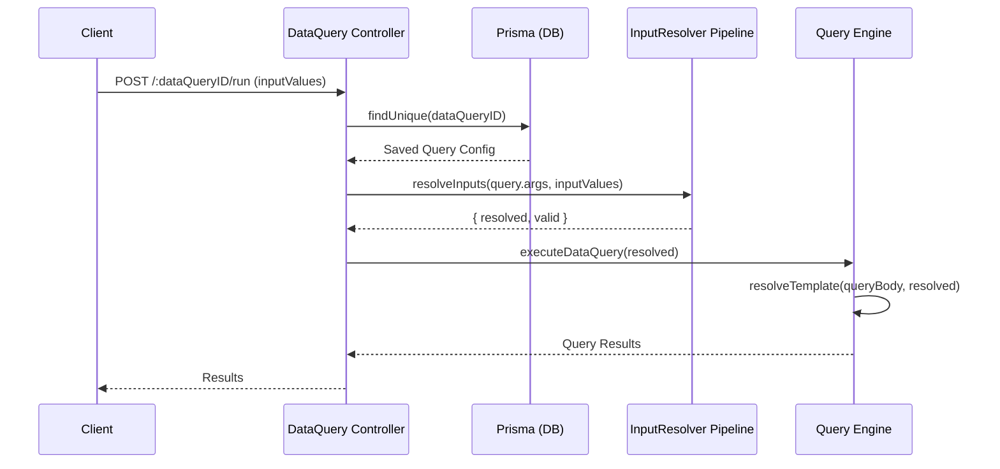
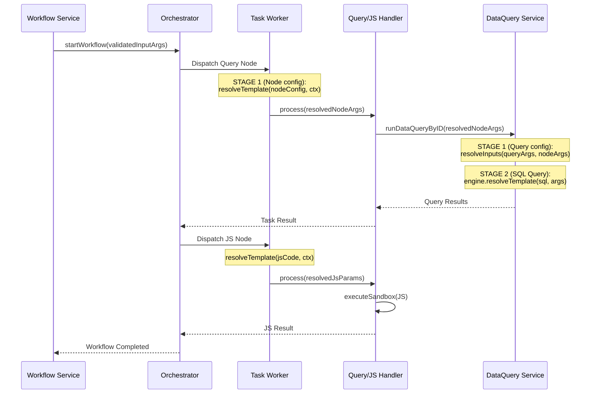
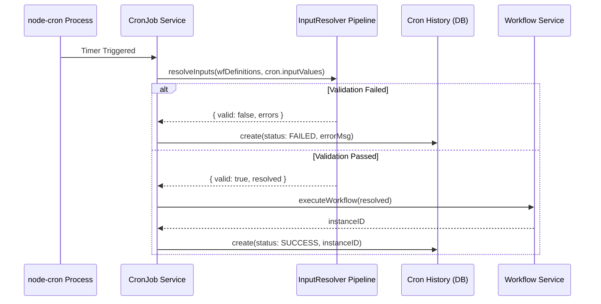

# Unified Input Lifecycle

All execution within Jet-Admin follows a centralized, contract-driven input lifecycle architecture. This standardizes how execution contracts are defined, how input values are resolved, and how templates are safely evaluated.

## Core Principle

```text
Execution Contract (Input Definitions)
        +
Input Provider Values
        =
Resolved Execution Inputs
```

Where:
*   **Execution Contract**: Defines what inputs exist and their expected types.
*   **Input Providers**: Supply the raw runtime values.
*   **Resolver**: A unified pipeline that prepares and validates inputs for execution.

---

## 1. Execution Contract

The Execution Contract defines the exact inputs required to execute a unit (Workflow, Query, Cron Job, etc.).

| Executable | Contract Storage |
| ---------- | ----------------- |
| Workflow   | `workflowOptions.inputDefinitions` |
| Data Query | `dataQueryOptions.inputDefinitions` |

Each required input is defined as an `InputDefinition`:
```ts
{
  key: string;
  type: "string" | "number" | "boolean" | "object" | "array";
  required: boolean;
  default?: any;
  supportsTemplate: boolean;
  definitionSource: "native" | "derived";
}
```

### Definition Sources
Definitions are extracted via the `DefinitionProvider` utility. There are two origins for inputDefinitions:
1.  **Native**: Defined directly on the executable (e.g., Workflow inputs, Data Query parameters).
2.  **Derived**: Inherited from another executable.
    *   **Node**: Inherits from its linked Query.
    *   **Widget**: Inherits from its linked Workflow.
    *   **Cron Job**: Inherits from its linked Workflow.

---

## 2. Input Providers

Input Providers supply the raw, unvalidated values (often called `inputValues`) that attempt to satisfy the Execution Contract.

| Provider / Trigger | Supplies Input Values To |
| ----------- | --------------- |
| Widget Config | Workflow Execution |
| Cron Job Config | Workflow Execution |
| API / Manual Run | Workflow / Query Execution |
| Node Config | Data Query Execution |

---

## 3. The Two-Stage Resolution Pipeline

Jet-Admin uses a mandatory **Two-Stage Pipeline** to resolve, validate, and safely inject values. This pipeline completely eliminates fragmented module-specific input logic.

### Stage 1: The InputResolver Pipeline
All runtimes invoke the centralized `resolveInputs()` pipeline before execution begins.

**Pipeline Execution Order:**
1.  **Fetch Definitions**: Derives the canonical `InputDefinition[]` from the target entity.
2.  **Resolve Templates**: If `supportsTemplate` is true, evaluates context references (e.g. `{{ctx.input.userId}}` → `123`).
3.  **Apply Defaults**: Injects default values if the runtime value is missing.
4.  **Coerce Types**: Safely coerces the value to the declared type (e.g. string `"123"` to integer `123`).
5.  **Validate Required**: Ensures all `required: true` fields are populated.

*Failure at Stage 1 immediately aborts execution and throws a precise validation error.*

### Stage 2: Engine-Specific Injection
Once the `InputResolver` returns a safe, validated, and typed set of `resolvedInputs`, the specific execution engine takes over.

For example, a **Data Query**:
The `QueryEngine` receives the `resolvedInputs` and performs a secondary `resolveTemplate` sweep directly against the SQL query body, safely injecting the typed execution arguments into the database driver.

---

## System Data Flow



## Architectural Rules
To maintain system integrity, the following rules are strictly enforced across the backend and frontend:
1.  **Definitions Determine Behavior**: Modules do not guess input shapes; they blindly follow the Definitions.
2.  **Centralized Resolution**: Runtimes (Workflows, Queries) must NOT resolve templates or validate inputs independently. They must use the `resolveInputs()` pipeline.
3.  **Execution Receives Safe Inputs**: Execution functions (like `startWorkflow` or `executeDataQuery`) assume `inputValues` are already fully validated by the pipeline.

---

## Execution Scenarios

This section outlines the chronological function invocations and Mermaid sequence diagrams for different execution scenarios across Jet-Admin, specifically highlighting the **Unified Input Lifecycle** (Stage 1 and Stage 2 resolution).

### Scenario 1: Testing an Unsaved Data Query
When a user clicks "Run" in the Data Query editor before saving.

**Chronological Invocation:**
1. `dataQuery.controller.js: testDataQuery(req, res)`
2. `dataQuery.service.js: runDataQueryByData(tempQuery, inputValues)`
3. `definitionProvider.util.js: extractQueryDefinitions(tempQuery)` (Extracts `dataQueryOptions.inputDefinitions` directly from the payload request)
4. `inputValues.util.js: resolveInputs(type: 'query', definitions, inputValues)` — **(Stage 1 Pipeline)**
   * Resolves templates against context (if provided)
   * Applies default values
   * Coerces to declared types (e.g. string `"123"` to integer `123`)
   * Validates required fields
5. `queryExecution.adapter.js: executeDataQuery({ executionInputs: resolved })`
6. `engine.js (QueryEngine): run(executionInputs)`
7. `engine.js (QueryEngine): resolveTemplate(queryBody, executionInputs)` — **(Stage 2 Pipeline)**
   * Injects the *validated* arguments directly into the SQL string or JSON body.
8. `[Specific DB Adapter]: execute()`



---

### Scenario 2: Running a Saved Data Query
When a query is executed via its API endpoint or triggered standalone.

**Chronological Invocation:**
1. `dataQuery.controller.js: runDataQuery(req, res)`
2. `dataQuery.service.js: runDataQueryByID(dataQueryID, inputValues)`
3. `prisma.tblDataQueries.findUnique(dataQueryID)` (Fetches the saved query config)
4. `definitionProvider.util.js: extractQueryDefinitions(savedQuery)`
5. `inputValues.util.js: resolveInputs(type: 'query', definitions, inputValues)` — **(Stage 1 Pipeline)**
6. `queryExecution.adapter.js: executeDataQuery({ executionInputs: resolved })`
7. `engine.js (QueryEngine): run(executionInputs)`
8. `engine.js (QueryEngine): resolveTemplate(queryBody, executionInputs)` — **(Stage 2 Pipeline)**



---

### Scenario 3: Testing/Running a Workflow (with Query & JS Nodes)
When a workflow triggers, evaluating a Data Query node followed by a Javascript logic node.

**Chronological Invocation:**
*(Workflow Initialisation)*
1. `workflow.controller.js: testWorkflow()` / `executeWorkflow()`
2. `workflow.service.js: testWorkflow()` / `executeWorkflow(inputValues)`
3. `inputValues.util.js: resolveInputs()` *(For `executeWorkflow` only: validates initial workflow-level arguments against `workflowOptions.inputDefinitions`)*
4. `orchestrator.js: startWorkflow()` (Stores validated inputs in initial state)

*(Node 1: Data Query Node)*
5. `taskWorker.js: processTask(dataQueryNode)`
6. `resolver.js: resolveTemplate(nodeConfig, workflowContext)` — **(Stage 1 for Nodes)**
   * Resolves dynamic mappings like `{{ctx.input.userId}}` into actual values based on the current workflow state.
7. `dataQueryHandler.js: process()`
8. `dataQuery.service.js: runDataQueryByID(nodeConfig.dataQueryID, resolvedNodeArgs)`
   * *→ Falls back into Scenario 2 flow.*
   * Calls `resolveInputs` against query definitions to ensure the node passed the correct data types.
   * **Stage 2**: `QueryEngine.resolveTemplate` injects data into SQL.
9. `orchestrator.js: handleTaskResult()` (Saves query result to state, triggers next node)

*(Node 2: Javascript Node)*
10. `taskWorker.js: processTask(jsNode)`
11. `resolver.js: resolveTemplate(nodeConfig, workflowContext)` (Injects previous query results into the JS node variables)
12. `jsHandler.js: process()` (Executes the sandboxed JS code via `isolated-vm`)
13. `orchestrator.js: handleTaskResult()` (Saves JS output, ends workflow)



---

### Scenario 4: Cron Job Triggering a Workflow
When `node-cron` fires on a schedule.

**Chronological Invocation:**
1. `node-cron` trigger fires.
2. `cronJob.service.js: runCronJob({ cronJob })`
3. `definitionProvider.util.js: extractWorkflowDefinitions(cronJob.tblWorkflows)` (Gets required workflow inputs).
4. `inputValues.util.js: resolveInputs(inputValues: cronJob.workflowConfig.inputValues)`
   * Applies defaults and guarantees the static cron payload is valid for the linked workflow.
   * If invalid, creates a `FAILED` history record immediately.
5. `workflow.service.js: executeWorkflow(workflowID, resolvedArgs)`
   * `executeWorkflow` safely re-verifies via `resolveInputs` (idempotent step).
6. `orchestrator.js: startWorkflow()` → Starts regular workflow execution (matches Scenario 3).


