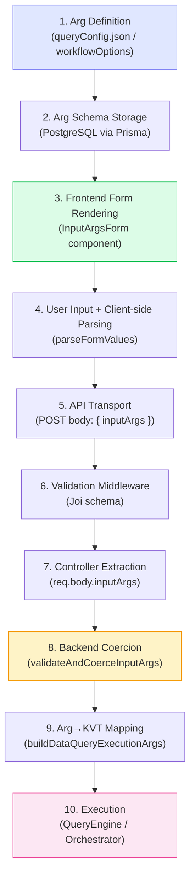
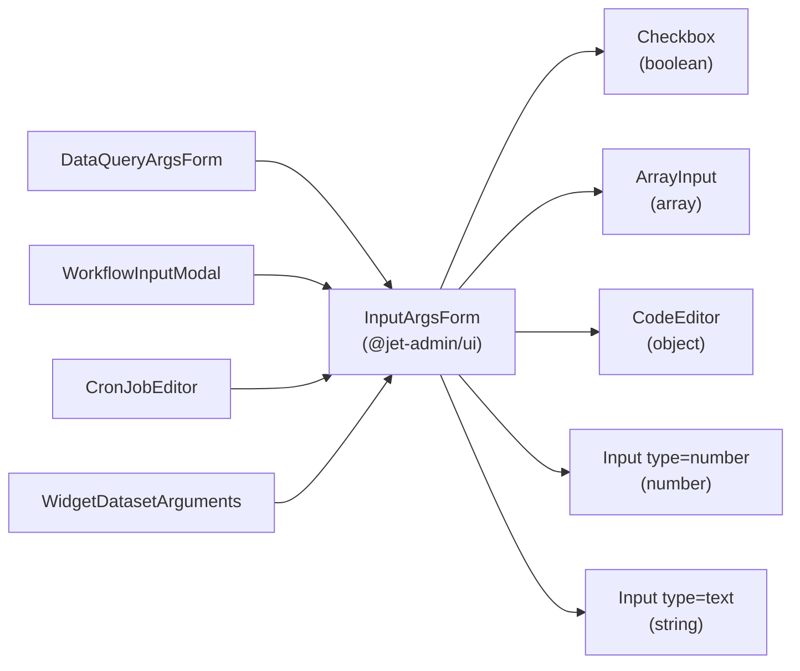
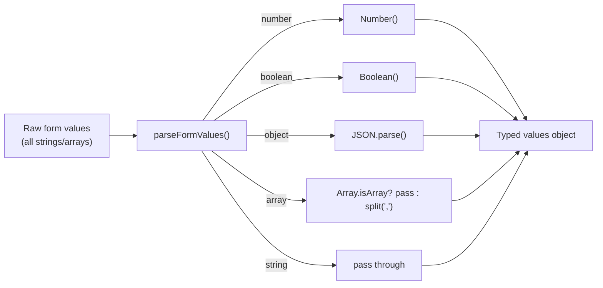
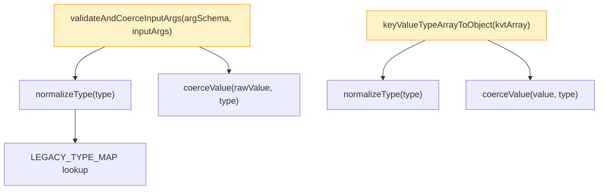
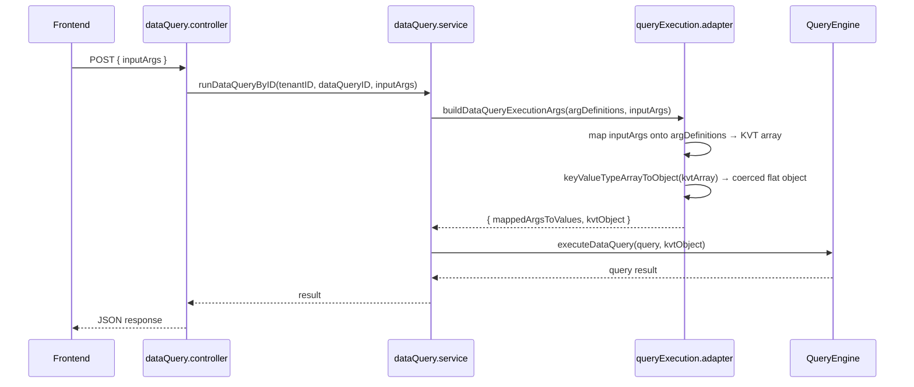
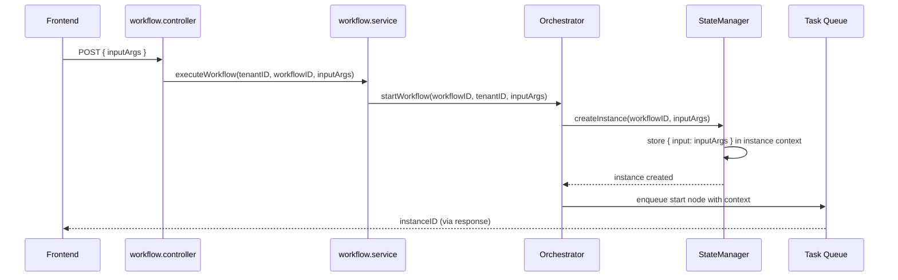
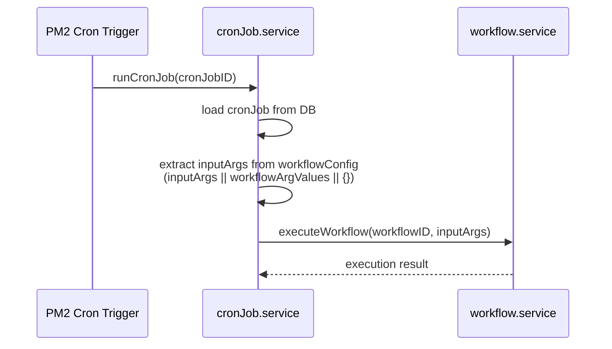
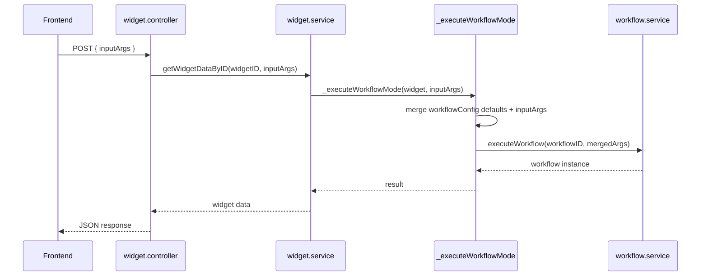
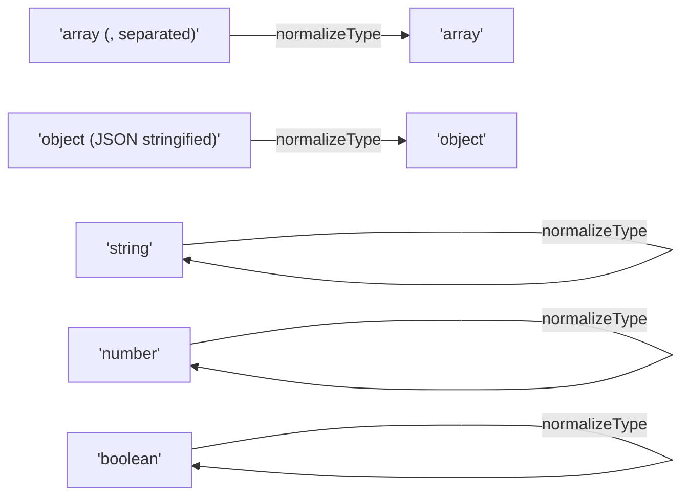

# Input Lifecycle

Jet Admin uses **input arguments** (or simply "inputs") to parameterize data queries, workflows, scheduled jobs, and widgets at runtime. This page documents the complete lifecycle of those inputs — from definition to execution — across every module.

## Canonical Schemas

### Arg Definition Schema

Every module defines its inputs using the same schema shape — an array of arg definitions:

```json
[
  { "key": "user_id",  "type": "string",  "required": true  },
  { "key": "limit",    "type": "number",  "required": false },
  { "key": "tags",     "type": "array",   "required": false },
  { "key": "filters",  "type": "object",  "required": false },
  { "key": "active",   "type": "boolean", "required": false }
]
```

| Field      | Type     | Description |
|------------|----------|-------------|
| `key`      | `string` | Unique name of the argument. Used as the key in the runtime values object. |
| `type`     | `string` | One of: `string`, `number`, `boolean`, `array`, `object`. |
| `required` | `bool`   | Whether the argument must be provided at runtime. |

### Runtime Values Shape

At runtime, input values are a flat key-value object:

```json
{
  "user_id": "abc-123",
  "limit": 25,
  "tags": ["admin", "active"],
  "filters": { "status": "enabled" },
  "active": true
}
```

The canonical key for this object in all API payloads is **`inputArgs`**.

## Supported Types

| Type | JS representation | Form component | Coercion behavior |
|------|-------------------|----------------|-------------------|
| `string` | `String` | `<Input type="text">` | `String(rawValue)` |
| `number` | `Number` | `<Input type="number">` | `Number(rawValue)`, `NaN` → error |
| `boolean` | `Boolean` | `<Checkbox>` | `"true"` → `true`, `"false"` → `false` |
| `array` | `Array` | `<ArrayInput>` | JSON parse, or accept native array |
| `object` | `Object` | `<CodeEditor language="json">` | JSON parse, reject non-object |

## End-to-End Flow



---

## Phase 1: Arg Definition

### Data Queries

Args are defined in `queryConfig.json` files inside `packages/datasource-types/src/<type>/`:

```
packages/datasource-types/src/
├── postgresql/queryConfig.json
├── mysql/queryConfig.json
├── mssql/queryConfig.json
├── restapi/queryConfig.json
├── weburl/queryConfig.json
├── firestore/queryConfig.json
└── ... (28 total)
```

The schema section declares args as a typed key-type array:

```json
{
  "args": {
    "type": "array",
    "items": {
      "type": "object",
      "properties": {
        "key":  { "type": "string" },
        "type": {
          "type": "string",
          "enum": ["string", "number", "boolean", "array", "object"],
          "default": "string"
        }
      },
      "required": ["key", "type"]
    }
  }
}
```

The UI schema includes `typeOptions.enumLabels` for human-readable dropdown labels:

```json
{
  "typeOptions": {
    "enumLabels": {
      "string": "String",
      "number": "Number",
      "boolean": "Boolean",
      "array": "Array",
      "object": "Object (JSON)"
    }
  }
}
```

This is rendered by `CustomKeyTypeArrayRenderer` → `CustomSelectInput` in the JSON Forms system.

### Workflows

Args are defined in `workflowOptions.args` — same shape, stored alongside the workflow definition in the database.

### Cron Jobs and Widgets

Both reference a workflow. Their arg definitions are inherited from the linked workflow's `workflowOptions.args`.

---

## Phase 2: Frontend Rendering

### InputArgsForm (packages/ui)

All four consumer components use the shared `InputArgsForm` component:



**Props:**

```typescript
interface InputArgsFormProps {
  args: Array<{ key: string; type?: string; required?: boolean }>;
  values: Record<string, any>;
  onChange: (key: string, value: any) => void;
  errors?: Record<string, string>;
  disabled?: boolean;
}
```

### ArrayInput (packages/ui)

Handles typed array items with constraints:

```typescript
interface ArrayInputProps {
  value: any[];
  onChange: (arr: any[]) => void;
  itemType?: "string" | "number" | "object";  // defaults to "string"
  maxItems?: number;
  minItems?: number;
  disabled?: boolean;
  placeholder?: string;
}
```

For `itemType="object"`, each item renders a mini `CodeEditor` for JSON editing.

### Consumer Rendering Map

| Consumer | Component | Location |
|----------|-----------|----------|
| Data Query testing | `DataQueryArgsForm` | `dataQueryComponents/dataQueryArgsForm.jsx` |
| Workflow test modal | `WorkflowInputModal` | `workflowComponents/workflowInputModal.jsx` |
| Cron Job editor | `CronJobEditor` | `cronJobComponents/cronJobEditor.jsx` |
| Widget dataset args | `WidgetDatasetArguments` | `widgetComponents/widgetDatasetArguments.jsx` |

---

## Phase 3: Client-Side Parsing

Before values leave the frontend, each consumer parses raw form data into properly typed values.

**`DataQueryArgsForm.parseFormValues(args, rawValues)`:**



`WorkflowInputModal` uses a similar `handleSubmit` parser. Both produce a flat `{ [key]: typedValue }` object.

---

## Phase 4: API Transport

All modules use a unified field name **`inputArgs`** in HTTP payloads:

### Data Query

```
POST /api/tenant/:tenantID/data-query/runDataQueryByID
Body: { inputArgs: { user_id: "abc", limit: 25 } }
```

**Function chain:**

```
dataQueryTestingForm._handleOnArgFormCompleted(values)
  → testDataQuery({ inputArgs: values })
    → testDataQueryByIDAPI({ tenantID, dataQueryID, inputArgs })
      → axios.post(url, { inputArgs })
```

### Workflow

```
POST /api/tenant/:tenantID/workflow/:workflowID/execute
Body: { inputArgs: { param1: "value" } }
```

**Function chain:**

```
workflowEditor.handleInputModalSubmit(inputArgs)
  → executeTestRun(inputArgs)
    → startTestRun({ nodes, edges, inputArgs })
      → testWorkflowAPI({ tenantID, nodes, edges, inputArgs })
        → axios.post(url, { nodes, edges, inputArgs })
```

### Cron Job

Cron jobs store inputs inside `workflowConfig`:

```json
{
  "workflowConfig": {
    "workflowID": 42,
    "inputArgs": { "report_type": "daily" }
  }
}
```

### Widget

```
GET /api/tenant/:tenantID/widget/:widgetID/data
Body: { inputArgs: { filter: "active" } }
```

**Socket connection:**

```
widgetSocketController.onWidgetConnect({
  widgetID, workflowID, mode: 'execute',
  inputArgs: { filter: "active" },
  tenantID
})
```

---

## Phase 5: Backend Validation

### Joi Schemas

Each module validates `inputArgs` at the route level using Joi:

```javascript
// dataQuery.validator.js
const runDataQueryByIDSchema = Joi.object({
  inputArgs: Joi.object().optional().default({}),
});

// workflow.validator.js
const executeWorkflowSchema = Joi.object({
  inputArgs: Joi.object().optional().default({}),
});
```

### Controller Extraction

```javascript
// Data Query
const { inputArgs } = req.body;

// Workflow
const { inputArgs } = req.body;

// Widget
const inputArgs = req.body?.inputArgs || {};
```

---

## Phase 6: Backend Coercion

All type coercion is centralized in `utils/inputArgs.util.js`.

### Function Reference



#### `normalizeType(type) → string`

Maps legacy descriptive type strings from older data to canonical values:

| Legacy value | Canonical value |
|-------------|-----------------|
| `"array (, separated)"` | `"array"` |
| `"object (JSON stringified)"` | `"object"` |
| `"string"` | `"string"` (unchanged) |
| `null` / `undefined` | `"string"` (default) |

#### `coerceValue(rawValue, type) → { value, error }`

Converts a raw value to the declared type:

| Type | Input | Output |
|------|-------|--------|
| `string` | `42` | `{ value: "42", error: null }` |
| `number` | `"3.14"` | `{ value: 3.14, error: null }` |
| `number` | `"abc"` | `{ value: "abc", error: "Expected number..." }` |
| `boolean` | `"true"` | `{ value: true, error: null }` |
| `object` | `'{"a":1}'` | `{ value: {a:1}, error: null }` |
| `array` | `'[1,2,3]'` | `{ value: [1,2,3], error: null }` |
| `array` | `"not json"` | `{ value: "not json", error: "Invalid JSON array" }` |

#### `validateAndCoerceInputArgs(argSchema, inputArgs) → { valid, errors, coercedValues }`

Full pipeline:

1. Iterate over `argSchema` entries
2. `normalizeType()` each arg's declared type
3. Check `required` constraints
4. `coerceValue()` each provided value
5. Collect errors or build `coercedValues` object
6. Returns `{ valid: boolean, errors: {}, coercedValues: {} }`

#### `keyValueTypeArrayToObject(kvtArray) → Object`

Converts a KVT (key-value-type) array `[{key, value, type}]` into a flat `{key: typedValue}` object. Used in the data query execution path:

```javascript
// queryExecution.adapter.js
const mappedArgsToValues = argDefinitions.map(arg => ({
  ...arg,
  value: inputArgs?.[arg.key],
}));
const kvtObject = keyValueTypeArrayToObject(mappedArgsToValues);
```

---

## Phase 7: Execution

### Data Query Module



**Key files:**

| File | Function |
|------|----------|
| `dataQuery.controller.js` | `runDataQueryByID()` — extracts `inputArgs` from request |
| `dataQuery.service.js` | `runDataQueryByID()` — orchestrates execution |
| `queryExecution.adapter.js` | `buildDataQueryExecutionArgs()` — maps args, `executeDataQuery()` — runs query |
| `inputArgs.util.js` | `keyValueTypeArrayToObject()` — coerces KVT to typed object |

### Workflow Module



**Key files:**

| File | Function |
|------|----------|
| `workflow.controller.js` | `executeWorkflow()`, `testWorkflow()` — extract `inputArgs` |
| `workflow.service.js` | `executeWorkflow()`, `testWorkflow()` — pass `inputArgs` to orchestrator |
| `orchestrator.js` | `startWorkflow()`, `startTestWorkflow()` — receive `inputArgs` |
| `stateManager.js` | `createInstance()` — stores `{ input: inputArgs }` in workflow context |

### Cron Job Module



**Backwards compatibility:** The service reads `workflowConfig.inputArgs` first, falling back to `workflowConfig.workflowArgValues` for existing data:

```javascript
const inputArgs = cronJob.workflowConfig?.inputArgs
  || cronJob.workflowConfig?.workflowArgValues
  || {};
```

### Widget Module



**Input merging in `widget.service.js`:**

```javascript
const finalInputArgs = {
  ...(workflowConfig.inputArgs || workflowConfig.workflowArgValues || {}),
  ...inputArgs,  // runtime args override defaults
};
```

**Socket path:** Widgets also accept `inputArgs` via `widget.socket.controller.js` for real-time connections:

```javascript
onWidgetConnect({ widgetID, workflowID, inputArgs, tenantID })
onWidgetRefresh({ widgetID, inputArgs, tenantID })
```

---

## Naming Convention Summary

The canonical name **`inputArgs`** is used consistently across:

| Layer | Previous names | Current name |
|-------|---------------|--------------|
| Data Query backend | `argValues` | `inputArgs` |
| Workflow backend | `inputParams` | `inputArgs` |
| Cron Job backend | `workflowArgValues` | `inputArgs` |
| Widget backend | `inputParams` | `inputArgs` |
| All frontend APIs | mixed | `inputArgs` |
| All frontend forms | mixed | `inputArgs` |

---

## Legacy Compatibility

### Type Normalization

Existing data may contain legacy descriptive type values from older `queryConfig.json` schemas. The `normalizeType()` function transparently maps these:



### Field Name Fallbacks

Backend services include fallbacks for stored data that uses old field names:

- **Cron Job:** `workflowConfig.inputArgs || workflowConfig.workflowArgValues || {}`
- **Widget:** `workflowConfig.inputArgs || workflowConfig.workflowArgValues || {}`

---

## Testing

The backend input utilities have comprehensive unit tests:

| Test file | Tests | Coverage |
|-----------|-------|----------|
| `__tests__/unit/utils/inputArgs.util.test.js` | 22 | `coerceValue`, `validateAndCoerceInputArgs`, `keyValueTypeArrayToObject` |

Run tests:

```bash
cd apps/backend
npx jest __tests__/unit/utils/inputArgs.util.test.js --verbose
```
