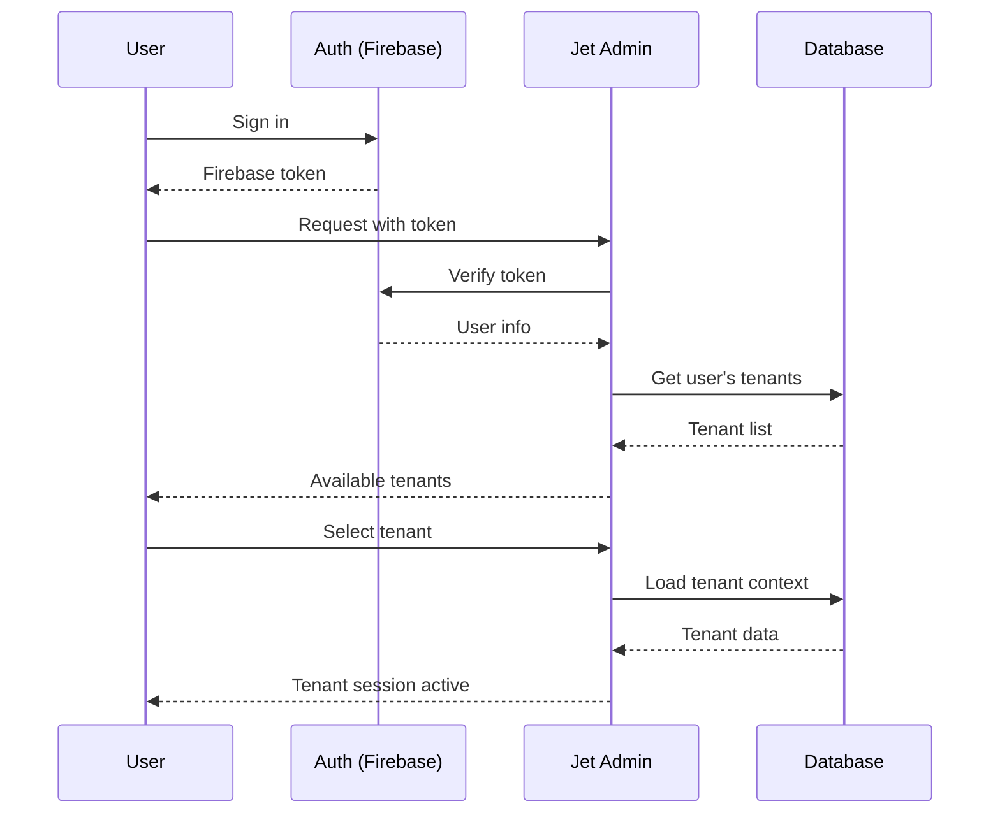
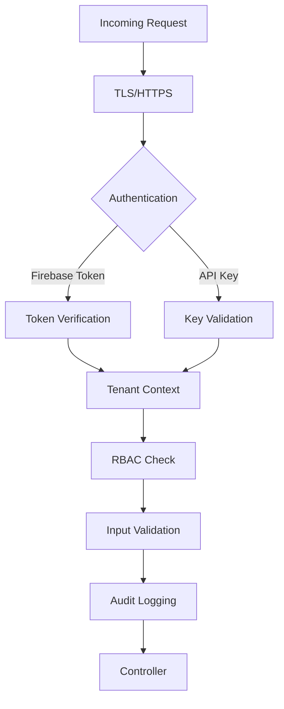

# Multi-Tenancy Architecture

Jet Admin is built from the ground up as a multi-tenant platform, enabling organizations to manage multiple isolated workspaces (tenants) with complete data separation, independent configurations, and granular access control.

---

## 📋 Table of Contents

- [What is Multi-Tenancy?](#what-is-multi-tenancy)
- [Tenant Architecture](#tenant-architecture)
- [Data Isolation](#data-isolation)
- [User Management](#user-management)
- [Role-Based Access Control](#role-based-access-control)
- [API Key Authentication](#api-key-authentication)
- [Security Model](#security-model)
- [Best Practices](#best-practices)

---

## What is Multi-Tenancy?

**Multi-tenancy** is an architecture where a single instance of Jet Admin serves multiple independent organizations (tenants). Each tenant has:

- ✅ **Complete data isolation** - Cannot access other tenants' data
- ✅ **Independent configuration** - Custom datasources, workflows, dashboards
- ✅ **Separate user management** - Own users, roles, and permissions
- ✅ **Dedicated resources** - Isolated execution environments

### Use Cases

| Scenario | Description |
|----------|-------------|
| **SaaS Platform** | Serve multiple customer organizations from one installation |
| **Enterprise** | Separate departments (HR, Finance, Engineering) with isolated data |
| **Agency** | Manage multiple clients with strict data separation |
| **Development** | Isolate dev/staging/production environments |

---

## Tenant Architecture

### Database Schema

```prisma
// Core tenant model
model tblTenants {
  tenantID        String   @id @default(gen_random_uuid())
  tenantTitle     String
  tenantDBURL     String?  // Optional: dedicated DB per tenant
  createdAt       DateTime @default(now())
  updatedAt       DateTime @updatedAt
  deletedAt       DateTime?
  
  // Tenant-scoped resources
  datasources     tblDatasources[]
  workflows       tblWorkflows[]
  dashboards      tblDashboards[]
  widgets         tblWidgets[]
  queries         tblDataQueries[]
  users           tblUsersTenantsRelationship[]
  apiKeys         tblAPIKeys[]
  roles           tblRoles[]
}
```

### Tenant Hierarchy

```
┌─────────────────────────────────────────┐
│         Jet Admin Platform              │
│                                         │
│  ┌──────────┐  ┌──────────┐  ┌────────┐│
│  │ Tenant A │  │ Tenant B │  │Tenant C││
│  │ ─────────│  │ ─────────│  │────────││
│  │ • Users  │  │ • Users  │  │ • Users││
│  │ • Data   │  │ • Data   │  │ • Data ││
│  │ • Config │  │ • Config │  │ • Config││
│  └──────────┘  └──────────┘  └────────┘│
└─────────────────────────────────────────┘
```

---

## Data Isolation

### Isolation Strategies

Jet Admin implements **logical isolation** through tenant scoping:

#### 1. Query-Level Isolation

All database queries automatically include tenant filtering:

```javascript
// Every query includes tenantID filter
const datasources = await prisma.tblDatasources.findMany({
  where: {
    tenantID: req.tenantID,  // ← Automatic tenant scoping
    deletedAt: null
  }
});
```

#### 2. Middleware Enforcement

Tenant context is established via middleware:

```javascript
// middleware/tenant.middleware.js
async function tenantMiddleware(req, res, next) {
  const tenantId = req.headers['x-tenant-id'] || req.params.tenantID;
  
  // Verify tenant exists
  const tenant = await prisma.tblTenants.findUnique({
    where: { tenantID: tenantId, deletedAt: null }
  });
  
  if (!tenant) {
    throw new AppError('Invalid tenant', 'INVALID_TENANT', 400);
  }
  
  req.tenant = tenant;
  req.tenantID = tenantId;
  next();
}
```

#### 3. Foreign Key Constraints

Database-level enforcement through foreign keys:

```prisma
model tblDatasources {
  id        String @id @default(gen_random_uuid())
  tenantID  String  // ← Foreign key to tenants
  tenant    tblTenants @relation(fields: [tenantID], references: [tenantID])
  // ... other fields
}
```

### Isolation Guarantees

| Level | Guarantee |
|-------|-----------|
| **API** | All endpoints require tenant context |
| **Database** | All queries filtered by tenantID |
| **Workflow** | Workflow execution tenant-scoped |
| **Real-time** | Socket rooms tenant-isolated |
| **Cache** | Cache keys include tenant prefix |

---

## User Management

### User-Tenant Relationship

Users can belong to multiple tenants with different roles:

```prisma
model tblUsers {
  userID    String @id @default(gen_random_uuid())
  email     String @unique
  firebaseID String @unique
  
  // Many-to-many with tenants
  tenants   tblUsersTenantsRelationship[]
}

model tblUsersTenantsRelationship {
  id        String @id @default(gen_random_uuid())
  userID    String
  tenantID  String
  roleID    String
  
  user      tblUsers @relation(fields: [userID], references: [userID])
  tenant    tblTenants @relation(fields: [tenantID], references: [tenantID])
  role      tblRoles @relation(fields: [roleID], references: [roleID])
  
  @@unique([userID, tenantID]) // One role per tenant per user
}
```

### User Journey



### Switching Tenants

Users can switch between tenants:

```javascript
// Frontend: Tenant switcher component
function TenantSwitcher() {
  const { tenants, currentTenant, selectTenant } = useTenant();
  
  return (
    <select 
      value={currentTenant?.tenantID}
      onChange={(e) => {
        const tenant = tenants.find(t => t.tenantID === e.target.value);
        selectTenant(tenant);
      }}
    >
      {tenants.map(tenant => (
        <option key={tenant.tenantID} value={tenant.tenantID}>
          {tenant.tenantTitle}
        </option>
      ))}
    </select>
  );
}
```

---

## Role-Based Access Control (RBAC)

### RBAC Model

```prisma
model tblRoles {
  roleID      String @id @default(gen_random_uuid())
  tenantID    String
  roleName    String  // e.g., "Admin", "Editor", "Viewer"
  
  permissions tblPermissions[]
  users       tblUsersTenantsRelationship[]
}

model tblPermissions {
  permissionID   String @id @default(gen_random_uuid())
  roleID         String
  permissionName String  // e.g., "datasource:create"
  resource       String  // e.g., "datasource"
  action         String  // e.g., "create"
  
  role           tblRoles @relation(fields: [roleID], references: [roleID])
}
```

### Default Roles

| Role | Permissions | Use Case |
|------|-------------|----------|
| **Admin** | All permissions | Platform administrators |
| **Editor** | Create, read, update | Content creators |
| **Viewer** | Read-only | Stakeholders, auditors |

### Permission System

Permissions follow a `resource:action` pattern:

```javascript
const PERMISSIONS = {
  // Datasources
  'datasource:list': 'View datasource list',
  'datasource:read': 'View datasource details',
  'datasource:create': 'Create new datasources',
  'datasource:update': 'Edit existing datasources',
  'datasource:delete': 'Remove datasources',
  
  // Workflows
  'workflow:list': 'View workflow list',
  'workflow:read': 'View workflow details',
  'workflow:create': 'Create new workflows',
  'workflow:update': 'Edit existing workflows',
  'workflow:execute': 'Execute workflows',
  'workflow:delete': 'Delete workflows',
  
  // Dashboards
  'dashboard:list': 'View dashboards',
  'dashboard:read': 'View dashboard',
  'dashboard:create': 'Create dashboards',
  'dashboard:update': 'Edit dashboards',
  'dashboard:delete': 'Delete dashboards',
  
  // Users & Roles
  'user:list': 'View users',
  'user:create': 'Invite users',
  'user:update': 'Update user roles',
  'user:delete': 'Remove users',
  'role:manage': 'Manage roles and permissions',
};
```

### Permission Middleware

```javascript
// middleware/permission.middleware.js
function requirePermission(permission) {
  return async (req, res, next) => {
    const { user, tenantID } = req;
    
    // Get user's roles in tenant
    const relationships = await prisma.tblUsersTenantsRelationship.findMany({
      where: { userID: user.uid, tenantID },
      include: { role: { include: { permissions: true } } }
    });
    
    // Check if any role has required permission
    const hasPermission = relationships.some(rel => 
      rel.role.permissions.some(p => p.permissionName === permission)
    );
    
    if (!hasPermission) {
      return res.status(403).json({
        error: 'Permission denied',
        code: 'PERMISSION_DENIED',
        required: permission
      });
    }
    
    next();
  };
}

// Usage in routes
router.post(
  '/',
  authMiddleware,
  tenantMiddleware,
  requirePermission('datasource:create'),
  datasourceController.createDatasource
);
```

---

## API Key Authentication

For machine-to-machine communication, Jet Admin supports API key authentication:

### API Key Model

```prisma
model tblAPIKeys {
  keyID         String @id @default(gen_random_uuid())
  tenantID      String
  keyName       String
  keyHash       String  // Hashed key value
  createdAt     DateTime @default(now())
  expiresAt     DateTime?
  
  tenant        tblTenants @relation(fields: [tenantID], references: [tenantID])
  roleMappings  tblAPIKeyRoleMappings[]
}
```

### Creating API Keys

```javascript
// API: Generate API key
async function createAPIKey(tenantID, name, permissions) {
  // Generate random key
  const rawKey = `jet_${crypto.randomBytes(32).toString('hex')}`;
  
  // Hash for storage
  const keyHash = await bcrypt.hash(rawKey, 10);
  
  // Store in database
  const apiKey = await prisma.tblAPIKeys.create({
    data: {
      tenantID,
      keyName: name,
      keyHash,
      roleMappings: {
        create: permissions.map(permission => ({
          permissionName: permission
        }))
      }
    }
  });
  
  // Return raw key once (never stored)
  return {
    keyID: apiKey.keyID,
    key: rawKey,  // Only shown once
    expiresAt: apiKey.expiresAt
  };
}
```

### Using API Keys

```bash
# API request with API key
curl -X GET https://api.jetadmin.io/api/v1/tenants/:tenantID/datasources \
  -H "Authorization: Bearer jet_abc123..." \
  -H "x-tenant-id: tenant-uuid"
```

### API Key Middleware

```javascript
async function apiKeyMiddleware(req, res, next) {
  const authHeader = req.headers.authorization;
  if (!authHeader?.startsWith('Bearer ')) {
    return next(); // Try Firebase auth instead
  }
  
  const key = authHeader.split(' ')[1];
  
  // Find API key
  const apiKey = await prisma.tblAPIKeys.findFirst({
    where: { tenantID: req.tenantID },
    include: { roleMappings: true }
  });
  
  if (!apiKey || !await bcrypt.compare(key, apiKey.keyHash)) {
    return res.status(401).json({ error: 'Invalid API key' });
  }
  
  // Attach permissions to request
  req.apiKey = apiKey;
  req.permissions = apiKey.roleMappings.map(m => m.permissionName);
  
  next();
}
```

---

## Security Model

### Defense in Depth



### Security Layers

| Layer | Protection |
|-------|------------|
| **Transport** | HTTPS/TLS encryption |
| **Authentication** | Firebase Auth or API Keys |
| **Authorization** | RBAC permissions |
| **Tenant Isolation** | Query-level filtering |
| **Input Validation** | Request sanitization |
| **Audit Logging** | All actions logged |
| **Encryption** | Credentials encrypted at rest |

### Audit Logging

All tenant-scoped actions are logged:

```prisma
model tblAuditLogs {
  logID      String @id @default(gen_random_uuid())
  tenantID   String
  userID     String
  action     String
  resource   String
  timestamp  DateTime @default(now())
  ipAddress  String
  userAgent  String
  metadata   Json
}
```

**Logged Events:**
- User login/logout
- Datasource CRUD operations
- Workflow execution
- Dashboard modifications
- Role changes
- API key usage

---

## Best Practices

### Tenant Organization

✅ **Use Clear Naming**
```
Good: "Acme Corp - Production"
Bad: "Tenant 1"
```

✅ **Separate Environments**
```
Tenant: "MyApp - Development"
Tenant: "MyApp - Staging"
Tenant: "MyApp - Production"
```

✅ **Document Purpose**
```javascript
{
  tenantTitle: 'Engineering Team',
  description: 'Engineering department tools and dashboards',
  metadata: {
    department: 'engineering',
    costCenter: 'ENG-001'
  }
}
```

### Access Control

✅ **Principle of Least Privilege**
- Start with minimal permissions
- Grant additional access as needed
- Review permissions regularly

✅ **Use Roles, Not Individual Permissions**
```javascript
// Good: Assign predefined role
await assignRoleToUser(userId, 'editor');

// Avoid: Assign individual permissions
await assignPermissions(userId, [
  'datasource:read',
  'workflow:read',
  // ... 20 more
]);
```

✅ **Regular Audits**
- Review user access quarterly
- Remove inactive users
- Rotate API keys every 90 days

### Security

✅ **Enable MFA**
- Require multi-factor authentication
- Especially for admin accounts

✅ **Monitor Suspicious Activity**
```javascript
// Alert on unusual patterns
if (loginAttempts > 5 || 
    ipChange || 
    unusualHour) {
  alertSecurityTeam();
}
```

✅ **Encrypt Sensitive Data**
- Use field-level encryption for PII
- Encrypt datasource credentials
- Secure key management

### Performance

✅ **Index Tenant Queries**
```prisma
model tblDatasources {
  @@index([tenantID, deletedAt])
  @@index([tenantID, createdAt])
}
```

✅ **Partition Large Tables**
```sql
-- Partition audit logs by tenant
CREATE TABLE audit_logs (
  logID uuid,
  tenantID uuid,
  ...
) PARTITION BY LIST (tenantID);
```

✅ **Cache Tenant Context**
```javascript
// Cache tenant data
const tenant = await cache.get(`tenant:${tenantID}`);
if (!tenant) {
  const tenant = await db.tblTenants.findUnique(...);
  await cache.set(`tenant:${tenantID}`, tenant, 300);
}
```

---

## Next Steps

- [**Authentication**](./authentication) - Firebase auth integration
- [**Security**](./security) - Security best practices
- [**RBAC Implementation**](../features/roles/index) - Role management
- [**API Reference**](../api-reference/authentication) - Auth endpoints

---

<div align="center">

### Need Help?

[Security Documentation](./security) · [API Reference](../api-reference/authentication) · [Troubleshooting](../troubleshooting/common-issues)

</div>
