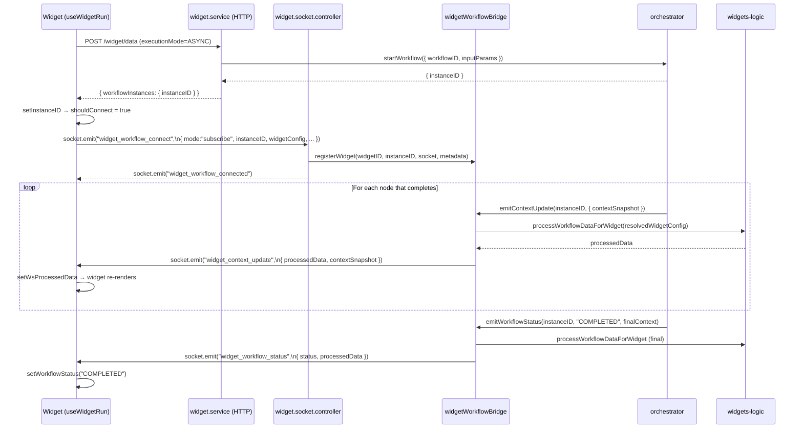
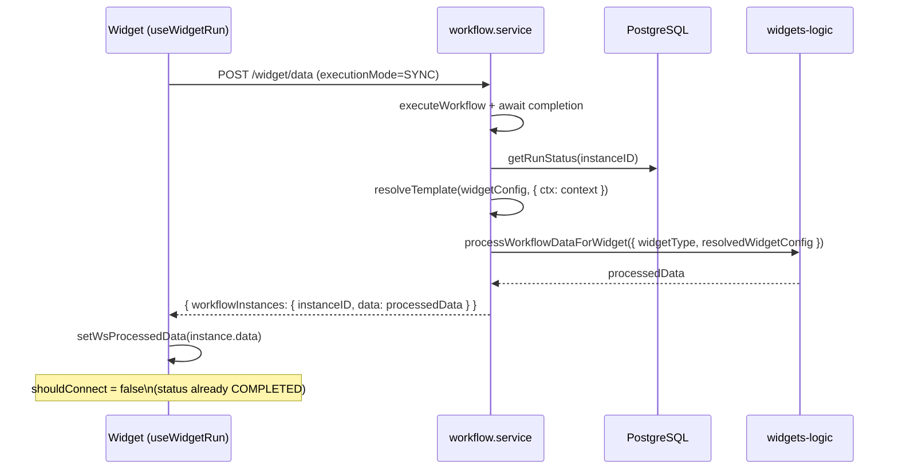
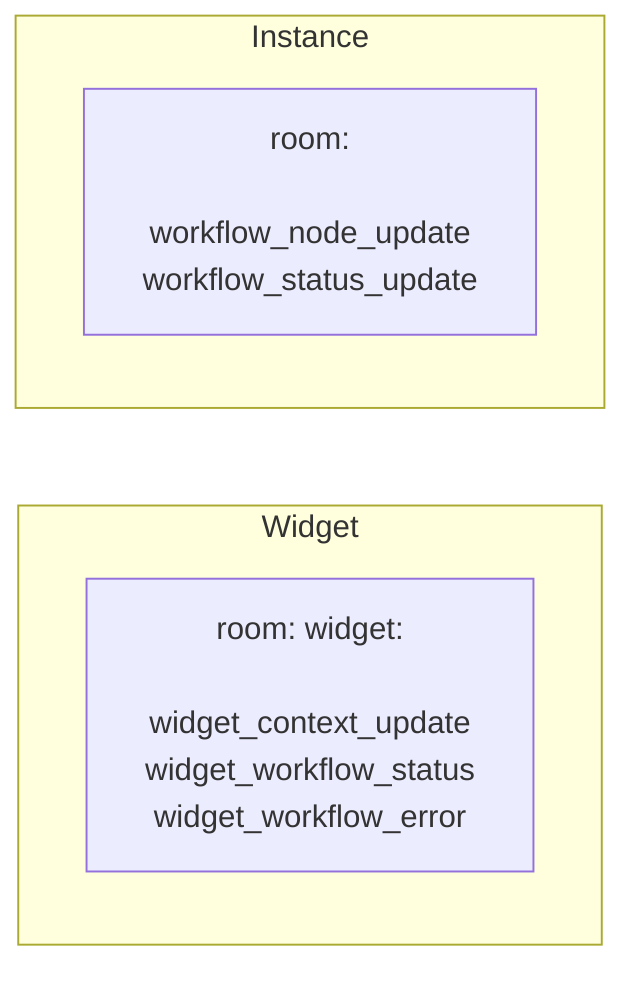
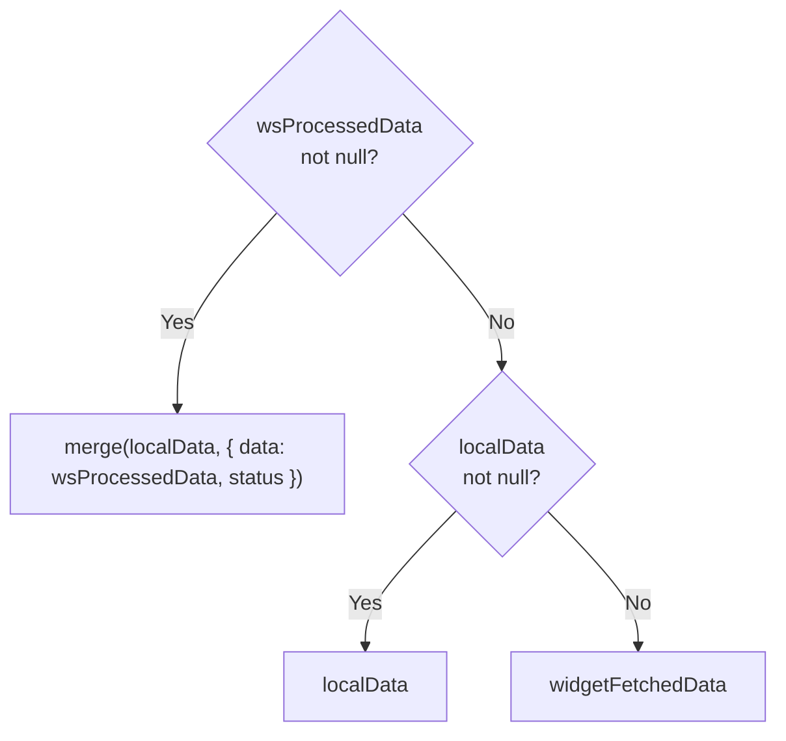
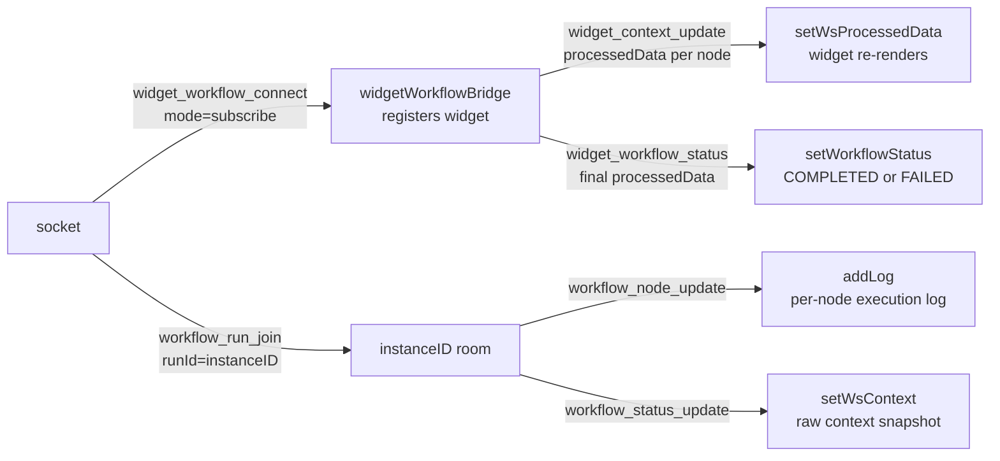
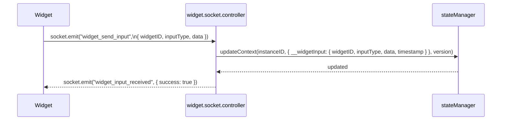

# Widget–Workflow Integration

Widgets are front-end components that display live, workflow-driven data. They connect to the Workflow Engine through a two-layer integration:

- **Backend** — `widgetWorkflowBridge` manages widget-to-instance subscriptions and processes context into renderable data.
- **Frontend** — `useWidgetRun` manages the socket connection, execution lifecycle, and data priority resolution.

## Architecture overview

```mermaid
flowchart TB
    subgraph Frontend["Frontend"]
        UWR[useWidgetRun]
        W[Widget component]
    end

    subgraph Socket["Socket.IO"]
        S[socket]
    end

    subgraph Backend["Backend"]
        WSC[widget.socket.controller]
        WWB[widgetWorkflowBridge]
        WS[workflow.service\ngetRunStatusForWidget]
        OR[orchestrator]
    end

    subgraph Engine["Workflow Engine"]
        TW[taskWorker]
        SM[stateManager]
    end

    subgraph External["External"]
        WL[@jet-admin/widgets-logic]
        TE[templateEngine]
    end

    UWR -- HTTP --> WS
    UWR -- socket events --> S
    S --> WSC
    WSC --> WWB
    OR --> WWB
    WWB --> WL
    WWB --> TE
    WWB --> S
    S --> UWR
    UWR --> W
```

## Execution modes

| Mode | Trigger | Data delivery | Use case |
|---|---|---|---|
| `ASYNC` (live) | `fetchWidgetData()` → workflow starts | Socket stream as nodes complete | Dashboards needing real-time updates |
| `SYNC` (on-completion) | `fetchWidgetData()` with `executionMode=SYNC` | HTTP response after workflow finishes | One-shot data fetch, no live updates |
| `subscribe` | `widget_workflow_connect` with `mode="subscribe"` | Socket stream on existing `instanceID` | Re-attach to an already-running workflow |
| `replay` | `widget_workflow_connect` with `mode="replay"` | Single emit with final context | Inspect a completed instance |

---

## Connection flows

### ASYNC mode — live execution

This is the primary mode for live dashboard widgets.



### SYNC mode — on-completion

No socket connection is established. The API call blocks until the workflow completes and returns fully processed data in the HTTP response.



### Widget registration timing

:::caution Critical

In `execute` mode, `widgetWorkflowBridge.registerWidget()` is called **before** emitting `widget_workflow_connected`, inside `onWidgetWorkflowConnect`. This prevents `NODE_COMPLETED` events from the very first node from being missed while the widget is still setting up its listener.

:::

---

## Backend bridge: widgetWorkflowBridge

### Widget registry

The bridge maintains two in-memory Maps:

| Map | Key | Value | Purpose |
|---|---|---|---|
| `widgetConnections` | `widgetID` | `{ instanceID, socketId, widgetType, widgetConfig, workflowConfig, ... }` | Full connection state per widget |
| `instanceWidgets` | `instanceID` | `Set<widgetID>` | Fast lookup — all widgets watching a given instance |

:::note Scaling

The registry is in-process memory. For horizontal scaling across multiple pods, this must be replaced with a shared store (e.g. Redis Pub/Sub) so emits reach widgets connected to any pod.

:::

### Context processing pipeline

```mermaid
flowchart LR
    CTX[Raw workflow\ncontext snapshot]
    WC[widgetConfig\n{with {{ctx.*}} templates}]

    CTX --> RT[resolveTemplate\nbackend template engine]
    WC --> RT

    RT --> RWC[Resolved widgetConfig\n{templates replaced with values}]
    RWC --> WL[processWorkflowDataForWidget\n@jet-admin/widgets-logic]
    WL --> PD[processedData\nchart-ready spec]
    PD --> SE[socket.emit\nwidget_context_update]
```

The pipeline runs **per widget, per node completion**. Each widget may have a different `widgetConfig`, so context is processed separately for each registered widget.

### Template resolution detail

`widgetConfig` is an opaque JSON blob that may contain `{{ctx.*}}` expressions anywhere in its structure — nested objects, arrays, string values.

```js
// widgetConfig before resolution
{ "data": { "values": "{{ctx.queryResult}}" }, "mark": "bar" }

// After resolveTemplate with preserveSingleExpressionType: true
// ctx.queryResult is an array — type is preserved, not serialised to string
{ "data": { "values": [{ "x": 1, "y": 2 }, ...] }, "mark": "bar" }
```

`preserveSingleExpressionType: true` is critical for passing arrays and objects to Vega-Lite and similar widget types without unwanted stringification.

### Room architecture

Each widget joins two socket rooms on registration:



The dual-room design means a widget receives both:
- **Typed processed data** (via its private room) — chart-ready output already shaped by widgets-logic.
- **Raw node execution logs** (via the instance room) — used for the per-node `logs` array in the developer tooling panel.

### widgetWorkflowBridge API

| Method | Parameters | Description |
|---|---|---|
| `registerWidget()` | `widgetID, instanceID, socket, metadata` | Stores connection; joins socket rooms `widget:<id>` and `instanceID` |
| `unregisterWidget()` | `widgetID, socket?` | Removes from both Maps; leaves socket rooms |
| `processContextForWidget()` | `context, { widgetType, widgetConfig, workflowConfig }` | Template resolution + widgets-logic delegation. Returns `processedData` or `null`. |
| `emitContextUpdate()` | `instanceID, update` | Processes and emits `widget_context_update` to all registered widgets for this instance |
| `emitWorkflowStatus()` | `instanceID, status, finalContext?` | Emits `widget_workflow_status` with final `processedData` to all registered widgets |
| `emitError()` | `widgetID, error` | Emits `widget_workflow_error` to a specific widget's private room |
| `getWidgetsForInstance()` | `instanceID` | Returns `string[]` of widgetIDs watching this instance |
| `getWidgetConnection()` | `widgetID` | Returns full connection metadata object or `null` |
| `getStats()` | — | Returns connection counts and summary array (diagnostics) |
| `cleanupStaleConnections()` | `maxAgeMs?` | Removes connections older than `maxAgeMs` (default 1 hr) |

---

## Socket event reference

### Client → server

| Event | Handler | Key payload fields |
|---|---|---|
| `widget_workflow_connect` | `onWidgetWorkflowConnect` | `widgetID, workflowID, mode, instanceID?, inputParams, widgetType, widgetConfig, workflowConfig, tenantID` |
| `widget_workflow_disconnect` | `onWidgetWorkflowDisconnect` | `widgetID` |
| `widget_send_input` | `onWidgetSendInput` | `widgetID, instanceID?, inputType, data` |
| `widget_refresh` | `onWidgetRefresh` | `widgetID, inputParams?, tenantID` |
| `workflow_run_join` | `workflowSocketController.onWorkflowRunJoin` | `runId` (instanceID) |

### Server → client

| Event | Room | Key payload fields |
|---|---|---|
| `widget_workflow_connected` | socket directly | `widgetID, instanceID, mode, initialContext, workflowMeta` |
| `widget_context_update` | `widget:<widgetID>` | `widgetID, instanceID, update: { processedData, contextSnapshot, nodeID, ... }` |
| `widget_workflow_status` | `widget:<widgetID>` | `widgetID, instanceID, status, finalContext, processedData` |
| `widget_workflow_error` | `widget:<widgetID>` | `widgetID, error: { code, message, recoverable }` |
| `widget_workflow_disconnected` | socket directly | `widgetID, success` |
| `workflow_node_update` | `instanceID` room | `instanceID, nodeID, status, output, error` |
| `workflow_status_update` | `instanceID` room | `instanceID, status, contextData` |

---

## Connection modes in detail

### execute mode

Starts a new workflow execution. Used when the widget drives its own workflow run.

- Requires `workflowID`.
- `widgetWorkflowBridge.registerWidget()` is called **before** emitting `widget_workflow_connected`.
- Returns early — skips the common register + emit path at the bottom of `onWidgetWorkflowConnect`.

### subscribe mode

Attaches to an existing running workflow instance.

- Requires `instanceID`.
- `initialContext` is set from the instance's assembled context at subscribe time.
- The widget receives all future context updates until the workflow completes.

### replay mode

Fetches the final context of a completed instance and emits it once. No live updates.

- Requires `instanceID`.
- If `widgetType` and `widgetConfig` are provided, `processContextForWidget` runs immediately and `processedData` is included in the `widget_workflow_connected` emit.
- Returns early — the widget is **not** registered for live updates.

---

## Frontend hook: useWidgetRun

### Parameters

| Parameter | Type | Description |
|---|---|---|
| `tenantID` | string | Required. Scopes the workflow execution. |
| `widgetID` | string \| null | Stable widget identifier. Null generates a preview ID. |
| `widgetFetchedData` | object \| null | Initial data from parent (SSR or cache). Hydrates on first render. |
| `executionMode` | `ASYNC` \| `SYNC` | Controls whether live socket streaming is used. |
| `workflowID` | string \| null | Target workflow to execute. |
| `widgetType` | string \| null | Widget type identifier passed to widgets-logic for data shaping. |
| `widgetConfig` | object \| null | Opaque widget configuration blob containing `{{ctx.*}}` templates. |
| `workflowConfig` | object \| null | Workflow binding configuration. |

### Return values

| Return | Type | Description |
|---|---|---|
| `data` | object \| null | Final resolved data — priority: `wsProcessedData > localData > widgetFetchedData` |
| `processedData` | object \| null | Latest chart-ready data from the socket stream. Updated per node completion. |
| `context` | object | Raw workflow context snapshot (all node outputs merged). |
| `isLoading` | boolean | True only during the initial API fetch before any socket data arrives. |
| `isRunning` | boolean | True while fetching OR `workflowStatus` is `LOADING` or `PENDING`. |
| `isLive` | boolean | True when `connectionState` is `CONNECTED`. |
| `workflowStatus` | string | `LOADING \| PENDING \| COMPLETED \| FAILED \| ERROR` |
| `connectionState` | string | `disconnected \| connecting \| connected \| error` |
| `logs` | array | Ordered `{ type, label, message, timestamp }` entries for developer tooling. |
| `runWidget(formValues, opts)` | function | Triggers API fetch. Accepts `opts.inputParams`. |
| `clearLogs()` | function | Empties the `logs` array. |

### Data priority resolution



This means:

- A widget pre-loaded with SSR data (`widgetFetchedData`) renders immediately — no loading state.
- When the live workflow produces data, `wsProcessedData` takes over and the widget updates in place.
- If the socket disconnects mid-run, the last received `wsProcessedData` remains — the widget does not revert to initial data.

### shouldConnect logic

The socket connection effect only fires when all four conditions are true:

| Condition | Why |
|---|---|
| `instanceID` is set | No point connecting before the workflow has started |
| `executionMode` is `ASYNC` | SYNC mode receives data over HTTP, not sockets |
| `socket` is available | Socket context must be initialised |
| `workflowStatus` is not `COMPLETED` or `FAILED` | Prevents reconnecting to a finished workflow on re-render |

### Dual-channel subscription

`useWidgetRun` subscribes to two separate socket channels simultaneously:



Both subscriptions are cleaned up in the effect's return function. On cleanup, `socket.emit("widget_workflow_disconnect", { widgetID })` is sent so the bridge unregisters the widget and stops processing context updates for it.

---

## Interactive widget input

Widgets can send input back to a running workflow via `widget_send_input`. This allows widgets to drive workflow behaviour — form submissions, filter changes, action buttons.



Downstream workflow nodes can read `ctx.__widgetInput` to branch behaviour based on widget input. The `version` CAS in `updateContext` ensures the input write does not race with concurrent node completions.

---

## Workflow service: widget path

### getRunStatusForWidget

Used for SYNC mode and replay context pre-processing:

```mermaid
flowchart TD
    A[getRunStatusForWidget\n{ instanceID, widgetType, widgetConfig }]
    A --> B{status = COMPLETED?}
    B -- No --> C[Return runStatus as-is\nno data field]
    B -- Yes --> D{widgetConfig provided?}
    D -- No --> C
    D -- Yes --> E[resolveTemplate\nwidgetConfig against ctx]
    E --> F[processWorkflowDataForWidget\nwidgets-logic]
    F --> G[Return runStatus + data: processedData]
```

---

## Comparison: useWidgetRun vs useWorkflowRun

`useWorkflowRun` is the hook used by the workflow builder UI for developer testing. `useWidgetRun` is for end-user widget consumers.

| Feature | `useWorkflowRun` | `useWidgetRun` |
|---|---|---|
| Audience | Workflow builder developers | End-user widget consumers |
| Socket connection | Creates its own `socket.io-client` instance | Uses shared `socketContext` socket |
| Data shape | Raw context + per-node outputs | Processed (chart-ready) via widgets-logic |
| Execution modes | `testRun` (in-memory) or `savedRun` | `ASYNC` (live) or `SYNC` (on-completion) |
| Test run lifecycle | Calls `stopTestWorkflowAPI` on stop | N/A |
| Processed data | Not applicable | `wsProcessedData` updated per node via bridge |
| Stop guard | `isStoppingRef` prevents race on stop | Not needed |

### isStoppingRef guard

`useWorkflowRun` uses `isStoppingRef` to prevent a race condition on stop: if socket events arrive after the user clicks Stop but before the socket disconnects, the guard causes those handlers to return immediately without updating state. This prevents flickering or false-positive completion events.

---

## Error handling

### Widget connection errors

If `onWidgetWorkflowConnect` throws, the controller emits `widget_workflow_error` with:

```json
{
  "widgetID": "...",
  "error": {
    "code": "CONNECTION_FAILED",
    "message": "...",
    "recoverable": false
  }
}
```

### Workflow failure during streaming

When the engine marks an instance `FAILED`, `widgetWorkflowBridge.emitWorkflowStatus(instanceID, "FAILED", finalContext)` is called. `useWidgetRun`'s `handleWidgetStatus` sets `workflowStatus` to `"FAILED"` and `shouldConnect` becomes `false`, stopping further reconnection attempts.

### processContextForWidget errors

Template resolution or widgets-logic processing may fail (e.g. invalid template expression, missing context key). `processContextForWidget` wraps the entire pipeline in `try/catch` and returns `null` on any error. The emit continues with `processedData: null` — the widget receives a context update but renders with no data change, preserving the last valid state.

---

## Scaling considerations

### Widget registry

`widgetConnections` and `instanceWidgets` are in-process Maps. With multiple pods:

- A widget connected to Pod A may not receive events emitted by the orchestrator on Pod B, because the bridge on Pod B has no knowledge of the widget registered on Pod A.
- The correct fix is to move the widget registry to Redis and use Redis Pub/Sub or Socket.IO's Redis adapter to broadcast events across pods.

### Socket.IO adapter

The orchestrator emits directly to `instanceID` rooms via `socketIO.to(instanceID).emit(...)`. In a multi-pod setup, room membership is not shared across pods by default. The Socket.IO Redis adapter makes rooms available to all pods, ensuring events reach the correct client regardless of which pod it is connected to.

---

## Developer guide

### Adding a new widget type

1. Implement the widget rendering component in the frontend.
2. Define the `widgetConfig` schema — the set of fields the widget needs, with `{{ctx.*}}` templates for dynamic values.
3. Add the new widget type handler to `@jet-admin/widgets-logic` in `processWorkflowDataForWidget`. The backend bridge is widget-type-agnostic — it passes `widgetType` and the resolved `widgetConfig` to this function and returns whatever it produces.
4. No backend changes are needed unless the widget requires a new context processing step.

### Adding a new connection mode

1. Add a `case` to the `switch` in `onWidgetWorkflowConnect`.
2. Call `widgetWorkflowBridge.registerWidget()` if live updates are required.
3. Emit `widget_workflow_connected` with the appropriate `initialContext`.

### Debugging widget data flow

- `widgetWorkflowBridge.getStats()` returns all active connections with metadata. Expose this on a debug endpoint to see what widgets are registered.
- The `logs` array in `useWidgetRun` contains timestamped entries for every connection event, node update, and error. Surface this in a dev panel to trace what the widget received.
- Set a breakpoint in `processContextForWidget` to inspect `resolvedWidgetConfig` before it reaches widgets-logic.
- Call `socket.emit("widget_workflow_connect", { mode: "replay", instanceID })` in the browser console to re-fetch the final context of any completed instance.

---

## File reference

| File | Role |
|---|---|
| `widgetWorkflowBridge.js` | Widget registry; context processing pipeline; socket room emission |
| `widget.socket.controller.js` | Socket event handlers for all `widget_workflow_*` events |
| `workflow.service.js` (`getRunStatusForWidget`) | SYNC mode and replay — template resolution + `processWorkflowDataForWidget` |
| `useWidgetRun.jsx` | Frontend hook — API execution, socket lifecycle, data priority resolution |
| `useWorkflowRun.jsx` | Workflow builder hook — test/saved run management, per-node status tracking |
| `@jet-admin/widgets-logic` | External package — `processWorkflowDataForWidget`; sole owner of widget-type-specific data shapes |
