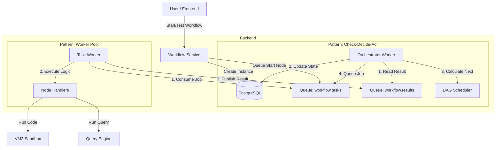

# 🏗️ Architecture Deep Dive

This document provides a comprehensive technical overview of the Jet Admin Workflow Engine. It covers the architecture, execution flow, core components, and implementation details for both backend and frontend.

## 1. High-Level Architecture

The workflow engine is designed as an **event-driven, distributed system** using **RabbitMQ** for decoupling the Orchestrator from the Task Workers. This allows for scalability and robust failure handling.



## 2. Core Components

### 2.1 Workflow Service (`workflow.service.js`)
The entry point for all workflow operations. It handles CRUD for workflow definitions and triggers executions.

- **`executeWorkflow`**: Starts a production run. Creates a `tblWorkflowInstances` record and queues the Start Node.
- **`testWorkflow`**: Starts a test run. Instead of reading from the DB, it places the *in-memory* node/edge definition into the execution context (`__workflowDefinition`), allowing users to test unsaved changes.

### 2.2 Orchestrator (`orchestrator.js`)
The "Brain" of the engine. It consumes **Execution Results** and decides what to do next.

**Key Responsibilities:**
1.  **Consume Results**: Listens to `workflow.results`.
2.  **Update State**: Updates the workflow instance context with the output of the completed node. Uses **optimistic locking** to prevent race conditions.
3.  **Determine Next Step**:
    *   If `isTestRun`: Uses in-memory graph from context.
    *   If Production: Calls `dagScheduler` to find downstream nodes from the DB.
4.  **Dispatch Jobs**: Pushes new jobs to `workflow.tasks` for the next nodes.
5.  **Completion**: If a terminal node (End Node) is reached, marks the instance as `COMPLETED`.

### 2.3 Task Worker (`taskWorker.js`)
The "Muscle" of the engine. It consumes **Task Jobs** and executes the specific logic for that node type.

**Key Responsibilities:**
1.  **Consume Tasks**: Listens to `workflow.tasks`.
2.  **Route to Handler**: Based on `nodeType` (e.g., `javascript`, `dataQuery`), delegates to the specific handler in `handlers/`.
3.  **Execute**: Runs the handler logic. This is **stateless**—it receives everything it needs (config + context) in the job payload.
4.  **Retry Logic**: Handles retries with exponential backoff using specific **delayed queues** (e.g., `workflow.tasks_delayed_5000`).
5.  **Publish Result**: Sends success/error payload to `workflow.results`.

### 2.4 State Manager (`stateManager.js`)
Handles all database interactions for execution state.
- **Optimistic Locking**: When updating context, it checks `version`. If the version in DB has changed, it retries. This ensures that parallel branches updating the context don't overwrite each other's data.

## 3. Data Structures

### 3.1 Context (`ctx`)
The `contextData` generic JSON field in `tblWorkflowInstances` holds the state.
- **`input`**: Initial arguments passed to the workflow.
- **Node Outputs**: Each node's output is stored under its `nodeID`.
  ```json
  {
    "input": { "userId": 123 },
    "node_abc123": { "success": true, "data": [...] },
    "node_xyz789": { "jsResult": 42 }
  }
  ```

### 3.2 Job Payload
Message sent to `workflow.tasks`:
```json
{
  "instanceID": "uuid",
  "nodeID": "uuid",
  "nodeType": "javascript",
  "nodeConfig": { "code": "return 1+1" },
  "context": { ... }, // Snapshot of context at dispatch time
  "workflowID": "uuid"
}
```

### 3.3 Result Payload
Message sent to `workflow.results`:
```json
{
  "instanceID": "uuid",
  "nodeID": "uuid",
  "status": "success", // or 'error'
  "output": { "result": 2 },
  "nextHandle": "success" // Which output handle to follow (e.g., 'true', 'false', 'error')
}
```

## 4. Implementation Details & Code Samples

### 4.1 Orchestrator Logic
The core "Check-Decide-Act" loop in `orchestrator.js`:

```javascript
// orchestrator.js
async function handleTaskResult(result) {
  const { instanceID, nodeID, status, output, nextHandle } = result;

  // 1. Update Context (State)
  const updatedInstance = await stateManager.updateContext(
    instanceID, 
    { [nodeID]: output }, // Merge new output into context
    instance.version
  );

  // 2. Calculate Next Nodes (Decision)
  const nextNodes = await dagScheduler.calculateNextNodes(
    instance.workflowID,
    nodeID,
    nextHandle // Follow specific handle (e.g., 'success')
  );

  // 3. Queue Next Jobs (Action)
  for (const nextNode of nextNodes) {
    await addNodeJob({
      instanceID,
      nodeID: nextNode.nodeID,
      nodeType: nextNode.nodeType,
      nodeConfig: nextNode.nodeConfig,
      context: updatedInstance.contextData,
    });
  }
}
```

### 4.2 Node Handler (Backend)
Example of the JavaScript Node Execution in `handlers/javascriptHandler.js`. Note the use of `vm2` for sandboxing.

```javascript
// handlers/javascriptHandler.js
const { VM } = require('vm2');

async function execute(nodeConfig, context) {
  const { code, outputVariable } = nodeConfig;
  
  // Create sandbox with access to context
  const sandbox = {
    ctx: context,
    console: { log: () => {} }, // Security: disable console
    // ... allow safe globals like Math, JSON
  };

  const vm = new VM({ timeout: 1000, sandbox });
  
  try {
    // Run user code
    const result = vm.run(code);
    
    return {
      output: { [outputVariable]: result },
      nextHandle: 'success'
    };
  } catch (error) {
    return {
      output: { error: error.message },
      nextHandle: 'error' // Follow 'error' edge
    };
  }
}
```

### 4.3 Node Component (Frontend)
The frontend uses **JSON Forms** to render the configuration panel. This allows for declarative UI definitions.

```jsx
// packages/workflow-nodes/src/nodes/javascriptNode.jsx
export const JavascriptNodeConfigurator = ({ data, onChange }) => {
  // Define Schema for JSON Forms
  const schema = {
    type: 'object',
    properties: {
      code: { 
        type: 'string', 
        format: 'code-javascript',
        title: 'Network Code' 
      },
      timeoutSeconds: { type: 'integer', default: 30 }
    }
  };

  return (
    <JsonForms
      schema={schema}
      data={data}
      onChange={({ data }) => onChange(data)}
      renderers={workflowNodeRenderers} // Custom renderers
    />
  );
};
```

## 5. Adding a New Node Type

To add a new node type (e.g., `slackNode`):

1.  **Frontend (`packages/workflow-nodes`)**:
    *   Create `slackNode.jsx` with `SlackNode` (visual) and `SlackNodeConfigurator` (config form).
    *   Register in `nodeTypes` map.

2.  **Backend Handler (`apps/backend/modules/workflow/workers/handlers`)**:
    *   Create `slackHandler.js`:
        ```javascript
        async function execute(config, context) {
          /* call slack api */ 
          return { output: { sent: true }, nextHandle: 'success' };
        }
        module.exports = { execute };
        ```
    *   Register in `handlers/index.js`.

3.  **Queue**: No changes needed! The `taskWorker` dynamically loads the handler based on the `nodeType` string.

## 6. Error Handling & Retries

*   **User Errors**: Caught in the handler. The handler returns `nextHandle: 'error'`, allowing the workflow to proceed down an "Error" path (if defined).
*   **System Errors (Crashes)**: Caught by `taskWorker`.
    *   **Retry**: If `attempts < maxAttempts`, the message is sent to a **Delayed Queue** (RabbitMQ `x-message-ttl`).
    *   **Dead Letter**: After max retries, it moves to `workflow.tasks.dlq`.

## 7. Development Tips

*   **Test Mode**: When you run "Test" in the UI, the backend **does not** create DB nodes. It relies entirely on the JSON payload you send. This is crucial for rapid iteration.
*   **Context usage**: Always use `ctx.` to access data from previous nodes.
*   **Logs**: Execution logs are stored in `tblNodeExecutionLogs`. This is what populates the "Console" in the UI.
