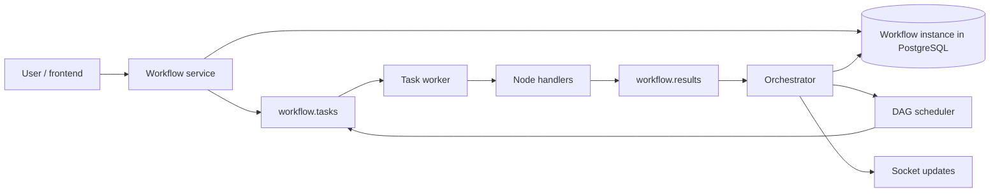
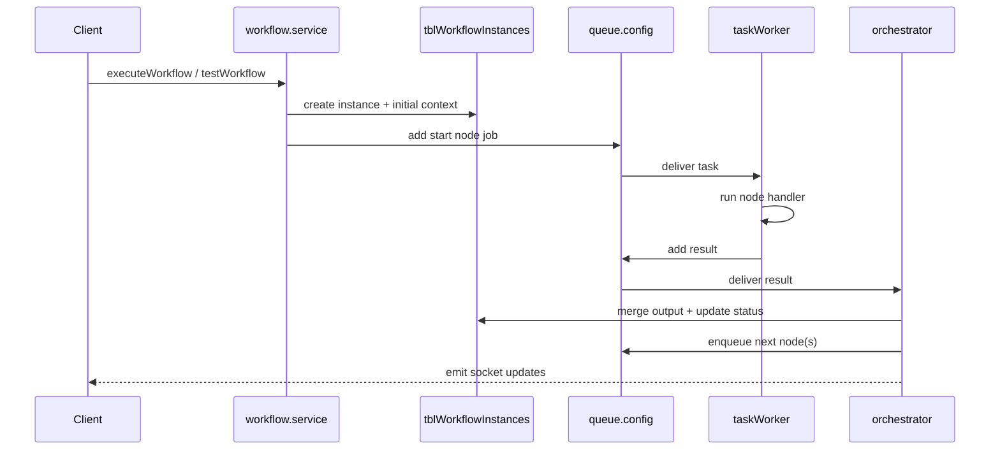

# Workflow Architecture

This page documents the **current** Jet Admin workflow runtime: a DAG-oriented execution engine that runs inside the backend process and uses an in-memory queue adapter built on `fastq`.

## High-level model

The workflow engine follows a **check-decide-act** loop:

1. **check** what node just finished,
2. **decide** which downstream nodes are eligible,
3. **act** by queuing the next node jobs or completing the run.



## Important runtime clarification

**Jet Admin uses an in-memory queue (fastq), not RabbitMQ.**

The workflow runtime is initialized from:
- `apps/backend/config/queue.config.js` - In-memory queue using fastq
- `apps/backend/workers/workflowWorkers.js` - Worker initialization
- `apps/backend/workers/taskWorker.js` - Task processor
- `apps/backend/workers/resultsConsumer.js` - Results orchestrator

This means:
- ✅ **No external broker needed** - Everything runs in-process
- ✅ **Simpler deployment** - No RabbitMQ container or service required
- ✅ **Faster development** - Direct function calls, no network overhead
- ⚠️ **Process-local queues** - Queue state is lost on restart
- ⚠️ **Limited horizontal scaling** - Tasks don't distribute across instances

## Core runtime components

### Workflow service

`workflow.service.js` is the API-facing service layer for workflow definition CRUD and run orchestration.

Important operations include:

- `executeWorkflow` — starts a persisted workflow run,
- `testWorkflow` — starts an unsaved test run from client-provided nodes and edges,
- `stopTestWorkflow` — removes a test instance,
- run-status retrieval for standard UI and widget-driven views.

### Workflow workers bootstrap

`workflowWorkers.js` initializes the active queue runtime and starts:

- the task worker,
- the results consumer/orchestrator loop,
- graceful queue shutdown hooks.

### Queue adapter

`apps/backend/config/queue.config.js` provides queue semantics using `fastq` and `EventEmitter`.

It exposes queue-like operations such as:

- `initializeQueue`
- `closeQueue`
- `addNodeJob`
- `addResult`
- `registerTaskWorker`
- `registerResultsWorker`
- `publishToMonitor`

The public shape intentionally mirrors the older AMQP-oriented abstraction so the workflow layer stays decoupled from the transport implementation.

### Task worker

`workers/taskWorker.js` is responsible for executing node jobs.

It:

1. receives a task payload,
2. resolves the handler from `nodeType`,
3. executes the handler with workflow context helpers,
4. publishes either success or error results,
5. retries failed jobs with exponential backoff by re-enqueuing them with delay.

### Orchestrator

`orchestrator/orchestrator.js` is the coordination layer.

It:

1. consumes node results,
2. updates workflow instance state and context,
3. emits node/status websocket updates,
4. determines downstream nodes using the DAG,
5. queues additional work or marks the workflow as complete.

### State manager and scheduler

The workflow engine separates responsibilities:

- **state management** persists context and execution state,
- **DAG scheduling** decides which next edges/nodes should fire,
- **workers** remain focused on isolated node execution.

## Execution lifecycle



## Production runs vs test runs

The engine supports two important modes.

### Production run

- workflow definition is read from persisted records,
- node/edge graph comes from the database,
- the run behaves like a normal saved workflow execution.

### Test run

- the frontend can send unsaved nodes and edges,
- those definitions are stored in context using internal markers such as `__workflowDefinition` and `__isTestRun`,
- the orchestrator resolves downstream nodes from the in-memory graph instead of reloading from the database,
- this enables iteration in the editor before saving the workflow.

## Context model

The workflow instance stores a mutable JSON context that acts as shared execution state.

Typical contents include:

- `input` for initial arguments,
- per-node outputs keyed by node ID,
- internal metadata for test runs,
- current execution status and supporting state used by downstream nodes.

Conceptually, the context evolves like this:

```json
{
  "input": { "customerId": 42 },
  "startNode": { "success": true },
  "fetchDataNode": { "rows": [{ "id": 1 }] },
  "transformNode": { "count": 1 }
}
```

## Node execution model

Each task job typically contains enough information for stateless execution:

- workflow instance ID,
- workflow ID,
- node ID,
- node type,
- node configuration,
- context snapshot,
- retry metadata.

The worker then dispatches to a handler that knows how to execute that node type.

Examples of node behavior include:

- JavaScript execution,
- data-query or datasource-driven actions,
- control-flow decisions,
- integration actions,
- widget-aware workflow bridging.

## Realtime feedback

Workflow execution is tightly integrated with Socket.IO.

The orchestrator emits updates for:

- individual node status changes,
- overall workflow status changes,
- widget-workflow integration state where applicable.

This is what allows the frontend to subscribe to a run and show near-live progress without polling every internal step.

## Retry behavior

Retries are implemented in the current queue adapter using delayed re-enqueueing rather than broker-managed delayed queues.

In practice this means:

- failed tasks can be retried with exponential backoff,
- delays are implemented with in-process timers,
- queue names such as `workflow.tasks.dlq` are preserved for compatibility even though the runtime is in-memory.

## Frontend relationship

The workflow UI depends on several frontend/package pieces:

- React Flow for graph editing,
- `@jet-admin/workflow-nodes` for node definitions and editors,
- `@jet-admin/workflow-edges` for custom edge rendering,
- JSON Forms-based configuration surfaces,
- socket subscriptions for live run feedback.

## Extending the workflow engine

Adding a new node type usually requires work in two places.

### Frontend/package side

- add the node definition and visual/configuration UI in `packages/workflow-nodes`,
- register the node so it appears in the editor and inspector UI.

### Backend side

- add the corresponding execution handler under the workflow worker handlers,
- ensure the handler returns the expected result shape,
- support any required validation or helper resolution.

The queue/orchestrator layer usually does not need structural changes because it dispatches dynamically by `nodeType`.

## Operational trade-offs of the current design

### Advantages

- simple local development,
- fewer moving parts than a broker-based distributed system,
- fast feedback for editor test runs,
- low cognitive overhead while the feature set evolves.

### Constraints

- queue state is process-local,
- horizontal scaling semantics are more limited,
- delayed retries are timer-based,
- resilience characteristics differ from a dedicated broker topology.

## Summary

Jet Admin's workflow engine is currently a **backend-embedded orchestration runtime** with:

- persisted workflow state in PostgreSQL,
- in-memory task/result queues,
- dynamic node handlers,
- DAG scheduling,
- retry support,
- realtime socket updates,
- explicit support for unsaved test execution.

That is the model to use when reasoning about the present codebase.