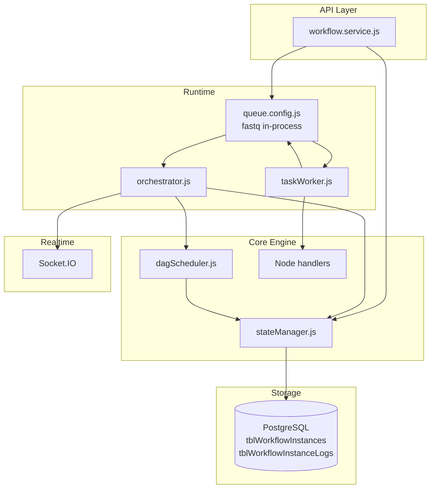
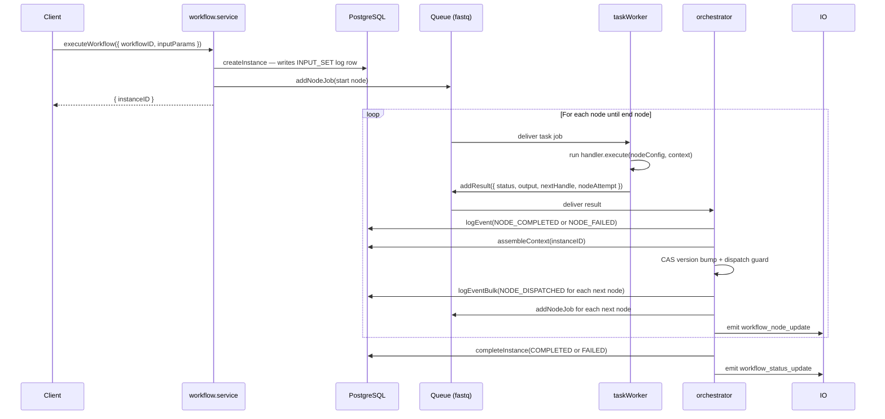
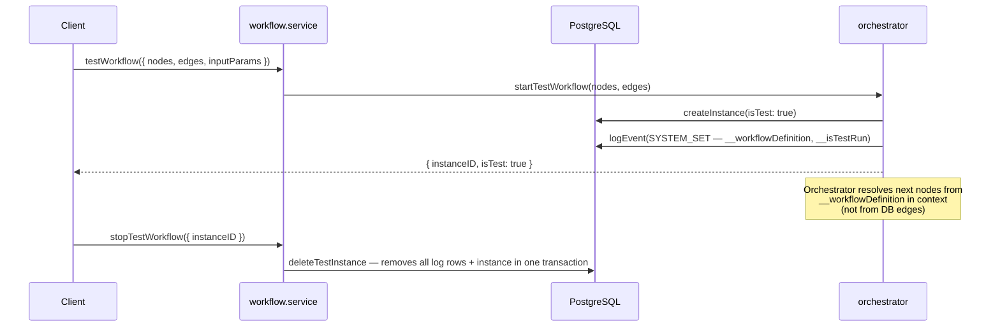
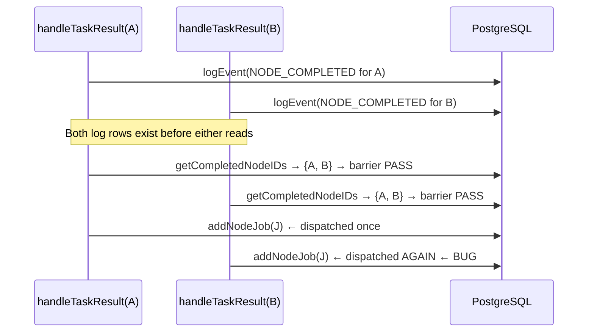
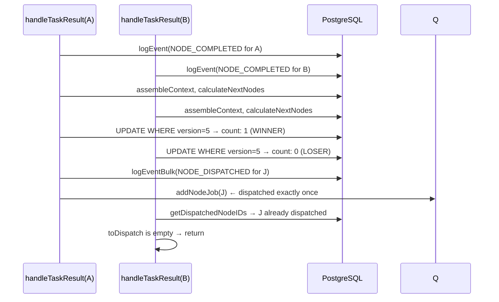
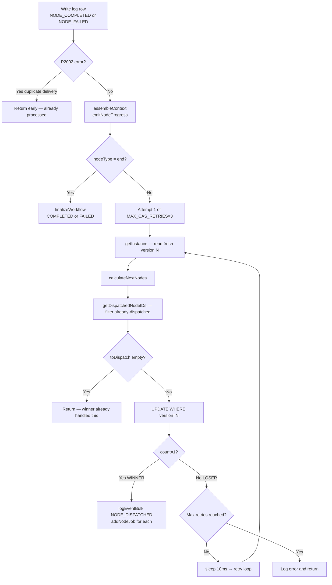
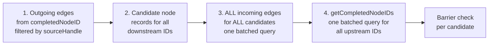
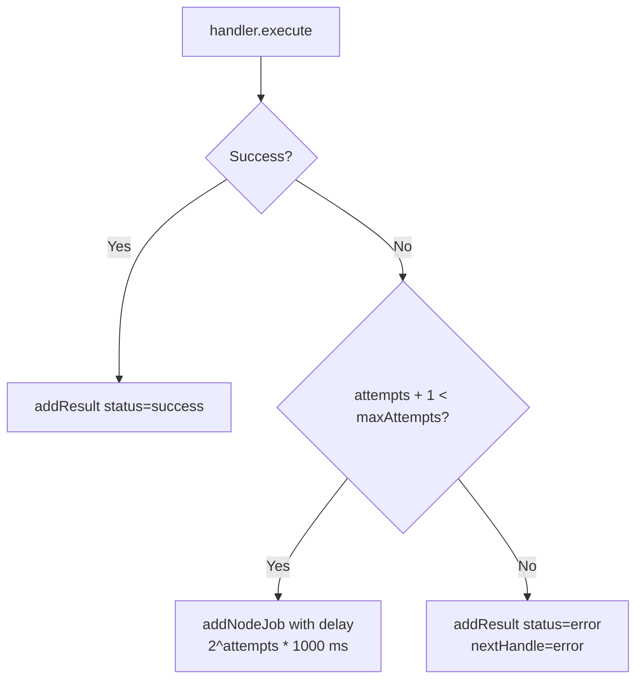

# Workflow Engine

The Workflow Engine is a DAG-based execution platform that runs multi-step automation workflows. It is built on a **queue-first, append-only-log architecture** designed for correctness under concurrent execution across multiple application pods.

## Design principles

Before reading anything else, internalize these five rules — they explain nearly every design decision in the engine:

1. **Queue-first** — every node execution is a discrete job. No synchronous blocking between nodes.
2. **Append-only log** — `tblWorkflowInstanceLogs` is the single source of truth. Context is assembled by folding log rows; nothing is ever updated in place.
3. **Optimistic concurrency** — a `version` field on `tblWorkflowInstances` serialises the scheduling decision using a CAS (compare-and-swap) loop. No distributed locks required.
4. **Idempotent log writes** — a unique index on `(instanceID, nodeID, eventType, nodeAttempt)` means duplicate result delivery is discarded before the scheduling loop is reached.
5. **`NODE_DISPATCHED` sentinel** — written atomically by the CAS winner before `addNodeJob`, giving losers a definitive read to check before re-dispatching.

## System components



| Layer | Module | Responsibility |
|---|---|---|
| API / Service | `workflow.service.js` | CRUD for workflow definitions; triggers execution |
| Queue Transport | `queue.config.js` (fastq) | In-process FIFO queues for jobs and results |
| Task Worker | `taskWorker.js` | Executes individual node handlers; reports results |
| Orchestrator | `orchestrator.js` | Processes results; updates log; decides next nodes |
| State Manager | `stateManager.js` | All DB reads/writes through a single interface |

---

## Data model

### Tables

| Table | Purpose |
|---|---|
| `tblWorkflows` | Workflow definition — title, options, tenant |
| `tblWorkflowNodes` | Node list — type, config, position |
| `tblWorkflowEdge` | Directed edges — `upstreamNodeID → downstreamNodeID`, `sourceHandle` |
| `tblWorkflowInstances` | One row per execution — status, `version` (CAS), timestamps |
| `tblWorkflowInstanceLogs` | Append-only event log — **the single source of truth** |

### tblWorkflowInstanceLogs schema

Every event in an execution writes one immutable row here. Context assembly, barrier checks, and dispatch guards all read from this table.

| Column | Type | Description |
|---|---|---|
| `logID` | BigInt PK | Auto-increment; determines ordering for context fold |
| `instanceID` | UUID FK | Links to `tblWorkflowInstances` |
| `nodeID` | UUID \| null | Null for `INPUT_SET` and `SYSTEM_SET` rows |
| `eventType` | Enum | See event types below |
| `nodeStatus` | `success` \| `error` \| null | Execution result for node events |
| `outputVariable` | string \| null | Key written into the context object |
| `payload` | JSONB | Context contribution (empty `{}` for failure/dispatch rows) |
| `errorMessage` | string \| null | Non-null only for `NODE_FAILED` |
| `nodeAttempt` | integer \| null | Which taskWorker retry produced this row (1 = first attempt) |

### Event types

| `eventType` | Who writes it | Carries payload? | Purpose |
|---|---|---|---|
| `INPUT_SET` | `stateManager.createInstance` | Yes — `{ input: params }` | Records workflow input; seeds context |
| `NODE_COMPLETED` | `orchestrator.handleTaskResult` | Yes — node output | Node ran successfully; contributes to context |
| `NODE_FAILED` | `orchestrator.handleTaskResult` | No (empty `{}`) | Node failed; error in `errorMessage` column |
| `NODE_DISPATCHED` | Orchestrator CAS winner | No (empty `{}`) | Signals a node has been queued; **prevents duplicate dispatch** |
| `SYSTEM_SET` | Orchestrator (test runs) | Yes — `__workflowDefinition` etc. | Metadata for test-run execution |

### Required schema migrations

Run the following before deploying the concurrency fix. Both columns and both indexes must exist for optimistic locking and idempotency to function correctly.

```sql
-- 1. Optimistic lock version field
ALTER TABLE "tblWorkflowInstances"
  ADD COLUMN IF NOT EXISTS "version" INTEGER NOT NULL DEFAULT 0;

-- 2. Execution attempt tracking
ALTER TABLE "tblWorkflowInstanceLogs"
  ADD COLUMN IF NOT EXISTS "nodeAttempt" INTEGER NULL;

-- 3. Idempotency guard — prevents duplicate log rows from at-least-once delivery
CREATE UNIQUE INDEX IF NOT EXISTS "uq_workflow_log_node_event"
  ON "tblWorkflowInstanceLogs" ("instanceID", "nodeID", "eventType", "nodeAttempt")
  WHERE "nodeID" IS NOT NULL;

-- 4. Fast lookup for dispatch guard checks
CREATE INDEX IF NOT EXISTS "idx_workflow_log_dispatched"
  ON "tblWorkflowInstanceLogs" ("instanceID", "eventType")
  WHERE "eventType" = 'NODE_DISPATCHED';

-- 5. Fast lookup for barrier checks (may already exist)
CREATE INDEX IF NOT EXISTS "idx_workflow_log_completed"
  ON "tblWorkflowInstanceLogs" ("instanceID", "nodeID", "eventType")
  WHERE "eventType" = 'NODE_COMPLETED';
```

---

## Execution lifecycle

### Saved workflow run



### Test workflow run

Test runs allow the frontend to execute unsaved workflows from the editor canvas without writing a permanent definition to the database.



Key differences from a production run:

- The node/edge graph is stored as `__workflowDefinition` inside a `SYSTEM_SET` log row, not read from the database on each scheduling step.
- `_resolveTestNextNodes` reads from `context.__workflowDefinition` instead of calling `dagScheduler.calculateNextNodes`.
- The barrier check uses `contextData.__node_<id>` sentinel keys instead of querying `NODE_COMPLETED` log rows, because test runs use frontend UUID strings as nodeIDs which do not match database UUIDs.

---

## Context assembly

The workflow context is a plain key-value object assembled by folding all `INPUT_SET`, `NODE_COMPLETED`, and `SYSTEM_SET` log rows in `logID` order. **Later rows win on key conflicts.**

```mermaid
flowchart LR
    L1[INPUT_SET\npayload: {input}]
    L2[NODE_COMPLETED\npayload: {stepA, __node_A}]
    L3[NODE_COMPLETED\npayload: {stepB, __node_B}]
    L4[NODE_COMPLETED\npayload: {stepA: override, __node_C}]

    L1 --> Fold
    L2 --> Fold
    L3 --> Fold
    L4 --> Fold

    Fold --> CTX["Context object\n{ input, stepA: override, stepB, __node_A, __node_B, __node_C }"]
```

Each `NODE_COMPLETED` row writes three keys into its payload:

- **`[outputVariable]`** — the value downstream nodes reference via `{{ctx.variableName}}`.
- **`output`** (end node only) — the final `workflowOutput` object for widget consumption.
- **`__node_<nodeID>`** — a sentinel used by test-run barrier checks and debugging.

`NODE_DISPATCHED` rows carry no payload and are intentionally excluded from context assembly.

---

## Concurrency model

### The double-dispatch problem

When a join node has multiple incoming branches (`joinMode: "all"`), those branches may complete at nearly the same time. Two separate `handleTaskResult` calls run concurrently — one per branch result.



This is not a single-process problem. It occurs across pods because both write their log rows before either reads `getCompletedNodeIDs`.

### The fix: optimistic locking with CAS

The `version` field on `tblWorkflowInstances` is the atomic gate.



### CAS retry loop



### Why not pessimistic locking?

`SELECT FOR UPDATE` is a valid alternative. The constraint is that every DB call inside `handleTaskResult` must use the same Prisma transaction client (`tx`), because PostgreSQL row locks are session-scoped. This requires threading `tx` into `stateManager` and `dagScheduler`.

Optimistic locking avoids this refactor: every query uses its own pool connection normally, correctness is enforced by the CAS gate, and there is zero blocking overhead in the common case (races are rare — they require two branches to complete within milliseconds).

---

## DAG scheduler

### calculateNextNodes

Given a completed node and its output handle, this function returns the set of downstream nodes ready to execute. It makes **exactly 4 DB queries** regardless of fan-out width:



### Barrier check: isNodeReadyToExecute

For each candidate node, the barrier check evaluates `joinMode`:

| `joinMode` | Fires when |
|---|---|
| `"all"` (default) | Every upstream node in the incoming edge set has a `NODE_COMPLETED` log row |
| `"any"` | At least one upstream node has a `NODE_COMPLETED` log row |

Single-parent nodes (`incomingEdges.length <= 1`) are always ready — no DB query needed.

For test runs the barrier falls back to checking `contextData.__node_<id>` key presence, because test runs use frontend UUID strings as nodeIDs.

---

## Node handlers

### Handler contract

Every handler exports one async function:

```js
async function execute(nodeConfig, context, helpers) {
  // helpers: { instanceID, nodeID, workflowID, resolveTemplate }
  return {
    output:      object,    // written into context under outputVariable
    nextHandle:  string,    // which outgoing edge to follow
    queueDelay:  number,    // optional ms — delays dispatch of next nodes (delay node)
  };
}
```

### Handler reference

| Node type | File | Key behaviour |
|---|---|---|
| `start` | `startHandler.js` | Passes through; returns `{ started: true, inputReceived: ctx.input }` |
| `end` | `endHandler.js` | Collects `outputParameters` from context; `nextHandle: null` (terminal) |
| `javascript` | `javascriptHandler.js` | Runs user code in `vm2` sandbox; IIFE wrapper so `return` works; `async/await` supported |
| `dataQuery` | `dataQueryHandler.js` | Calls `QueryEngine.executeQuery(dataQueryID, resolvedArgs)`; args resolved via template engine |
| `condition` | `conditionHandler.js` | Evaluates branches in order; returns first truthy branch ID as `nextHandle` |
| `delay` | `delayHandler.js` | Returns `queueDelay: N ms`; non-blocking — next node is re-queued with delay |
| `loop` | `loopHandler.js` | Resolves source array; `nextHandle: "loop"` (has items) or `"done"` (empty) |

### Template resolution

Handlers resolve `{{ctx.*}}` expressions via `sharedResolveTemplate`. Two modes:

- **Single expression** — `"{{ctx.input.id}}"` preserves the original type (number, array, object).
- **String interpolation** — `"prefix_{{ctx.input.id}}"` always returns a string.

### JavaScript node sandbox

User code runs inside `vm2` with a configurable timeout (default 30 s). The sandbox exposes only `ctx` (the current workflow context). `eval` and `wasm` are disabled. Async code is raced against the same timeout.

```js
// Both forms work inside the javascript node
return ctx.input.items.map(item => item.id);

// Async
const result = await fetch('https://...');
return await result.json();
```

### errorHandling modes

| Mode | Behaviour |
|---|---|
| `continue` (default) | Return error output and follow the `"error"` output handle. Workflow continues. |
| `fail_workflow` | Throw — propagates to taskWorker retry logic, then marks workflow FAILED. |

---

## Queue configuration

### In-process queues (fastq)

There is no external broker. Two queues exist:

| Queue | Producer | Consumer | Concurrency |
|---|---|---|---|
| `workflow.tasks` | `addNodeJob` | `taskWorker._processJob` | 10 |
| `workflow.results` | `addResult` | `orchestrator.handleTaskResult` | 10 |

### Delayed jobs

`addNodeJob` accepts `options.delay` (ms). Delayed jobs use `setTimeout` to push into the task queue after the delay. This is used by the `delay` node — the handler returns `queueDelay: N` and the orchestrator forwards this when dispatching next nodes.

### At-least-once delivery

The unique index on `(instanceID, nodeID, eventType, nodeAttempt)` means any duplicate result delivery throws `P2002` on the log write and exits cleanly without re-entering the scheduling loop. The CAS loop is never reached.

---

## State manager API

| Method | Returns | Description |
|---|---|---|
| `logEvent({...})` | log row | Single write path for all events. Pass `nodeAttempt` for node events. |
| `logEventBulk(events[])` | `{ count }` | Batch INSERT for multiple events. One round-trip. |
| `createInstance({...})` | `{ instance, initialContext }` | Creates instance row + `INPUT_SET` log row. Returns initial context directly. |
| `getInstance(instanceID)` | instance \| null | Fetches instance row (status, version, flags). Does not assemble context. |
| `assembleContext(instanceID)` | context object | Folds `INPUT_SET` + `NODE_COMPLETED` + `SYSTEM_SET` payloads in logID order. |
| `getCompletedNodeIDs(id, nodeIDs[])` | `Set<string>` | Barrier check — returns nodeIDs that have `NODE_COMPLETED` rows. |
| `getDispatchedNodeIDs(id, nodeIDs[])` | `Set<string>` | CAS loser check — returns nodeIDs that have `NODE_DISPATCHED` rows. |
| `completeInstance(id, status)` | void | Marks instance `COMPLETED` / `FAILED` / `CANCELLED`. Does not write a log row. |
| `getStaleRunningInstances(opts)` | instance[] | Recovery sweep — finds `RUNNING` instances with `updatedAt` older than threshold. |
| `markInstancesAsRecovered(ids[])` | void | Bulk-marks stale instances FAILED; writes `SYSTEM_SET` log row per instance. |
| `deleteTestInstance(instanceID)` | void | Transactionally deletes all log rows and the instance row. Test-run only. |

---

## Error handling and recovery

### Node-level retry



- `nodeAttempt` is recorded on every log row so the audit trail shows which attempt produced each result.
- Default `maxAttempts` is 3 with exponential backoff: 1 s, 2 s, 4 s.

### Orchestrator errors

If `handleTaskResult` itself throws (outside the CAS loop), the catch block calls `stateManager.completeInstance(instanceID, "FAILED")`. This prevents an instance from being stuck in `RUNNING` indefinitely.

### Stale instance recovery

On application startup, `recoverStuckWorkflows` runs:

1. Finds `RUNNING` instances whose `updatedAt` is older than 5 minutes.
2. Marks them `FAILED` via `updateMany`.
3. Writes a `SYSTEM_SET` log row with `__recoveryError` for each.
4. Emits `workflow_status_update` to any connected sockets.

---

## Real-time socket events

### Server → client

| Event | Room | Payload |
|---|---|---|
| `workflow_node_update` | `instanceID` | `{ instanceID, nodeID, status, output, error }` |
| `workflow_status_update` | `instanceID` | `{ instanceID, status, contextData }` |

### Client → server

| Event | Payload | Effect |
|---|---|---|
| `workflow_run_join` | `{ runId: instanceID }` | Socket joins the `instanceID` room to receive node and status events |

---

## Workflow service API

| Method | Description |
|---|---|
| `getAllWorkflows({ tenantID })` | Returns all workflow definitions for a tenant including nodes and edges |
| `getWorkflowByID({ workflowID })` | Fetches a single workflow definition with nodes and edges |
| `createWorkflow({ title, nodes, edges, workflowOptions })` | Transactionally creates workflow + nodes + edges |
| `updateWorkflow({ workflowID, nodes, edges })` | Transactionally replaces nodes and edges (delete-all + re-create) |
| `deleteWorkflow({ workflowID })` | Transactionally removes nodes, edges, instances, and the workflow |
| `executeWorkflow({ workflowID, inputParams })` | Starts a production run; returns `{ instanceID }` immediately |
| `testWorkflow({ nodes, edges, inputParams })` | Starts a test run from unsaved in-memory graph |
| `stopTestWorkflow({ instanceID })` | Deletes test instance and all its log rows |
| `getRunStatus(instanceID)` | Returns instance status and log history |
| `getRunStatusForWidget({ instanceID, widgetType, widgetConfig })` | Returns status with processed widget data (SYNC / replay path) |

---

## Testing

### Stress test architecture

The stress test suite at `__tests__/stress/workflowStress.test.js` drives the full orchestrator → handler → orchestrator cycle in-process without a real queue.

| Component | File | Purpose |
|---|---|---|
| DB mock | `inMemoryPrisma.js` | In-memory Prisma mock with correct `matchesWhere()`, `version` CAS semantics, and `P2002` simulation |
| Executor | `workflowExecutor.js` | `drainJobsFor(instanceID)` — per-instance drain prevents concurrent instances stealing each other's queue entries |
| Topologies | `topologies.js` | 12 synthetic workflow shapes: linear, fan-out, fan-in, diamond AND/OR, deep chain, error path, conditional, delay, multi-level join |

### Key assertions

- Join node executes **exactly once** per instance — even under `runParallel` (concurrent batch processing).
- 100 concurrent linear instances all reach `COMPLETED`.
- 50 concurrent diamond-AND instances show **zero double-dispatch** events.
- All 12 topology shapes reach a terminal state.
- Duplicate result delivery (P2002 on log write) exits cleanly without double-dispatch.

---

## Operational trade-offs

### Advantages of the current design

- Simple local development — no external broker needed.
- Fast feedback for editor test runs.
- Low cognitive overhead while the feature set evolves.
- Queue API surface is transport-agnostic, so replacing `fastq` with pg-boss or RabbitMQ requires only changes to `queue.config.js`.

### Current constraints

- Queue state is process-local — lost on pod restart.
- Horizontal scaling is limited — task and result processing must happen on the same pod where the queue was initialised.
- Delayed retries use in-process timers — less resilient than broker-managed delays.

### Migration path

Because `queue.config.js` exposes a stable interface (`addNodeJob`, `addResult`, `registerTaskWorker`, `registerResultsWorker`), the workflow layer remains fully decoupled from the transport. Replacing the queue with pg-boss or RabbitMQ requires no changes to the orchestrator, task worker, or state manager.

---

## File reference

| File | Role |
|---|---|
| `orchestrator.js` | `handleTaskResult` CAS loop; `startWorkflow`; `startTestWorkflow` |
| `stateManager.js` | All DB operations — log writes, context assembly, barrier/dispatch checks |
| `dagScheduler.js` | `calculateNextNodes`; `isNodeReadyToExecute` barrier logic |
| `taskWorker.js` | Node job consumer; handler execution; retry with backoff |
| `workflowWorkers.js` | Startup — initialises queue, registers task worker and results consumer |
| `workflow.service.js` | Business logic facade — CRUD, `executeWorkflow`, `testWorkflow`, `stopTestWorkflow` |
| `queue.config.js` | fastq in-process queues; `addNodeJob`; `addResult`; `registerTaskWorker/ResultsWorker` |
| `handlers/startHandler.js` | Start node — passes input through |
| `handlers/endHandler.js` | End node — collects `outputParameters`; terminal |
| `handlers/javascriptHandler.js` | JS execution in `vm2` sandbox with timeout |
| `handlers/dataQueryHandler.js` | QueryEngine adapter; template-resolved args |
| `handlers/conditionHandler.js` | Branch evaluation — returns first truthy branch as `nextHandle` |
| `handlers/delayHandler.js` | Non-blocking delay via `queueDelay` return value |
| `handlers/loopHandler.js` | Array iteration scaffolding |
| `workflow.socket.controller.js` | Socket handler — `workflow_run_join` |
