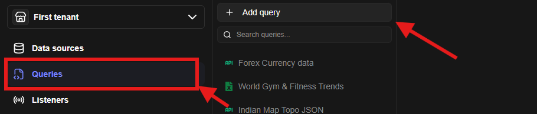
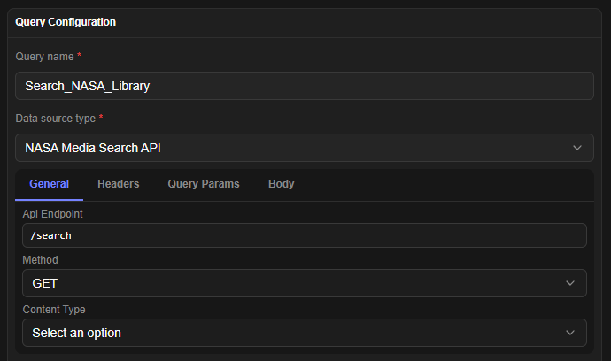
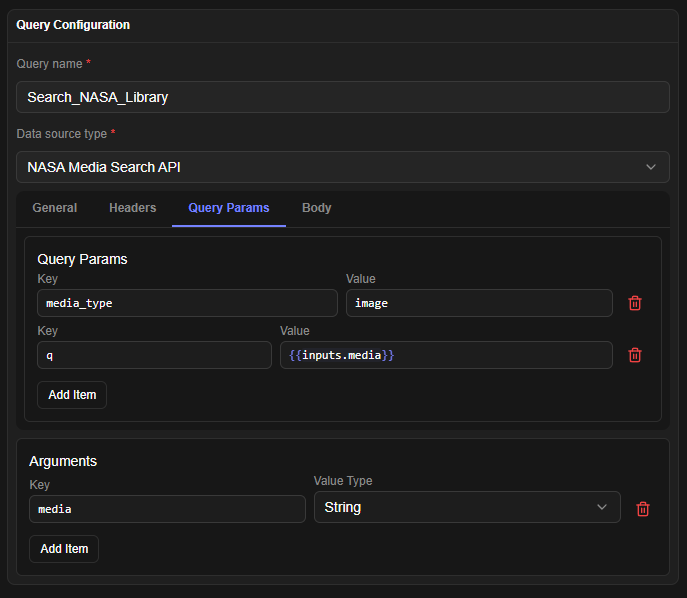

# Data Query

## Data Query Module Overview

The **Data Query Module** lets users write and run queries or supported commands on configured Data Sources. Data Queries perform CRUD operations on any supported data source.

:::note
Queries always run against a datasource in the same tenant (`datasourceID` FK). Execution from workflows, app pages, and listeners reuses the caller's identity plus an origin reference for delegated authorization — see [Identity & Access Management](../identity-access-management/identity-access-management.md).
:::

## Create a Data Query

1. Click on the Queries Tab
2. Click on Add query button in the right hand side drawer list

1. A query configuration form will appear
2. Select your configured data source
3. Dynamic fields will appear in the form which are supported by the data source
4. Once all the details are filled, you can click on test to test your query

## Query Variable Usage

- Queries support moustache format based variable usage.
- Add all the variables which you want in the Args section.
  - Use the `{{inputs.variable}}` format to reference that variable anywhere in the query config (excluding title and description).

## Endpoints

Mounted at `/api/v1/tenants/:tenantID/queries`:

| Method | Path | Permission | Notes |
|---|---|---|---|
| GET | `/schemas` | `dataquery.list` | per-datasource config JSON schemas for the query form |
| GET | `/` | `dataquery.list` | list (supports `?folderID=`) |
| POST | `/` | `dataquery.create` | create; grants creator access |
| GET | `/:dataQueryID/export` | `dataquery.read` | export single query as bundle item |
| POST | `/:dataQueryID/clone` | `dataquery.create` | deep copy with fresh ID |
| PATCH | `/queryTest` | `dataquery.execute` | ad-hoc test without saving |
| GET \| PATCH \| DELETE | `/:dataQueryID` | `dataquery.read/update/delete` | CRUD on one query |
| POST | `/:dataQueryID/queryTest` | `dataquery.execute` | test saved query |
| POST | `/:dataQueryID/run` | `dataquery.execute` | execute with `Args` variables |

## Execution notes

- `POST /run` and `/queryTest` resolve `{{inputs.*}}` server-side before dispatching to the connector in `@jet-admin/datasources-logic`. Secrets are resolved from vault/`datasourceOptions` and redacted in responses via `utils/sensitive.js`.
- Workflows call queries through the `dataQuery` node (`nodeConfig.dataQueryID`); app pages through `TRIGGER_QUERY` widget actions. Both pass the original caller identity + origin for delegated authorization.