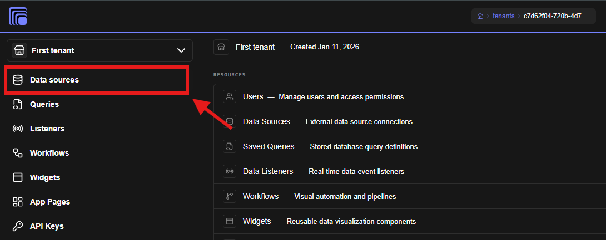
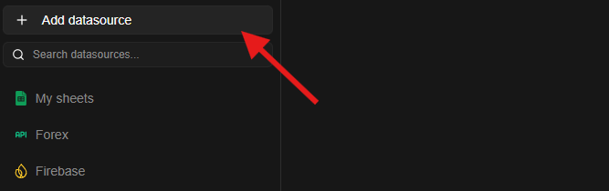
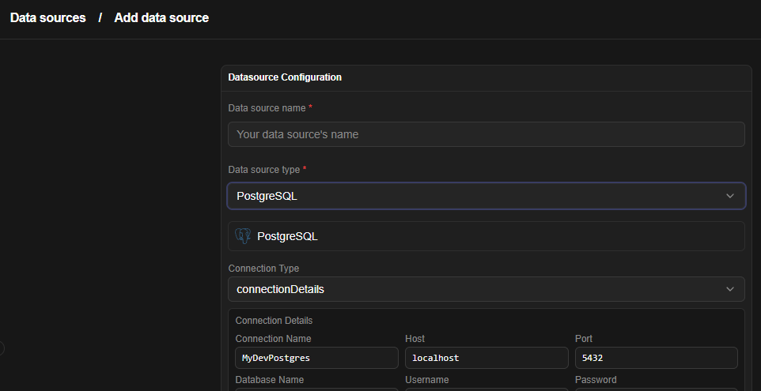

# Data Source

The **Data Source Module** stores, validates, and manages connections for your connectors such as PostgreSQL, MySQL, REST APIs, Firebase, Google Sheets, Excel, and more.

This is where integration with various data sources begins. Configure a data source to perform data queries or set up data listeners.

Create a data source

1. Navigate to the Data sources tab
2. Click Add data source
3. Enter your data source name
4. Select the data source type from the dropdown
5. A configuration wizard will appear below the selection with fields to set up the data source.
6. Fill in the details and click save

Jet Admin supports various data sources listed below:

- Airtable
- BigQuery
- CockroachDB
- Elasticsearch
- Excel / CSV
- Firestore
- Google Analytics
- Google Sheets
- GraphQL
- Jira
- Kafka
- MongoDB
- MQTT
- Microsoft SQL Server (MSSQL)
- MySQL
- NATS
- Neo4j
- Notion
- Oracle Database
- PostgreSQL
- RabbitMQ
- Redis
- REST API
- Amazon S3
- SendGrid
- Slack
- SQLite
- Server-Sent Events (SSE)
- Stripe
- Supabase
- Syslog
- Twilio
- Webhook
- WebSocket
- Web URL (Web Scraping / URL Data Source)