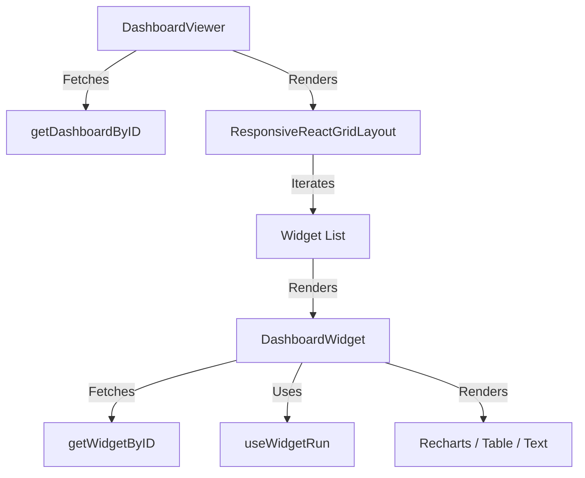

# Dashboard UI

The Dashboard frontend (`apps/frontend/src/presentation/components/dashboardComponents`) uses **React Grid Layout** to provide a draggable, resizable canvas.

## Component Hierarchy



## `DashboardWidget` Wrapper

The `DashboardWidget` component is a smart wrapper that handles the data fetching strategy.

1.  **Initial Load:** Fetches `getWidgetDataByIDAPI`.
    -   If mode is **SQL**, returns data immediately.
    -   If mode is **Workflow**, returns an `instanceID`.
2.  **Live Connection:**
    -   Passes `instanceID` to `useWidgetRun`.
    -   Establishes WebSocket connection.
    -   Listens for `widget_context_update`.

## Layout Configuration

The dashboard layout is stored in the `dashboardConfig` JSON field.

```json
{
  "layouts": {
    "lg": [
      { "i": "widget-1", "x": 0, "y": 0, "w": 4, "h": 2 },
      { "i": "widget-2", "x": 4, "y": 0, "w": 4, "h": 2 }
    ]
  },
  "widgets": ["widget-1", "widget-2"]
}
```
