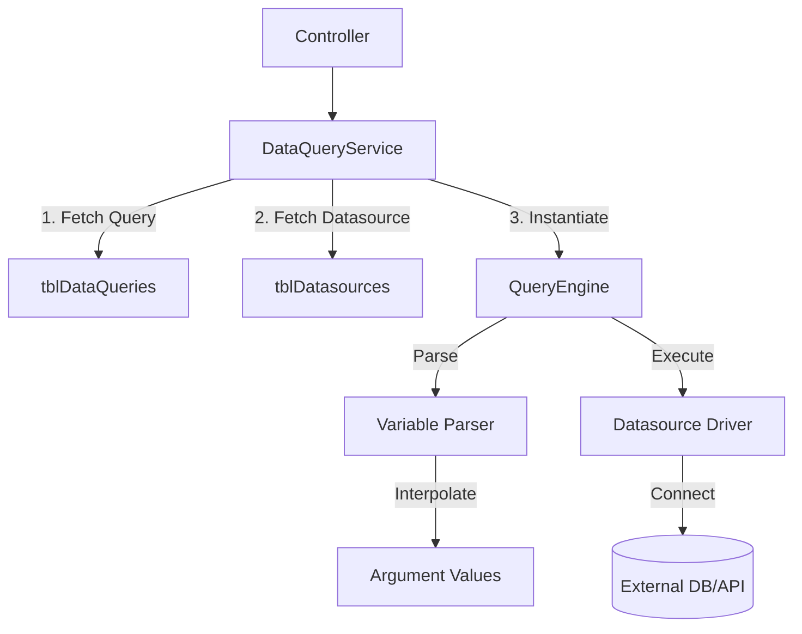

# DataQuery Module

The **DataQuery Module** (`apps/backend/modules/dataQuery`) allows users to write and execute queries (SQL, HTTP) against registered Datasources.

## Architecture

The core of execution is the `QueryEngine`.



## Variable Interpolation

Queries support dynamic arguments using `{{variable}}` syntax.

1.  **Frontend** sends `argValues` (e.g., `{ "limit": 10 }`).
2.  **Parser** scans the query string for mapped arguments.
3.  **Engine** performs parameter substitution (using proper prepared statements for SQL to prevent Injection).

## AI Generation

The module includes an AI integration (`generateAIPromptBasedQuery`) that:
1.  Retrieves database schema.
2.  Sends schema + user prompt to LLM (Gemini).
3.  Returns a generated SQL query.

## Query Engine (`queryEngine/engine.js`)

A framework-agnostic runner that:
1.  Accepts a `queryID` and `executionParams`.
2.  Loads the correct driver based on `datasourceType`.
3.  Standardizes the output format.

### Supported Drivers
- **PostgreSQL:** Uses `pg` pool.
- **REST API:** Uses `axios` (implied).
- **RunJS:** Executes sandboxed JavaScript.

## Service API

### `runDataQueryByID`

Executes a saved query.

```javascript
await dataQueryService.runDataQueryByID({
  userID: 1,
  tenantID: 1,
  dataQueryID: 100,
  argValues: { "id": 5 }
});
```

### `runDataQueryByData`

Executes an ad-hoc ("dirty") query. Used during the editing/testing phase before saving.

**Warning:** This creates a temporary `queryID` internally to satisfy the engine interface.
