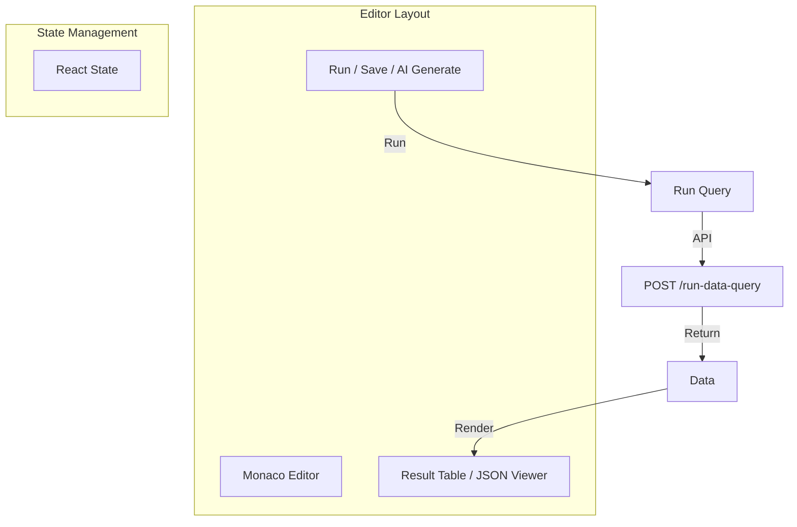

# DataQuery UI

The **DataQuery Editor** (`apps/frontend/src/presentation/components/dataQueryComponents/dataQueryEditor.jsx`) is a sophisticated IDE-like environment for writing and testing queries.

## Component Architecture

## Features

### AI Generation
The `DataQueryAIGeneratePrompt` component allows users to describe their intent in natural language.
- **Input:** "Show me top 5 users by revenue"
- **Process:** Frontend sends prompt -> Backend AI Service -> Returns SQL.
- **Output:** SQL determines populated into the Monaco Editor.

### Argument Binding
The editor provides a UI to input **Test Values** for dynamic arguments (e.g. `{{id}}`).
- The `DataQueryArgsForm` dynamically renders input fields for every variable detected in the query string.

### Result Visualization
- **Table View:** Default for SQL queries. Uses `ag-grid` or parsed HTML table.
- **JSON View:** Default for API responses. Uses `react-json-view`.
