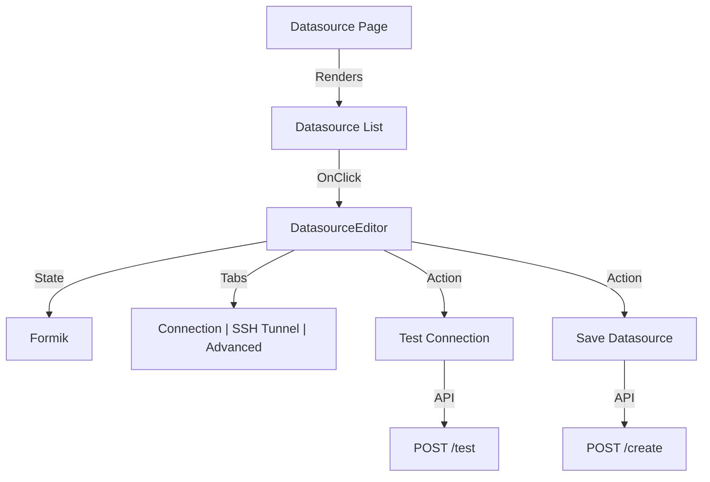

# Datasource UI

The Datasource UI (`apps/frontend/src/presentation/components/datasourceComponents`) provides interfaces for adding, editing, and listing data sources.

## Data Models

The UI handles diverse datasource types (PostgreSQL, REST API, etc.) using a polymorphic form structure.

## Key Components

### `DatasourceEditor`
A shared wrapper that renders the specific form fields based on `datasourceType`.
- Uses `useDatasource` hook for data fetching.
- Manage `isLoading` states for Test/Save actions.

### `DatasourceTestingForm`
A sub-component specifically for the "Test Connection" button logic. It displays success/error toasts based on the backend response.
