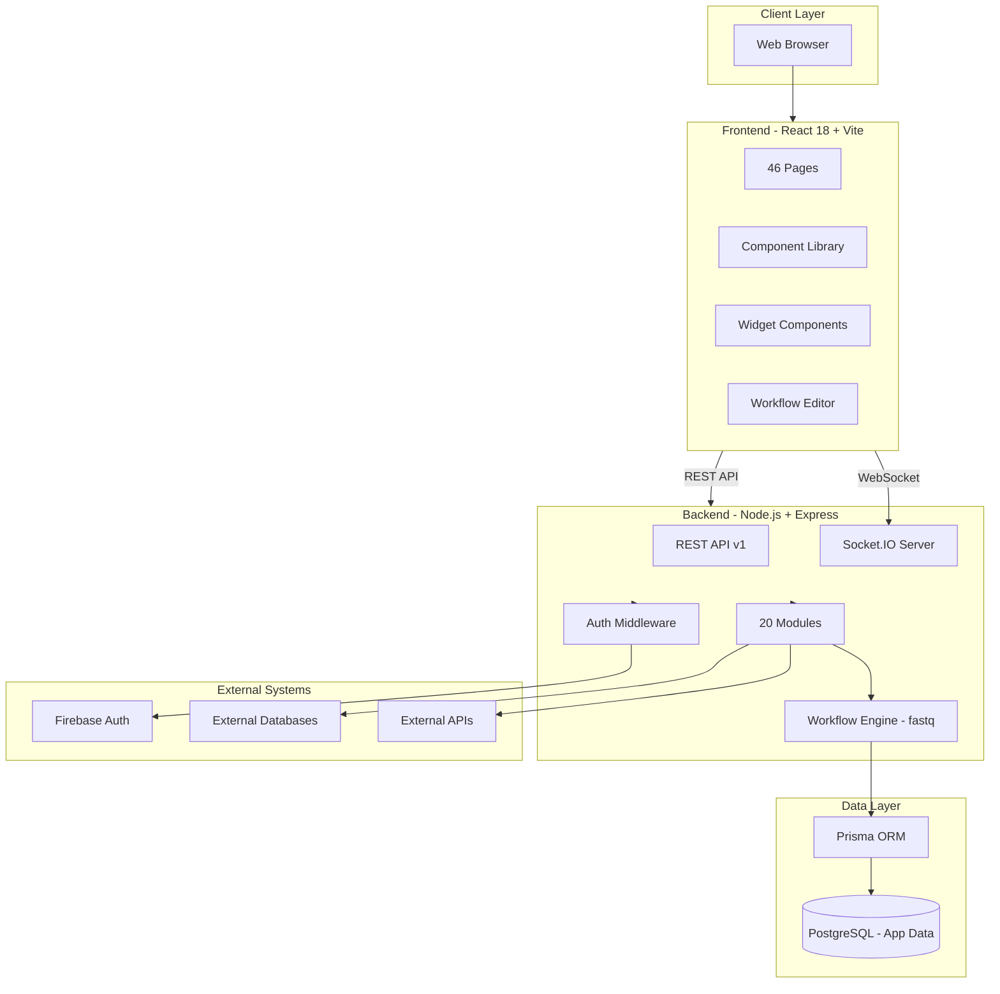

# Jet Admin Platform Overview


<div align="center">


### 🚀 Full-Stack Internal Tools Platform

**Multi-Tenant · Workflow Automation · Data Management · Real-time Dashboards**

</div>

---

## 📋 Table of Contents

- [What is Jet Admin?](#what-is-jet-admin)
- [Core Modules](#core-modules)
- [Architecture Overview](#architecture-overview)
- [Key Features](#key-features)
- [Technology Stack](#technology-stack)
- [Getting Started](#getting-started)

---

## What is Jet Admin?

**Jet Admin** is a comprehensive **multi-tenant internal tools platform** built with Node.js, Express, React, and PostgreSQL. It provides a complete suite of tools for:

- 🔌 **Data Source Management** - Connect and manage external databases and APIs
- 📝 **Data Queries** - Build, test, and execute parameterized queries
- 🔄 **Workflow Automation** - Visual DAG-based workflow builder with in-memory execution
- 📊 **Widgets & Dashboards** - Create interactive data visualizations
- 👥 **Multi-Tenancy** - Complete tenant isolation with RBAC
- 🔑 **API Keys** - Machine-to-machine authentication
- ⏰ **Cron Jobs** - Scheduled query execution
- 📢 **Database Notifications** - Real-time PostgreSQL notifications
- 🔔 **Database Triggers** - React to database events
- 📋 **Database Tables** - Manage database schemas and tables
- 🤖 **AI Assistant** - AI-powered query generation help

---

## Core Modules

Jet Admin consists of **20 backend modules** and corresponding frontend components:

### Backend Modules

| Module | Purpose | Key Features |
|--------|---------|--------------|
| **auth** | Authentication | Firebase token verification, user sessions |
| **tenant** | Multi-tenancy | Tenant CRUD, database configuration |
| **userManagement** | User management | User invites, role assignments, tenant users |
| **tenantRole** | Role management | Custom roles, permissions, RBAC |
| **apiKey** | API authentication | API key generation, role mappings |
| **datasource** | Data connections | PostgreSQL, REST API, and more |
| **dataQuery** | Query execution | Parameterized queries, testing, caching |
| **workflow** | Automation | Visual builder, in-memory queue (fastq), DAG execution |
| **widget** | Visualizations | Charts, tables, text, custom components |
| **dashboard** | Dashboards | Grid layouts, widget management |
| **cronJob** | Scheduling | Scheduled queries, execution history |
| **database** | Database management | Schema operations, metadata |
| **databaseTable** | Table management | CRUD operations, table metadata |
| **databaseTrigger** | Triggers | PostgreSQL trigger management |
| **databaseNotification** | Notifications | LISTEN/NOTIFY support |
| **audit** | Audit logging | Action tracking, compliance |
| **notification** | Notifications | In-app notifications |
| **ai** | AI assistance | Query generation, help |
| **monitor** | Monitoring | System health, metrics |
| **system** | System config | Platform settings |

### Frontend Pages (46 Pages)

**Management Pages:**
- Tenant Management
- User Management  
- Role Management
- API Key Management
- Audit Logs

**Data Pages:**
- Datasource Management (List, Create, Update)
- Data Query Management (List, Create, Update, Execute)
- Database Tables (List, View, Update)
- Database Schema Management
- Database Triggers
- Database Notifications

**Automation Pages:**
- Workflow Management (List, Create, Update, Execute)
- Cron Job Management (List, Create, Update, History)

**Visualization Pages:**
- Dashboard Management (List, Create, Update)
- Widget Management (List, Create, Update, Configure)

**Account Pages:**
- Sign In / Sign Up
- Account Settings
- Tenant Settings

---

## Architecture Overview

### High-Level Architecture



### Key Architectural Decisions

**1. In-Memory Workflow Queue (fastq)**
- No external message broker required
- Process-local task execution
- Simpler deployment and maintenance
- Workflow state persisted to PostgreSQL

**2. Multi-Tenancy**
- Tenant-scoped resources
- Complete data isolation
- RBAC per tenant
- API key authentication

**3. Real-Time Communication**
- Socket.IO for live updates
- Workflow execution monitoring
- Widget data refresh
- Database notifications (PostgreSQL LISTEN/NOTIFY)

---

## Key Features

### 1. Multi-Tenancy & Access Control

**Tenant Management:**
- Create and manage tenants
- Tenant-specific database configuration
- Tenant isolation at application level
- Custom tenant database URLs

**User Management:**
- Firebase Authentication integration
- Multi-tenant user membership
- Role-based access control (RBAC)
- User invite system

**API Keys:**
- Generate API keys for automation
- Role-based API key permissions
- API key audit logging
- Disable/enable keys

### 2. Data Source Management

**Supported Datasources:**
- PostgreSQL (primary)
- REST APIs
- Extensible connector architecture

**Features:**
- Connection testing
- Encrypted credentials
- Datasource tagging
- Clone datasources
- Datasource permissions

### 3. Data Queries

**Query Capabilities:**
- Native SQL queries
- Parameterized queries with variables
- Query result caching
- Test queries before saving
- Query execution history

**Query Options:**
- Run on load configuration
- Custom timeout settings
- Result schema validation
- Query sharing across tenants

### 4. Workflow Automation

**Workflow Engine:**
- Visual DAG-based editor (React Flow)
- In-memory queue execution (fastq)
- Real-time execution monitoring
- Test mode for unsaved workflows

**Node Types:**
- Start Node (input arguments)
- Data Query Node (execute queries)
- JavaScript Node (custom code)
- Condition Node (branching logic)
- Loop Node (iteration)
- Delay Node (timeouts)
- End Node (output mapping)

**Features:**
- Workflow instances tracking
- Node execution logs
- Retry logic with backoff
- Socket.IO real-time updates
- Workflow versions

### 5. Widgets & Dashboards

**Widget Types:**
- Chart widgets (Bar, Line, Pie, etc.)
- Table widgets
- Text widgets
- Custom widgets

**Widget Configuration:**
- Data source binding (queries or workflows)
- Parameter mapping
- Field mapping for charts
- Custom styling options
- Auto-refresh intervals

**Dashboard Features:**
- Drag-and-drop grid layout
- Multiple dashboards per tenant
- Dashboard templates
- Widget positioning
- Dashboard sharing

### 6. Cron Jobs

**Scheduling:**
- Cron expression support
- Query argument configuration
- Execution history tracking
- Manual trigger support
- Timeout configuration

**Features:**
- Retry attempts
- Retry delay
- Success/failure notifications
- Execution logs

### 7. Database Management

**Table Management:**
- List database tables
- View table metadata
- Update table configurations
- Table CRUD operations

**Schema Management:**
- Create schemas
- Schema listing
- Schema metadata

**Triggers:**
- Create database triggers
- Trigger function management
- Trigger execution monitoring

**Notifications:**
- PostgreSQL LISTEN/NOTIFY
- Real-time event handling
- Notification channels

### 8. Audit & Monitoring

**Audit Logs:**
- User action tracking
- API call logging
- Success/failure recording
- Metadata storage

**Monitoring:**
- System health checks
- Workflow execution metrics
- Query performance tracking
- Resource usage monitoring

---

## Technology Stack

### Frontend

| Technology | Purpose |
|------------|---------|
| **React 18** | UI framework |
| **Vite** | Build tool & dev server |
| **React Router** | Client-side routing |
| **React Query** | Server state management |
| **Context API** | Client state management |
| **Socket.IO Client** | Real-time communication |
| **Firebase SDK** | Authentication |
| **React Flow** | Workflow editor |
| **Chart.js** | Data visualization |
| **JSON Forms** | Dynamic forms |
| **Monaco Editor** | Code editing |
| **TailwindCSS** | Styling |
| **MUI** | Component library |

### Backend

| Technology | Purpose |
|------------|---------|
| **Node.js** | Runtime |
| **Express.js** | Web framework |
| **Prisma** | ORM |
| **PostgreSQL** | Database |
| **Firebase Admin** | Authentication |
| **Socket.IO** | WebSocket server |
| **fastq** | In-memory queue |
| **vm2** | Code sandboxing |
| **node-cron** | Job scheduling |
| **Winston** | Logging |

### Infrastructure

| Technology | Purpose |
|------------|---------|
| **Docker** | Containerization |
| **Docker Compose** | Orchestration |
| **Nginx** | Reverse proxy |
| **PostgreSQL** | Primary database |

---

## Getting Started

### Quick Start (5 minutes)

```bash
# Clone repository
git clone https://github.com/Jet-labs/jet-admin.git
cd jet-admin

# Configure environment
cp .env.docker.example .env.docker
# Edit .env.docker with your settings

# Start with Docker
docker-compose -f docker-compose.cloud.yml up -d
```

Access at: `http://localhost:3000`

### Local Development

```bash
# Install dependencies
npm install

# Setup backend
cd apps/backend
cp .env.example .env
npx prisma migrate dev
npm run dev

# Setup frontend (new terminal)
cd apps/frontend
npm run dev
```

### Prerequisites

- Node.js 18+
- PostgreSQL 14+
- Docker & Docker Compose (for deployment)
- Firebase project (for authentication)
- Git

---

## Documentation Structure

This documentation is organized into:

1. **Getting Started** - Setup and deployment guides
2. **Architecture** - System design and technical details
3. **Features** - Detailed feature documentation
4. **API Reference** - Complete API documentation
5. **Developer Guide** - Extending the platform
6. **Deployment** - Production deployment guides
7. **Troubleshooting** - Common issues and FAQ

---

<div align="center">

### Ready to Get Started?

[→ Docker Deployment](./setup/docker-deployment) · [→ Backend Setup](./setup/setup-backend) · [→ Frontend Setup](./setup/setup-frontend)

</div>
