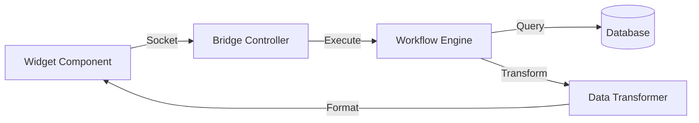

# Widget-Workflow Bridge

The **Widget-Workflow Bridge** is a core architectural pattern in Jet Admin that decouples visual components (widgets) from their data sources (workflows). This allows widgets to display complex, processed data without hardcoding SQL queries.

## Concept

Unlike traditional BI tools where a chart is directly tied to a SQL query, Jet Admin ties widgets to **Workflows**. A workflow can:
- Execute multiple queries
- Transform and aggregate data
- Apply conditional logic
- Call external APIs

The final output of the workflow is sent to the widget for display.



## How It Works

### 1. Widget Mounts

When a widget component mounts on a dashboard, it emits a `WIDGET_WORKFLOW_CONNECT` event via Socket.IO:

```javascript
socket.emit('widget_workflow_connect', {
  widgetID: 'widget-uuid',
  workflowID: 'linked-workflow-uuid',
  inputParams: { dateRange: '7d' },
  tenantID: 'tenant-uuid'
});
```

### 2. Backend Processing

The `WidgetSocketController` receives the event and:

1. Looks up the widget configuration in `tblWidgets`
2. Identifies the linked workflow
3. Triggers workflow execution with the provided `inputParams`

```javascript
// Backend: widget.socket.controller.js
async onWidgetWorkflowConnect({ socket, widgetID, workflowID, inputParams }) {
  const runResult = await workflowService.runWorkflow({
    workflowID,
    inputs: inputParams,
    mode: 'execute'
  });
  
  // Process data for widget format
  const processedData = widgetProcessor.transform(runResult, widgetConfig);
  
  socket.emit('widget_context_update', { widgetID, data: processedData });
}
```

### 3. Workflow Execution

The workflow runs through its nodes:

1. **Start Node**: Receives `inputParams` as initial context
2. **Query Nodes**: Execute SQL/API calls
3. **Script Nodes**: Transform data with JavaScript
4. **Response Node**: Returns the final payload

:::tip
The workflow MUST end with a **Response Node** to return data to the widget.
:::

### 4. Data Transformation

The `widgets-logic` package contains processors that transform raw workflow output into widget-specific formats:

```javascript
// Example: Transform for Line Chart
function transformForLineChart(data, config) {
  return {
    labels: data.map(row => row[config.xAxis]),
    datasets: [{
      label: config.datasetLabel,
      data: data.map(row => row[config.yAxis])
    }]
  };
}
```

### 5. Widget Updates

The frontend widget receives the `widget_context_update` event and renders the data:

```jsx
function ChartWidget({ widgetID }) {
  const [chartData, setChartData] = useState(null);
  
  useEffect(() => {
    socket.on('widget_context_update', (data) => {
      if (data.widgetID === widgetID) {
        setChartData(data.data);
      }
    });
  }, []);
  
  return <LineChart data={chartData} />;
}
```

## Benefits

| Aspect | Traditional Approach | Widget-Workflow Bridge |
|:-------|:---------------------|:-----------------------|
| **Data Source** | Single SQL query | Multiple queries, APIs, transformations |
| **Reusability** | Query per widget | Workflow reusable across widgets |
| **Flexibility** | Static data shape | Dynamic transformations |
| **Real-time** | Polling required | Socket-based updates |

## Configuration

Widgets are configured in the UI with:

- **Linked Workflow**: The workflow that provides data
- **Input Parameters**: Values passed to the workflow (can be dynamic)
- **Data Mapping**: How workflow output maps to widget properties (X-axis, Y-axis, labels)
- **Refresh Settings**: Auto-refresh interval or manual-only
