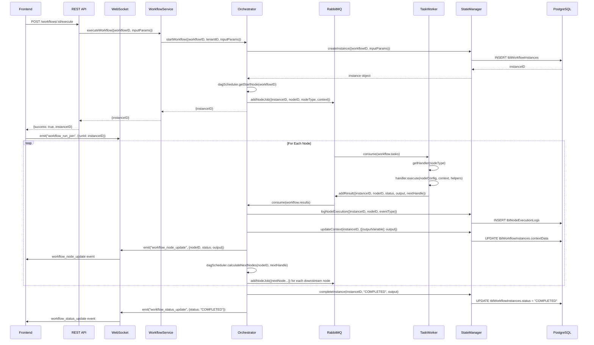

# Workflow Module - Technical Blueprint


> **Generated:** 2026-01-18 | **Version:** 1.0  
> **Status:** Comprehensive System Documentation

---

## Table of Contents

1. [High-Level Architecture](#1-high-level-architecture)
2. [Data Flow & State Management](#2-data-flow--state-management)
3. [Module & Dependency Matrix](#3-module--dependency-matrix)
4. [Function-to-Function Detailed Map](#4-function-to-function-detailed-map)
5. [Database Schema](#5-database-schema)
6. [Execution Engine Deep Dive](#6-execution-engine-deep-dive)
7. [Frontend Components](#7-frontend-components)

---

## 1. High-Level Architecture

### 1.1 Pattern Identification

The Workflow Module implements an **Event-Driven, DAG-Based Workflow Orchestration** pattern with the following characteristics:

- **Directed Acyclic Graph (DAG) Scheduling**: Workflow execution follows a graph-based model where nodes represent tasks and edges define execution order
- **Message Queue Architecture**: Uses RabbitMQ for decoupled, asynchronous task processing
- **Check-Decide-Act Cycle**: Orchestrator implements a continuous loop pattern for workflow progression
- **Optimistic Concurrency**: State manager uses version-based locking for concurrent access control

### 1.2 Service Map

```
┌─────────────────────────────────────────────────────────────────────────────┐
│                              FRONTEND (React + Vite)                        │
│  ┌───────────────────┐  ┌─────────────────┐  ┌──────────────────────────┐  │
│  │  WorkflowEditor   │  │  WorkflowContext│  │   workflow.js (API)      │  │
│  │  (ReactFlow)      │◄─┤  (React Context)│◄─┤   - REST + WebSocket     │  │
│  └────────┬──────────┘  └────────▲────────┘  └──────────┬───────────────┘  │
│           │                       │                      │                  │
└───────────┼───────────────────────┼──────────────────────┼──────────────────┘
            │                       │                      │
            │                       │ Socket.IO            │ REST API
            ▼                       │                      ▼
┌───────────────────────────────────┼─────────────────────────────────────────┐
│                            BACKEND (Node.js + Express)                      │
│  ┌─────────────────────────────────────────────────────────────────────┐   │
│  │                        workflow.v1.routes.js                         │   │
│  │   GET /            - List workflows                                  │   │
│  │   POST /           - Create workflow                                 │   │
│  │   GET /:id         - Get workflow by ID                              │   │
│  │   PATCH /:id       - Update workflow                                 │   │
│  │   DELETE /:id      - Delete workflow                                 │   │
│  │   POST /:id/execute - Execute workflow                               │   │
│  │   POST /test       - Test run (in-memory)                            │   │
│  │   GET /instances/:instanceID - Get run status                        │   │
│  └─────────────────────────────────────────────────────────────────────┘   │
│                                    │                                        │
│                                    ▼                                        │
│  ┌─────────────────────┐    ┌─────────────────────────────────────────┐    │
│  │  workflow.controller │───►│          workflow.service.js           │    │
│  │  (Request Handler)   │    │   - getAllWorkflows()                   │    │
│  └─────────────────────┘    │   - createWorkflow()                     │    │
│                              │   - updateWorkflow()                     │    │
│                              │   - executeWorkflow()  ──────────────┐  │    │
│                              │   - testWorkflow()                   │  │    │
│                              └──────────────────────────────────────┼──┘    │
│                                                                     │       │
│  ┌──────────────────────────────────────────────────────────────────▼──┐   │
│  │                          ORCHESTRATOR                               │   │
│  │  ┌─────────────────┐  ┌─────────────────┐  ┌────────────────────┐  │   │
│  │  │  orchestrator.js │  │  stateManager.js│  │  dagScheduler.js   │  │   │
│  │  │  (Check-Decide- │  │  (DB State Ops) │  │  (Graph Traversal) │  │   │
│  │  │   Act Cycle)    │  │  - createInstance│  │  - getStartNode    │  │   │
│  │  │                  │  │  - updateContext│  │  - calculateNext   │  │   │
│  │  │  handleTaskResult│  │  - completeInst │  │  - isTerminalNode  │  │   │
│  │  │  startResultsCons│  │  - logNodeExec  │  │                    │  │   │
│  │  │  startWorkflow   │  └────────┬────────┘  └────────────────────┘  │   │
│  │  └────────┬─────────┘           │                                    │   │
│  │           │                     │                                    │   │
│  └───────────┼─────────────────────┼────────────────────────────────────┘   │
│              │                     │                                        │
│              ▼                     ▼                                        │
│  ┌─────────────────────────────────────────────────────────────────────┐   │
│  │                          RabbitMQ                                    │   │
│  │  ┌─────────────────┐  ┌─────────────────┐  ┌────────────────────┐   │   │
│  │  │ workflow.tasks  │◄─┤ workflow.results│◄─┤ workflow.tasks.dlq │   │   │
│  │  │ (Task Queue)    │  │ (Results Queue) │  │ (Dead Letter Q)    │   │   │
│  │  └────────┬────────┘  └────────▲────────┘  └────────────────────┘   │   │
│  └───────────┼────────────────────┼────────────────────────────────────┘   │
│              │                    │                                        │
│              ▼                    │                                        │
│  ┌───────────────────────────────────────────────────────────────────────┐ │
│  │                           TASK WORKER                                  │ │
│  │  ┌─────────────────┐  ┌─────────────────────────────────────────────┐ │ │
│  │  │  taskWorker.js  │  │              Node Handlers                   │ │ │
│  │  │  - consume msgs │  │  ┌───────────┐ ┌───────────┐ ┌───────────┐  │ │ │
│  │  │  - route to     │─►│  │  start    │ │ dataQuery │ │javascript │  │ │ │
│  │  │    handlers     │  │  └───────────┘ └───────────┘ └───────────┘  │ │ │
│  │  │  - publish      │  │  ┌───────────┐ ┌───────────┐ ┌───────────┐  │ │ │
│  │  │    results      │──┼──┤ condition │ │   loop    │ │   delay   │  │ │ │
│  │  │                 │  │  └───────────┘ └───────────┘ └───────────┘  │ │ │
│  │  │  resolveTemplate│  │  ┌───────────┐                              │ │ │
│  │  │  helper inject  │  │  │    end    │ (Terminal Node)              │ │ │
│  │  │    + widgets    │  │  └───────────┘                              │ │ │
│  │  └─────────────────┘  └─────────────────────────────────────────────┘ │ │
│  └───────────────────────────────────────────────────────────────────────┘ │
│                                    │                                        │
│                                    ▼                                        │
│  ┌───────────────────────────────────────────────────────────────────────┐ │
│  │                          PostgreSQL (Prisma)                          │ │
│  │   tblWorkflows │ tblWorkflowNodes │ tblWorkflowEdge                   │ │
│  │   tblWorkflowInstances │ tblNodeExecutionLogs                         │ │
│  └───────────────────────────────────────────────────────────────────────┘ │
└─────────────────────────────────────────────────────────────────────────────┘
```

### 1.3 Communication Protocols

| Source | Target | Protocol | Purpose |
|--------|--------|----------|---------|
| Frontend | Backend | REST (HTTP) | CRUD operations, workflow execution |
| Frontend | Backend | WebSocket (Socket.IO) | Real-time execution updates |
| Orchestrator | Workers | RabbitMQ | Task dispatch and result collection |
| Backend | Database | Prisma (PostgreSQL) | Persistent storage |

---

## 2. Data Flow & State Management

### 2.1 State Store

**Backend State:**
- **PostgreSQL** via Prisma ORM for persistent workflow definitions and execution history
- **RabbitMQ** for transient task queue state
- **In-memory context** (`contextData`) passed through execution chain

**Frontend State:**
- **React Query** for server state management (workflows list, data queries)
- **Formik** for workflow editor form state
- **Local component state** for UI concerns (selected node, console logs, etc.)

### 2.2 Data Lifecycle - Workflow Execution



### 2.3 Context Object Structure

The `context` object flows through the entire execution and accumulates data:

```typescript
interface WorkflowContext {
  // Input parameters (set at workflow start)
  input: {
    [paramName: string]: any;
  };
  
  // Node outputs (added by outputVariable name)
  [outputVariable: string]: any;  // e.g., "queryResult", "scriptResult"
  
  // Internal tracking (prefixed with __)
  __workflowDefinition?: {
    nodes: { [nodeID: string]: NodeDefinition };
    edges: EdgeDefinition[];
  };
  __isTestRun?: boolean;
  __node_[nodeID]: {
    output: any;
    status: string;
    outputVariable: string;
  };
}
```

### 2.4 Variable Resolution

Workflow runtime now injects a single shared resolver into handlers:

1. **`resolveTemplate(template, ctx, options)`**: Generic template resolution for strings, arrays, and objects
   - **Single variable** `"{{ctx.input.id}}"` → Preserves original type
   - **String interpolation** `"prefix_{{ctx.input.id}}_suffix"` → Returns string
   - **Nested objects/arrays** are resolved recursively
   - **Literal** `"hardcoded"` → Returns as-is
   - **Raw paths** like `"ctx.input.id"` are not resolved for workflow template fields; use `{{ctx...}}`

---

## 3. Module & Dependency Matrix

### 3.1 Backend Modules

| Module | Location | Responsibility | Dependencies |
|--------|----------|----------------|--------------|
| **workflow.controller** | `modules/workflow/workflow.controller.js` | HTTP request handling, validation | workflow.service, express.utils |
| **workflow.service** | `modules/workflow/workflow.service.js` | Business logic, DB operations | prisma, orchestrator |
| **workflow.v1.routes** | `modules/workflow/workflow.v1.routes.js` | Route definitions | controller, auth.middleware, validator |
| **orchestrator** | `modules/workflow/orchestrator/orchestrator.js` | Check-Decide-Act cycle, task dispatch | stateManager, dagScheduler, rabbitmq.config |
| **stateManager** | `modules/workflow/orchestrator/stateManager.js` | Instance state CRUD operations | prisma |
| **dagScheduler** | `modules/workflow/orchestrator/dagScheduler.js` | Graph traversal, next node calculation | prisma |
| **taskWorker** | `modules/workflow/workers/taskWorker.js` | Task queue consumer, handler dispatch | rabbitmq.config, handlers |
| **workerSDK** | `modules/workflow/workers/workerSDK.js` | Widget binding compatibility barrel | rabbitmq.config |
| **handlers/** | `modules/workflow/workers/handlers/` | Node-type-specific execution logic | isolated-vm, QueryEngine |
| **rabbitmq.config** | `config/rabbitmq.config.js` | Message queue connection & operations | amqplib |

### 3.2 Frontend Modules

| Module | Location | Responsibility | Dependencies |
|--------|----------|----------------|--------------|
| **WorkflowEditor** | `components/workflowComponents/workflowEditor.jsx` | Visual DAG editor, test runner | ReactFlow, workflow.js, socket.io-client |
| **workflowContext** | `contexts/workflowContext.jsx` | React Query state provider | @tanstack/react-query, workflow.js |
| **workflow.js (API)** | `data/apis/workflow.js` | REST API client functions | axios, firebase |
| **Workflow model** | `data/models/workflow.js` | Data transformation | - |

### 3.3 Shared Packages

| Package | Location | Responsibility | Exports |
|---------|----------|----------------|---------|
| **@jet-admin/workflow-nodes** | `packages/workflow-nodes/` | Visual node components & schemas | WORKFLOW_NODES_MAP, node components, WorkflowNodesProvider |
| **@jet-admin/workflow-edges** | `packages/workflow-edges/` | Edge components | WORKFLOW_EDGES_MAP, WorkflowEdgeContext |

---

## 4. Function-to-Function Detailed Map

### 4.1 `orchestrator.js` - Core Orchestration

```javascript
// File: apps/backend/modules/workflow/orchestrator/orchestrator.js

┌─────────────────────────────────────────────────────────────────────────────┐
│ handleTaskResult(result)                                                    │
├─────────────────────────────────────────────────────────────────────────────┤
│ Input: { instanceID, nodeID, nodeType, outputVariable, status, output,      │
│          nextHandle, queueDelay, error }                                    │
│                                                                             │
│ Calls:                                                                      │
│   ├─► stateManager.getInstance(instanceID)                                  │
│   ├─► stateManager.logNodeExecution({...})                                  │
│   ├─► stateManager.updateContext(instanceID, contextUpdate, version)        │
│   ├─► socketIO.to(instanceID).emit("workflow_node_update", {...})           │
│   │                                                                          │
│   │ [If terminal node:]                                                     │
│   ├─► stateManager.completeInstance(instanceID, status, output)             │
│   ├─► socketIO.emit("workflow_status_update", {...})                        │
│   │                                                                          │
│   │ [If not terminal:]                                                      │
│   ├─► dagScheduler.calculateNextNodes(workflowID, nodeID, nextHandle)       │
│   └─► addNodeJob({...}) for each next node                                  │
│                                                                             │
│ State Change: Updates contextData in tblWorkflowInstances                   │
│ Error Handling: Logs error, marks instance as FAILED                        │
└─────────────────────────────────────────────────────────────────────────────┘

┌─────────────────────────────────────────────────────────────────────────────┐
│ startWorkflow({ workflowID, tenantID, inputParams })                        │
├─────────────────────────────────────────────────────────────────────────────┤
│ Returns: { instanceID }                                                     │
│                                                                             │
│ Calls:                                                                      │
│   ├─► stateManager.createInstance({workflowID, tenantID, inputParams})      │
│   ├─► dagScheduler.getStartNode(workflowID)                                 │
│   └─► addNodeJob({instanceID, nodeID, nodeType, nodeConfig, context})       │
│                                                                             │
│ State Change: Creates new tblWorkflowInstances record                       │
└─────────────────────────────────────────────────────────────────────────────┘

┌─────────────────────────────────────────────────────────────────────────────┐
│ startTestWorkflow({ nodes, edges, tenantID, inputParams })                  │
├─────────────────────────────────────────────────────────────────────────────┤
│ Returns: { instanceID, isTest: true }                                       │
│                                                                             │
│ Purpose: Runs workflow from in-memory definition (no DB save required)      │
│                                                                             │
│ Calls:                                                                      │
│   ├─► stateManager.createInstance({..., isTest: true})                      │
│   ├─► stateManager.updateContext() with __workflowDefinition, __isTestRun   │
│   └─► addNodeJob({..., isTestRun: true})                                    │
│                                                                             │
│ Key Behavior: Stores nodes/edges in contextData for test-mode lookups       │
└─────────────────────────────────────────────────────────────────────────────┘

┌─────────────────────────────────────────────────────────────────────────────┐
│ startResultsConsumer()                                                      │
├─────────────────────────────────────────────────────────────────────────────┤
│ Purpose: Consumes from workflow.results queue indefinitely                  │
│                                                                             │
│ Calls:                                                                      │
│   ├─► getChannel()                                                          │
│   ├─► channel.consume(QUEUE_NAMES.RESULTS, callback)                        │
│   └─► handleTaskResult(result) for each message                             │
│                                                                             │
│ Error Handling: nack without requeue on parse errors                        │
└─────────────────────────────────────────────────────────────────────────────┘
```

### 4.2 `taskWorker.js` - Task Processing

```javascript
// File: apps/backend/modules/workflow/workers/taskWorker.js

┌─────────────────────────────────────────────────────────────────────────────┐
│ startTaskWorker()                                                           │
├─────────────────────────────────────────────────────────────────────────────┤
│ Purpose: Main worker loop - consumes from workflow.tasks queue              │
│                                                                             │
│ Process Flow:                                                               │
│   1. Parse message from queue                                               │
│   2. Extract { instanceID, nodeID, nodeType, nodeConfig, context }          │
│   3. getHandler(nodeType) → handler                                         │
│   4. handler.execute(nodeConfig, context, helpers)                          │
│   5. addResult({instanceID, nodeID, status, output, nextHandle, queueDelay})│
│   6. channel.ack(msg)                                                       │
│                                                                             │
│ Helpers Object Passed to Handlers:                                          │
│   {                                                                         │
│     instanceID, nodeID, workflowID,                                         │
│     resolveTemplate: (template, meta) =>                                    │
│       resolveTemplate(template, context, WORKFLOW_TEMPLATE_OPTIONS, meta)   │
│   }                                                                         │
│                                                                             │
│ Retry Logic:                                                                │
│   - Exponential backoff: 2^attempts * 1000ms                                │
│   - Creates delayed queue with TTL and dead-letter routing                  │
│   - Max attempts: 3 (configurable per job)                                  │
│                                                                             │
│ Error Handling:                                                             │
│   - On max retries exceeded: sends error result, nack without requeue       │
└─────────────────────────────────────────────────────────────────────────────┘
```

### 4.3 Node Handlers - Execution Logic

```javascript
// File: apps/backend/modules/workflow/workers/handlers/

┌─────────────────────────────────────────────────────────────────────────────┐
│ startHandler.execute(nodeConfig, context, helpers)                          │
├─────────────────────────────────────────────────────────────────────────────┤
│ Output: { output: { started: true, inputReceived: context.input },          │
│           nextHandle: 'output' }                                            │
│                                                                             │
│ Purpose: Entry point, passes input through to downstream nodes              │
└─────────────────────────────────────────────────────────────────────────────┘

┌─────────────────────────────────────────────────────────────────────────────┐
│ dataQueryHandler.execute(nodeConfig, context, helpers)                      │
├─────────────────────────────────────────────────────────────────────────────┤
│ Config: { dataQueryID, args, outputVariable, errorHandling }                │
│                                                                             │
│ Calls:                                                                      │
│   ├─► resolveTemplate(args)                                                 │
│   ├─► QueryEngine.executeQuery(dataQueryID, resolvedArgs)                   │
│   │     └─► Fetches query from DB, executes against datasource              │
│                                                                             │
│ Output: { output: { [outputVariable]: result, success: true },              │
│           nextHandle: 'success' | 'error' }                                 │
│                                                                             │
│ Error Handling: FAIL_WORKFLOW throws, CONTINUE returns error output         │
└─────────────────────────────────────────────────────────────────────────────┘

┌─────────────────────────────────────────────────────────────────────────────┐
│ javascriptHandler.execute(nodeConfig, context, helpers)                     │
├─────────────────────────────────────────────────────────────────────────────┤
│ Config: { code, outputVariable, timeoutSeconds, errorHandling }             │
│                                                                             │
│ Calls:                                                                      │
│   └─► runInSandbox(wrappedCode) with sandbox { ctx: context, console, ... } │
│                                                                             │
│ Sandbox Globals: JSON, Math, Date, Array, Object, String, Number, Boolean,  │
│                  parseInt, parseFloat, isNaN, isFinite                      │
│                                                                             │
│ Security: No eval, no wasm, timeout enforced                                │
│ Output: { output: { [outputVariable]: result, success: true } }             │
└─────────────────────────────────────────────────────────────────────────────┘

┌─────────────────────────────────────────────────────────────────────────────┐
│ conditionHandler.execute(nodeConfig, context, helpers)                      │
├─────────────────────────────────────────────────────────────────────────────┤
│ Config: { branches: [{ id, condition }], defaultBranch, errorHandling }     │
│                                                                             │
│ Logic: Evaluates each branch.condition in VM (Boolean(${condition}))        │
│        First matching branch.id becomes nextHandle                          │
│        Falls back to defaultBranch if no match                              │
│                                                                             │
│ Output: { output: { matched: branchId, success: true },                     │
│           nextHandle: matchingBranchId }                                    │
│                                                                             │
│ Dynamic Handles: Each branch creates a separate output path                 │
└─────────────────────────────────────────────────────────────────────────────┘

┌─────────────────────────────────────────────────────────────────────────────┐
│ loopHandler.execute(nodeConfig, context, helpers)                           │
├─────────────────────────────────────────────────────────────────────────────┤
│ Config: { sourceVariable, itemVariable, indexVariable, outputVariable }     │
│ Template Example: sourceVariable = "{{ctx.queryResult}}"                    │
│                                                                             │
│ Note: Loop body execution is orchestrator's responsibility (not implemented)│
│                                                                             │
│ Output: { output: { loopConfig: {...}, success: true },                     │
│           nextHandle: 'loop' | 'done' (if empty array) }                    │
└─────────────────────────────────────────────────────────────────────────────┘

┌─────────────────────────────────────────────────────────────────────────────┐
│ delayHandler.execute(nodeConfig, context, helpers)                          │
├─────────────────────────────────────────────────────────────────────────────┤
│ Config: { delayType, delayMinutes, delaySeconds, delayMs, delayVariable }   │
│ Template Example: delayVariable = "{{ctx.waitTime}}"                        │
│                                                                             │
│ Key Feature: Returns queueDelay instead of blocking                         │
│              Next node is queued with TTL = totalDelayMs                    │
│                                                                             │
│ Output: { output: { delayedMs, success: true },                             │
│           nextHandle: 'success', queueDelay: totalDelayMs }                 │
│                                                                             │
│ Non-Blocking: No thread waits; RabbitMQ handles the delay                   │
└─────────────────────────────────────────────────────────────────────────────┘

┌─────────────────────────────────────────────────────────────────────────────┐
│ endHandler.execute(nodeConfig, context, helpers)                            │
├─────────────────────────────────────────────────────────────────────────────┤
│ Config: { status, outputParameters: [{ name, sourceVariable }] }            │
│ Recommended Format: sourceVariable = "{{ctx.queryResult}}"                  │
│                                                                             │
│ Purpose: Terminal node - collects final outputs                             │
│                                                                             │
│ Calls:                                                                      │
│   └─► resolveTemplate(sourceVariable) for each output parameter             │
│       (workflow template fields require {{ctx...}} syntax)                  │
│                                                                             │
│ Output: { output: { status, workflowOutput: {...}, completedAt },           │
│           nextHandle: null }  // Terminal - no next node                    │
└─────────────────────────────────────────────────────────────────────────────┘
```

### 4.4 `stateManager.js` - Database Operations

```javascript
// File: apps/backend/modules/workflow/orchestrator/stateManager.js

┌─────────────────────────────────────────────────────────────────────────────┐
│ createInstance({ workflowID, tenantID, inputParams, isTest })               │
├─────────────────────────────────────────────────────────────────────────────┤
│ DB Operation: INSERT INTO tblWorkflowInstances                              │
│ Fields: workflowID (null for test), status='RUNNING', contextData={input}   │
└─────────────────────────────────────────────────────────────────────────────┘

┌─────────────────────────────────────────────────────────────────────────────┐
│ updateContext(instanceID, contextUpdate, expectedVersion)                   │
├─────────────────────────────────────────────────────────────────────────────┤
│ DB Operation: UPDATE tblWorkflowInstances SET contextData = merged          │
│ Behavior: Merges new context with existing (shallow merge)                  │
└─────────────────────────────────────────────────────────────────────────────┘

┌─────────────────────────────────────────────────────────────────────────────┐
│ completeInstance(instanceID, status, output)                                │
├─────────────────────────────────────────────────────────────────────────────┤
│ DB Operation: UPDATE status, completedAt, contextData                       │
│ Status Values: 'COMPLETED', 'FAILED', 'CANCELLED'                           │
└─────────────────────────────────────────────────────────────────────────────┘

┌─────────────────────────────────────────────────────────────────────────────┐
│ logNodeExecution({ instanceID, nodeID, eventType, ... })                    │
├─────────────────────────────────────────────────────────────────────────────┤
│ DB Operation: INSERT INTO tblNodeExecutionLogs                              │
│ Note: nodeID is null for test runs; nodeUUID stores temp ID instead         │
└─────────────────────────────────────────────────────────────────────────────┘

┌─────────────────────────────────────────────────────────────────────────────┐
│ deleteTestInstance(instanceID)                                              │
├─────────────────────────────────────────────────────────────────────────────┤
│ DB Operation: DELETE logs, DELETE instance (transaction)                    │
│ Precondition: isTest must be true                                           │
└─────────────────────────────────────────────────────────────────────────────┘
```

### 4.5 `workflow.service.js` - Business Logic

```javascript
// File: apps/backend/modules/workflow/workflow.service.js

┌─────────────────────────────────────────────────────────────────────────────┐
│ createWorkflow({ tenantID, title, nodes, edges, workflowOptions })          │
├─────────────────────────────────────────────────────────────────────────────┤
│ Transaction:                                                                │
│   1. INSERT tblWorkflows                                                    │
│   2. INSERT MANY tblWorkflowNodes (maps frontend node.id → nodeID)          │
│   3. INSERT MANY tblWorkflowEdge (source/target → upstream/downstream)      │
│                                                                             │
│ Node Config Storage: position, width, height, measured + node.data          │
└─────────────────────────────────────────────────────────────────────────────┘

┌─────────────────────────────────────────────────────────────────────────────┐
│ updateWorkflow({ workflowID, title, nodes, edges, workflowOptions })        │
├─────────────────────────────────────────────────────────────────────────────┤
│ Transaction:                                                                │
│   1. UPDATE tblWorkflows                                                    │
│   2. DELETE all existing nodes and edges for workflow                       │
│   3. INSERT MANY new nodes and edges                                        │
│                                                                             │
│ Strategy: Full replacement (not diff-based)                                 │
└─────────────────────────────────────────────────────────────────────────────┘

┌─────────────────────────────────────────────────────────────────────────────┐
│ deleteWorkflow({ workflowID })                                              │
├─────────────────────────────────────────────────────────────────────────────┤
│ Transaction (ordered for FK constraints):                                   │
│   1. DELETE tblWorkflowNodes                                                │
│   2. DELETE tblWorkflowEdge                                                 │
│   3. DELETE tblNodeExecutionLogs (via instance)                             │
│   4. DELETE tblWorkflowInstances                                            │
│   5. DELETE tblWorkflows                                                    │
└─────────────────────────────────────────────────────────────────────────────┘

┌─────────────────────────────────────────────────────────────────────────────┐
│ executeWorkflow({ workflowID, tenantID, inputParams })                      │
├─────────────────────────────────────────────────────────────────────────────┤
│ Delegates to: orchestrator.startWorkflow()                                  │
│ Returns: { instanceID } immediately (async execution)                       │
└─────────────────────────────────────────────────────────────────────────────┘

┌─────────────────────────────────────────────────────────────────────────────┐
│ testWorkflow({ tenantID, nodes, edges, inputParams })                       │
├─────────────────────────────────────────────────────────────────────────────┤
│ Delegates to: orchestrator.startTestWorkflow()                              │
│ Purpose: Run from in-memory definition without saving                       │
│ Returns: { instanceID, isTest: true }                                       │
└─────────────────────────────────────────────────────────────────────────────┘

┌─────────────────────────────────────────────────────────────────────────────┐
│ getRunStatus(instanceID)                                                    │
├─────────────────────────────────────────────────────────────────────────────┤
│ Queries: tblWorkflowInstances with tblNodeExecutionLogs (ordered by time)   │
│ Returns: { instanceID, status, contextData, logs, workflowTitle, ... }      │
└─────────────────────────────────────────────────────────────────────────────┘
```

---

## 5. Database Schema

### 5.1 Entity Relationship Diagram

```
┌─────────────────────┐       ┌──────────────────────┐
│   tblWorkflows      │       │   tblTenants         │
├─────────────────────┤       ├──────────────────────┤
│ PK workflowID (UUID)│◄──────┤ PK tenantID (UUID)   │
│ FK tenantID         │       │    tenantTitle       │
│ FK creatorID        │       └──────────────────────┘
│    title            │
│    workflowOptions  │
│    isDisabled       │
│    createdAt        │
└────────┬────────────┘
         │
         │ 1:N
         ▼
┌─────────────────────┐       ┌──────────────────────┐
│  tblWorkflowNodes   │◄──┬──►│   tblWorkflowEdge    │
├─────────────────────┤   │   ├──────────────────────┤
│ PK nodeID (UUID)    │   │   │ PK edgeID (UUID)     │
│ FK workflowID       │   │   │ FK workflowID        │
│    nodeType         │   │   │ FK upstreamNodeID    │
│    nodeConfig (JSON)│   │   │ FK downstreamNodeID  │
│    timeoutSeconds   │   │   │    sourceHandle      │
│    retryLimit       │   │   │    targetHandle      │
└────────┬────────────┘   │   │    edgeType          │
         │                │   │    edgeConfig (JSON) │
         │ 1:N            │   └──────────────────────┘
         ▼                │
┌──────────────────────┐  │
│tblNodeExecutionLogs  │  │
├──────────────────────┤  │
│ PK executionLogID    │  │
│ FK instanceID        │  │
│ FK nodeID (nullable) │──┘
│    nodeUUID (test)   │
│    eventType         │
│    inputData (JSON)  │
│    outputData (JSON) │
│    errorMessage      │
│    createdAt         │
└──────────────────────┘
         ▲
         │ 1:N
         │
┌───────────────────────┐
│ tblWorkflowInstances  │
├───────────────────────┤
│ PK instanceID (UUID)  │
│ FK workflowID (null)  │  ← Nullable for test instances
│ FK tenantID           │
│    status             │  ← PENDING, RUNNING, COMPLETED, FAILED, CANCELLED
│    contextData (JSON) │  ← Accumulated execution context
│    version            │  ← For optimistic locking
│    isTest             │  ← Test vs production run
│    startedAt          │
│    completedAt        │
└───────────────────────┘
```

### 5.2 Key Fields

| Table | Field | Purpose |
|-------|-------|---------|
| tblWorkflows | workflowOptions | JSON storing `{ args: [{key, type, defaultValue}] }` |
| tblWorkflowNodes | nodeConfig | JSON storing node-specific settings + visual properties |
| tblWorkflowEdge | sourceHandle | Handle ID for conditional routing (e.g., "branch_1", "error") |
| tblWorkflowInstances | contextData | Accumulated execution context (input + all outputs) |
| tblWorkflowInstances | isTest | Distinguishes test runs for cleanup |
| tblNodeExecutionLogs | nodeUUID | Temporary node ID for test runs (nodeID is null) |

---

## 6. Execution Engine Deep Dive

### 6.1 RabbitMQ Queue Architecture

```
                    ┌─────────────────────────────────────┐
                    │             RabbitMQ                │
                    │                                     │
                    │  ┌─────────────────────────────┐   │
                    │  │     workflow.tasks          │   │
                    │  │  (Main task queue)          │   │
       ┌──────────► │  │                             │ ──┼──► TaskWorker.startTaskWorker()
       │            │  │  DLQ: workflow.tasks.dlq    │   │
       │            │  └─────────────────────────────┘   │
       │            │                                     │
  addNodeJob()      │  ┌─────────────────────────────┐   │
       │            │  │ workflow.tasks_delayed_XXXX │   │
       └──────────► │  │  (Per-delay queues)         │   │  TTL expires
                    │  │  x-message-ttl: XXXX        │ ──┼──► Routes to workflow.tasks
                    │  │  x-dead-letter-routing-key  │   │
                    │  └─────────────────────────────┘   │
                    │                                     │
       ┌──────────► │  ┌─────────────────────────────┐   │
       │            │  │     workflow.results        │   │
  addResult()       │  │  (Results queue)            │ ──┼──► Orchestrator.startResultsConsumer()
       │            │  └─────────────────────────────┘   │
       └──────────► │                                     │
                    │  ┌─────────────────────────────┐   │
                    │  │     monitor.exchange        │   │
                    │  │  (Topic exchange, non-dur)  │ ──┼──► Optional live monitoring
                    │  └─────────────────────────────┘   │
                    └─────────────────────────────────────┘
```

### 6.2 Message Formats

**Task Message (workflow.tasks):**
```json
{
  "instanceID": "uuid",
  "nodeID": "uuid",
  "nodeType": "dataQuery",
  "nodeConfig": { ... },
  "context": { "input": {...}, "prevOutput": {...} },
  "workflowID": "uuid",
  "isTestRun": false,
  "timestamp": 1705534055000,
  "attempts": 0,
  "maxAttempts": 1
}
```

**Result Message (workflow.results):**
```json
{
  "instanceID": "uuid",
  "nodeID": "uuid",
  "nodeType": "dataQuery",
  "outputVariable": "queryResult",
  "status": "success",
  "output": { "queryResult": [...], "success": true },
  "nextHandle": "success",
  "queueDelay": 0,
  "error": null
}
```

### 6.3 Delay Implementation

The delay node uses a **non-blocking queue-based approach**:

1. Delay handler returns `{ queueDelay: 5000 }`
2. Orchestrator creates temporary queue: `workflow.tasks_delayed_5000`
3. Queue configured with:
   - `x-message-ttl: 5000` (message expires after 5 seconds)
   - `x-dead-letter-exchange: ''` (default exchange)
   - `x-dead-letter-routing-key: workflow.tasks`
4. Message sits in delayed queue for 5 seconds
5. On TTL expiry, RabbitMQ routes to main task queue
6. TaskWorker processes next node

**Benefit:** No thread blocking; RabbitMQ handles timing.

---

## 7. Frontend Components

### 7.1 WorkflowEditor Component Architecture

```
WorkflowEditor (workflowEditorForm: Formik)
│
├── WorkflowNodesProvider (context for node components)
│   └── Context Values:
│       ├── dataQueries
│       ├── workflowNodes / workflowEdges
│       ├── workflowInputDefinitions
│       ├── nodeExecutionStatus
│       └── onQueryTest callback
│
├── WorkflowEdgeContext.Provider
│   └── Context Values: { deleteEdge, updateEdge }
│
├── ReactFlowProvider
│   └── ReactFlow Canvas
│       ├── nodeTypes (from WORKFLOW_NODES_MAP)
│       ├── edgeTypes (from WORKFLOW_EDGES_MAP)
│       ├── Controls / MiniMap / Background
│       └── FitViewButton
│
├── ResizablePanelGroup
│   ├── Left Panel (20%)
│   │   ├── Title Input
│   │   ├── Node Palette (Add Node buttons)
│   │   ├── Settings (Edge Style, Snap to Grid)
│   │   ├── WorkflowInputDefinitionsPanel
│   │   ├── Actions (Test Run / Stop buttons)
│   │   └── Utilities (Auto-layout, Schema, Console, Context)
│   │
│   └── Right Panel (80%)
│       ├── ReactFlow Canvas
│       ├── WorkflowNodeConfigPanel (overlay - node selected)
│       ├── WorkflowSchemaPanel (overlay - schema view)
│       ├── WorkflowConsole (overlay - execution logs)
│       └── WorkflowContextPanel (overlay - context viewer)
│
├── WorkflowInputModal (for test run with args)
└── DataQueryTestingPanel (query testing modal)
```

### 7.2 Test Run Flow (Frontend)

```javascript
// Simplified flow from workflowEditor.jsx

onTestRunClick()
    │
    ├── If workflowInputDefinitions.length > 0:
    │   └── setShowInputModal(true)  // User enters input values
    │       └── handleInputModalSubmit(inputParams)
    │           └── executeTestRun(inputParams)
    │
    └── If no args:
        └── executeTestRun({})

executeTestRun(inputParams)
    │
    ├── Reset UI state (clear logs, reset node status)
    ├── POST testWorkflowAPI({ tenantID, nodes, edges, inputParams })
    │   └── Returns { instanceID }
    │
    ├── Connect to Socket.IO
    │   └── socket.emit("workflow_run_join", { runId: instanceID })
    │
    ├── Set start node status to 'running'
    │
    ├── Listen: socket.on("workflow_node_update")
    │   ├── Update nodeExecutionStatus[nodeID] = 'completed' | 'failed'
    │   ├── Update workflowContext with node output
    │   ├── Add log entry
    │   └── Mark next nodes as 'running'
    │
    ├── Listen: socket.on("workflow_status_update")
    │   ├── Update full context
    │   ├── Set isTestRunning = false
    │   └── Disconnect socket
    │
    └── Timeout after 2 minutes
```

### 7.3 Node Type Registry (WORKFLOW_NODES_MAP)

| Type | Component | Configurator | Default Output Variable |
|------|-----------|--------------|------------------------|
| start | StartNode | StartNodeConfigurator | N/A (passes input) |
| dataQuery | DataQueryNode | DataQueryNodeConfigurator | queryResult |
| javascript | JavascriptNode | JavascriptNodeConfigurator | scriptResult |
| condition | ConditionNode | ConditionNodeConfigurator | N/A (routing only) |
| loop | LoopNode | LoopNodeConfigurator | loopResults |
| delay | DelayNode | DelayNodeConfigurator | N/A (timing only) |
| end | EndNode | EndNodeConfigurator | workflowOutput |

### 7.4 Node Schema Structure

Each node type in `WORKFLOW_NODES_MAP` includes:

```javascript
{
  label: "Data Query",
  value: "dataQuery",
  component: DataQueryNode,           // ReactFlow node component
  configurator: DataQueryNodeConfigurator, // Configuration panel
  defaultValue: {                     // Initial node.data
    title: "Data Query",
    dataQueryID: "",
    outputVariable: "queryResult",
    // ... type-specific defaults
  },
  schema: { /* JSON Schema for validation */ },
  uischema: { /* JSON Forms UI Schema */ }
}
```

---

## Appendix: Key File Locations

| Category | Path |
|----------|------|
| **Backend Entry** | `apps/backend/modules/workflow/workflow.v1.routes.js` |
| **Orchestrator** | `apps/backend/modules/workflow/orchestrator/` |
| **Workers** | `apps/backend/modules/workflow/workers/` |
| **Handlers** | `apps/backend/modules/workflow/workers/handlers/` |
| **Queue Config** | `apps/backend/config/rabbitmq.config.js` |
| **Prisma Schema** | `apps/backend/prisma/schema.prisma` |
| **Frontend Editor** | `apps/frontend/src/presentation/components/workflowComponents/` |
| **Frontend API** | `apps/frontend/src/data/apis/workflow.js` |
| **Frontend Context** | `apps/frontend/src/logic/contexts/workflowContext.jsx` |
| **Node Package** | `packages/workflow-nodes/` |
| **Edge Package** | `packages/workflow-edges/` |

---

*Document generated by Antigravity AI - Documenter Skill*
