# Workflow Module

The **Workflow Module** (`apps/backend/modules/workflow`) is the heart of automation in Jet Admin. It allows users to define business logic using a visual node-based editor and execute it asynchronously.

## Architecture

The module is built around an event-driven **Check-Decide-Act** loop pattern, handled by the `Orchestrator`.

```mermaid
flowchart TB
    API["WorkflowController"] -->|Start/Test| Service["WorkflowService"]
    Service -->|Initialize| Orch["Orchestrator"]
    
    subgraph "Orchestration Loop"
        Orch -->|1. Queue Job| MQ["RabbitMQ / Internal Queue"]
        MQ -->|2. Consume| Worker["Worker Node"]
        Worker -->|3. Execute| Logic["Node Logic (HTTP/JS/DB)"]
        Logic -->|4. Return Result| ResultQueue["Results Queue"]
        ResultQueue -->|5. Consume| Orch
    end
    
    Orch -->|Update State| DB[("PostgreSQL")]
    Orch -->|Emit Events| Socket["Socket.io"]
```

## Key Components

| Component | File Path | Responsibility |
| :--- | :--- | :--- |
| **Controller** | `workflow.controller.js` | Handles HTTP requests from the frontend. |
| **Service** | `workflow.service.js` | Manages CRUD for workflows and initiates execution. |
| **Orchestrator** | `orchestrator/orchestrator.js` | Manages the execution lifecycle and state transitions. |
| **DAG Scheduler** | `orchestrator/dagScheduler.js` | Calculates downstream nodes (Next Steps) based on graph topology. |
| **State Manager** | `orchestrator/stateManager.js` | Handles database updates for instances and context data. |

## Data Models

### Workflow Instance (`tblWorkflowInstances`)
Represents a single run of a workflow.

| Field | Type | Description |
| :--- | :--- | :--- |
| `instanceID` | UUID | Unique ID for the run. |
| `status` | String | `PENDING`, `COMPLETED`, `FAILED`. |
| `contextData` | JSON | A shared memory space passed between nodes. |
| `isTest` | Boolean | If true, the run is ephemeral and not saved permanently. |

### Node Execution Log (`tblNodeExecutionLogs`)
Records the result of each step.

| Field | Type | Description |
| :--- | :--- | :--- |
| `nodeID` | UUID | The node that executed. |
| `inputData` | JSON | Data received by the node. |
| `outputData` | JSON | Data returned by the node. |
| `status` | String | `success` or `failure`. |
