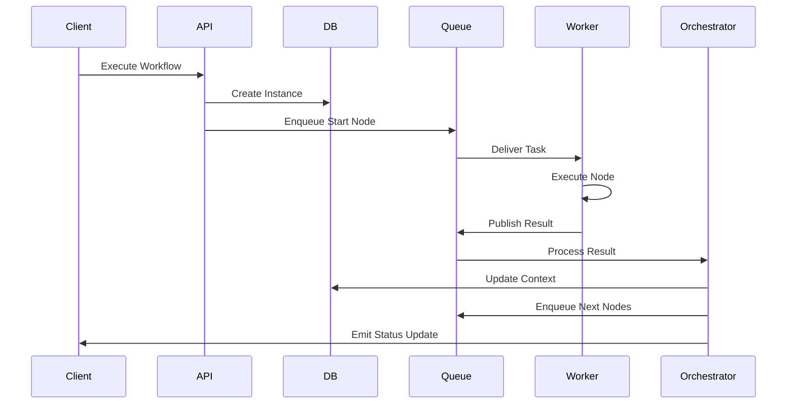

# Workflows - Complete Guide


<div align="center">

### 🔄 Automate Your Business Logic

**Visual Builder · 15+ Node Types · Real-time Execution · Error Handling**

</div>

---

## 📋 Table of Contents

- [What are Workflows?](#what-are-workflows)
- [Workflow Use Cases](#workflow-use-cases)
- [Workflow Editor](#workflow-editor)
- [Node Types](#node-types)
- [Building Your First Workflow](#building-your-first-workflow)
- [Workflow Execution](#workflow-execution)
- [Error Handling & Retries](#error-handling--retries)
- [Best Practices](#best-practices)
- [Advanced Patterns](#advanced-patterns)

---

## What are Workflows?

**Workflows** are visual automation pipelines that orchestrate multi-step business logic. They allow you to chain together database queries, API calls, data transformations, and conditional logic into reusable, executable processes.

### Key Characteristics

- **Visual Editor** - Drag-and-drop node-based interface
- **DAG Execution** - Directed Acyclic Graph execution model
- **Real-time Updates** - Live execution progress via WebSocket
- **Error Handling** - Built-in retry and failure handling
- **Test Mode** - Execute unsaved workflows for validation
- **Version Control** - Track workflow changes over time

### Workflow Anatomy

```
┌─────────────────────────────────────────────────────────────┐
│  Workflow: "New User Onboarding"                            │
├─────────────────────────────────────────────────────────────┤
│                                                             │
│  🟢 START                                                   │
│     ↓                                                       │
│  🔷 QUERY: Check if email exists                            │
│     ↓                                                       │
│  🔀 CONDITION: Email exists?                                │
│     ├─ Yes → 📜 SCRIPT: Log duplicate attempt               │
│     │              → 🔴 END: Return {success: false}        │
│     │                                                       │
│     └─ No → 🔷 QUERY: Create user record                    │
│                ↓                                              │
│             📧 ACTION: Send welcome email                    │
│                ↓                                              │
│             🔷 QUERY: Create audit log                       │
│                ↓                                              │
│             🔴 END: Return {success: true, userId}           │
│                                                             │
└─────────────────────────────────────────────────────────────┘
```

---

## Workflow Use Cases

### 📊 Data Processing

**Scenario**: Daily sales report generation

```
🟢 START (date range)
   ↓
🔷 QUERY: Fetch orders from database
   ↓
📜 SCRIPT: Calculate totals, group by category
   ↓
🔷 QUERY: Save report to database
   ↓
📧 ACTION: Email report to stakeholders
   ↓
🔴 END: Return report ID
```

### 🔄 Integration Sync

**Scenario**: Sync customers to CRM

```
🟢 START (customer ID)
   ↓
🔷 QUERY: Get customer details
   ↓
🔀 CONDITION: Customer active?
   ├─ Yes → 🔷 API: Create/Update in CRM
   │         ↓
   │      📝 LOG: Sync successful
   │
   └─ No → 📝 LOG: Skip inactive customer
   ↓
🔴 END: Return sync status
```

### 🤖 Approval Workflow

**Scenario**: Expense approval process

```
🟢 START (expense ID)
   ↓
🔷 QUERY: Get expense details
   ↓
🔀 CONDITION: Amount > $1000?
   ├─ Yes → 📧 ACTION: Notify manager
   │         ↓
   │      ⏱️ DELAY: Wait for approval
   │         ↓
   │      🔀 CONDITION: Approved?
   │         ├─ Yes → Continue
   │         └─ No → 🔴 END: Rejected
   │
   └─ No → Auto-approve
   ↓
🔷 QUERY: Update expense status
   ↓
📧 ACTION: Notify employee
   ↓
🔴 END: Return final status
```

### 📱 Notification System

**Scenario**: Order status updates

```
🟢 START (order ID, status)
   ↓
🔷 QUERY: Get order details
   ↓
🔀 CONDITION: Status = "shipped"?
   ├─ Yes → 🔷 API: Send SMS via Twilio
   │         ↓
   │      📧 ACTION: Send email
   │
   └─ No → 📧 ACTION: Send email only
   ↓
📝 LOG: Notification sent
   ↓
🔴 END: Return notification ID
```

---

## Workflow Editor

### Editor Interface

```
┌────────────────────────────────────────────────────────────────┐
│  [← Back]  Workflow: New User Onboarding          [Save] [▶ Run]│
├────────────────────────────────────────────────────────────────┤
│                                                                │
│  ┌────────────┐                                                │
│  │   Nodes    │    🟢 START                                    │
│  │  Panel     │      ↓                                         │
│  │            │    🔷 Query: Check Email                       │
│  │ • Start    │      ↓                                         │
│  │ • Query    │    🔀 Condition                                │
│  │ • Script   │                                                │
│  │ • Condition│                                                │
│  │ • Loop     │                                                │
│  │ • End      │                                                │
│  │            │                                                │
│  └────────────┘                                                │
│                                                                │
│                              ┌────────────────┐                │
│                              │ Node Inspector │                │
│                              ├────────────────┤                │
│                              │ Type: Query    │                │
│                              │ Datasource: PG │                │
│                              │ Query: SELECT  │                │
│                              └────────────────┘                │
└────────────────────────────────────────────────────────────────┘
```

### Editor Features

| Feature | Description |
|---------|-------------|
| **Canvas** | Infinite workspace for building workflows |
| **Node Palette** | Drag nodes from the left panel |
| **Connection Tool** | Draw edges between nodes |
| **Node Inspector** | Configure node properties |
| **Toolbar** | Save, run, undo/redo, zoom controls |
| **Minimap** | Navigate large workflows |
| **Keyboard Shortcuts** | Fast editing with shortcuts |

### Keyboard Shortcuts

| Shortcut | Action |
|----------|--------|
| `Delete` | Delete selected node(s) |
| `Ctrl/Cmd + Z` | Undo |
| `Ctrl/Cmd + Y` | Redo |
| `Ctrl/Cmd + C` | Copy selected node(s) |
| `Ctrl/Cmd + V` | Paste node(s) |
| `Ctrl/Cmd + D` | Duplicate selected node |
| `Space + Drag` | Pan canvas |
| `Scroll` | Zoom in/out |

---

## Node Types

Jet Admin provides **15+ node types** for building workflows:

### 🟢 Start Node

**Purpose**: Entry point for workflow execution

**Configuration:**
```javascript
{
  nodeType: 'start',
  nodeConfig: {
    inputArguments: [
      { name: 'userId', type: 'string', required: true },
      { name: 'action', type: 'string', default: 'create' }
    ]
  }
}
```

**Output**: `args` object containing input parameters

---

### 🔷 Query Node

**Purpose**: Execute database queries or API calls

**Configuration:**
```javascript
{
  nodeType: 'query',
  nodeConfig: {
    datasourceId: 'datasource-uuid',
    queryType: 'sql', // or 'api', 'graphql', etc.
    query: `
      SELECT * FROM users 
      WHERE email = {{args.email}}
    `,
    resultKey: 'userRecord'
  }
}
```

**Output**: Query results stored in `context.resultKey`

**Use Cases:**
- Fetch data from databases
- Call external APIs
- Execute stored procedures
- Run GraphQL queries

---

### 📜 Script Node

**Purpose**: Execute custom JavaScript code

**Configuration:**
```javascript
{
  nodeType: 'script',
  nodeConfig: {
    code: `
      // Access previous node outputs
      const user = context.checkEmail.result;
      
      // Transform data
      const formatted = {
        id: user.id,
        name: \`\${user.firstName} \${user.lastName}\`,
        email: user.email.toLowerCase()
      };
      
      // Return result
      return { formattedUser: formatted };
    `,
    resultKey: 'scriptResult'
  }
}
```

**Available Variables:**
- `context` - All previous node outputs
- `args` - Workflow input arguments
- `utils` - Helper functions (date, string, math)

**Output**: Returned object merged into context

---

### 🔀 Condition Node

**Purpose**: Branch logic based on expressions

**Configuration:**
```javascript
{
  nodeType: 'condition',
  nodeConfig: {
    conditions: [
      {
        label: 'User Exists',
        expression: 'context.checkEmail.result.count > 0',
        targetNodeId: 'node-uuid-1'
      },
      {
        label: 'New User',
        expression: 'context.checkEmail.result.count === 0',
        targetNodeId: 'node-uuid-2'
      }
    ],
    defaultTargetNodeId: 'node-uuid-3'
  }
}
```

**Output**: Routes execution to matching branch

**Expression Syntax:**
```javascript
// Comparison
context.nodeId.result === 'value'
context.nodeId.count > 5

// Logical
context.node1.result && context.node2.result
context.node1.result || context.node2.result

// Array methods
context.users.result.some(u => u.active)
context.items.result.filter(i => i.price > 100)

// String methods
context.user.result.email.includes('@company.com')
```

---

### 🔁 Loop Node

**Purpose**: Iterate over arrays

**Configuration:**
```javascript
{
  nodeType: 'loop',
  nodeConfig: {
    arrayExpression: 'context.fetchUsers.result',
    loopVariable: 'currentUser',
    batchSize: 1, // Process items in batches
    parallel: false // Run iterations sequentially
  }
}
```

**Inside Loop:**
- Access current item: `context.currentUser`
- Access loop index: `context.__loopIndex`
- Access all items: `context.__loopArray`

**Output**: Array of all iteration results

---

### ⏱️ Delay Node

**Purpose**: Pause execution

**Configuration:**
```javascript
{
  nodeType: 'delay',
  nodeConfig: {
    delayType: 'seconds', // or 'milliseconds', 'minutes', 'until'
    duration: 5000, // milliseconds
    // or
    untilExpression: 'context.approvalReceived === true'
  }
}
```

**Use Cases:**
- Wait for external process
- Rate limiting API calls
- Scheduled retries

---

### 🔴 End Node

**Purpose**: Terminate workflow with output

**Configuration:**
```javascript
{
  nodeType: 'end',
  nodeConfig: {
    outputMapping: {
      success: 'context.createUser.result.success',
      userId: 'context.createUser.result.id',
      message: '"User created successfully"'
    }
  }
}
```

**Output**: Final workflow result returned to caller

---

### 📧 Action Nodes

**Purpose**: Execute external actions

**Available Actions:**
- **Email** (SendGrid, SMTP)
- **SMS** (Twilio)
- **Slack Message**
- **Webhook**
- **File Upload** (S3, etc.)

**Configuration:**
```javascript
{
  nodeType: 'action',
  nodeConfig: {
    actionType: 'send_email',
    datasourceId: 'sendgrid-uuid',
    template: 'welcome_email',
    recipients: ['{{args.email}}'],
    data: {
      userName: 'context.user.result.name'
    }
  }
}
```

---

## Building Your First Workflow

### Tutorial: User Registration Workflow

Let's build a complete workflow that handles new user registration:

#### Step 1: Create Workflow

1. Navigate to **Workflows** in the sidebar
2. Click **Create Workflow**
3. Enter name: "User Registration"
4. Click **Create**

#### Step 2: Add Start Node

The Start node is added automatically. Configure input arguments:

```
Input Arguments:
- email (string, required)
- password (string, required)
- name (string, required)
```

#### Step 3: Add Query Node - Check Email

1. Drag a **Query** node onto the canvas
2. Connect Start → Query
3. Configure:
   - **Datasource**: PostgreSQL - Production
   - **Query**: 
   ```sql
   SELECT COUNT(*) as count FROM users 
   WHERE email = '{{args.email}}'
   ```
   - **Result Key**: `emailCheck`

#### Step 4: Add Condition Node

1. Drag a **Condition** node
2. Connect Query → Condition
3. Configure conditions:
   - **Email Exists**: `context.emailCheck.result.count > 0`
   - **New Email**: `context.emailCheck.result.count === 0`

#### Step 5: Add Branch for Existing Email

1. Add **Script** node for "Email Exists" branch
2. Configure:
   ```javascript
   return {
     success: false,
     error: 'Email already registered',
     code: 'EMAIL_EXISTS'
   };
   ```
3. Add **End** node with output mapping

#### Step 6: Add Branch for New Email

1. Add **Query** node for "New Email" branch
2. Configure:
   ```sql
   INSERT INTO users (email, password, name, created_at)
   VALUES ('{{args.email}}', '{{args.password}}', '{{args.name}}', NOW())
   RETURNING id, email, name;
   ```
   - **Result Key**: `createUser`

3. Add **Script** node to hash password (if not done in query)
4. Add **Action** node to send welcome email
5. Add **End** node with success output

#### Step 7: Test Workflow

1. Click **Test** button
2. Provide test input:
   ```json
   {
     "email": "test@example.com",
     "password": "secure123",
     "name": "Test User"
   }
   ```
3. Click **Run Test**
4. Watch real-time execution in the terminal panel
5. Review output

#### Step 8: Save Workflow

1. Click **Save**
2. Add description and tags
3. Workflow is now ready for production use

---

## Workflow Execution

### Execution Modes

#### Production Execution

Execute a saved workflow:

```javascript
// API Call
POST /api/v1/tenants/:tenantID/workflows/:workflowID/execute

// Request Body
{
  "input": {
    "email": "user@example.com",
    "password": "secure123"
  }
}

// Response
{
  "data": {
    "instanceID": "instance-uuid",
    "status": "RUNNING",
    "startedAt": "2024-01-01T00:00:00Z"
  }
}
```

#### Test Execution

Execute unsaved workflow definition:

```javascript
// API Call
POST /api/v1/tenants/:tenantID/workflows/test

// Request Body
{
  "nodes": [...],
  "edges": [...],
  "input": {
    "email": "test@example.com"
  }
}
```

### Execution Lifecycle



### Real-time Monitoring

Subscribe to workflow execution via WebSocket:

```javascript
// Client-side
socket.emit('workflow_run_join', { runId: 'instance-uuid' });

socket.on('workflow_node_update', (data) => {
  console.log(`Node ${data.nodeId}: ${data.status}`);
  console.log(`Duration: ${data.duration}ms`);
  console.log(`Output:`, data.output);
});

socket.on('workflow_status_update', (data) => {
  console.log(`Workflow ${data.status}`);
  if (data.error) {
    console.error(`Error: ${data.error}`);
  }
});
```

### Execution Status

| Status | Description |
|--------|-------------|
| `PENDING` | Waiting to start |
| `RUNNING` | Currently executing |
| `COMPLETED` | Finished successfully |
| `FAILED` | Encountered an error |
| `STOPPED` | Manually stopped |
| `TIMEOUT` | Exceeded time limit |

---

## Error Handling & Retries

### Node-Level Error Handling

Configure retry behavior:

```javascript
{
  nodeConfig: {
    // ... node config
    retryPolicy: {
      maxRetries: 3,
      initialDelay: 1000, // 1 second
      maxDelay: 30000,    // 30 seconds
      backoffMultiplier: 2,
      retryableErrors: [
        'ECONNRESET',
        'ETIMEDOUT',
        'RATE_LIMIT_EXCEEDED'
      ]
    }
  }
}
```

### Workflow-Level Error Handling

Add error handling nodes:

```
🔷 QUERY: Fetch Data
   ↓
🔀 CONDITION: Query successful?
   ├─ Yes → Continue processing
   └─ No → 📜 SCRIPT: Handle error
              ↓
           📧 ACTION: Send alert
              ↓
           🔴 END: Return error
```

### Error Types

| Error Type | Description | Handling |
|------------|-------------|----------|
| `VALIDATION_ERROR` | Invalid input | Fix input, retry |
| `CONNECTION_ERROR` | External system down | Retry with backoff |
| `TIMEOUT_ERROR` | Operation timed out | Increase timeout, retry |
| `AUTH_ERROR` | Authentication failed | Update credentials |
| `BUSINESS_ERROR` | Business logic violation | Handle in workflow |

### Dead Letter Queue

Failed nodes after max retries go to DLQ:

```javascript
// Configuration
{
  workflowOptions: {
    deadLetterQueue: {
      enabled: true,
      maxRetries: 3,
      alertOnFailure: true
    }
  }
}
```

---

## Best Practices

### Workflow Design

✅ **Keep Workflows Focused**
- Single responsibility per workflow
- Break complex logic into sub-workflows
- Maximum 20-25 nodes per workflow

✅ **Use Descriptive Names**
```
Good: "Validate User Email"
Bad: "Query 1"
```

✅ **Document with Comments**
```javascript
// Script node comment
// Purpose: Transform user data for CRM format
// Input: context.user.result
// Output: { crmData: {...} }
```

### Performance

✅ **Minimize Database Calls**
- Batch queries when possible
- Use appropriate indexes
- Cache frequently accessed data

✅ **Parallel Processing**
```
🔷 QUERY: Fetch Users
   ↓
┌─→ 🔷 QUERY: Fetch Orders ─┐
├─→ 🔷 QUERY: Fetch Products ┤ → 📜 SCRIPT: Combine Results
└─→ 🔷 QUERY: Fetch Reviews ─┘
```

✅ **Use Appropriate Timeouts**
```javascript
{
  timeout: 30000,        // 30s for most nodes
  queryTimeout: 60000,   // 60s for complex queries
  apiTimeout: 10000      // 10s for external APIs
}
```

### Error Handling

✅ **Fail Fast**
- Validate inputs early
- Check prerequisites before processing

✅ **Graceful Degradation**
- Handle non-critical failures
- Continue with partial data when appropriate

✅ **Alerting**
- Send notifications for critical failures
- Include context in error messages
- Log sufficient details for debugging

### Security

✅ **Input Validation**
```javascript
// Script node - validate inputs
if (!args.email || !args.email.includes('@')) {
  throw new Error('Invalid email format');
}
```

✅ **Credential Management**
- Never hardcode credentials in workflows
- Use datasource configurations
- Rotate API keys regularly

✅ **Audit Logging**
```javascript
// Log important actions
{
  nodeType: 'query',
  nodeConfig: {
    query: `
      INSERT INTO audit_log (action, user_id, timestamp)
      VALUES ('user_created', '{{args.userId}}', NOW())
    `
  }
}
```

---

## Advanced Patterns

### Sub-workflows

Call one workflow from another:

```
🟢 MAIN WORKFLOW
   ↓
🔷 WORKFLOW: "Validate User" (sub-workflow)
   ↓
🔀 CONDITION: Validation passed?
   ├─ Yes → Continue
   └─ No → Handle error
```

**Configuration:**
```javascript
{
  nodeType: 'workflow',
  nodeConfig: {
    workflowId: 'validate-user-workflow-id',
    inputMapping: {
      email: 'context.startNode.result.email',
      action: '"register"'
    },
    resultKey: 'validationResult'
  }
}
```

### Dynamic Node Configuration

Generate node config at runtime:

```javascript
// Script node before Query node
const datasourceId = context.user.result.preferred_db;
return {
  nextQueryNode: {
    datasourceId: datasourceId,
    query: `SELECT * FROM data`
  }
};
```

### Parallel Execution

Fan-out pattern for parallel processing:

```
         🔷 QUERY 1
        ↗
🟢 START → 🔷 QUERY 2
        ↘
         🔷 QUERY 3
           ↓
      📜 SCRIPT: Combine Results
```

### Circuit Breaker

Prevent cascading failures:

```javascript
// Script node - circuit breaker logic
const failures = context.__circuitFailures || 0;
const threshold = 5;

if (failures >= threshold) {
  return { circuitOpen: true };
}

try {
  // Attempt operation
  return { circuitOpen: false, success: true };
} catch (error) {
  return { 
    circuitOpen: false, 
    success: false,
    incrementFailure: true
  };
}
```

---

## Next Steps

- [**Workflow Nodes Reference**](./workflow/nodes) - Detailed node documentation
- [**Workflow Edges**](./workflow/edges) - Connection configuration
- [**Backend Implementation**](./workflow/backend) - Technical architecture
- [**Widget Integration**](./widgets/widget-workflow-bridge) - Connect workflows to widgets

---

<div align="center">

### Ready to Build?

[Create Your First Workflow](#building-your-first-workflow) · [View Examples](#workflow-use-cases) · [API Reference](../api-reference/index)

</div>
