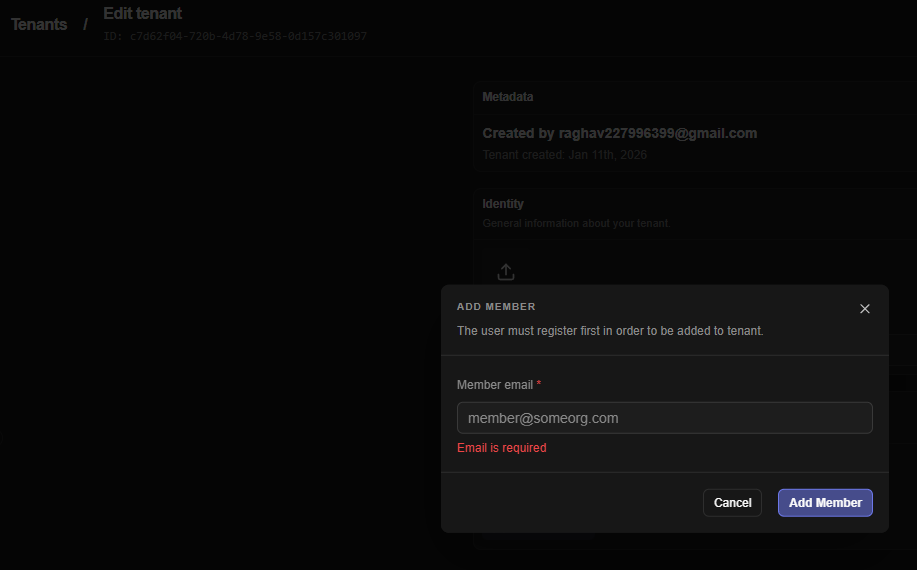
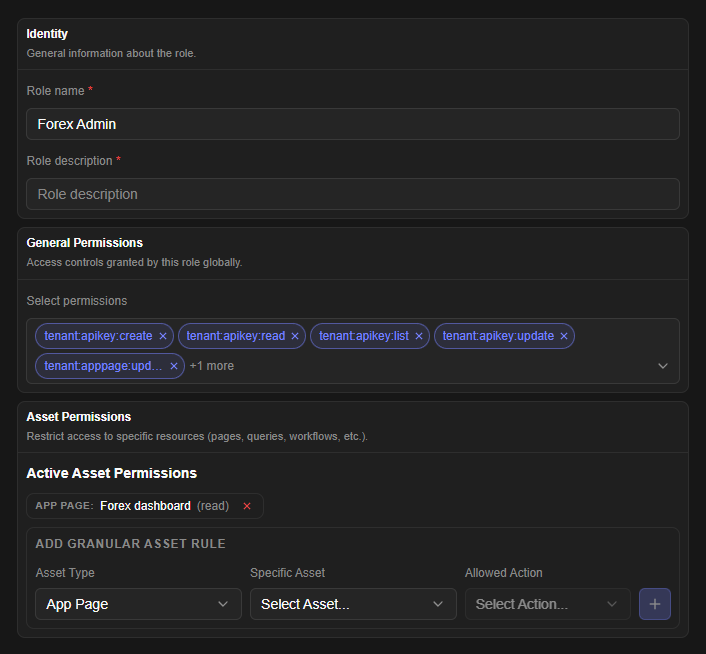

# Identity & Access Management

*Covers: Authentication, Tenants, Tenant Roles & Permissions, and Tenant User Management*

* * *

## Table of Contents

1. [Overview](#1-overview)
2. [Key Concepts](#2-key-concepts)
3. [How It Works — End-to-End Flows](#3-how-it-works-end-to-end-flows)
  - 3.1 [User Sign-In and Account Provisioning](#31-user-sign-in-and-account-provisioning)
  - 3.2 [Tenant Creation](#32-tenant-creation)
  - 3.3 [Authorization Check on Every Request](#33-authorization-check-on-every-request)
  - 3.4 [Inviting and Managing Tenant Members](#34-inviting-and-managing-tenant-members)
  - 3.5 [Creating and Assigning Custom Roles](#35-creating-and-assigning-custom-roles)
4. [Authentication Methods](#4-authentication-methods)
5. [Configurable Entities](#5-configurable-entities)
  - 5.1 [Tenant](#51-tenant)
  - 5.2 [Tenant Role](#52-tenant-role)
  - 5.3 [General Permission](#53-general-permission)
  - 5.4 [Asset (Granular) Permission](#54-asset-granular-permission)
  - 5.5 [Tenant User (Membership)](#55-tenant-user-membership)
  - 5.6 [User-Level Tenant Configuration](#56-user-level-tenant-configuration)
6. [Supported Permission Types](#6-supported-permission-types)
7. [Input/Output Contracts](#7-inputoutput-contracts)
8. [Integration Points](#8-integration-points)
9. [Real-Time and Asynchronous Behaviour](#9-real-time-and-asynchronous-behaviour)
10. [Error States and Edge Cases](#10-error-states-and-edge-cases)
11. [Best Practices](#11-best-practices)
12. [Limitations and Constraints](#12-limitations-and-constraints)
13. [Related Modules](#13-related-modules)

* * *

## 1\. Overview

The Identity & Access Management (IAM) module is the security foundation of Jet Admin. It governs **who can sign in**, **which organisation ("tenant") they are acting within**, and **what they are permitted to do** inside that organisation.

The module is made up of four closely related pieces:

- **Authentication** — verifies that a request genuinely comes from a known user (via a Firebase identity token) or an automated integration (via an API key), and provisions a platform user record automatically on first sign-in.
- **Tenants** — Jet Admin is multi-tenant: every workspace (a company, team, or project) is represented as a tenant. All build-time and run-time resources (datasources, queries, workflows, app pages, widgets, cron jobs, listeners, API keys) belong to exactly one tenant.
- **Tenant Roles & Permissions** — a policy engine that determines what an authenticated identity (a user or an API key) may do within a given tenant, down to the level of individual resources.
- **User Management** — the administrative surface for adding people to a tenant, assigning them roles, promoting or demoting admins, and removing them.

Every other module in the platform (datasources, data queries, workflows, app pages, widgets, cron jobs, listeners, API keys) depends on this module for two things: knowing **whose request this is** and knowing **whether they're allowed to do it**.

* * *

## 2\. Key Concepts

**User** — A person who has signed in to Jet Admin at least once. A user account is created automatically the first time someone successfully authenticates; there is no separate manual "sign up" step in the platform itself. A user can belong to multiple tenants at once.

**Tenant** — An isolated workspace. Each tenant has its own datasources, queries, workflows, pages, widgets, roles, members, and API keys. A user's access to a tenant's resources is entirely separate from their access to any other tenant's resources.

**Tenant Membership** — The relationship between a user and a tenant. Every member has exactly one **Membership Tier** (Admin or Member, described below) plus, optionally, one or more **Custom Roles** that grant additional fine-grained permissions.

**Membership Tier (Primary Role)** — A coarse-grained designation attached directly to a user's membership in a tenant:

- **Admin** — full control over the tenant, including the ability to manage other members, roles, and tenant settings.
- **Member** — a standard, non-administrative participant. A Member's actual capabilities are determined entirely by the Custom Roles assigned to them.

**Custom Role** — A named, reusable bundle of permissions that an Admin defines for a tenant (e.g., "Analyst," "Workflow Editor"). Roles are assigned to Members to grant them specific capabilities. Custom Roles are only meaningful for users with the Member tier — Admins implicitly have full access and do not need roles assigned.

**Global Role** — A role that is not tied to any specific tenant and is available platform-wide as a reference/template. Global roles are shown alongside a tenant's own custom roles when listing available roles, but they cannot be edited or deleted through the tenant's role management screens.

**Permission** — A single, named capability (e.g., "create a data query," "execute a workflow"). Permissions are combined into Custom Roles.

**General Permission** — A permission that applies to an entire category of resource within the tenant (e.g., "can list all data queries"). This is the default, broad form of permission.

**Asset (Granular) Permission** — A permission scoped to one specific resource instance rather than an entire category (e.g., "can execute *this one* workflow, not all workflows"). Asset permissions let an Admin hand out narrowly-scoped access without granting blanket category-wide rights.

**API Key** — A credential that lets external systems or automations call the platform without a human signing in interactively. An API key acts on behalf of the user who created it for resource-ownership purposes, but is evaluated as its own distinct identity for authorization decisions.

**Authorization Check** — Every protected action in the platform is evaluated against the policy engine before it is allowed to proceed. The check asks: "Does this identity (user or API key), within this tenant, have permission to perform this action on this resource (or resource category)?"

**Delegated / Originating Resource Authorization** — Some actions are triggered indirectly — for example, a workflow step that runs a data query, or an app page that triggers a workflow. If the caller doesn't have direct permission on the inner resource (the query) but does have permission on the resource that triggered it (the workflow or page), the action is still allowed. This prevents administrators from having to grant access to every internal building block individually.

* * *

## 3\. How It Works — End-to-End Flows {#3-how-it-works-end-to-end-flows}

### 3.1 User Sign-In and Account Provisioning

A user signs in through the platform's identity provider (Firebase). On their first successful sign-in, Jet Admin automatically creates a corresponding platform user record using the email address and identity-provider ID from that sign-in — there is no separate registration form. On every subsequent sign-in, the existing user record is found and reused. The user's outstanding notifications are attached to their profile at this point as well, so the user always sees their current notification state immediately after signing in.

### 3.2 Tenant Creation

Any signed-in user can create a new tenant, subject to a maximum number of tenants they're allowed to own (see [Limitations](#12-limitations-and-constraints)). When a tenant is created:

1. The tenant record itself is created with a title and optional logo.
2. An empty configuration entry is created for the creator within that tenant.
3. The creator is automatically added as a member of the new tenant with the **Admin** membership tier.

From this point on, the creator can invite other users, define custom roles, and configure every other module (datasources, queries, workflows, etc.) within that tenant.

### 3.3 Authorization Check on Every Request

Whenever a request is made against a tenant-scoped resource, the following sequence happens:

1. **Identity verification** — the request's credentials (Firebase token or API key) are validated and the corresponding user/API key identity is attached to the request.
2. **Resource resolution** — the system determines which resource (and resource type) the action targets, based on the URL or submitted data. If the action affects a list/category rather than one item (e.g., listing all workflows), the check is performed against the whole category.
3. **Policy evaluation** — the policy engine checks whether the identity has been granted the requested action on that resource (or category) within that tenant.
4. **Delegated fallback** — if the direct check fails and the action was triggered by a parent resource (e.g., a query running inside a workflow), the system re-checks permission against that parent resource before finally denying access.
5. **Outcome** — if allowed, the request proceeds and an execution context (identifying the actor and, where relevant, the resource that triggered the action) is made available to the rest of the system for traceability. If denied, the request is rejected and the user sees a permission error.

### 3.4 Inviting and Managing Tenant Members

An Admin adds a new member by submitting the **email address of an existing platform user** (the person must have signed in to Jet Admin at least once already; this flow does not send an email invitation or create a new account). The system:

1. Looks up the user by email.
2. Confirms the user isn't already a member of the tenant (duplicate membership is rejected).
3. Creates the membership record with the **Member** tier by default.
4. Sends the new member an in-app notification informing them they've been added to the tenant.

Once added, an Admin can:

- Assign or change the member's **Custom Roles**.
- Promote the member to **Admin**, or demote an existing Admin back to **Member**.
- Remove the member from the tenant entirely.

### 3.5 Creating and Assigning Custom Roles

When an Admin creates a Custom Role, they give it a title and description and attach:

- Zero or more **General Permissions** selected from the platform's permission catalogue.
- Zero or more **Asset Permissions**, each naming a specific resource, its type, and the allowed action on that resource.

Behind the scenes, every permission attached to the role is translated into a policy rule. Asset permissions that reference a resource/action combination not seen before automatically create the underlying permission record on the fly, so Admins never need to pre-register asset permissions before using them. Whenever a role's permissions are created, updated, or removed, the platform's policy engine is automatically resynchronized so that the change takes effect immediately for every member holding that role — no manual "publish" or cache-refresh step is required.

* * *

## 4\. Authentication Methods

The platform supports two ways for a request to authenticate itself. Both are evaluated based on the format of the credential supplied.

| Method | Who Uses It | How It Identifies the Caller | Notes |
| --- | --- | --- | --- |
| **Firebase Identity Token** | Human users via the web app | A signed identity token issued at sign-in, verified against the identity provider on every request | A new platform user is auto-provisioned on first successful verification if one doesn't already exist |
| **API Key** | External systems, scripts, automations | A secret key string; only the portion needed to look up candidate keys is stored in readable form, with the full key validated by comparing a one-way hash | The key carries its own tenant scope and title, and acts as a distinct identity from its creator for authorization purposes, while still being attributed to the human who created it for resource-ownership and audit purposes |

A request that supplies neither credential — or an invalid one — is rejected before reaching any business logic.

* * *

## 5\. Configurable Entities

### 5.1 Tenant

| Field | Description | Type | Required | Default |
| --- | --- | --- | --- | --- |
| Tenant Title | Display name of the workspace | Text | Yes (on creation) | —   |
| Tenant Logo URL | URL of an image used as the tenant's logo/avatar | Text (URL) | No  | None |
| Disabled State | Whether the tenant has been deactivated platform-wide | Boolean | System-managed | Not disabled |
| Disable Reason | Free-text explanation recorded when a tenant is disabled | Text | System-managed | None |

A tenant cannot be renamed by itself — title and logo are updated together via the same update action. Both fields are optional on update, so an Admin can change just the title or just the logo in a single call.

### 5.2 Tenant Role

| Field | Description | Type | Required | Default |
| --- | --- | --- | --- | --- |
| Role Title | Display name of the role | Text (max 255 characters) | Yes | —   |
| Role Description | Explanation of what the role is for | Text | No  | None |
| General Permission IDs | List of catalogue permissions to grant | List of Permission references | No  | Empty list |
| Asset Permissions | List of resource-specific grants (see [5.4](#54-asset-granular-permission)) | List of Asset Permission objects | No  | Empty list |

A role belongs to exactly one tenant (a "Custom Role") or to no tenant at all (a "Global Role," read-only from the tenant's perspective). Attempting to update or delete a Global Role, or a role that belongs to a different tenant than the one being managed, is rejected.

### 5.3 General Permission

| Field | Description | Type |
| --- | --- | --- |
| Permission Title | A unique, system-defined identifier for the permission (e.g., `tenant:query:execute`) | Text |
| Permission Description | Human-readable explanation of the permission | Text |

General permissions are read from a fixed platform catalogue (see [Section 6](#6-supported-permission-types)) — Admins choose from this catalogue when building a role rather than creating arbitrary new general permissions.

### 5.4 Asset (Granular) Permission

Each entry in a role's asset permission list is an object with the following fields:

| Field | Description | Type | Required | Allowed Values |
| --- | --- | --- | --- | --- |
| Resource Type | The category of resource being scoped | Text | Yes | `appPage`, `dataquery`, `workflow`, `datasource`, `widget`, `listener` (any resource type recognised by the platform's authorization model) |
| Resource ID | The specific resource instance this grant applies to | Text (resource identifier) | Yes | Must reference an existing resource of the given type |
| Action | The operation allowed on that specific resource | Text | Yes | Varies by resource type — see table below |

**Actions available per resource type (as exposed in the role-builder UI):**

| Resource Type | Available Actions |
| --- | --- |
| Data Query | Read, Update, Delete, Run |
| Workflow | Read, Update, Delete, Execute |
| App Page, Datasource, Listener, Cron Job, Widget | Read, Update, Delete |

If any of Resource Type, Resource ID, or Action is missing from an entry, that entry is silently skipped rather than causing the whole role save to fail.

### 5.5 Tenant User (Membership)

| Field | Description | Type | Editable By |
| --- | --- | --- | --- |
| User Email | Identifies which existing platform user to add | Text (email) | Set once, at invitation time |
| Membership Tier | Admin or Member | Selection | Admin |
| Assigned Custom Roles | List of roles granting fine-grained permissions | List of Role references | Admin (Members only — Admins don't need roles) |

### 5.6 User-Level Tenant Configuration

A small, free-form configuration object that each user can hold per tenant, intended for personal preferences scoped to that workspace (e.g., UI state). It is stored as an open JSON object with no fixed schema — the platform does not validate its internal structure beyond requiring it to be a JSON object.

| Field | Description | Type | Required |
| --- | --- | --- | --- |
| Config | Arbitrary JSON object of user preferences for the tenant | JSON Object | Yes (an object, may be empty) |

* * *

## 6\. Supported Permission Types

The platform ships with a fixed catalogue of general permissions, grouped by the resource category they govern. Custom Roles are built by selecting from this catalogue (plus any Asset Permissions needed for narrower scoping).

| Category | Permissions Available |
| --- | --- |
| **Data Queries** | List, Create, Read, Update, Delete, Test, Clone, Bulk Create |
| **Workflows** | List, Create, Read, Update, Delete, Execute |
| **App Pages** | List, Create, Read, Update, Delete, Clone |
| **Datasources** | List, Create, Read, Update, Delete, Test |
| **Widgets** | List, Create, Read, Update, Delete, Clone |
| **Listeners** | List, Create, Read, Update, Delete |
| **Tenant Users** | List, Create, Read, Update, Delete |
| **Roles & Permissions** | List Roles, Create Role, Read Role, Update Role, Delete Role, List Permissions |
| **Tenant (general)** | Read, Update, Delete |

In addition to these general, category-wide permissions, **Asset Permissions** (see [5.4](#54-asset-granular-permission)) allow a permission to be scoped down to one specific resource instead of the whole category.

* * *

## 7\. Input/Output Contracts

This section describes, conceptually, what each part of the module expects as input and what it returns — without reference to specific endpoints.

**Authentication**

- *Input:* A credential — either an identity token from sign-in, or an API key string.
- *Output:* The caller's user profile (including any pending notifications), or — on first sign-in — a newly created user profile.

**Get/Update User's Tenant Configuration**

- *Input (read):* The tenant to read configuration for.
- *Output (read):* The stored configuration object for that user/tenant pair, or nothing if none has been set.
- *Input (write):* The tenant, and the new configuration object to store.
- *Output (write):* Confirmation that the configuration was saved.

**Create Tenant**

- *Input:* A title and, optionally, a logo URL.
- *Output:* The newly created tenant record, with the requesting user already attached as Admin.

**Get Tenant Details**

- *Input:* A tenant identifier.
- *Output:* The tenant's profile information together with summary counts (number of roles, app pages, data queries, widgets, cron jobs, API keys) and the list of all current member relationships — giving a single-screen overview of the tenant's size and configuration.

**List My Tenants**

- *Input:* None beyond the authenticated identity.
- *Output:* Every tenant the caller belongs to, each annotated with the caller's membership tier(s) in that tenant. Disabled tenants are excluded.

**Update / Delete Tenant**

- *Input (update):* Tenant identifier and any of title/logo to change.
- *Output (update):* The updated tenant record.
- *Input (delete):* Tenant identifier.
- *Output (delete):* Confirmation of removal. Deleting a tenant is destructive and cascades to the tenant's roles, members, API keys, app pages, data queries, and widgets.

**Create / Update / Delete Custom Role**

- *Input:* Role title, description, general permission selections, and/or asset permission entries.
- *Output:* Confirmation that the role (and its underlying policy rules) has been created, updated, or removed.

**List Roles / List Permissions**

- *Input:* The tenant to list for.
- *Output:* All roles visible to the tenant (its own custom roles plus global roles), or the full catalogue of general permissions.

**Add Tenant Member**

- *Input:* The email of an existing platform user.
- *Output:* Confirmation of the new membership; the invited user receives an in-app notification.

**Update Member Roles / Tier**

- *Input:* The target member, the desired membership tier (Admin/Member), and/or the list of custom role IDs to assign.
- *Output:* Confirmation that the membership was updated. If the requested change is a tier transition (Member→Admin or Admin→Member), that transition is applied; otherwise the supplied role list replaces the member's current custom roles.

**Remove Tenant Member**

- *Input:* The member to remove.
- *Output:* Confirmation of removal, **unless** removing this member would leave the tenant with zero Admins, in which case the action is rejected (see [Error States](#10-error-states-and-edge-cases)).

**List Tenant Members**

- *Input:* The tenant, with optional pagination controls (page number, page size).
- *Output:* A page of members, each with their profile, membership tier, join date, and assigned custom roles.

* * *

## 8\. Integration Points

The IAM module is a dependency of nearly every other module in the platform. Specifically:

- **Datasources, Data Queries, Workflows, App Pages, Widgets, Cron Jobs, Listeners, API Keys** — every one of these resources is created within a tenant and is subject to the same authorization checks described in [Section 3.3](#33-authorization-check-on-every-request). Each of these modules' create actions also records which identity (user or API key) created the resource, for ownership and audit purposes.
- **Workflow Engine** — when a workflow executes a step that itself runs a data query, the engine passes along the original caller's identity plus a reference to the workflow as the "originating resource," enabling the delegated authorization fallback described in [Section 2](#2-key-concepts).
- **Cron Jobs and Listeners** — these are system-triggered rather than user-triggered. When they execute a workflow or query, they are trusted automatically (no policy check is performed), but their actions are still logged with their origin (which cron job or listener triggered them) for traceability.
- **Notifications** — new-member additions generate an in-app notification to the invited user, and a user's outstanding notifications are surfaced as part of their profile on sign-in.
- **Audit Logging** — most authentication and tenant-management actions are recorded to the audit trail, capturing who performed the action, whether it succeeded, and relevant metadata.
- **API Key Management** — API keys are themselves scoped to a tenant and can be assigned roles in the same way a human member can, governing what the key is permitted to do on the platform's behalf.

* * *

## 9\. Real-Time and Asynchronous Behaviour

Most actions in this module are immediate and synchronous from the user's perspective — creating a tenant, inviting a member, or saving a role all complete and reflect their result right away.

The one asynchronous-feeling behaviour is **policy propagation**: whenever a role's permissions change (create, update, or delete), the platform recalculates and republishes the underlying policy rules as part of that same save operation. This means a permission change takes effect for all affected members essentially immediately — there is no separate background job or delay before the new permissions apply.

Membership changes (adding a member, changing roles, promoting/demoting) similarly take effect immediately; the next request made by the affected user is evaluated under the new permissions.

* * *

## 10\. Error States and Edge Cases

| Situation | What Happens | User-Facing Outcome |
| --- | --- | --- |
| No credentials supplied, or credentials invalid/expired | Request is rejected before reaching business logic | Authentication error; user is prompted to sign in again |
| API key doesn't match any active key, or has been disabled | Request is rejected | "Invalid API key" error |
| Action attempted without the required permission | Policy check fails, including the delegated/originating-resource fallback | Permission-denied error |
| Authorization check is missing the tenant or caller identity (malformed request) | Rejected immediately, before a policy lookup is attempted | "Missing subject or tenant" error |
| Inviting a user who hasn't signed in to the platform before | Lookup fails, since the system only invites existing platform users | Member-not-found error |
| Inviting a user who is already a member of the tenant | Rejected to prevent duplicate membership | "User already a member of this tenant" error |
| Removing or demoting the **last remaining Admin** of a tenant | Rejected to prevent a tenant from being left without any administrator | "Only one admin in tenant" error — another member must be promoted first |
| Attempting to update or delete a **Global Role** | Rejected — global roles are platform-wide references, not tenant-owned | "Role is a global role and cannot be updated" error |
| Attempting to update or delete a role that **belongs to a different tenant** | Rejected | "Role does not belong to this tenant" error |
| Creating a tenant beyond the account's tenant-creation limit | Blocked before tenant creation | Limit-exceeded error |
| Adding a member beyond the tenant's member-limit | Blocked before the membership is created | Limit-exceeded error |
| Asset permission entry missing resource type, resource ID, or action | That single entry is skipped; the rest of the role save proceeds normally | No error shown, but the incomplete entry is silently dropped |
| Promoting an Admin to Admin again (no-op tier change) | Explicitly rejected rather than silently ignored | "User is already an admin of this tenant" error |

* * *

## 11\. Best Practices

**Prefer Custom Roles over Asset Permissions for anything broad.** Asset Permissions are powerful for one-off exceptions ("this analyst can run *only* this one sensitive workflow") but become hard to maintain at scale. For anything that applies to a whole category of resources, use a General Permission instead.

**Keep the number of Admins intentional.** Because the platform refuses to let the last Admin be removed or demoted, always promote a trusted second Admin before offboarding the current one, rather than discovering the restriction mid-process.

**Name roles by job function, not by person.** Since roles are reusable and reassignable, naming them after a function (e.g., "Dashboard Viewer," "Workflow Builder") rather than an individual keeps them useful as the team changes.

**Use API keys with their own scoped roles, not a human's full access.** Because an API key is authorized as a distinct identity (even though it's attributed to its creator for ownership), give automation API keys the narrowest role that lets them do their job, rather than relying on the creator's personal permissions.

**Review tenant member counts before bulk invites.** Tenants have a maximum member count; if you plan to onboard a large team, check the current count before running an invite workflow so it doesn't fail partway through.

**Treat the per-tenant user configuration as ephemeral preference storage, not business data.** It has no schema enforcement, so it's well suited to UI state but shouldn't be relied on for anything that needs validation or auditing.

* * *

## 12\. Limitations and Constraints

- **Invitations require an existing account.** There is no email-invitation flow that creates an account for someone who has never signed in; the invited person must authenticate with the platform's identity provider at least once first.
- **A tenant cannot exist without at least one Admin.** The platform actively blocks both removal and demotion of the last Admin.
- **Global Roles are read-only at the tenant level.** They can be assigned and viewed, but not modified or deleted through tenant role management.
- **Tenant and member counts are capped.** Both the number of tenants a single user can create and the number of members a single tenant can hold are limited by the account's plan; both limits are enforced before the respective creation action completes.
- **Asset Permission actions are fixed per resource type** — you cannot define a custom action name; you choose from the platform-defined set documented in [5.4](#54-asset-granular-permission).
- **Role names are not required to be unique** within a tenant — the platform does not currently enforce uniqueness on role titles.
- **Deleting a tenant is irreversible** and cascades through its dependent resources (roles, memberships, API keys, app pages, data queries, widgets); there is no soft-delete/recovery path for the tenant's resources beyond the tenant-level disable mechanism used for administrative deactivation.

* * *

## 13\. Related Modules

This document focuses on identity, tenancy, roles, and membership. For the resources these permissions actually govern, see the documentation for the **Data Query**, **Workflow**, **App Page**, **Datasource**, **Widget**, **Listener**, and **Cron Job** modules. For how automated, non-interactive access is issued and scoped, see the **API Key Management** module. For how individual actions are recorded for compliance and troubleshooting, see the **Audit Log** module.