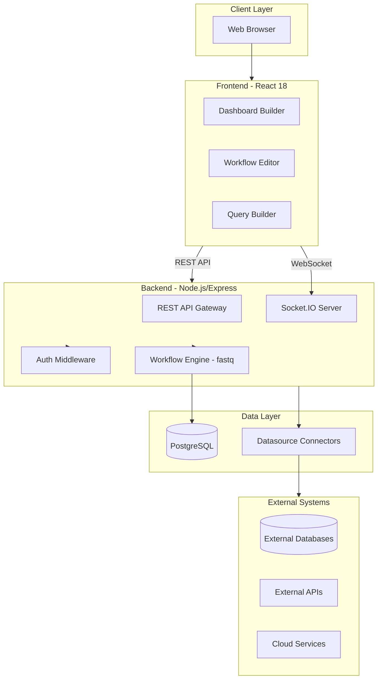

# Welcome to Jet Admin

<div align="center">


### 🚀 The Complete Platform for Building Internal Tools

**Connect your data · Build workflows · Create dashboards · Automate everything**

[](./setup/docker-deployment)
[](./api-reference/index)
[](https://github.com/Jet-labs/jet-admin)

</div>

---

## 📋 Table of Contents

- [What is Jet Admin?](#what-is-jet-admin)
- [Core Capabilities](#core-capabilities)
- [Use Cases](#use-cases)
- [Platform Architecture](#platform-architecture)
- [Key Benefits](#key-benefits)
- [Getting Started](#getting-started)
- [Documentation Structure](#documentation-structure)

---

## What is Jet Admin?

**Jet Admin** is a comprehensive open-source analytics platform and internal tools builder that empowers development teams to create production-grade admin panels, BI dashboards, data pipelines, and workflow automations—without starting from scratch.

### The Problem Jet Admin Solves

Building internal tools traditionally requires:

- ❌ Weeks of development time for basic CRUD operations
- ❌ Reinventing the wheel for common features (auth, RBAC, dashboards)
- ❌ Managing multiple services and infrastructure components
- ❌ Writing repetitive boilerplate code for data visualization
- ❌ Complex deployment and scaling configurations

### The Jet Admin Solution

Jet Admin provides a complete platform that includes:

- ✅ **Pre-built components** for common internal tool patterns
- ✅ **Visual builders** for workflows and dashboards
- ✅ **25+ data source connectors** ready to use
- ✅ **Enterprise features** like multi-tenancy and RBAC out of the box
- ✅ **Docker-ready deployment** with scalable architecture

---

## Core Capabilities

Jet Admin brings together six powerful capability areas:

### 1. 🔌 Data Connectivity

Connect to your data sources:

**Databases**
- PostgreSQL (primary focus)
- REST APIs
- Extensible connector architecture

**Cloud Services**
- Google BigQuery (via connectors)
- Google Sheets (via connectors)
- Custom integrations

**APIs & Messaging**
- REST API connector
- GraphQL (custom implementation)
- Webhook support

**Note**: Jet Admin focuses on PostgreSQL as the primary database with an extensible architecture for adding more connectors.

### 2. 📝 Query Engine

Build, test, and execute queries with ease:

- **Native SQL/NoSQL** - Write queries in your database's native language
- **Parameterized Queries** - Use dynamic variables like `{{args.userId}}`
- **AI Assistance** - Generate queries using natural language
- **Query Testing** - Test queries in real-time before saving
- **Result Caching** - Optimize performance with intelligent caching
- **Batch Operations** - Execute multiple queries in sequence

### 3. 🔄 Workflow Automation

Visual workflow builder for complex business logic:

```
┌────────────────────────────────────────────────────────────┐
│  🟢 START: New User Signup                                 │
│     ↓                                                      │
│  🔷 QUERY: Check email in database                         │
│     ↓                                                      │
│  🔀 CONDITION: Email exists?                               │
│     ├─ Yes → 📜 SCRIPT: Log duplicate attempt              │
│     │              → 🔴 END: Return error                  │
│     └─ No → 🔷 QUERY: Insert new user                      │
│                → 📧 ACTION: Send welcome email             │
│                → 🔴 END: Return success                    │
└────────────────────────────────────────────────────────────┘
```

**Available Node Types:**

| Node | Icon | Purpose |
|------|------|---------|
| Start | 🟢 | Entry point with input arguments |
| Data Query | 🔷 | Execute database/API queries |
| JavaScript | 📜 | Run custom code |
| Condition | 🔀 | Branch logic (if/else) |
| Loop | 🔁 | Iterate over arrays |
| Delay | ⏱️ | Pause execution |
| End | 🔴 | Return output |

### 4. 📊 Data Visualization

Rich widget library for data presentation:

**Chart Types**
- Bar, Line, Area charts for trends
- Pie, Donut, Polar for proportions
- Scatter, Bubble for correlations
- Radar for multivariate analysis

**Data Displays**
- Interactive tables with sorting/filtering
- Text and markdown blocks
- Custom HTML and iFrames
- KPI cards and metrics

**Features**
- Real-time data updates via WebSocket
- Auto-refresh intervals
- Export to PDF/CSV
- Custom styling and themes

### 5. 🖥️ Dashboard Builder

Create professional dashboards:

- **Drag-and-Drop** - Grid-based layout editor
- **Responsive Design** - Works on all screen sizes
- **Template System** - Save and reuse layouts
- **Multi-Page** - Organize complex dashboards
- **PDF Export** - Generate reports instantly
- **Real-Time Updates** - Live data streaming

### 6. 👥 Multi-Tenancy & Security

Enterprise-ready access control:

- **Tenant Isolation** - Complete data separation
- **Role-Based Access Control (RBAC)** - Granular permissions
- **API Key Authentication** - Machine-to-machine access
- **Audit Logging** - Track all actions
- **User Management** - Invite and manage team members

---

## Use Cases

Jet Admin is designed to handle a wide variety of internal tooling needs:

### 📊 Business Intelligence Dashboards

**Scenario**: Your leadership team needs real-time visibility into key metrics.

**Solution**: Build a dashboard with:
- KPI cards showing MRR, churn, growth
- Line charts for revenue trends
- Pie charts for customer segments
- Tables for top accounts

**Time to Build**: 2-4 hours vs 2-3 weeks traditionally

### 🔄 Data Pipeline Automation

**Scenario**: You need to sync data between systems daily.

**Solution**: Create a workflow that:
1. Fetches new orders from your database
2. Transforms the data format
3. Pushes to your analytics platform
4. Sends Slack notification on completion
5. Logs results for audit

**Time to Build**: 1-2 days vs 1-2 weeks traditionally

### 🛠️ Admin Panels

**Scenario**: Your support team needs tools to manage users.

**Solution**: Build an admin panel with:
- User search and filtering
- Profile viewing and editing
- Account status management
- Activity history
- Bulk operations

**Time to Build**: 3-5 days vs 3-4 weeks traditionally

### 📈 Analytics Reports

**Scenario**: You need to generate weekly performance reports.

**Solution**: Create a report with:
- Scheduled workflow execution
- Data aggregation queries
- Chart visualizations
- PDF export and email delivery

**Time to Build**: 1-2 days vs 1 week traditionally

---

## Platform Architecture

Jet Admin uses a modern, scalable architecture:

### High-Level Overview



### Technology Stack

| Layer | Technology | Purpose |
|-------|------------|---------|
| **Frontend** | React 18 + Vite | Modern SPA with HMR |
| **Styling** | TailwindCSS + MUI | Component library |
| **State** | React Query + Context | Data fetching & state |
| **Backend** | Node.js + Express | REST API & WebSocket |
| **Database** | PostgreSQL + Prisma | Data persistence |
| **Auth** | Firebase Auth | User authentication |
| **Queue** | fastq (in-memory) | Workflow execution |
| **Real-time** | Socket.IO | Live updates |
| **Containerization** | Docker + Compose | Deployment |

---

## Key Benefits

### ⚡ Speed of Development

- **Pre-built Components**: Don't start from scratch
- **Visual Builders**: Drag-and-drop simplicity
- **Ready Connectors**: 25+ integrations available
- **Hot Reload**: Instant feedback during development

### 💰 Cost Efficiency

- **Open Source**: No licensing fees
- **Self-Hosted**: Full control over infrastructure
- **Reduced Dev Time**: Build in days, not weeks
- **Lower Maintenance**: Platform handles complexity

### 🔒 Security & Compliance

- **Multi-Tenancy**: Complete data isolation
- **RBAC**: Granular access control
- **Audit Logs**: Track all actions
- **Encrypted Connections**: Secure data in transit

### 📈 Scalability

- **Horizontal Scaling**: Scale backend independently
- **Database Optimization**: Prisma ORM with connection pooling
- **Caching Layer**: Redis for performance (optional)
- **Load Balancing**: Docker-ready for orchestration

### 🛠️ Developer Experience

- **Modern Stack**: React, Node.js, TypeScript
- **Monorepo**: Shared packages across apps
- **Hot Reload**: Fast development cycles
- **Comprehensive Docs**: Detailed documentation

---

## Getting Started

### Prerequisites

Before you begin, ensure you have:

- **Docker & Docker Compose** (for deployment)
- **Node.js 18+** (for local development)
- **PostgreSQL 14+** (database)
- **Firebase Project** (authentication)
- **Git** (version control)

### Quick Start Path

<div align="center">

| Step | Action | Time |
|------|--------|------|
| 1 | [Docker Deployment](./setup/docker-deployment) | 5 minutes |
| 2 | [Connect Your First Datasource](./features/datasource/overview) | 5 minutes |
| 3 | [Build a Query](./features/data-query/overview) | 10 minutes |
| 4 | [Create a Dashboard](./features/dashboard/overview) | 15 minutes |
| 5 | [Automate with Workflows](./features/workflow/overview) | 20 minutes |

</div>

### Deployment Options

**Option 1: Docker (Recommended)**
```bash
git clone https://github.com/Jet-labs/jet-admin.git
cd jet-admin
docker-compose -f docker-compose.cloud.yml up -d
```
🎉 Access at `http://localhost:3000`

**Option 2: Local Development**
```bash
# Install dependencies
npm install

# Setup backend
cd apps/backend
cp .env.example .env
npx prisma migrate dev
npm run dev

# In another terminal, setup frontend
cd apps/frontend
npm run dev
```

📖 See the complete [Setup Guide](./setup/docker-deployment) for detailed instructions.

---

## Documentation Structure

This documentation is organized into logical sections to help you find what you need:

### 🚀 Getting Started

New to Jet Admin? Start here:

- [**Docker Deployment**](./setup/docker-deployment) - Quick deployment with Docker
- [**Backend Setup**](./setup/setup-backend) - Local backend development
- [**Frontend Setup**](./setup/setup-frontend) - Local frontend development

### 🏛️ Architecture

Understand how Jet Admin works under the hood:

- [**Backend Architecture**](./architecture/backend-architecture) - Express.js API structure
- [**Frontend Architecture**](./architecture/frontend-architecture) - React SPA architecture
- [**Database Schema**](./architecture/database-schema) - PostgreSQL ERD and tables
- [**Socket Events**](./architecture/socket-events) - Real-time communication

### ✨ Features

Deep dive into platform capabilities:

- [**Datasources**](./features/datasource/overview) - Connect external data sources
- [**Data Queries**](./features/data-query/overview) - Build and execute queries
- [**Workflows**](./features/workflow/overview) - Visual automation builder
- [**Widgets**](./features/widgets/charts) - Data visualization components
- [**Dashboards**](./features/dashboard/overview) - Create interactive dashboards
- [**Users & Roles**](./features/users/index) - Multi-tenant user management

### 💡 Core Concepts

Essential concepts for understanding the platform:

- [**Data Flow**](./concepts/data-flow) - How data moves through the system
- [**Workflow Architecture**](./concepts/workflow-architecture) - Execution engine details
- [**Multi-Tenancy**](./concepts/multi-tenancy) - Tenant isolation and RBAC

### 🛠️ Developer Guide

Extend and customize Jet Admin:

- [**Packages Overview**](./developer/packages-overview) - Monorepo structure
- [**Creating a Datasource**](./developer/creating-datasource) - Add new connectors
- [**Creating a Widget**](./developer/creating-widget) - Build custom widgets
- [**Creating a Workflow Node**](./developer/creating-workflow-node) - New node types

### 📡 API Reference

Complete API documentation:

- [**REST API**](./api-reference/index) - All HTTP endpoints
- [**WebSocket API**](./api-reference/websocket) - Real-time events
- [**Authentication**](./api-reference/authentication) - Auth mechanisms

### 🚀 Deployment & Operations

Production deployment guides:

- [**Production Checklist**](./deployment/production-checklist) - Go-live preparation
- [**Logging & Monitoring**](./logging/index) - Observability setup

### ❓ Troubleshooting

Need help? Find answers here:

- [**Common Issues**](./troubleshooting/troubleshooting) - Diagnostic guides
- [**FAQ**](./troubleshooting/faq) - Frequently asked questions

---

## 🆘 Getting Help

- 📖 **Documentation** - You're here! Browse the sidebar for more topics
- 💬 **GitHub Discussions** - Ask questions and share ideas
- 🐛 **GitHub Issues** - Report bugs or request features
- 📧 **Email Support** - Contact the Jet Labs team

---

## 🚀 Next Steps

<div align="center">

| Ready to Start? | Want to Learn More? | Need to Deploy? |
|-----------------|---------------------|-----------------|
| [→ Quick Start Guide](./setup/docker-deployment) | [→ Platform Overview](#what-is-jet-admin) | [→ Production Checklist](./deployment/production-checklist) |
| [→ Video Tutorials](#) | [→ Architecture Deep Dive](./architecture/backend-architecture) | [→ Monitoring Setup](./logging/index) |
| [→ Sample Projects](#) | [→ Feature Documentation](./features/datasource/overview) | [→ Troubleshooting](./troubleshooting/troubleshooting) |

</div>

---

<div align="center">

### ⭐ Ready to Build?

[Get Started Now](./setup/docker-deployment) · [View on GitHub](https://github.com/Jet-labs/jet-admin) · [Join Community](#)

**Made with ❤️ by the Jet Labs Team**

</div>
