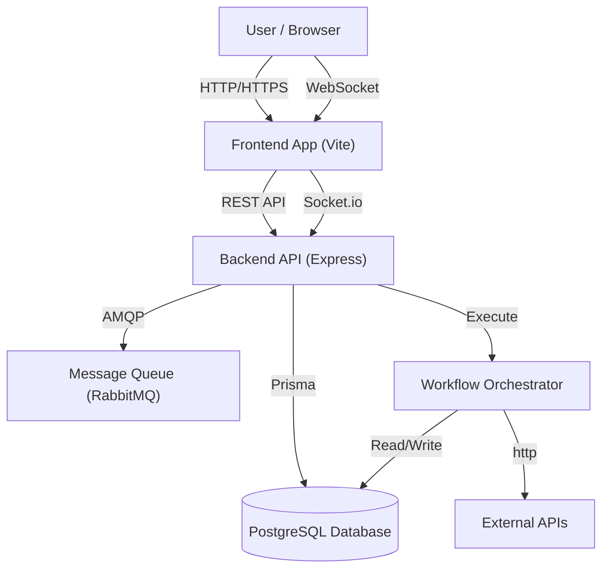

# Jet Admin CodeWiki

Welcome to the technical documentation for **Jet Admin**, a comprehensive web-based PostgreSQL management and visualization platform. This documentation is designed to help developers understand the codebase, architecture, and modules in extreme detail.

## Project Overview

**Jet Admin** allows users to:
- Manage PostgreSQL databases (DML/DDL operations).
- Visualise data using drag-and-drop dashboards.
- Build and execute complex workflows.
- Manage teams with granular role-based access control.

The project is structured as a **Monorepo** using NPM Workspaces.

## Technology Stack

### Frontend (`apps/frontend`)
- **Framework:** [React](https://reactjs.org/) (Vite)
- **UI Library:** [Material UI (MUI)](https://mui.com/)
- **State Management:** `react-query`, `Context API`
- **Editor:** Monaco Editor, React Flow (for workflows)
- **Styling:** Tailwind CSS + Emotion

### Backend (`apps/backend`)
- **Runtime:** [Node.js](https://nodejs.org/)
- **Framework:** [Express.js](https://expressjs.com/)
- **ORM:** [Prisma](https://www.prisma.io/)
- **Database:** PostgreSQL
- **Real-time:** Socket.io
- **Queue/Messaging:** `amqplib` (RabbitMQ)

### Shared Packages (`packages/`)
- `widgets`: Shared UI widgets for dashboards.
- `workflow-nodes`: Logic for workflow execution nodes.
- `datasources`: Connectors for different database types.

## High-Level Architecture

## Directory Structure

| Directory | Description |
| :--- | :--- |
| `apps/frontend` | The main React application source code. |
| `apps/backend` | The Node.js API server and background workers. |
| `packages/*` | Shared internal libraries used by both apps. |
| `docs` | This Docusaurus documentation site. |
