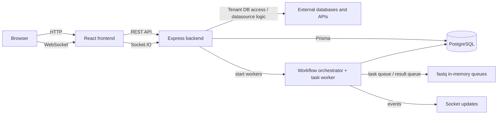

# Jet Admin

Jet Admin is a multi-tenant internal tooling platform that combines:

- a React frontend for application authoring and operations,
- an Express + Prisma backend for API, auth, tenancy, and persistence,
- a shared package layer for widgets, datasources, workflow nodes, and UI primitives,
- a visual workflow engine with real-time execution updates.

This documentation is organized to explain the system from four angles:

1. **Setup** — how to run the monorepo locally.
2. **Features** — what product areas exist and what they do.
3. **Core concepts** — how data, auth, tenancy, and workflows behave.
4. **Architecture** — how the frontend, backend, packages, and runtime fit together.

## What the platform includes

At the repository level, the current implementation supports these major capabilities:

- **Authentication and tenant-aware access control** powered by Firebase identity plus backend RBAC.
- **Tenant-scoped administration** for users, roles, permissions, and API keys.
- **Database and datasource management** for tenant-owned integrations and data access.
- **Data-query and widget-driven dashboards** for visualization and operational views.
- **Workflow authoring and execution** with DAG scheduling, retries, and live status updates.
- **Realtime features** through Socket.IO for workflow runs, AI chat, and widget-workflow coordination.
- **Developer extensibility** through internal workspace packages in `packages/`.

## Monorepo structure

Jet Admin uses **npm workspaces** from the repository root:

| Path | Purpose |
| --- | --- |
| `apps/frontend` | Vite + React application used by operators and builders. |
| `apps/backend` | Express API, Prisma access layer, socket server, cron startup, and workflow workers. |
| `packages/*` | Reusable internal packages for datasources, widgets, workflow nodes/edges, forms, and UI. |
| `docs` | This Docusaurus documentation site plus generated API reference. |

## Technology map

### Frontend

- React 18 + Vite
- React Router with nested layouts
- TanStack React Query + React Context
- MUI, Emotion, Tailwind CSS, and internal `@jet-admin/ui`
- Firebase client SDK
- Supabase client for asset-oriented integrations
- Socket.IO client
- React Flow, JSON Forms, Monaco Editor, CodeMirror

### Backend

- Node.js + Express
- Prisma + PostgreSQL
- Firebase Admin authentication verification
- Socket.IO server
- `fastq`-based in-memory workflow queues for the active workflow runtime
- `vm2` sandbox execution for scriptable workflow nodes
- `node-cron`, Winston logging, and optional syslog forwarding

### Shared packages

- Datasource packages: metadata, UI, and execution logic
- Widget packages: types, configuration UI, and processing logic
- Workflow packages: visual nodes and custom edges
- Supporting packages: JSON Forms renderers, shared UI, and template utilities

## High-level runtime view

:::info Workflow runtime note
The repository still contains a legacy/alternate `rabbitmq.config.js`, but the current workflow startup path initializes the in-memory queue adapter from `apps/backend/config/queue.config.js`.
:::

## How to read this documentation

- Start with [Backend setup](./setup/setup-backend) and [Frontend setup](./setup/setup-frontend) if you want to run the project.
- Read [Backend architecture](./architecture/backend-architecture) and [Frontend architecture](./architecture/frontend-architecture) for the current implementation model.
- Read [Data flow](./concepts/data-flow) and [Workflow architecture](./concepts/workflow-architecture) for the execution model.
- Use [Packages overview](./developer/packages-overview) when working in shared workspaces.

## Current documentation principles

This doc set is intentionally aligned to the current code on disk:

- auth docs describe **Firebase token verification and API-key auth**, not cookie-session flows,
- workflow docs describe the **current in-memory queue runtime**,
- setup docs use the **actual environment variables referenced by the code**,
- feature docs focus on the feature surface that is visibly implemented in routes, services, contexts, and packages.