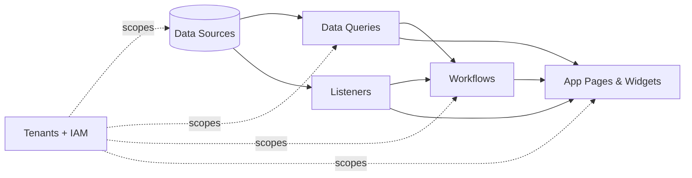

# Introduction

Jet Admin is a self-hosted internal-tools platform: connect data sources, query them, automate with workflows and listeners, and compose the results into app pages and dashboards — all scoped to isolated tenants with Casbin-enforced RBAC.

## Build order

1. Tenant — isolated workspace; everything below lives inside one (see [Tenants](../tenants/tenants.md)).
2. Data source — connection to Postgres, REST, Kafka, etc. (see [Data Source](../data-source/data-source.md)).
3. Data queries — parameterized reads/writes against a source (see [Data Query](../data-query/data-query.md)).
4. Listeners — streaming/event ingress plus pipeline actions (see [Listeners](../listeners/listeners.md)).
5. Workflows — multi-step DAG automation over queries, JS, conditions, loops, approvals (see [Workflows](../workflows/workflows.md)).
6. Widgets — charts, tables, forms bound to queries/workflows/listeners.
7. App Pages — canvas composing widgets + data sources + variables (see [App Pages & Widgets](../app-pages-widgets/app-pages-widgets.md)).
8. Administration
   1. Users
   2. Roles and permissions (see [Identity & Access Management](../identity-access-management/identity-access-management.md)).

## Platform features

- **Folders** — organize widgets, workflows, queries, listeners, cron jobs and
  app pages in per-entity folder trees (see [Folders](../platform/folders.md)).
- **Export / Import** — move any item together with its dependency closure
  between tenants as a sanitized JSON bundle (see
  [Export & Import Bundles](../platform/export-import-bundles.md)).
- **Shared widget library** — publish widgets deployment-wide and install them
  into any tenant with fresh IDs (see
  [Shared Widget Library](../platform/widget-library.md)).

## Start here

- New engineer: [Local Setup](../getting-started/local-setup.md) → [Architecture](../platform/architecture.md) → [Configuration Reference](../operations/configuration-reference.md).
- Operator: [Deployment](../operations/deployment.md) → [Observability](../operations/observability.md) → [Security](../operations/security.md).
- Integrator: [API Reference](../developers/api-reference.md) → [Export & Import Bundles](../platform/export-import-bundles.md).