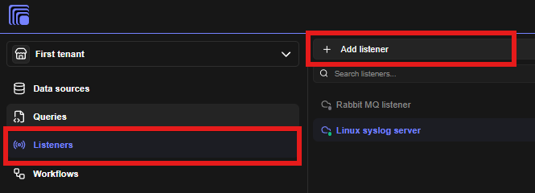
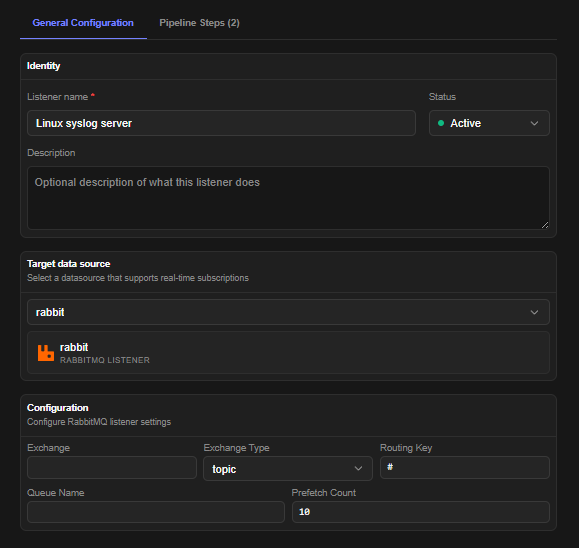
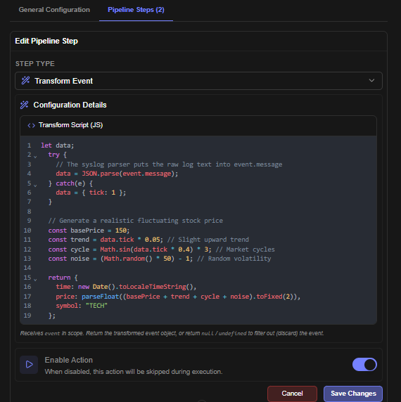
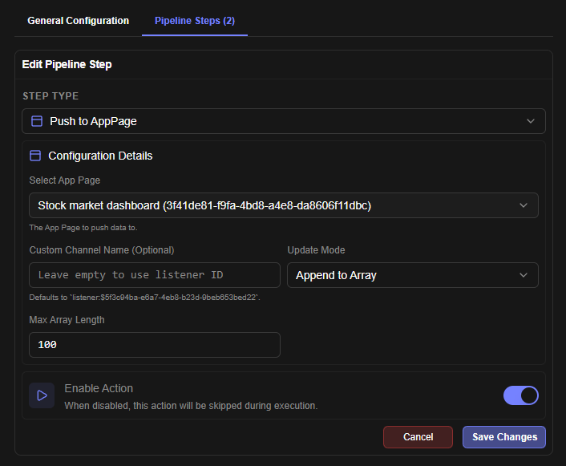
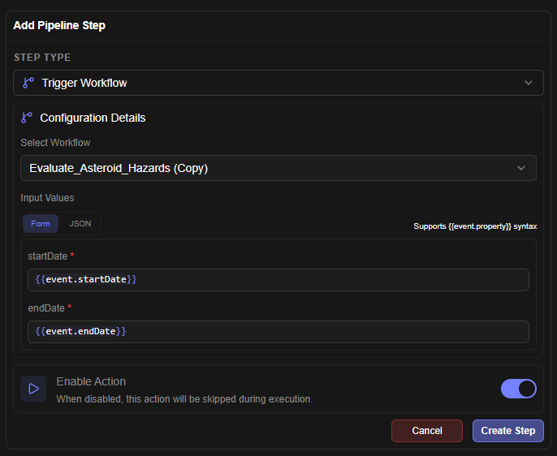

# Listeners

 Listener Module Overview

The **Listener Module** allows users to listen, subscribe to, or watch data from configured Data Sources.

### Data Processing Pipeline

Data received through listeners goes through a data pipeline, where the following steps can be added:

- Pre-processing transformations (in JS)
- Post-processing steps, such as:
  - Triggering Data queries
  - Triggering Workflows
  - Pushing live data to any widget

# Create a Listener

 Listener Configuration

1. Click on the Listeners Tab
2. Click on Add listener button in the right hand side drawer list

 Listener Configuration Steps

1. A listener configuration form will appear.
2. Select your configured data source.
3. Listener fields will appear in the form which are supported by the data source.
4. Once all the details are filled, you can click on test to test your query. If your data source is active and sending data, they will appear in console.

 Pipeline Configuration Steps

1. Once the listener is configured, you can configure post-ingestion actions & transformations also in the pipeline tab

 Sample Configuration to Push Data to App Page

This sample configuration demonstrates how to push data to a app page in real-time

 Sample Config to Trigger Workflow

This configuration snippet demonstrates how to trigger a workflow.

