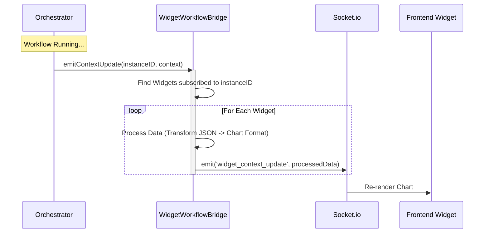

# Widget Module

The **Widget Module** (`apps/backend/modules/widget`) is responsible for defining data visualizations and connecting them to data sources (SQL Queries or Workflows).

## Architecture

The module has two distinct execution modes handled by `widget.service.js`:

1.  **Query Mode:** Direct execution of SQL queries via `dataQueryService`.
2.  **Workflow Mode:** Triggering a workflow via `workflowService` and streaming results.

## Real-time Data Bridge

The `widgetWorkflowBridge.js` is a critical component that enables real-time charts. It acts as a middleware between the **Workflow Orchestrator** and the **Frontend Widgets**.

### Bridge Data Flow

### Key Functions

#### `registerWidget(widgetID, instanceID, socket, metadata)`
Maps a connected frontend widget to a running workflow instance. Stores `metadata` (like which fields to plot) in memory.

#### `processContextForWidget(context, widgetConfig)`
Transforms raw workflow variables (e.g. `[ { x: 1, y: 10 }, { x: 2, y: 20 } ]`) into the specific format required by the widget type (e.g. Bar Chart needs separate label/value arrays). This transformation happens on the **Server Side** to reduce frontend payload size.

## Widget Service API

### `getWidgetDataByID`

**Params:** `{ widgetID, executionMode: 'ASYNC' | 'SYNC' }`

- **Async Mode (Default):**
    1. Triggers `workflowService.executeWorkflow`.
    2. Returns `{ status: "PENDING", instanceID: "..." }`.
    3. Frontend subscribes to `instanceID` via Socket.
- **Sync Mode:**
    1. Triggers workflow.
    2. Polles internal status until `COMPLETED`.
    3. Returns full payload `{ status: "COMPLETED", data: [...] }`.
