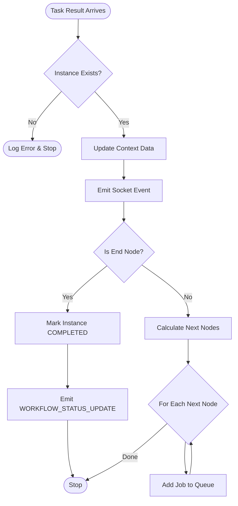
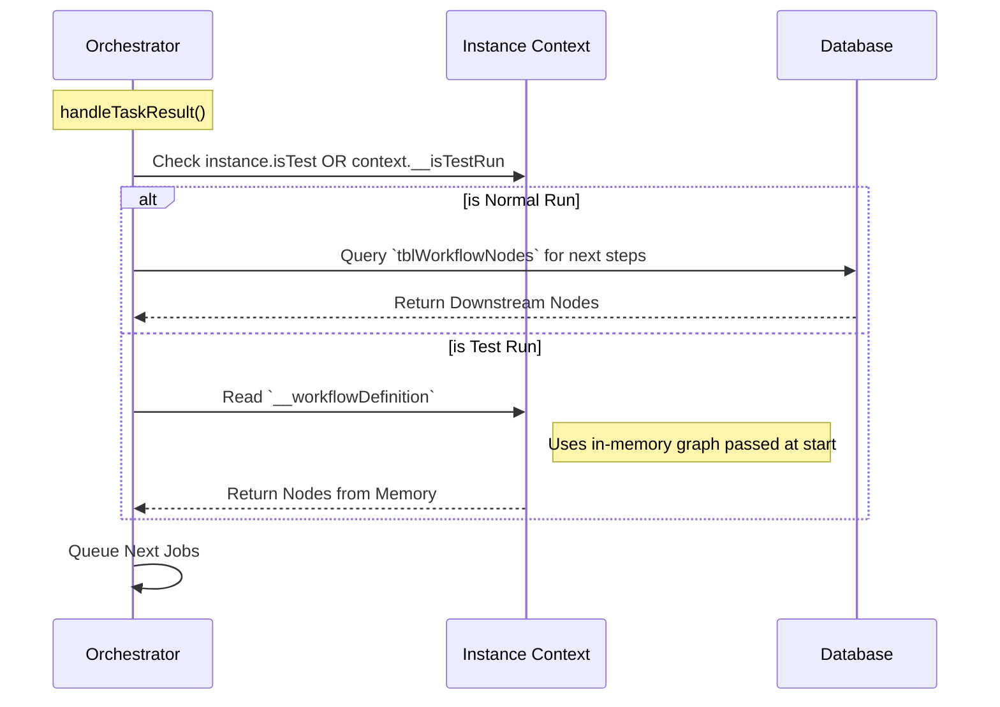
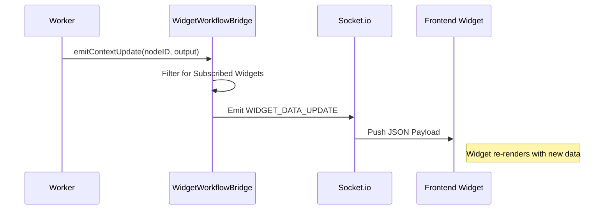

# Logic Flows

## Orchestrator State Machine

The following diagram illustrates the lifecycle of a single workflow execution step.

## Test Run vs Normal Run

How the Orchestrator distinguishes between saved workflows and test runs.

## Real-time Data Streaming

How data flows from the Worker to the Frontend Dashboard.

