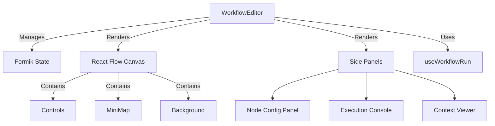

# Workflow Editor

The **Workflow Editor** (`src/presentation/components/workflowComponents/workflowEditor.jsx`) is the core UI for building automation logic. It wraps **React Flow** with custom logic for node configuration, state management, and real-time execution feedback.

## Component Structure



## State Management

The editor uses **Formik** as the single source of truth for the workflow definition.

| Field | Type | Description |
| :--- | :--- | :--- |
| `nodes` | Array | React Flow nodes array. Source of truth for the graph. |
| `edges` | Array | React Flow edges array. |
| `workflowOptions` | Object | Global settings for the workflow (e.g., arguments). |

### Syncing React Flow and Formik

React Flow maintains its own internal state for high-performance dragging. We sync this to Formik using the `onNodesChange` and `onEdgesChange` callbacks.

```javascript
const onNodesChange = useCallback(
    (changes) => {
        const updatedNodes = applyNodeChanges(changes, values.nodes);
        setFieldValue("nodes", updatedNodes);
    },
    [values.nodes, setFieldValue]
);
```

## Execution & Feedback

The editor integrates tightly with the **Execution Engine** via the `useWorkflowRun` hook.

1. **Triggering Run:**
   - User clicks "Test Run".
   - `useWorkflowRun.startTestRun()` is called with current nodes/edges.
2. **Real-time Updates:**
   - The hook connects to WebSocket.
   - When node status updates, `useWorkflowRun` updates `nodeExecutionStatus`.
3. **Visual Feedback:**
   - The `WorkflowNodesProvider` passes `nodeExecutionStatus` to custom node components.
   - Nodes change color (Green/Red) based on status.

## Key Components

### `WorkflowNodeConfigPanel`
An overlay panel that appears when a node is selected. It allows editing the `data` property of a specific node.

### `WorkflowConsole`
Displays the logs array from `useWorkflowRun`. It shows a chronological list of execution steps (Node Start, Node Complete, Error).
