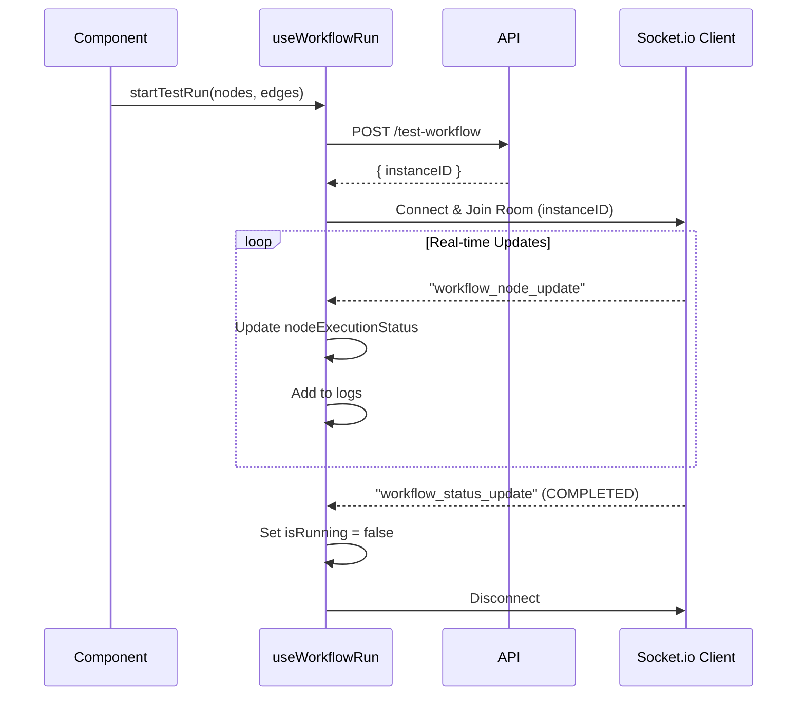

# Workflow Hooks

## `useWorkflowRun`

Located at `src/presentation/components/workflowComponents/useWorkflowRun.jsx`.

This hook encapsulates the complexity of:
1. **Starting Executions** (Test or Saved).
2. **WebSocket Connection** (Joining rooms, listening for events).
3. **Log Management** (Accumulating execution logs).
4. **State Tracking** (Running, Completed, Failed).

### Hook Interface

```javascript
const {
    isRunning,              // Boolean: is workflow currently executing?
    result,                 // Object: Final result of the run
    nodeExecutionStatus,    // Object: { [nodeId]: 'running' | 'completed' | 'failed' }
    logs,                   // Array: Log entries
    context,                // Object: Current workflow context data
    startTestRun,           // Func: Start a run with in-memory nodes
    startSavedRun,          // Func: Start a run by workflowID
    stopRun,                // Func: Terminate execution
    clearLogs               // Func: Reset logs
} = useWorkflowRun({ tenantID });
```

### Execution Flow



### Robustness Features
- **Auto-Disconnect:** Automatically cleans up socket connection on unmount or after timeout (2 mins).
- **Race Condition Guard:** Uses `isStoppingRef` to prevent processing late-arriving events after a stop command.
- **Dynamic Imports:** Loads `socket.io-client` only when needed to optimize bundle size.
