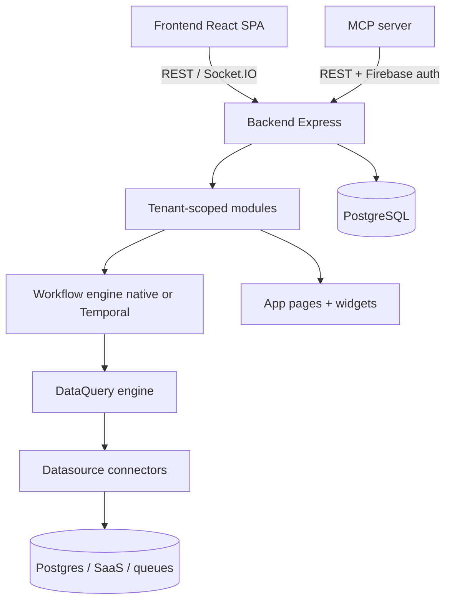

# Platform Architecture

Jet Admin is a monorepo with three main workspaces:

```
jet-admin/
├── apps/
│   ├── backend/        Express + Prisma + PostgreSQL API (`PORT`, default 8090)
│   ├── frontend/       React 18 + Vite SPA
│   ├── mcp-server/     Standalone Express MCP bridge (`PORT`, default 5001)
│   └── admin/          Legacy Vite app (superseded by frontend)
├── packages/
│   ├── ui/             @jet-admin/ui — Button, Input, Dialog, PageHeader, …
│   ├── widgets-ui/     widget renderers (WIDGETS_MAP)
│   ├── datasources-logic/
│   ├── datasource-types/
│   ├── workflow-nodes / workflow-edges
│   └── …
└── docs/               this documentation site (Docusaurus)
```



## Backend module pattern

Every feature lives in `apps/backend/modules/<name>/` and follows the same layout:

| File | Purpose |
|---|---|
| `<name>.controller.js` | Thin request handlers: log, call service, respond |
| `<name>.service.js` | Business logic + Prisma queries |
| `<name>.v1.routes.js` | Route definitions mounted under `/api/v1/tenants/:tenantID/...` |
| `<name>.validator.js` | Zod schemas validated via `utils/validation.utils` |
| `<name>.middleware.js` | Request enrichment (extract IDs for authorization) |

Conventions:

- **Responses** go through `expressUtils.sendResponse(res, success, data, error)` which *spreads* `data` into the top-level JSON body (`{ success, ...data }`).
- **Authorization** uses Casbin policies derived from `config/permissions.json`. Routes call `authMiddleware.authorize(P.<resource>.<action>)`; cross-resource checks attach extracted IDs to the request via `{ ...P.x.y, reqKey: "xIDs", skipIfMissing: true }`.
- **Creator access**: after creating a resource, services call `grantCreatorAccess(tenantID, resourceType, resourceID, authContext, userID)` from `config/casbin.config`.
- **Database models** are in `prisma/schema.prisma`, all named `tbl*`, primary keys are UUIDs generated by `gen_random_uuid()`.
- **Secrets** live in vault (`tblVaultCredentials`) or encrypted `datasourceOptions`; they must never appear in logs, exports or API responses (`utils/sensitive.js`).

All entity routers are nested inside `modules/tenant/tenant.v1.routes.js`, which also mounts the cross-cutting routers:

| Mount point | Router | Purpose |
|---|---|---|
| `/:tenantID/app-pages` | appPage | App page CRUD + versions |
| `/:tenantID/queries` | dataQuery | Data query CRUD + execution |
| `/:tenantID/widgets` | widget | Widget CRUD + file upload |
| `/:tenantID/workflows` | workflow | Workflow CRUD + engine (+ `/data-collection`) |
| `/:tenantID/datasources` | datasource | Connections + proxy + test |
| `/:tenantID/listeners` | listener | Event listeners + actions |
| `/:tenantID/cronjobs` | cronJob | Scheduled jobs + history |
| `/:tenantID/users` | userManagement | Tenant members |
| `/:tenantID/roles` | tenantRole | Custom roles + policy sync |
| `/:tenantID/apikeys` | apiKey | API keys (+ clone) |
| `/:tenantID/audit` | audit | Audit log list + CSV export |
| `/:tenantID/import` | bundle | Export/import preview + execute |
| `/:tenantID/folders` | folder | Folder organization + bulk move |
| `/:tenantID/widget-library` | widgetLibrary | Library preview/install (tenant side) |

Top-level (outside the tenant router, see `apps/backend/index.js`):

| Mount point | Purpose |
|---|---|
| `GET /health` | Unauthenticated health probe (`{status:'ok', timestamp}`); Docker/Render healthchecks target this |
| `/api/v1/auth` | Firebase session config endpoints |
| `/api/v1/operator/auth`, `/api/v1/operator` | Operator realm (platform admins; PBKDF2 + opaque sessions; no Casbin). Widget-library publish/unpublish lives here (`GET\|POST /roles`, `/permissions`, `/widget-library`) |
| `/api/v1/tenants/:tenantID/ai` | Jet Agent chat streaming (`POST /chat/stream`, `DELETE /session`) |
| `/api/v1/oauth` | Google OAuth (`/google/auth/:tenantID`, `/google/callback`) |
| `/webhooks` | Datasource webhook ingress (`/v1/inbound/:tenantID/:pathSuffix`, `/v1/inbound/:listenerID`; open CORS) |

:::warning
Earlier drafts placed the shared widget library registry at `GET /api/v1/widget-library`. That route does not exist — the registry is managed through the **operator** router (`/api/v1/operator/widget-library`), and tenants install through `/:tenantID/widget-library`. Corrected here against `apps/backend/index.js` and `modules/tenant/tenant.v1.routes.js`.
:::

## Reference graph between entities

```
AppPage ──> Widget          (appPageConfig.widgets = ["widget_<widgetID>_<suffix>", …])
AppPage ──> DataQuery       (appPageConfig.dataSources[].queryID)
AppPage ──> Workflow        (appPageConfig.dataSources[].workflowID)
AppPage ──> Listener        (appPageConfig.dataSources[].listenerID)
Widget  ──> DataQuery       (widgetConfig event actions TRIGGER_QUERY.queryID)
Widget  ──> Workflow        (widgetConfig event actions TRIGGER_WORKFLOW.workflowID)
Workflow ─> DataQuery       (workflow node nodeType="dataQuery", nodeConfig.dataQueryID)
DataQuery -> Datasource     (datasourceID column)
Listener ─> Datasource      (datasourceID column, NOT NULL)
Listener ─> Workflow/Query  (listener actions actionConfig.workflowID / .dataQueryID)
```

This graph drives export/import bundles, install previews and dependency warnings.
