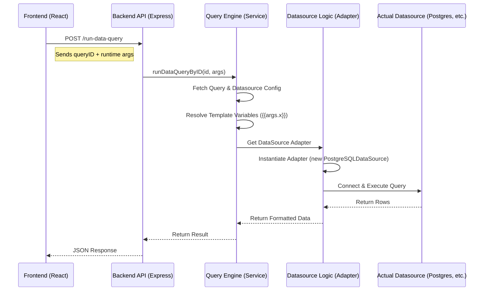

# Jet Admin Query Engine Deep Dive


This document provides a comprehensive overview of the Jet Admin Query Engine, detailing its architecture, data flow, and implementation across the frontend, backend, and shared packages.

## 1. Architecture Overview

The Query Engine is designed to be **modular**, **schema-driven**, and **extensible**. It decouples the *intent* of a query (the user configuration) from the *execution* (the actual database call).

### High-Level Data Flow



## 2. Directory Structure

The system is distributed across three main locations:

1.  **Backend Core** (`apps/backend/modules/dataQuery`): Orchestrates execution, handles API requests, and manages permissions.
2.  **Datasource Logic** (`packages/datasources-logic`): Contains the "Drivers" or adapters for each specific datasource (e.g., PostgreSQL, Stripe). This is where the actual connection code lives.
3.  **Datasource Types** (`packages/datasource-types`): Defines the *schema* (JSON Schema) for the configuration forms. This drives the UI content.
4.  **Frontend UI** (`apps/frontend/presentation/components/dataQueryComponents`): Renders the query builder and triggers execution.

---

## 3. The Backend Execution Engine

The heart of the system is the **QueryEngine** class.

**Location**: `apps/backend/modules/dataQuery/queryEngine/engine.js`

### Responsibilities:
1.  **Fetching**: Retrieving the query definition and datasource credentials (via injected fetchers).
2.  **Interpolation**: Replacing template variables (e.g., `{{args.limit}}`) with actual runtime values.
3.  **Delegation**: Loading the correct "Driver" from the Shared Registry and asking it to execute.

### Code Spotlight: `engine.js`

The `executeQuery` method is the main entry point:

```javascript
async executeQuery(dataQueryID, runtimeArgs) {
  // 1. Fetch Query
  const query = await this.queryFetcher(dataQueryID);

  // 2. Resolve Template Variables
  // This recursively walks the query options object and replaces strings
  const resolvedTemplate = await this.resolveTemplate(
    query.dataQueryOptions,
    runtimeArgs,
    dataQueryID
  );

  // 3. Get DataSource Adapter (The "Driver")
  const datasource = await this.getDataSource(query, dataQueryID);

  // 4. Execute
  const result = await datasource.execute(resolvedTemplate);
  return result;
}
```

The **Template Resolution** uses a recursive text replacement strategy:
```javascript
async resolveStringTemplate(template, runtimeArgs, ...) {
    const blocks = extractTemplateBlocks(template); // Finds {{...}}
    for (const block of blocks) {
        // SAFETY WARNING: This uses eval() to resolve paths like "args.user.id"
        const value = eval(`runtimeArgs.${block.expression}`);
        result = result.replace(block.fullMatch, value);
    }
    return result;
}
```

---

## 4. The "Driver" Layer (Datasource Logic)


This package implements the Adapter Pattern. Each datasource type (Postgres, MySQL, REST API) has its own directory.

**Location**: `packages/datasources-logic/src/data-sources/`

### The Registry
`packages/datasources-logic/src/data-sources/index.js` maintains a map of all available adapters:

```javascript
import PostgreSQLDataSource from "./postgresql/datasource";
// ... imports ...

const dataSources = {
  postgresql: PostgreSQLDataSource,
  mysql: MySQLDataSource,
  // ...
};

export default {
  getDataSource(type) {
    return dataSources[type.toLowerCase()];
  }
};
```

### The Driver Implementation
A driver must extend the base `DataSource` class and implement `execute`.

**Example: PostgreSQL Driver** (`packages/datasources-logic/src/data-sources/postgresql/datasource.js`)

```javascript
import { Client } from "pg";

export default class PostgreSQLDataSource extends DataSource {
  async execute(dataQueryOptions, context) {
    // 1. Unpack connection info from this.config (injected in constructor)
    const client = new Client({
      connectionString: this.config.datasourceOptions?.connectionString,
      ...this.config.datasourceOptions?.connectionData,
    });

    try {
      // 2. Connect
      await client.connect();
      
      // 3. Run Query (the query string comes from 'dataQueryOptions', which is fully resolved)
      const result = await client.query(dataQueryOptions.query);
      
      // 4. Return Rows
      return result.rows;
    } finally {
      await client.end();
    }
  }
}
```

---

## 5. The Frontend Query Builder

The frontend logic is heavily **schema-driven**. Instead of hardcoding forms for every database, it uses **JSON Forms** to render inputs based on a schema defined in `packages/datasource-types`.

**Location**: `apps/frontend/src/presentation/components/dataQueryComponents/`


### Key Components

1.  **`DataQueryEditor.jsx`**:
    - Selects the datasource.
    - Uses `JsonForms` to render the configuration inputs (e.g., SQL text area, checkboxes).
    - The schema comes from: `currentDatasourceType.queryConfigForm`.

    ```javascript
    // Pseudocode from DataQueryEditor.jsx
    <JsonForms
        schema={currentDatasourceType.queryConfigForm.schema}
        uischema={currentDatasourceType.queryConfigForm.uischema}
        data={dataQueryOptions}
        renderers={materialRenderers} 
        onChange={...}
    />
    ```

2.  **`DataQueryTestingForm.jsx`**:
    - The "Run" button.
    - Handles "Prompt for Arguments": If the query needs inputs (e.g., `{{args.id}}`), it opens a modal (`DataQueryArgsForm`) to ask the user for values before sending the request.
    - Calls `testDataQueryByIDAPI` or `testDataQueryByDataAPI`.

### Query Execution Flow (Frontend)

1.  User clicks **Run**.
2.  `DataQueryTestingForm` checks `dataQueryOptions.args`.
3.  If args exist, show Modal -> User enters values -> Submit.
4.  Call API:
    ```javascript
    POST /api/dataQuery/run-by-id
    {
        "dataQueryID": 123,
        "argValues": { "id": 5 }
    }
    ```

---

## 6. Adding a New Query Type

To add a new datasource type (e.g., "Snowflake"), you would:

1.  **Define Schema** (`packages/datasource-types`):
    - Create `snowflake/formConfig.json` (for connection fields).
    - Create `snowflake/queryConfig.json` (for query editor fields, e.g., SQL textarea).

2.  **Implement Driver** (`packages/datasources-logic`):
    - Create `snowflake/datasource.js`.
    - Implement `execute()` using the Snowflake Node.js driver.
    - Create `snowflake/connection.js` for `testConnection`.

3.  **Register** (`packages/datasources-logic/src/data-sources/index.js`):
    - Import and add to `dataSources` map.

4.  **Backend & Frontend** automatically pick it up due to the registry execution model.

## 7. Security & Validation

-   **Backend**: `dataQuery.middleware.js` (not shown above but exists) ensures the user belongs to the tenant.
-   **Validation**: The query options are verified against the Zod schema or JSON schema before execution in some paths (though primarily relied on Schema validation at the UI layer).
-   **Secrets**: Passwords are decrypted server-side before being passed to the Driver constructor.