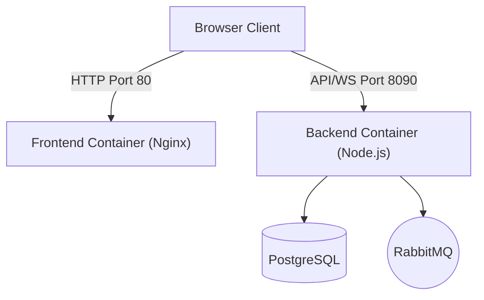

# Comprehensive Docker Deployment Guide

This guide covers deployment strategies for Jet Admin, ranging from simple single-server setups to scalable cloud-native architectures.

## Table of Contents
1. [Architecture Overview](#architecture-overview)
2. [Docker Files Explained](#docker-files-explained)
3. [Strategy 1: Single Server (Docker Compose)](#strategy-1-single-server)
4. [Strategy 2: Scalable Backend (Microservices)](#strategy-2-scalable-backend)
5. [Strategy 3: Independent Deployments (Hybrid)](#strategy-3-independent-deployments)
6. [Strategy 4: Cloud Native (Kubernetes/ECS)](#strategy-4-cloud-native)
7. [Configuration Reference](#configuration-reference)
8. [Maintenance & Troubleshooting](#maintenance--troubleshooting)



### Key Components
- **Frontend Container**: Nginx serving React static files on Port 80.
- **Backend Container**: Node.js Express API listening on Port 8090. Client connects directly.
- **PostgreSQL**: Database for data storage.
- **RabbitMQ**: Message broker for task queues.

---

## Docker Files Explained

Understanding the purpose of each file helps in customizing the deployment.

### 1. `Dockerfile.frontend`
- **Purpose**: Builds the customized Nginx container for serving the React application.
- **Key Features**:
  - Uses `nginx:alpine` as base.
  - **Multi-Stage Build**: Builds source code inside Docker.
  - **Runtime Config**: Generates `config.js` at startup using **`docker-entrypoint.frontend.sh`**.
- **Usage**: Used by the `frontend` service in Docker Compose.

### 2. `Dockerfile.backend`
- **Purpose**: Builds the Node.js API server container.
- **Key Features**:
  - Uses `node:18-slim` for small footprint.
  - Installs dependencies including local workspace packages (`@jet-admin/*`).
  - Generates Prisma client.
  - Runs migration/startup checks via entrypoint.
- **Usage**: Used by the `backend` service.

### 3. `docker-compose.yml`
- **Purpose**: The blueprint for running all services together with separated containers.
- **Services Defined**:
  - `frontend`: Port 80.
  - `backend`: Port 8090.
  - `postgres`: Database.
  - `rabbitmq`: Message queue.
- **Networking**: Creates `jet-network` to allow internal communication (e.g., `http://backend:8090`).

### 4. `nginx.frontend.conf`
- **Purpose**: Configuration for the Nginx server inside the frontend container.
- **Key Features**:
  - Listens on Port 80.
  - Serves static files from `/usr/share/nginx/html`.
  - Handles SPA routing (redirects 404 to `index.html`).
  - Enables Gzip compression.

### 5. `docker-entrypoint.backend.sh`
- **Purpose**: Script that runs every time the **backend container** starts.
- **Actions**:
  - Waits for Postgres and RabbitMQ to be ready.
  - Runs database migrations (`prisma migrate`).
  - Seeds database (if `SEED_DATABASE=true`).
  - Starts the application.

### 6. `docker-entrypoint.frontend.sh`
- **Purpose**: Script that runs every time the **frontend container** starts.
- **Actions**:
  - Takes `VITE_SERVER_HOST` and `VITE_SOCKET_HOST` environment variables.
  - Generates `config.js` in the Nginx HTML root.
  - Starts Nginx.

### 7. `.dockerignore`
- **Purpose**: Specifies files to exclude from the Docker build context (like `node_modules`, `logs`).
- **Benefit**: Reduces build time and image size.

---

## Strategy 1: Single Server
**Best for**: On-Premise, Small/Medium Business, Staging, Simple VPS.

This strategy uses `docker-compose` to run all services on a single machine. It is simple to manage and deploy.

### 1. Prerequisites
- Docker Engine & Docker Compose installed.
- Git.

### 2. Setup
```bash
# Clone repository
git clone <repo_url> jet-admin
cd jet-admin


# Configure environment
cp .env.docker .env
# Edit .env and set secure passwords!
```

### 3. Deployment
```bash
# Start all services
docker compose up -d --build
```

### 4. Verification
- **Frontend**: http://localhost (Port 80)
- **Backend**: http://localhost:8090 (Port 8090)
- **Check Status**: `docker compose ps`

---

## Strategy 2: Scalable Backend
**Best for**: High Traffic, Enterprise On-Premise, Performance focus.

To handle more concurrent users or workflows, you can scale the Backend service horizontally.

### 1. Requirements
- **Redis**: Required for Socket.IO to broadcast events across multiple backend nodes.
- **Load Balancer**: Nginx (already included) must be configured to distribute traffic.

### 2. Configuration for Scaling

**Add Redis Service**:
Add a Redis container to `docker-compose.sample.yml` and configure backend ENV:
```yaml
environment:
  - SOCKET_ADAPTER=redis
  - REDIS_URL=redis://redis:6379
```

**Scale Command**:
```bash
# Run 3 instances of backend
docker compose up -d --scale backend=3
```

**Nginx Update**:
Update `nginx.frontend.conf` upstream block to include all backend instances (Docker internal DNS usually handles `backend` round-robin automatically).

---

## Strategy 3: Independent Deployments
**Best for**: Flexibility, using PaaS (Vercel/Heroku), or segregating duties.

You can deploy the Frontend and Backend completely separately.

### 1. Frontend Only (Static Hosting)
Deploy the `apps/frontend` directory to any static host (AWS S3 + CloudFront, Vercel, Netlify).

**Build Configuration**:
Since the backend URL differs per environment, use **Runtime Configuration**:
1. Build the app: `npm run build`
2. Configure your host to inject a `config.js` file at the root:
   ```javascript
   window.JET_ADMIN_CONFIG = {
     SERVER_HOST: "https://api.yourdomain.com",
     SOCKET_HOST: "https://api.yourdomain.com"
   };
   ```

### 2. Backend Only (API Server)
Deploy the backend as a Node.js service on EC2, DigitalOcean Droplet, or Heroku.

**External Dependencies**:
You must provide connection strings to external services:
- `DATABASE_URL` -> Managed RDS / Cloud SQL.
- `RABBITMQ_URL` -> Amazon MQ / CloudAMQP.

---

## Strategy 4: Cloud Native
**Best for**: Autoscaling, High Availability, AWS/Azure/GCP.

Deploy containers using an orchestrator like Kubernetes (EKS/GKE) or Amazon ECS.

### Kubernetes Manifests (Conceptual)

**Frontend Deployment**:
- **ReplicaSet**: 2+ replicas of `jet-admin-frontend` image.
- **ConfigMap**: Mounts `config.js` with the correct Backend Service URL.
- **Ingress**: Exposes frontend to the internet.

**Backend Deployment**:
- **Deployment**: `jet-admin-backend` image.
- **HPA (Horizontal Pod Autoscaler)**: Auto-scale based on CPU/Memory.
- **Env Vars**: Injected via Secrets (DB credentials).

**Data Layer**:
- **Do NOT** run Postgres/RabbitMQ in containers for production cloud. Use managed services (AWS RDS, AWS MQ) for backups, patching, and HA.

---

## Configuration Reference

### Frontend Environment Variables
These control where the Frontend connects to. Can be set in `docker-compose.yml` or injected via `config.js`.

| Variable | Default | Description |
|----------|---------|-------------|
| `VITE_SERVER_HOST` | `http://localhost:8090` | HTTP URL of the Backend API |
| `VITE_SOCKET_HOST` | `http://localhost:8090` | WebSocket URL of the Backend |

### Backend Environment Variables
Set these in `docker-compose.yml` or `.env`.

| Variable | Description |
|----------|-------------|
| `DATABASE_URL` | Postgres connection string |
| `RABBITMQ_URL` | RabbitMQ connection string |
| `JWT_ACCESS_TOKEN_SECRET` | Secret for signing tokens |

---

## Maintenance & Troubleshooting

### Updating
To update the application with new code:
```bash
# 1. Pull changes
git pull

# 2. Rebuild Frontend Locally (Important!)
cd apps/frontend && npm install && npm run build
cd ../..

# 3. Rebuild Containers
docker compose up -d --build
```

### Backups
**Postgres**:
```bash
docker exec jet-admin-postgres pg_dump -U postgres jet_admin_db > backup_$(date +%F).sql
```

### Common Issues

**Connectivity Failures**:
- Ensure `config.js` in the frontend container contains the correct backend URL. Check via:
  `docker exec jet-admin-frontend cat /usr/share/nginx/html/config.js`

**Backend Crash on Startup**:
- Ensure all peer dependencies (like `react` for shared widgets) are installed in `apps/backend/package.json`.
- Check logs: `docker logs jet-admin-backend`

**CORS Errors**:
- Check `CORS_WHITELIST` environment variable in Backend. It must include the Frontend's URL.
