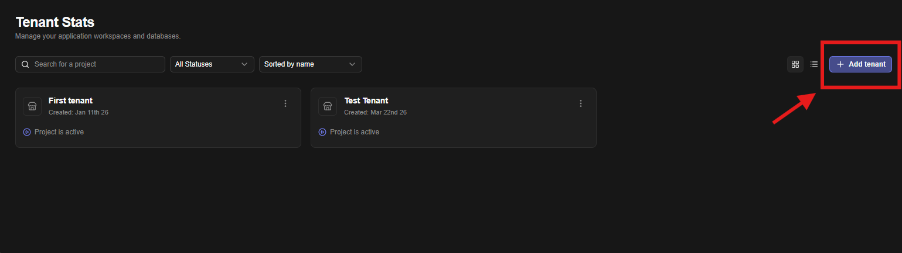
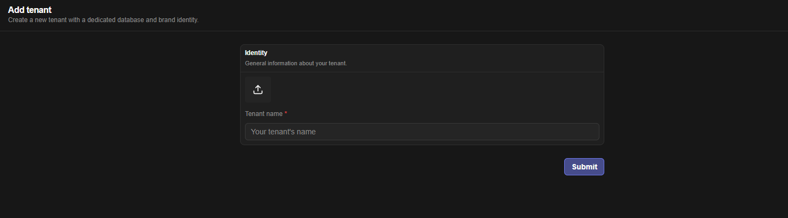

# Tenants

Jet Admin is a multi-tenant platform that lets organizations manage isolated workspaces with full data separation, independent configurations, and granular access control.

Create a tenant

1. Upload your tenant logo (optional)
2. Enter your tenant’s name

