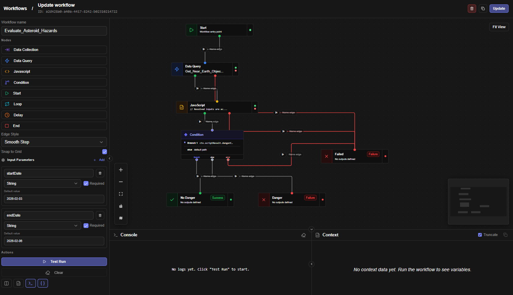

# Workflows

<a id="table-of-contents"></a>

## Table of Contents

1. [Overview](https://claude.ai/chat/cf478a4a-9d2c-4893-a616-91ed366edf25#overview)
2. [Key Concepts](https://claude.ai/chat/cf478a4a-9d2c-4893-a616-91ed366edf25#key-concepts)
3. [Workflow Lifecycle](https://claude.ai/chat/cf478a4a-9d2c-4893-a616-91ed366edf25#workflow-lifecycle)
4. [Node Types](https://claude.ai/chat/cf478a4a-9d2c-4893-a616-91ed366edf25#node-types)
  - [Start Node](https://claude.ai/chat/cf478a4a-9d2c-4893-a616-91ed366edf25#start-node)
  - [Data Query Node](https://claude.ai/chat/cf478a4a-9d2c-4893-a616-91ed366edf25#data-query-node)
  - [JavaScript Node](https://claude.ai/chat/cf478a4a-9d2c-4893-a616-91ed366edf25#javascript-node)
  - [Condition Node](https://claude.ai/chat/cf478a4a-9d2c-4893-a616-91ed366edf25#condition-node)
  - [Switch Node](https://claude.ai/chat/cf478a4a-9d2c-4893-a616-91ed366edf25#switch-node)
  - [Fan-out Node](https://claude.ai/chat/cf478a4a-9d2c-4893-a616-91ed366edf25#fan-out-node)
  - [Join Node](https://claude.ai/chat/cf478a4a-9d2c-4893-a616-91ed366edf25#join-node)
  - [Loop Node](https://claude.ai/chat/cf478a4a-9d2c-4893-a616-91ed366edf25#loop-node)
  - [Delay Node](https://claude.ai/chat/cf478a4a-9d2c-4893-a616-91ed366edf25#delay-node)
  - [Data Collection Node](https://claude.ai/chat/cf478a4a-9d2c-4893-a616-91ed366edf25#data-collection-node)
  - [Approval Node](https://claude.ai/chat/cf478a4a-9d2c-4893-a616-91ed366edf25#approval-node)
  - [Sub-Workflow Node](https://claude.ai/chat/cf478a4a-9d2c-4893-a616-91ed366edf25#sub-workflow-node)
  - [End Node](https://claude.ai/chat/cf478a4a-9d2c-4893-a616-91ed366edf25#end-node)
5. [Edge Types](https://claude.ai/chat/cf478a4a-9d2c-4893-a616-91ed366edf25#edge-types)
6. [Context & Variable System](https://claude.ai/chat/cf478a4a-9d2c-4893-a616-91ed366edf25#context-variable-system)
7. [Error Handling](https://claude.ai/chat/cf478a4a-9d2c-4893-a616-91ed366edf25#error-handling)
8. [Execution Modes](https://claude.ai/chat/cf478a4a-9d2c-4893-a616-91ed366edf25#execution-modes)
9. [Real-Time Monitoring](https://claude.ai/chat/cf478a4a-9d2c-4893-a616-91ed366edf25#real-time-monitoring)
10. [Workflow Triggers](https://claude.ai/chat/cf478a4a-9d2c-4893-a616-91ed366edf25#workflow-triggers)
11. [Best Practices](https://claude.ai/chat/cf478a4a-9d2c-4893-a616-91ed366edf25#best-practices)

* * *

<a id="overview"></a>

## Overview

The Jet Admin Workflow Engine is a visual, DAG-based (Directed Acyclic Graph) automation platform that allows you to build, test, and deploy multi-step business processes without writing backend infrastructure code.



Workflows are built by connecting **nodes** on a canvas. Each node represents a discrete unit of work — querying a database, running a script, branching on a condition, collecting input from a user, or pausing for a set duration. Nodes pass data to one another through a shared **execution context**, which acts as the workflow's live memory throughout a run.

Workflows can be triggered manually, via API, or linked directly to UI widgets inside Jet Admin apps.

* * *

<a id="key-concepts"></a>

## Key Concepts

<a id="nodes"></a>

### Nodes

Nodes are the building blocks of a workflow. Each node has a specific type that determines what it does. Nodes are visually represented as cards on the workflow canvas and are connected by edges.

<a id="edges"></a>

### Edges

Edges are the directional connections between nodes. They represent the flow of execution from one node to the next. Edges connect to specific **handles** on each node (for example, `success`, `error`, `loop`, `completed`), allowing you to route execution along different paths depending on the outcome of a node.

<a id="execution-context-ctx"></a>

### Execution Context (`ctx`)

The execution context is a shared key-value store that persists for the lifetime of a single workflow run. Every node reads from and writes to this context. When a node completes, its output is stored in the context under a name you define (the **Output Variable**). Subsequent nodes can reference that data using template expressions like `{{ctx.outputVariableName}}`.

The context always includes `ctx.input`, which holds the input parameters passed when the workflow was triggered.

<a id="template-expressions"></a>

### Template Expressions

Data is referenced between nodes using double-curly-brace (`{{ }}`) template syntax. These expressions are resolved at runtime against the current execution context.

| Expression | Description |
| --- | --- |
| `{{ctx.input.userId}}` | A workflow input parameter named `userId` |
| `{{ctx.queryResult}}` | The output of a node whose Output Variable is `queryResult` |
| `{{ctx.queryResult[0].name}}` | The `name` field of the first row returned by a query node |
| `{{ctx.item}}` | The current item in a Loop node's iteration |
| `{{ctx.item.email}}` | A field on the current loop item |

You can also use template expressions for **string interpolation**: `"Order ID: {{ctx.input.orderId}}"` will produce a string like `"Order ID: 4821"`.

<a id="output-variables"></a>

### Output Variables

Every node that produces data has an **Output Variable** field. This is the key under which the node's result will be stored in the execution context. Output variable names must be unique across all nodes in a workflow and must start with a letter or underscore (e.g., `queryResult`, `userData`, `isApproved`).

<a id="workflow-instances"></a>

### Workflow Instances

Each time a workflow is executed, a new **instance** is created. Instances track the execution status (`RUNNING`, `COMPLETED`, `FAILED`), all node execution logs, and the full execution context. Instances are uniquely identified by an **Instance ID**.

* * *

<a id="workflow-lifecycle"></a>

## Workflow Lifecycle

A workflow run follows this general sequence:

1. **Trigger** — The workflow is initiated (manually, via API, or from a widget).
2. **Start Node Executes** — The entry point node fires, placing input parameters into the context.
3. **DAG Traversal** — The engine evaluates which nodes are ready to execute based on which upstream nodes have completed, then dispatches them to a processing queue.
4. **Node Execution** — Each node runs, reads from the context, performs its work, and writes its output back to the context.
5. **Edge Routing** — Based on the node's outcome (e.g., `success` vs. `error`), the engine follows the appropriate outgoing edge to determine the next node(s).
6. **Termination** — Execution ends when an **End Node** is reached, completing or failing the instance.

<a id="parallel-execution-join-behaviour"></a>

### Parallel Execution & Join Behaviour

When a node has multiple outgoing edges (a **fan-out**), downstream nodes can execute in parallel. When a node has multiple incoming edges (a **join**), you can configure whether it waits for **all** upstream nodes to complete before running (`Wait for All`), or whether it fires as soon as **any one** upstream node completes (`Trigger on Any`). This is set per-node in the **Advanced Settings** panel.

* * *

<a id="node-types"></a>

## Node Types

<a id="start-node"></a>

### Start Node

**Purpose:** The mandatory entry point of every workflow. There can only be one Start Node per workflow.

The Start Node receives the workflow's input parameters and makes them available throughout the rest of the workflow via `{{ctx.input.*}}`. It does not execute any business logic itself — it simply marks the beginning of the run and passes control to the first connected node.

**Configuration:**

| Field | Description |
| --- | --- |
| Title | The display name for the node on the canvas |
| Description | An optional note documenting the workflow's purpose |

**Input Parameters** are not configured on the Start Node itself — they are defined in the **Input Parameters** panel on the left sidebar of the Workflow Editor. Each parameter has a name (key), a data type, a required flag, and an optional default value.

Supported parameter types: `string`, `number`, `boolean`, `object`, `array`.

**Output handle:** `output` — connects to the first node in the workflow.

**Accessing inputs in subsequent nodes:**

```
{{ctx.input.parameterName}}
{{ctx.input.userId}}
{{ctx.input.email}}

```

* * *

<a id="data-query-node"></a>

### Data Query Node

**Purpose:** Executes a saved Data Query against a configured datasource (e.g., PostgreSQL, REST API). The result is stored in the execution context for use by later nodes.

This node references an existing query that has been defined and saved elsewhere in Jet Admin. Input values for the query's parameters are provided at the node level, using template expressions to bind them to the live context.

**Configuration:**

| Field | Description |
| --- | --- |
| Title | Display name for the node |
| Description | Optional documentation |
| Data Query | The saved query to execute, selected from a searchable dropdown |
| Inputs | Mapped values for each of the query's input parameters |
| Output Variable | The context key where the query result will be stored |
| Timeout (seconds) | Maximum time the query is allowed to run (default: 300, max: 3600) |
| Retry Attempts | How many times to retry on failure (0–10) |
| Retry Delay (seconds) | Wait time between retries (1–300) |
| Error Behaviour | What to do if the node fails (see [Error Handling](https://claude.ai/chat/cf478a4a-9d2c-4893-a616-91ed366edf25#error-handling)) |
| Skip this node | If enabled, the node is bypassed entirely during execution |

**Input binding examples:**

| Expression | Description |
| --- | --- |
| `{{ctx.input.userId}}` | Pass a workflow input directly to the query |
| `{{ctx.fetchUser.id}}` | Pass a field from a previous node's output |
| `Order-{{ctx.input.id}}` | String interpolation |

**Output handles:** `success`, `error`

**Accessing results:**

```
{{ctx.outputVariableName}}           — the full result set
{{ctx.outputVariableName[0].name}}   — first row, name column

```

* * *

<a id="javascript-node"></a>

### JavaScript Node

**Purpose:** Executes custom JavaScript logic inside a secure sandbox. Use this node for data transformation, computation, validation, or any logic that cannot be expressed with the other node types.

The code runs in an isolated environment. It has access to the full execution context via the `ctx` variable and can use a safe subset of JavaScript globals (`JSON`, `Math`, `Date`, `Array`, `Object`, `String`, `Number`, `Boolean`, `parseInt`, `parseFloat`). Network access, filesystem access, and external libraries are not available.

**Configuration:**

| Field | Description |
| --- | --- |
| Title | Display name for the node |
| Description | Optional documentation |
| JavaScript Code | The code to execute. Must use `return` to produce an output value |
| Output Variable | The context key where the returned value will be stored |
| Timeout (seconds) | Execution time limit (default: 30, max: 300) |
| Retry Attempts | Retries on failure (0–10) |
| Retry Delay (seconds) | Wait between retries (1–300) |
| Error Behaviour | Behaviour on failure (see [Error Handling](https://claude.ai/chat/cf478a4a-9d2c-4893-a616-91ed366edf25#error-handling)) |
| Skip this node | Bypass this node during execution |

**Accessing context in code:**

```
// Workflow input parameters
ctx.input.paramName

// Output from a previous node
ctx.queryResult
ctx.queryResult[0].name

// Current loop item (when inside a Loop node)
ctx.item
ctx.item.email

```

**Code must use** `return` **to produce a value:**

```
// Transform data
const user = ctx.fetchUser[0];
return {
  fullName: user.first_name + " " + user.last_name,
  isVerified: user.status === "active"
};

```

```
// Conditional logic
const order = ctx.orderData[0];
if (order.total > 10000) {
  return { requiresApproval: true, level: "director" };
}
return { requiresApproval: false };

```

```
// Data aggregation
const orders = ctx.allOrders;
const total = orders.reduce((sum, o) => sum + o.amount, 0);
return {
  count: orders.length,
  total: total,
  average: total / orders.length
};

```

**Output handles:** `success`, `error`

* * *

<a id="condition-node"></a>

### Condition Node

**Purpose:** Branches the workflow along different paths based on evaluated conditions. It is the primary decision-making node in Jet Admin workflows.

The Condition Node evaluates one or more **branches** in order from top to bottom. The first branch whose conditions are satisfied determines the outgoing path. If no branch matches, execution follows the `else` path.

Each branch has a **label** (which becomes the name of the outgoing edge handle), a **condition logic** setting (`AND` or `OR`), and one or more individual **conditions**.

**Configuration:**

| Field | Description |
| --- | --- |
| Title | Display name for the node |
| Description | Optional documentation |
| Branches | The list of conditional branches, evaluated in order |
| On Error | Behaviour if evaluation itself fails |

**Branch structure:**

Each branch contains:

- **Label** — The name for this path (e.g., "VIP Customer", "Approved", "High Risk"). This becomes the handle name on the canvas.
- **Condition Logic** — `AND` (all conditions must be true) or `OR` (any condition must be true).
- **Conditions** — One or more condition rows.

**Condition operators:**

| Operator | Description | Example |
| --- | --- | --- |
| Equals | Left value equals right value | `{{ctx.status}}` equals `active` |
| Not Equals | Left value does not equal right value | `{{ctx.role}}` not equals `guest` |
| Contains | Left value contains the right value as a substring | `{{ctx.email}}` contains `@company.com` |
| Doesn't Contain | Left value does not contain the right value | `{{ctx.tags}}` doesn't contain `blocked` |
| Starts With | Left value begins with the right value | `{{ctx.code}}` starts with `ORD-` |
| Ends With | Left value ends with the right value | `{{ctx.filename}}` ends with `.pdf` |
| Greater Than | Left numeric value is greater than right | `{{ctx.amount}}` greater than `1000` |
| Less Than | Left numeric value is less than right | `{{ctx.score}}` less than `50` |
| ≥ Or Equal | Greater than or equal to | `{{ctx.age}}` ≥ `18` |
| ≤ Or Equal | Less than or equal to | `{{ctx.retries}}` ≤ `3` |
| Is Empty | Value is null, undefined, or empty string/array | `{{ctx.approvalComment}}` is empty |
| Is Not Empty | Value has a non-empty value | `{{ctx.attachments}}` is not empty |
| Matches Regex | Left value matches a regular expression pattern | `{{ctx.email}}` matches `^[^\s@]+@[^\s@]+\.[^\s@]+$` |
| JS Expression | A raw JavaScript expression (returns `true` or `false`) | `ctx.score > 80 && ctx.tier === 'gold'` |

> **Note on JS Expression:** Unlike other operators, JS Expression uses `ctx.variable` syntax directly (without `{{ }}`), as it runs as raw JavaScript code.

**Output handles:** One handle per branch (named after the branch label) + `else` (default path) + `error`.

**Evaluation order:** Branches are evaluated top to bottom. The first matching branch is taken. Remaining branches are not evaluated.

* * *

<a id="switch-node"></a>

### Switch Node

**Purpose:** Routes on a single value across many named cases — a cleaner fit than Condition when one variable decides between 3+ paths (e.g. `{{ctx.trend}}` → `bull` / `bear` / `flat`).

The switch value (template or literal) is compared against each case in order; the first match wins, otherwise execution follows `default`.

**Configuration:**

| Field | Description |
| --- | --- |
| Switch Value | Template or literal to match (e.g. `{{ctx.status}}`) |
| Cases | Ordered list of `{ label, operator, matchValue }`. Operators: `equals` (default), `not_equals`, `contains`, `greater_than`, `less_than`, `expression` (raw JS with `ctx` in scope, same convention as Condition) |
| Error Behaviour | Behaviour on evaluation failure |

**Output handles:** One handle per case (named by case id) + `default` + `error`.

* * *

<a id="fan-out-node"></a>

### Fan-out Node

**Purpose:** Fires **every** connected branch — the explicit way to split one path into parallel paths (e.g. refresh cache *and* send digest *and* update dashboard). Pair with a Join node to reconverge.

Branches execute sequentially in sorted order (deterministic path parallelism, not threads — the shared-context model forbids concurrent mutation).

**Configuration:**

| Field | Description |
| --- | --- |
| Branches | Named branch handles; all fire, unconditionally |

**Output handles:** One handle per branch + `error`.

* * *

<a id="join-node"></a>

### Join Node

**Purpose:** Barrier + merge for reconverging branches. Waits per its barrier mode, then collects the listed source variables into one object for downstream nodes.

**Configuration:**

| Field | Description |
| --- | --- |
| Barrier Mode | `all` (wait for every upstream, default) or `any` (fire on first upstream) |
| Collect Variables | Upstream output variables to merge (checkbox list in the editor) |
| Output Variable | The context key for the merged object (default: `joined`) |
| Require all | Missing variable fails the node instead of resolving to `null` |

**Output handles:** `output`, `error`.

> Fan-out → N branches → Join(`all`) is the standard split/reconverge pattern. A join fires only when its barrier is satisfied; unconnected or never-completing upstreams stall it like any other join.

* * *

<a id="loop-node"></a>

### Loop Node

**Purpose:** Iterates over an array, executing the downstream nodes once for each item. Use this when you need to perform the same operation on multiple records — for example, sending a notification to each user in a list, or processing each row returned by a query.

The Loop Node emits one item at a time. For each item, it follows the `loop` handle to the body of the loop. After all items have been processed, it follows the `completed` handle to continue the rest of the workflow.

**Configuration:**

| Field | Description |
| --- | --- |
| Title | Display name for the node |
| Description | Optional documentation |
| Source Array | Template expression resolving to the array to iterate over (e.g., `{{ctx.userList}}`) |
| Item Variable Name | The context key for the current item (default: `item`, accessible as `ctx.item`) |
| Index Variable Name | The context key for the current index (default: `index`, accessible as `ctx.index`) |
| Max Iterations | Safety cap on iterations to prevent runaway loops (default: 1000, max: 100,000) |
| Delay Between Items (ms) | Optional pause between each iteration (0–60,000 ms) |
| Error Behaviour | What to do if a node in the loop body fails |
| Skip this node | Bypass the loop entirely |

**Accessing loop variables inside the loop body:**

```
{{ctx.item}}           — the current array element
{{ctx.item.email}}     — a field on the current element
{{ctx.index}}          — the current 0-based iteration index (0, 1, 2, …)

```

**Output handles:** `loop` (executes for each item), `completed` (executes after all items are done), `error`.

**Loop body design pattern:**

```
Loop Node ──(loop)──→ [Node A] ──→ [Node B] ──→ (back to Loop Node)
          └─(completed)──→ [Next Step]

```

> **Important:** The last node in the loop body must connect back to the Loop Node to allow it to advance to the next item. When the Loop Node detects all items have been processed, it automatically exits via the `completed` handle.

* * *

<a id="delay-node"></a>

### Delay Node

**Purpose:** Pauses workflow execution for a specified duration before continuing. Use this for rate limiting, scheduled follow-ups, polling patterns, or simply adding a gap between steps.

The Delay Node is **non-blocking** — it does not hold a process thread open. Instead, it schedules the next step to be queued after the delay period, which means large delays (even hours) are handled efficiently.

**Configuration:**

| Field | Description |
| --- | --- |
| Title | Display name for the node |
| Description | Optional documentation |
| Delay Type | `Fixed Duration`, `From Variable`, or `Until Time` |
| Skip this node | Bypass the delay |

**Delay type options:**

**Fixed Duration** — Specify an exact wait period using minutes, seconds, and milliseconds. These values are additive.

| Sub-field | Range | Description |
| --- | --- | --- |
| Minutes | 0–1440 | Number of full minutes to wait |
| Seconds | 0–59 | Additional seconds |
| Milliseconds | 0–999 | Additional milliseconds |

**From Variable** — The delay duration (in milliseconds) is resolved from the execution context at runtime. The referenced variable must resolve to a numeric millisecond value.

```
{{ctx.calculatedDelay}}
{{ctx.input.waitMs}}

```

**Until Time** — Waits until a specific ISO 8601 datetime string. If the time is already in the past when the node executes, it proceeds immediately.

```
2025-01-31T09:00:00Z
{{ctx.scheduledTime}}

```

Maximum delay: **24 hours**.

**Output handles:** `output` (after the delay completes), `error`.

* * *

<a id="data-collection-node"></a>

### Data Collection Node

**Purpose:** Suspends the workflow and waits for a human to provide data through a form before the workflow can continue. This enables human-in-the-loop automation patterns — for example, requiring a manager to approve an order, asking an analyst to fill in a missing value, or prompting a user to confirm an action.

When this node executes, the workflow **pauses**. A form modal appears in the Jet Admin interface for the relevant user. The workflow only resumes once the user submits the form.

If the collection request is not fulfilled within the configured expiry period, the request expires and the workflow remains suspended until addressed or administratively resolved.

**Configuration:**

| Field | Description |
| --- | --- |
| Modal Title | The heading shown on the form modal (e.g., "Approval Required") |
| Instructions | Explanatory text shown to the user inside the modal |
| Collection Method | Currently `UI Form` — the form is rendered inside Jet Admin |
| Form Fields | The list of fields the user must fill in |
| Output Variable | The context key where the submitted data will be stored (default: `collectedData`) |
| Expiry (minutes) | How long before the request expires (0 = never expires) |

**Form field configuration:**

Each field in the form has the following properties:

| Property | Description |
| --- | --- |
| Key | The field's identifier in the submitted data (e.g., `approvalComment`) |
| Label | The display label shown to the user (e.g., "Approval Comment") |
| Type | The field type: `Text`, `Long text`, `Number`, `Checkbox`, or `Dropdown` |
| Placeholder | Optional hint text shown inside the field |
| Required | Whether the user must fill in this field before submitting |
| Options | For Dropdown type: comma-separated list of options |

**Accessing submitted data in subsequent nodes:**

```
{{ctx.collectedData}}                    — the full submitted object
{{ctx.collectedData.approvalComment}}    — a specific field
{{ctx.collectedData.approved}}           — a boolean checkbox field

```

**Output handles:** `output` (after successful submission), `error`.

**Workflow behaviour during suspension:**

- The workflow instance remains in `RUNNING` status while waiting.
- The user sees an "Input Required" indicator in the workflow execution panel.
- Submitting the form resumes the workflow automatically.
- If the user closes the modal without submitting, they can reopen it from the "Input Required" button that appears in the execution panel.
- The Data Collection Node supports idempotent re-delivery — if the system sends the form prompt more than once (e.g., due to a page refresh), the same request is reused rather than creating a duplicate.

* * *

<a id="approval-node"></a>

### Approval Node

**Purpose:** Human approve/reject decision step — a specialized Data Collection with three explicit buttons (Accept / Reject / Cancel) plus comment, decision routing, and expiry routing. The workflow suspends until someone decides; Cancel dismisses the dialog without deciding and the run stays paused.

**Configuration:**

| Field | Description |
| --- | --- |
| Approvers | Display-only hint of who should decide |
| Require comment | Makes the comment field mandatory |
| Accept / Reject / Cancel button text | Labels for the three modal buttons (defaults: Accept, Reject, Cancel) |
| Expiry (minutes) | Wait limit (`0` = never expires) |
| On Timeout | `expired` (route to the `expired` handle, default) or `fail` (fail the run like Data Collection) |
| Output Variable | The context key for `{ approved, comment }` (default: `approval`) |

**Output handles:** `approved`, `rejected`, `expired`, `error`.

* * *

<a id="sub-workflow-node"></a>

### Sub-Workflow Node

**Purpose:** Runs another saved workflow (a sub-playbook) synchronously and maps its result back into the parent context. Use this to compose reusable playbooks — e.g. a "Crypto Intelligence Pipeline" parent that calls a shared "FX Rates" child.

**Context model (isolated):** The child sees **only** the mapped inputs as its `ctx.input` — never the parent context. On success the parent receives `{{ctx.outputVariable}}` (the child's End-node outputs), plus `childInstanceID` / `childStatus` for audit. With **Merge child outputs** enabled, the child's public top-level outputs are additionally spread into the parent context (child wins; `input` is never overwritten).

**Configuration:**

| Field | Description |
| --- | --- |
| Child Workflow | The saved workflow to run (current workflow excluded — self-calls are blocked) |
| Child Inputs | Mapped values for the child's input parameters; supports `{{ctx.*}}` templates. Guided by the child's declared inputs |
| Output Variable | The context key for the child result (default: `subResult`) |
| Merge child outputs | Spread child outputs into the parent context (default: off) |
| Max Nesting Depth | Recursion guard, 1–10 (default: 5). Depth is tracked via `__subDepth` |
| Timeout (seconds) | Caps the total child wait (default: 300, max: 3600). Keep above the child's expected duration |
| Retry Attempts / Delay / Error Behaviour / Skip | Same semantics as Data Query nodes |

The child runs as a **real instance** with its own history, linked to the parent via `parentInstanceID` / `parentNodeID` (filterable in run history). Triggering a parent requires `workflow.execute` on each child. Bundle export/import follows `childWorkflowID` automatically.

**Output handles:** `success`, `error`

* * *

<a id="end-node"></a>

### End Node

**Purpose:** Terminates the workflow run and optionally maps node outputs to named workflow-level outputs. Every workflow must have at least one End Node. You can have multiple End Nodes for different completion paths (e.g., one for success, one for a failure branch).

**Configuration:**

| Field | Description |
| --- | --- |
| Title | Display name for the node |
| Description | Optional documentation |
| Completion Status | `Success`, `Failure`, or `Cancelled` — records the intended outcome |
| Output Parameters | Named outputs that will be returned by the workflow when it completes |

**Output Parameters:**

Each output parameter maps a name to a source value from the execution context:

| Property | Description |
| --- | --- |
| Name | The key for this output (e.g., `createdUserId`, `totalRevenue`) |
| Source Variable | A template expression resolving to the value (e.g., `{{ctx.createUser[0].id}}`) |
| Description | Optional note on what this output represents |

**No output handles** — the End Node is terminal.

* * *

<a id="edge-types"></a>

## Edge Types

Edges connect nodes and define the flow of execution. Each edge connects from a **source handle** on one node to the **target handle** on the next. The handle determines which execution outcome triggers that path.

<a id="visual-edge-styles"></a>

### Visual Edge Styles

The edge style is a cosmetic preference and does not affect execution. Available styles:

| Style | Description |
| --- | --- |
| Bezier (Curved) | Smooth curved lines (default) |
| Straight | Direct straight lines between nodes |
| Step (Sharp) | Right-angled lines with sharp corners |
| Smooth Step | Right-angled lines with rounded corners |
| Simple Bezier | A simpler curved variant |

<a id="error-edges"></a>

### Error Edges

Any connection from an `error` handle is displayed in **red** regardless of the visual style setting, to visually distinguish error paths from normal execution paths.

<a id="edge-labels"></a>

### Edge Labels

Edges can be given labels by clicking on the edge label area on the canvas. Labels are cosmetic — they document the intent of a connection but do not affect routing.

<a id="standard-source-handles-by-node-type"></a>

### Standard Source Handles by Node Type

| Node | Handle | Description |
| --- | --- | --- |
| Start | `output` | Connects to the first step in the workflow |
| Data Query | `success` | Query executed successfully |
| Data Query | `error` | Query failed |
| JavaScript | `success` | Script executed and returned a value |
| JavaScript | `error` | Script threw an error |
| Condition | *(branch label)* | One handle per defined branch (named by label) |
| Condition | `else` | No branch conditions were matched |
| Condition | `error` | Condition evaluation itself failed |
| Loop | `loop` | Fires for each item in the array |
| Loop | `completed` | Fires after all items have been processed |
| Loop | `error` | Loop encountered an error |
| Delay | `output` | Fires after the delay period has elapsed |
| Delay | `error` | Delay configuration was invalid |
| Data Collection | `output` | User submitted the form |
| Data Collection | `error` | An error occurred creating or managing the request |
| Approval | `approved` / `rejected` | Human approved / rejected |
| Approval | `expired` | Wait timed out (`onTimeout: expired`) |
| Approval | `error` | An error occurred creating or managing the request |
| Switch | *(case id)* | First matching case |
| Switch | `default` | No case matched |
| Switch | `error` | Evaluation failed |
| Fan-out | *(branch id)* | Every branch fires |
| Fan-out | `error` | Fan-out configuration was invalid |
| Join | `output` | Barrier satisfied, variables merged |
| Join | `error` | A required variable was missing |
| Sub-Workflow | `success` | Child workflow completed successfully |
| Sub-Workflow | `error` | Child workflow failed |
| End | *(none)* | Terminal node — no outgoing handles |

* * *

<a id="context-variable-system"></a>

## Context & Variable System

<a id="how-context-works"></a>

### How Context Works

The execution context (`ctx`) is a flat key-value store that accumulates data as the workflow runs. Each time a node completes successfully, its output is merged into the context under its configured Output Variable name. Later nodes can reference any previously stored value.

The context is assembled from the workflow's full execution log in chronological order. If two nodes write to the same key, the later write wins.

<a id="reserved-context-keys"></a>

### Reserved Context Keys

| Key | Description |
| --- | --- |
| `ctx.input` | The workflow's input parameters, provided at trigger time |
| `ctx.item` | The current loop item (set by a Loop Node during iteration) |
| `ctx.index` | The current loop index (set by a Loop Node during iteration) |

<a id="naming-rules-for-output-variables"></a>

### Naming Rules for Output Variables

- Must start with a letter or underscore: `a–z`, `A–Z`, `_`
- May contain letters, digits, and underscores: `a–z`, `A–Z`, `0–9`, `_`
- Must be **unique** across all nodes in the workflow
- Examples of valid names: `queryResult`, `userData`, `isApproved`, `_tempValue`, `step2Output`
- Examples of invalid names: `query result` (spaces), `2ndResult` (starts with digit), `query-result` (hyphen)

<a id="template-expression-reference"></a>

### Template Expression Reference

| Syntax | Result |
| --- | --- |
| `{{ctx.variableName}}` | The full value of `variableName` in the context |
| `{{ctx.variableName[0]}}` | The first element of an array result |
| `{{ctx.variableName[0].fieldName}}` | A specific field from the first row |
| `{{ctx.input.paramName}}` | An input parameter provided at trigger time |
| `prefix-{{ctx.input.id}}` | String interpolation — combines literal text with a context value |

* * *

<a id="error-handling"></a>

## Error Handling

Each node (except Start and End) can be configured with an **Error Behaviour** setting that determines what happens if that node fails.

| Option | Description | When to Use |
| --- | --- | --- |
| **Fail Workflow** | Stop execution immediately and mark the workflow as FAILED | Critical operations where failure means the whole process must stop |
| **Continue** | Ignore the error and proceed via the `error` handle; the node's output will be `null` | Non-critical steps where failure is expected and can be handled downstream |
| **Retry, then Continue** | Retry the node up to the configured number of times, then continue via the `error` handle if still failing | Flaky external services or network calls |
| **Retry, then Fail** | Retry the node, then fail the whole workflow if it still fails | Important but potentially transient failures |

<a id="retry-behaviour"></a>

### Retry Behaviour

When retries are configured, the engine applies **exponential backoff** between attempts:

| Attempt | Wait Before Retrying |
| --- | --- |
| 1st retry | Configured Retry Delay (e.g., 5 seconds) |
| 2nd retry | 2× Retry Delay (e.g., 10 seconds) |
| 3rd retry | 4× Retry Delay (e.g., 20 seconds) |

<a id="error-edges"></a>

### Error Edges

To handle errors gracefully rather than failing silently, connect a node's `error` handle to a downstream node (such as a notification step, a logging query, or another End Node with a `Failure` status). This lets you build explicit error recovery paths directly in the workflow graph.

* * *

<a id="execution-modes"></a>

## Execution Modes

<a id="test-run"></a>

### Test Run

A Test Run executes the workflow **in-memory** using the nodes and edges as currently drawn on the canvas, without saving the workflow first. This is ideal for iterative development and debugging.

During a Test Run:

- You can provide custom input parameter values before the run starts.
- The **Console** panel shows a real-time log of every node as it starts and completes.
- The **Context** panel shows the live execution context, updating as each node completes.
- Node cards on the canvas update visually to reflect their current status (running, completed, failed).
- The test instance is automatically cleaned up from the system when you click **Stop** or **Clear**.

<a id="production-run"></a>

### Production Run

A Production Run executes a **saved** workflow. It is triggered via the workflow list, via API, or via a linked UI widget. Production runs are persisted in the database and their logs and context are retained for audit and debugging.

* * *

<a id="real-time-monitoring"></a>

## Real-Time Monitoring

The Workflow Editor provides two monitoring panels that are visible during and after execution:

<a id="console-panel"></a>

### Console Panel

The Console shows a timestamped log of all execution events in chronological order. Each entry includes the event type, the node name, and a brief message. For completed nodes, the output data is shown inline. For failed nodes, the error message is displayed.

Log entry types: `Run Started`, `Node Started`, `Node Completed`, `Node Failed`, `Workflow Complete`, `Workflow Failed`, `Connected`, `Stopped`, `Timeout`.

<a id="context-panel"></a>

### Context Panel

The Context Panel shows the full execution context as a live JSON view. It updates automatically as each node completes, so you can see exactly what data is available to downstream nodes at any point in the run.

The context display **truncates** very large arrays and strings by default (togglable) to prevent browser performance issues when working with large result sets.

<a id="node-status-indicators"></a>

### Node Status Indicators

Each node card on the canvas shows a visual badge in its top-right corner during execution:

| Indicator | Meaning |
| --- | --- |
| Spinning icon (blue, pulsing) | Node is currently executing |
| Green checkmark | Node completed successfully |
| Red X | Node failed |
| Amber pulsing border | Node is suspended, waiting for user input (Data Collection Node) |

* * *

<a id="workflow-triggers"></a>

## Workflow Triggers

A workflow can be initiated in the following ways:

| Trigger Method | Description |
| --- | --- |
| **Manual (Test Run)** | Click "Test Run" in the Workflow Editor. Prompts for input parameters if any are defined. |
| **Manual (Production)** | Click "Run" from the workflow list or detail view. |
| **API** | Make a `POST` request to the workflow's execution endpoint with input values in the request body. |
| **Widget** | Link the workflow to a Jet Admin widget (e.g., a button). The widget triggers the workflow when the user interacts with it. |
| **Sub-workflow** | A workflow can be called from another workflow (composability). |

* * *

<a id="best-practices"></a>

## Best Practices

<a id="workflow-design"></a>

### Workflow Design

- **One responsibility per node.** Nodes should do one thing clearly. Avoid combining multiple concerns into a single JavaScript node when separate Data Query and condition nodes would be clearer.
- **Name your output variables descriptively.** Prefer `customerData` over `result1`, and `isOrderApproved` over `flag`.
- **Add titles and descriptions to every node.** This makes the canvas readable and helps collaborators understand the intent without reading configuration details.
- **Use the Condition Node's** `else` **path.** Always connect the `else` handle of a Condition Node to handle cases where no branch matches — even if it leads to an End Node with a `Failure` status.
- **Connect all** `error` **handles on critical paths.** Don't leave error handles dangling. Route them to meaningful recovery logic or a dedicated failure End Node.

<a id="performance"></a>

### Performance

- **Paginate large result sets.** If a Data Query might return thousands of rows, add pagination to the query rather than loading all rows and processing them in JavaScript.
- **Use Delay Between Items in Loop Nodes** when iterating over external API calls to avoid hitting rate limits.
- **Set appropriate timeouts.** The default timeout for Data Query nodes is 5 minutes and for JavaScript nodes is 30 seconds. Adjust these to match the expected runtime of your specific operations.

<a id="testing"></a>

### Testing

- **Test with representative data.** When using Test Run, provide input values that reflect real-world scenarios, including edge cases.
- **Check the Context Panel** after each node completes to verify the output shape matches what you expect before building downstream nodes.
- **Test error paths explicitly.** Configure test inputs that will intentionally cause a node to fail, and verify that your error handling routes execution correctly.

<a id="data-collection-human-in-the-loop"></a>

### Data Collection (Human-in-the-Loop)

- **Set a reasonable expiry.** Requests without an expiry can leave a workflow suspended indefinitely. Choose an expiry that reflects your process SLAs.
- **Write clear instructions.** The instructions field in the modal is the only guidance the user has. Be explicit about what is needed and why.
- **Handle the expiry case.** If a Data Collection request expires, the workflow remains suspended. Consider building a separate monitoring process or alerting mechanism for overdue requests.

* * *

*This document covers the Jet Admin Workflow Engine as of the current platform version. For API endpoint reference, datasource configuration, and RBAC permissions related to workflows, refer to the respective sections of the Jet Admin technical documentation.*